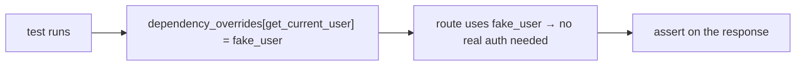

# 07 · Testing

> **Level:** Advanced · **Prerequisites:** [06 · Dependencies](06_dependencies.md)
> **Time:** ~1 hour · **Verified:** 2026-06-04 (FastAPI 0.136.3, pytest 9.0.3)

## Why this matters

Untested code is code you're afraid to change. **Tests** let you verify your API works *and* keep it working as you add features — change something, run the tests, instantly know if you broke anything. FastAPI's `TestClient` (which you've been using all section) plus **pytest** make this fast and pleasant: tests run **in-process** (no server), so they're quick and reliable. This is the capstone-ready skill that turns a script into trustworthy software.

## Concept: pytest basics

**pytest** is Python's most popular testing framework. The essentials:
- A **test** is a function named `test_*` containing `assert` statements.
- If every `assert` passes, the test passes; if one fails, pytest shows exactly what differed.
- Run all tests with the `pytest` command in your project.

```python
# test_math.py
def add(a, b):
    return a + b

def test_add():
    assert add(2, 3) == 5            # passes
    assert add(-1, 1) == 0

def test_add_strings():
    assert add("a", "b") == "ab"     # + works on strings too
```

Run it:

```bash
pytest -v
```

```text
test_math.py::test_add PASSED
test_math.py::test_add_strings PASSED
```

No special classes or boilerplate — just functions and `assert`. (`pip install pytest` first; recall [Section 03.05](../03_functions_and_modules/05_virtualenv_and_pip.md).)

## Concept: testing a FastAPI app with `TestClient`

`TestClient` sends real requests to your app *in-process* and returns the response. Put your app in `main.py` and tests in `test_main.py`:

```python
# main.py
from fastapi import FastAPI, HTTPException
from pydantic import BaseModel

app = FastAPI()

class Item(BaseModel):
    name: str
    price: float

_items: dict[int, Item] = {}
_next = {"id": 1}

@app.post("/items", status_code=201)
def create_item(item: Item):
    iid = _next["id"]; _next["id"] += 1
    _items[iid] = item
    return {"id": iid, **item.model_dump()}

@app.get("/items/{item_id}")
def read_item(item_id: int):
    if item_id not in _items:
        raise HTTPException(404, "item not found")
    return _items[item_id]
```

```python
# test_main.py
from fastapi.testclient import TestClient
from main import app

client = TestClient(app)

def test_create_and_read():
    # create
    r = client.post("/items", json={"name": "Mug", "price": 9.99})
    assert r.status_code == 201
    item_id = r.json()["id"]
    # read it back
    r2 = client.get(f"/items/{item_id}")
    assert r2.status_code == 200
    assert r2.json()["name"] == "Mug"

def test_missing_item():
    r = client.get("/items/9999")
    assert r.status_code == 404
    assert r.json()["detail"] == "item not found"

def test_validation_error():
    r = client.post("/items", json={"name": "x"})   # missing price
    assert r.status_code == 422
```

Run `pytest -v`:

```text
test_main.py::test_create_and_read PASSED
test_main.py::test_missing_item PASSED
test_main.py::test_validation_error PASSED
```

Each test sends requests with `client.get/post/...` and asserts on `.status_code` and `.json()`. You're testing the *whole* request→response flow — routing, validation, your logic, serialisation — without a running server. (Verified: this suite passes.)

> 🧠 **What to test:** the happy path (valid input → expected output), error paths (missing resource → 404, bad input → 422), and edge cases. Each test should be independent and check one behaviour.

## Concept: pytest fixtures (reusable setup)

A **fixture** provides reusable setup for tests — create it once, request it by naming it as a test parameter. Great for "a thing that already exists" preconditions:

```python
# test_with_fixture.py
import pytest
from fastapi.testclient import TestClient
from main import app

client = TestClient(app)

@pytest.fixture
def created_item_id():
    """Create an item and hand its id to any test that asks for it."""
    response = client.post("/items", json={"name": "Pen", "price": 1.5})
    return response.json()["id"]

def test_read_created(created_item_id):       # fixture injected by name
    r = client.get(f"/items/{created_item_id}")
    assert r.status_code == 200
    assert r.json()["name"] == "Pen"
```

A function decorated with `@pytest.fixture` becomes available to any test that lists its name as a parameter — pytest calls the fixture and passes its return value in. Here `created_item_id` sets up a precondition (an item exists) so the test can focus on reading it. Fixtures keep tests DRY and readable.

## Concept: overriding dependencies in tests ⭐

This is the payoff of dependency injection ([Module 06](06_dependencies.md)). In tests you often want to **replace** a real dependency — authentication, a database, an external API — with a fake. FastAPI's `app.dependency_overrides` does exactly that:

```python
# main.py (with auth)
from fastapi import FastAPI, Depends, HTTPException
from typing import Annotated
from pydantic import BaseModel

app = FastAPI()

def get_current_user(token: str = ""):
    if token != "secret":
        raise HTTPException(401, "unauthorized")
    return {"user": "real-user"}

class Item(BaseModel):
    name: str
    price: float

@app.post("/items", status_code=201)
def create_item(item: Item, user: Annotated[dict, Depends(get_current_user)]):
    return {"owner": user["user"], **item.model_dump()}
```

```python
# test_main.py
from fastapi.testclient import TestClient
from main import app, get_current_user

def fake_user():                      # a stand-in that needs no real token
    return {"user": "test-user"}

app.dependency_overrides[get_current_user] = fake_user   # swap it for tests

client = TestClient(app)

def test_create_item_authenticated():
    r = client.post("/items", json={"name": "Mug", "price": 9.99})
    assert r.status_code == 201
    assert r.json()["owner"] == "test-user"   # came from the OVERRIDE, not real auth
```

Run `pytest`:

```text
test_main.py::test_create_item_authenticated PASSED
```

`app.dependency_overrides[get_current_user] = fake_user` tells FastAPI "in this app instance, use `fake_user` instead of the real `get_current_user`." Now the test doesn't need a real token — it can focus on the endpoint's logic. This is *the* reason dependency injection matters for testability: you swap out auth, databases, and external services for fast, predictable fakes. (Verified: passes.)



## Concept: testing async endpoints

`TestClient` handles `async def` routes transparently — you write the *same* synchronous test code, and it runs the event loop for you:

```python
# main.py
@app.get("/async-data")
async def async_data():
    import asyncio
    await asyncio.sleep(0)            # an async endpoint
    return {"data": [1, 2, 3]}

# test_main.py
def test_async_endpoint():           # NOT async — TestClient handles it
    r = client.get("/async-data")
    assert r.status_code == 200
    assert r.json()["data"] == [1, 2, 3]
```

You don't need `async def` tests or `await` — `TestClient` drives the async route under the hood. (For testing async code *directly* — not through HTTP — you'd use `pytest-asyncio` with `@pytest.mark.asyncio` and `async def` tests, but for API endpoints `TestClient` is all you need.)

## Concept: a good test structure

Organise a project so tests are easy to find and run:

```text
myapi/
├── main.py              # the app
├── models.py            # Pydantic models
├── test_main.py         # tests (pytest discovers test_*.py)
├── requirements.txt
└── .venv/
```

- pytest auto-discovers files named `test_*.py` and functions named `test_*`.
- Run `pytest` from the project root.
- Use the **Arrange–Act–Assert** shape: set up data, make the request, assert the result.

## Common mistakes

**Mistake: tests depending on each other / shared state order**
```python
def test_a(): client.post("/items", json={...})   # creates item 1
def test_b(): client.get("/items/1")              # assumes test_a ran first!
```
**Why:** tests should be independent — they may run in any order or in isolation. Use a fixture to set up what each test needs, or reset state between tests.

**Mistake: not testing the error paths**
```python
def test_get(): assert client.get("/items/1").status_code == 200   # only happy path
```
**Why:** bugs love edge cases. Test the `404`, the `422`, the empty list, the boundary value — not just the success case.

**Mistake: forgetting to clear `dependency_overrides`**
**Why:** overrides persist on the app object. If different test files need different overrides, clear them (`app.dependency_overrides.clear()`) in teardown, or use a fixture that sets and unsets them.

## Practice

**Exercise:** Given a `GET /greet/{name}` endpoint that returns `{"greeting": "Hello, <name>!"}` and rejects names longer than 20 chars with a `400`, write a pytest suite with: (1) a happy-path test, (2) a test for the `400` on a too-long name, and (3) a fixture that provides a `TestClient`. Run it.

<details><summary>Solution</summary>

`main.py`:
```python
from fastapi import FastAPI, HTTPException

app = FastAPI()

@app.get("/greet/{name}")
def greet(name: str):
    if len(name) > 20:
        raise HTTPException(status_code=400, detail="name too long")
    return {"greeting": f"Hello, {name}!"}
```

`test_main.py`:
```python
import pytest
from fastapi.testclient import TestClient
from main import app

@pytest.fixture
def client():
    return TestClient(app)            # fresh client for each test

def test_greet_happy(client):
    r = client.get("/greet/Ada")
    assert r.status_code == 200
    assert r.json() == {"greeting": "Hello, Ada!"}

def test_greet_too_long(client):
    r = client.get("/greet/" + "x" * 21)
    assert r.status_code == 400
    assert r.json()["detail"] == "name too long"
```

Run `pytest -v`:
```text
test_main.py::test_greet_happy PASSED
test_main.py::test_greet_too_long PASSED
```

The `client` fixture supplies a `TestClient` to each test; one test covers the success path and one covers the `400` error path — independent, focused, and fast.
</details>

## Recap & next

- ✅ pytest: write `test_*` functions with `assert`; run `pytest`.
- ✅ `TestClient(app)` tests the full request→response flow **in-process** (no server).
- ✅ Test happy paths, error paths (`404`/`422`), and edge cases — independently.
- ✅ **Fixtures** (`@pytest.fixture`) provide reusable setup.
- ✅ **`app.dependency_overrides`** swaps real dependencies (auth/DB) for fakes — the DI payoff.
- ✅ `TestClient` runs `async def` endpoints transparently.
- Self-check: why are in-process `TestClient` tests preferable to spinning up a real server?

🎉 **Section 09 complete — and with it, all the learning sections.** You can build, validate, document, secure, and test a real web API. Time to combine *everything*.

→ Next: **[99 · Capstone Project](../99_capstone_project.md)**
