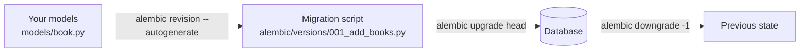

# 10 · Alembic Migrations

> **Level:** Advanced · **Prerequisites:** [09 · Database with SQLAlchemy](09_database_sqlalchemy.md)
> **Time:** ~1.5 hours · **Verified:** 2026-06-25 (Alembic 1.14.1, SQLAlchemy 2.0.41)

---

## Why this matters

`Base.metadata.create_all()` creates tables but can't evolve them. Add a column, rename a table, add an index — and `create_all` does nothing (the table already exists). In production, modifying the schema without a migration means manually running SQL on the live database, which is error-prone and not repeatable across environments. **Alembic** solves this: it tracks every schema change as a versioned script that can be applied forward (`upgrade`) or reversed (`downgrade`) on any environment.

---

## Install

```bash
pip install alembic
```

---

## Concepts



| Term | What it is |
|---|---|
| **Migration** | A versioned Python script with `upgrade()` and `downgrade()` functions |
| **Revision** | A unique ID for one migration (e.g. `a3b4c1d2e5f6`) |
| **Head** | The latest migration — `upgrade head` applies all pending migrations |
| `alembic_version` | A table Alembic adds to your DB to track which revision is currently applied |

---

## One-time setup

```bash
# From the project root (bookstore/)
alembic init alembic
```

This creates:
```
alembic/
├── env.py          ← you'll edit this
├── script.py.mako  ← migration template (leave as-is)
└── versions/       ← migration files go here
alembic.ini         ← config file (already created)
```

### Edit `alembic.ini`

Change the `sqlalchemy.url` line — but we'll use the `.env` value instead, so comment it out:

```ini
# alembic.ini
sqlalchemy.url =    # leave blank — set in env.py
```

### Edit `alembic/env.py`

This is the critical file. It tells Alembic where your models and database URL are:

```python
# alembic/env.py
import asyncio
from logging.config import fileConfig

from sqlalchemy import pool
from sqlalchemy.ext.asyncio import async_engine_from_config

from alembic import context

# --- add these imports ---
from app.core.config import settings
from app.core.database import Base
# import all models so Alembic can see their metadata
import app.models.book   # noqa: F401
import app.models.user   # noqa: F401
# -------------------------

config = context.config
fileConfig(config.config_file_name)

# Point Alembic at your actual DB URL and your model metadata
config.set_main_option("sqlalchemy.url", settings.database_url)
target_metadata = Base.metadata


def run_migrations_offline() -> None:
    """Run migrations in 'offline' mode (no DB connection — just generate SQL)."""
    url = config.get_main_option("sqlalchemy.url")
    context.configure(
        url=url,
        target_metadata=target_metadata,
        literal_binds=True,
        dialect_opts={"paramstyle": "named"},
    )
    with context.begin_transaction():
        context.run_migrations()


def do_run_migrations(connection):
    context.configure(connection=connection, target_metadata=target_metadata)
    with context.begin_transaction():
        context.run_migrations()


async def run_migrations_online() -> None:
    """Run migrations in 'online' mode (real connection)."""
    connectable = async_engine_from_config(
        config.get_section(config.config_ini_section),
        prefix="sqlalchemy.",
        poolclass=pool.NullPool,   # don't pool in migration scripts
    )
    async with connectable.connect() as connection:
        await connection.run_sync(do_run_migrations)
    await connectable.dispose()


if context.is_offline_mode():
    run_migrations_offline()
else:
    asyncio.run(run_migrations_online())
```

---

## Your first migration

```bash
# Generate a migration by comparing your models to the (empty) database
alembic revision --autogenerate -m "create books and users tables"
```

Alembic inspects `Base.metadata` (your models) and the current database state (nothing yet) and writes the diff as a migration file:

```
alembic/versions/a3b4c1d2e5f6_create_books_and_users_tables.py
```

Open it to review:

```python
# alembic/versions/a3b4c1d2e5f6_create_books_and_users_tables.py
"""create books and users tables

Revision ID: a3b4c1d2e5f6
Revises:
Create Date: 2026-06-25 10:00:00
"""
from alembic import op
import sqlalchemy as sa

revision = 'a3b4c1d2e5f6'
down_revision = None   # first migration — no parent
branch_labels = None
depends_on = None


def upgrade() -> None:
    op.create_table('users',
        sa.Column('id', sa.Integer(), nullable=False),
        sa.Column('email', sa.String(length=255), nullable=False),
        sa.Column('hashed_password', sa.String(length=255), nullable=False),
        sa.Column('is_active', sa.Boolean(), nullable=False),
        sa.PrimaryKeyConstraint('id'),
    )
    op.create_index(op.f('ix_users_email'), 'users', ['email'], unique=True)

    op.create_table('books',
        sa.Column('id', sa.Integer(), nullable=False),
        sa.Column('title', sa.String(length=200), nullable=False),
        sa.Column('author', sa.String(length=100), nullable=False),
        sa.Column('price', sa.Integer(), nullable=False),
        sa.Column('is_published', sa.Boolean(), nullable=False),
        sa.Column('created_at', sa.DateTime(), server_default=sa.text('(CURRENT_TIMESTAMP)'), nullable=False),
        sa.Column('owner_id', sa.Integer(), nullable=True),
        sa.ForeignKeyConstraint(['owner_id'], ['users.id'], ),
        sa.PrimaryKeyConstraint('id'),
    )
    op.create_index(op.f('ix_books_author'), 'books', ['author'], unique=False)


def downgrade() -> None:
    op.drop_index(op.f('ix_books_author'), table_name='books')
    op.drop_table('books')
    op.drop_index(op.f('ix_users_email'), table_name='users')
    op.drop_table('users')
```

**Always review autogenerated migrations before applying them.** Alembic can't detect every change (e.g., column renames look like drop + add, which loses data).

```bash
# Apply the migration
alembic upgrade head

# Check current state
alembic current
# a3b4c1d2e5f6 (head)
```

---

## Adding a column: the migration workflow

This is the day-to-day workflow you'll follow every time you change a model.

**Step 1 — edit the model:**
```python
# app/models/book.py — add genre
genre: Mapped[str | None] = mapped_column(String(50), nullable=True)
```

**Step 2 — generate the migration:**
```bash
alembic revision --autogenerate -m "add genre to books"
```

Generated file:
```python
def upgrade() -> None:
    op.add_column('books', sa.Column('genre', sa.String(length=50), nullable=True))

def downgrade() -> None:
    op.drop_column('books', 'genre')
```

**Step 3 — review and apply:**
```bash
alembic upgrade head
```

**Step 4 — update the schema:**
```python
# app/schemas/book.py — add to BookBase:
genre: str | None = Field(None, max_length=50)
```

---

## Common migration operations

```python
# Rename a column
op.alter_column('books', 'price', new_column_name='price_pence')

# Add a non-nullable column to an existing table with data
# Must provide a server_default for existing rows
op.add_column('books', sa.Column(
    'isbn', sa.String(13), nullable=False, server_default=''
))
# Then remove the default after filling in real values:
op.alter_column('books', 'isbn', server_default=None)

# Add an index
op.create_index('ix_books_genre', 'books', ['genre'])

# Add a foreign key
op.add_column('books', sa.Column('category_id', sa.Integer(), nullable=True))
op.create_foreign_key('fk_books_category', 'books', 'categories', ['category_id'], ['id'])
```

---

## Migration history commands

```bash
# Show all migrations and their status
alembic history --verbose

# Show current applied revision
alembic current

# Apply all pending migrations
alembic upgrade head

# Roll back one migration
alembic downgrade -1

# Roll back to a specific revision
alembic downgrade a3b4c1d2e5f6

# Generate SQL for a migration without running it (for review)
alembic upgrade head --sql
```

---

## Running migrations on startup (optional)

Some teams run `alembic upgrade head` automatically when the app starts:

```python
# app/main.py
from alembic.config import Config
from alembic import command

@app.on_event("startup")
async def startup():
    alembic_cfg = Config("alembic.ini")
    command.upgrade(alembic_cfg, "head")
```

**Pros:** new deployments auto-migrate. **Cons:** can fail on startup if a migration has a bug. Many teams prefer running migrations as a separate step in the CI/CD pipeline before the app starts — safer for production.

---

## Common mistakes

**Committing generated migrations without reviewing them:**  
Alembic's `--autogenerate` can't detect column renames (it sees drop + add), changes to server defaults that differ by dialect, or custom types. Always read the diff before applying.

**Not importing models in `env.py`:**
```python
# If you forget this, Alembic sees an empty Base and generates empty migrations
import app.models.book   # noqa — must be present even if "unused"
import app.models.user
```

**Editing a migration that's already been applied to production:**  
Once a migration is applied on any shared environment, treat it as immutable. Create a new migration to fix mistakes.

---

## Exercises

1. **Add a `published_at` column.** Add `published_at: Mapped[datetime | None]` to the `Book` model. Generate and apply the migration. Check `alembic history` shows two revisions.

<details>
<summary>Solution</summary>

```python
# models/book.py
from datetime import datetime
published_at: Mapped[datetime | None] = mapped_column(DateTime, nullable=True)
```

```bash
alembic revision --autogenerate -m "add published_at to books"
alembic upgrade head
alembic history
```

The new migration has `down_revision = 'a3b4c1d2e5f6'` — pointing to the previous one.

</details>

2. **Roll back and re-apply.** Run `alembic downgrade -1`, confirm the `genre` column is gone (inspect the DB with `sqlite3 bookstore.db ".schema books"`), then `alembic upgrade head` to re-apply.

<details>
<summary>Solution</summary>

```bash
alembic downgrade -1
sqlite3 bookstore.db ".schema books"  # genre column absent
alembic upgrade head
sqlite3 bookstore.db ".schema books"  # genre column back
```

</details>

---

## Recap & next

- ✅ Alembic tracks schema changes as versioned scripts — apply with `upgrade head`, reverse with `downgrade`
- ✅ `--autogenerate` compares your models to the DB and writes the diff
- ✅ Always review generated migrations: renames, server defaults, and custom types need manual edits
- ✅ Import all models in `env.py` — Alembic can only see tables whose models are imported
- ✅ Never edit an applied migration; create a new one to fix it

**→ Next: [11 · Authentication & JWT](11_authentication_jwt.md)**
