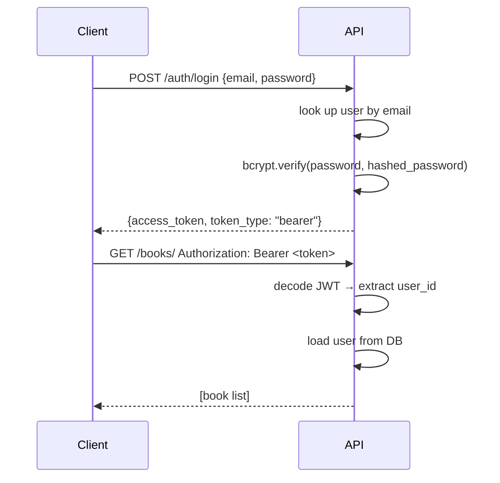

# 11 · Authentication & JWT

> **Level:** Advanced · **Prerequisites:** [10 · Alembic](10_alembic_migrations.md), [06 · Dependencies](06_dependencies.md)
> **Time:** ~2 hours · **Verified:** 2026-06-25 (python-jose 3.4.0, passlib 1.7.4, bcrypt 4.3.0)

---

## Why this matters

Authentication is the mechanism that answers "who is this request from?" Authorization answers "what are they allowed to do?" Every real API needs both. FastAPI's dependency injection makes it clean: `current_user = Depends(get_current_user)` anywhere you need identity.

---

## Install

```bash
pip install "python-jose[cryptography]" "passlib[bcrypt]"
```

---

## The flow



JWT (JSON Web Token) is a signed string: `header.payload.signature`. The API signs it with a secret key; any later request can be verified without touching the database.

---

## `app/core/security.py`

```python
from datetime import UTC, datetime, timedelta
from passlib.context import CryptContext
from jose import JWTError, jwt
from app.core.config import settings

pwd_context = CryptContext(schemes=["bcrypt"], deprecated="auto")

def hash_password(plain: str) -> str:
    return pwd_context.hash(plain)

def verify_password(plain: str, hashed: str) -> bool:
    return pwd_context.verify(plain, hashed)


def create_access_token(subject: int | str, expires_delta: timedelta | None = None) -> str:
    expire = datetime.now(UTC) + (expires_delta or timedelta(minutes=settings.access_token_expire_minutes))
    payload = {"sub": str(subject), "exp": expire}
    return jwt.encode(payload, settings.secret_key, algorithm=settings.jwt_algorithm)


def decode_access_token(token: str) -> int:
    """Decode token and return user_id (int). Raises JWTError on failure."""
    payload = jwt.decode(token, settings.secret_key, algorithms=[settings.jwt_algorithm])
    sub = payload.get("sub")
    if sub is None:
        raise JWTError("Missing sub")
    return int(sub)
```

---

## Settings additions

```python
# app/core/config.py (additions to the Settings class — see module 12 for full file)
secret_key: str = "CHANGE_THIS_IN_PRODUCTION_USE_openssl_rand_hex_32"
jwt_algorithm: str = "HS256"
access_token_expire_minutes: int = 30
```

Generate a strong secret key:
```bash
python3 -c "import secrets; print(secrets.token_hex(32))"
```

Store it in `.env`:
```
SECRET_KEY=a8f3b2c1...your_64_char_hex_string...
```

---

## User schemas

```python
# app/schemas/user.py
from pydantic import BaseModel, EmailStr, ConfigDict

class UserCreate(BaseModel):
    email: EmailStr
    password: str   # plaintext — hashed before storage

class UserResponse(BaseModel):
    id: int
    email: str
    is_active: bool
    model_config = ConfigDict(from_attributes=True)

class Token(BaseModel):
    access_token: str
    token_type: str = "bearer"

class TokenData(BaseModel):
    user_id: int
```

---

## User CRUD

```python
# app/crud/user.py
from sqlalchemy import select
from sqlalchemy.ext.asyncio import AsyncSession
from app.models.user import User
from app.schemas.user import UserCreate
from app.core.security import hash_password

async def get_by_email(db: AsyncSession, email: str) -> User | None:
    result = await db.execute(select(User).where(User.email == email))
    return result.scalar_one_or_none()

async def get_by_id(db: AsyncSession, user_id: int) -> User | None:
    result = await db.execute(select(User).where(User.id == user_id))
    return result.scalar_one_or_none()

async def create(db: AsyncSession, data: UserCreate) -> User:
    user = User(email=data.email, hashed_password=hash_password(data.password))
    db.add(user)
    await db.flush()
    await db.refresh(user)
    return user
```

---

## Auth router

```python
# app/routers/auth.py
from fastapi import APIRouter, Depends, HTTPException, status
from fastapi.security import OAuth2PasswordRequestForm
from sqlalchemy.ext.asyncio import AsyncSession
from app import deps
from app.crud import user as crud_user
from app.core.security import verify_password, create_access_token
from app.schemas.user import Token, UserCreate, UserResponse

router = APIRouter(prefix="/auth", tags=["auth"])

@router.post("/register", response_model=UserResponse, status_code=201)
async def register(data: UserCreate, db: AsyncSession = Depends(deps.get_db)):
    existing = await crud_user.get_by_email(db, data.email)
    if existing:
        raise HTTPException(status_code=400, detail="Email already registered")
    return await crud_user.create(db, data)


@router.post("/login", response_model=Token)
async def login(
    form_data: OAuth2PasswordRequestForm = Depends(),   # reads username + password form fields
    db: AsyncSession = Depends(deps.get_db),
):
    user = await crud_user.get_by_email(db, form_data.username)
    if not user or not verify_password(form_data.password, user.hashed_password):
        raise HTTPException(
            status_code=status.HTTP_401_UNAUTHORIZED,
            detail="Incorrect email or password",
            headers={"WWW-Authenticate": "Bearer"},
        )
    if not user.is_active:
        raise HTTPException(status_code=400, detail="Inactive user")
    token = create_access_token(subject=user.id)
    return {"access_token": token, "token_type": "bearer"}
```

`OAuth2PasswordRequestForm` reads standard OAuth2 form fields (`username`, `password`) — this is what tools like Swagger UI's "Authorize" button send automatically.

---

## Authentication dependency

```python
# app/deps.py (additions)
from fastapi import Depends, HTTPException, status
from fastapi.security import OAuth2PasswordBearer
from jose import JWTError
from sqlalchemy.ext.asyncio import AsyncSession
from app.core.security import decode_access_token
from app.crud import user as crud_user

oauth2_scheme = OAuth2PasswordBearer(tokenUrl="/auth/login")

async def get_current_user(
    token: str = Depends(oauth2_scheme),
    db: AsyncSession = Depends(get_db),
):
    credentials_exception = HTTPException(
        status_code=status.HTTP_401_UNAUTHORIZED,
        detail="Could not validate credentials",
        headers={"WWW-Authenticate": "Bearer"},
    )
    try:
        user_id = decode_access_token(token)
    except JWTError:
        raise credentials_exception

    user = await crud_user.get_by_id(db, user_id)
    if user is None:
        raise credentials_exception
    return user


async def get_current_active_user(user = Depends(get_current_user)):
    if not user.is_active:
        raise HTTPException(status_code=400, detail="Inactive user")
    return user
```

---

## Protecting routes

```python
# app/routers/books.py — add auth to create/update/delete
from app.deps import get_current_active_user
from app.models.user import User

@router.post("/", response_model=BookResponse, status_code=201)
async def create_book(
    data: BookCreate,
    db: AsyncSession = Depends(deps.get_db),
    current_user: User = Depends(get_current_active_user),   # ← add this
):
    return await crud_book.create(db, data, owner_id=current_user.id)

@router.delete("/{book_id}", status_code=204)
async def delete_book(
    book_id: int,
    db: AsyncSession = Depends(deps.get_db),
    current_user: User = Depends(get_current_active_user),
):
    book = await crud_book.get_by_id(db, book_id)
    if not book:
        raise HTTPException(404, "Book not found")
    if book.owner_id != current_user.id:
        raise HTTPException(403, "Not your book")   # authorisation check
    await crud_book.delete(db, book)
```

---

## Testing authenticated routes

```python
# tests/conftest.py — add helper fixtures
import pytest
from app.schemas.user import UserCreate
from app.crud import user as crud_user

@pytest.fixture
async def test_user(db_session):
    return await crud_user.create(db_session, UserCreate(email="test@example.com", password="secret"))

@pytest.fixture
async def auth_client(client, test_user):
    resp = await client.post("/auth/login", data={"username": "test@example.com", "password": "secret"})
    token = resp.json()["access_token"]
    client.headers["Authorization"] = f"Bearer {token}"
    return client
```

```python
# tests/test_books.py
async def test_create_book_requires_auth(client):
    resp = await client.post("/books/", json={"title": "x", "author": "y", "price": 100})
    assert resp.status_code == 401

async def test_create_book_authenticated(auth_client):
    resp = await auth_client.post("/books/", json={"title": "Clean Code", "author": "Martin", "price": 2999})
    assert resp.status_code == 201
    assert resp.json()["title"] == "Clean Code"
```

---

## Common mistakes

**Storing the secret key in source code:**  
Use `os.environ` or pydantic-settings to read it from the environment. Anyone who sees the secret key can mint arbitrary tokens.

**Not checking `user.is_active`:**  
If you deactivate a user (soft-delete), their existing JWT is still valid until expiry. Always check `is_active` in the `get_current_active_user` dependency.

**Long token expiry:**  
`access_token_expire_minutes=10080` (1 week) is convenient but means a stolen token grants access for a week. Use short-lived access tokens (15–60 min) and implement refresh tokens for long sessions.

**Returning `401` for "wrong resource" errors:**  
`401 Unauthorized` = not authenticated (no/invalid token). `403 Forbidden` = authenticated but not allowed. Don't confuse them.

---

## Exercises

1. **Add a `/auth/me` endpoint.** Create `GET /auth/me` that returns the currently authenticated user's profile (without the hashed password).

<details>
<summary>Solution</summary>

```python
@router.get("/me", response_model=UserResponse)
async def get_me(current_user: User = Depends(get_current_active_user)):
    return current_user
```

</details>

2. **Ownership check.** Add `GET /books/mine` that returns only books owned by the current user.

<details>
<summary>Solution</summary>

```python
# crud/book.py
async def get_by_owner(db: AsyncSession, owner_id: int) -> list[Book]:
    result = await db.execute(select(Book).where(Book.owner_id == owner_id))
    return list(result.scalars().all())

# routers/books.py
@router.get("/mine", response_model=list[BookResponse])
async def my_books(
    db: AsyncSession = Depends(deps.get_db),
    current_user: User = Depends(get_current_active_user),
):
    return await crud_book.get_by_owner(db, current_user.id)
```

</details>

---

## Recap & next

- ✅ `passlib[bcrypt]`: hash passwords at registration, verify at login — never store plaintext
- ✅ JWT: signed token carries user_id; verify with the same secret key on every request
- ✅ `OAuth2PasswordBearer` + `Depends(get_current_user)`: one line protects any route
- ✅ 401 = not authenticated; 403 = authenticated but forbidden — different status codes
- ✅ Short token lifetime + refresh tokens for production; long lifetime only in development

**→ Next: [12 · Settings & configuration](12_settings_and_config.md)**
