# Section 09 · FastAPI

> **Level:** Advanced · **Prerequisites:** [OOP](../04_oop/README.md), [exceptions](../05_exceptions_and_errors/README.md), [type hints](../03_functions_and_modules/03_type_hints.md), [async](../08_async/README.md)
> **Time:** ~12 hours · **Verified:** 2026-06-25 against **FastAPI 0.136.3**, **Pydantic 2.13.4**, **SQLAlchemy 2.0.41**, **Alembic 1.14.1**, **pydantic-settings 2.9.1**, **python-jose 3.4.0**, **passlib 1.7.4**

This is where everything converges. **FastAPI** is a modern, high-performance Python web framework for building **APIs** (the back-ends that power web and mobile apps). It uses the **type hints** (Section 03), **classes** (Section 04), **exceptions** (Section 05), and **async** (Section 08) you've already learned — so you'll recognise every piece. By the end you'll build, validate, document, and **test** a real API — structured the way industry teams actually do it.

## What's an API? (quick framing)

An **API** (Application Programming Interface) here means a **web service**: a program that listens for HTTP requests (`GET /users`, `POST /orders`) and returns structured data (usually JSON). Your phone apps and websites talk to APIs constantly. FastAPI lets you build one with remarkably little code — and it **auto-generates interactive documentation** from your type hints.

## Why FastAPI

- **Fast to write & fast to run** — built on async (Starlette) + Pydantic.
- **Automatic validation** — Pydantic checks incoming data against your types and returns clear errors.
- **Automatic docs** — interactive API docs at `/docs`, generated from your code.
- **Type-hint native** — the hints you learned *are* the API definition.

## Modules

| # | Module | You'll learn to… |
|---|--------|------------------|
| 01 | [First app](01_first_app.md) | Create an app, define routes, run it, see the auto-docs |
| 02 | [Parameters & validation](02_parameters_and_validation.md) | Take path/query params with automatic validation |
| 03 | [Request bodies & Pydantic](03_request_bodies_pydantic.md) | Receive and validate JSON with Pydantic models |
| 04 | [Responses & status codes](04_responses_and_status.md) | Shape output with response models and status codes |
| 05 | [Error handling](05_error_handling.md) | Return proper HTTP errors; map domain exceptions |
| 06 | [Dependencies](06_dependencies.md) | Share logic (auth, DB, pagination) with dependency injection |
| 07 | [Testing](07_testing.md) | Test your API in-process with `TestClient` + pytest |
| 08 | [Project structure](08_project_structure.md) | Industry-standard layout: models / schemas / crud / routers / core |
| 09 | [Database with SQLAlchemy](09_database_sqlalchemy.md) | Async ORM models, sessions, CRUD layer, test with in-memory DB |
| 10 | [Alembic migrations](10_alembic_migrations.md) | Versioned schema changes — autogenerate, upgrade, downgrade |
| 11 | [Authentication & JWT](11_authentication_jwt.md) | bcrypt passwords, OAuth2 password flow, protected routes |
| 12 | [Settings & config](12_settings_and_config.md) | pydantic-settings, .env files, environment-specific configuration |

```mermaid
flowchart LR
    subgraph Foundations["Foundations (01–07)"]
        A["01 First app"] --> B["02 Params"]
        B --> C["03 Bodies"]
        C --> D["04 Responses"]
        D --> E["05 Errors"]
        E --> F["06 Dependencies"]
        F --> G["07 Testing"]
    end
    subgraph Industry["Industry patterns (08–12)"]
        H["08 Project structure"]
        H --> I["09 SQLAlchemy DB"]
        I --> J["10 Alembic migrations"]
        J --> K["11 Auth & JWT"]
        K --> L["12 Settings"]
    end
    G --> H
    L --> P["→ 99 Capstone API"]
```



## Setup

```bash
python3 -m venv .venv && source .venv/bin/activate

# Foundations (modules 01–07)
pip install "fastapi" "uvicorn[standard]" "pytest" "httpx"

# Industry patterns (modules 08–12)
pip install "sqlalchemy[asyncio]" "aiosqlite" "alembic" \
            "pydantic-settings" "python-jose[cryptography]" \
            "passlib[bcrypt]" "pytest-asyncio" "email-validator"
```

> ℹ️ Modules 01–07 verify examples in-process with `TestClient`. Modules 08–12 use an async test client with an in-memory SQLite database — no external service needed.

→ Start: **[01 · First app](01_first_app.md)**  
→ Already know the basics? Jump to: **[08 · Project structure](08_project_structure.md)**
