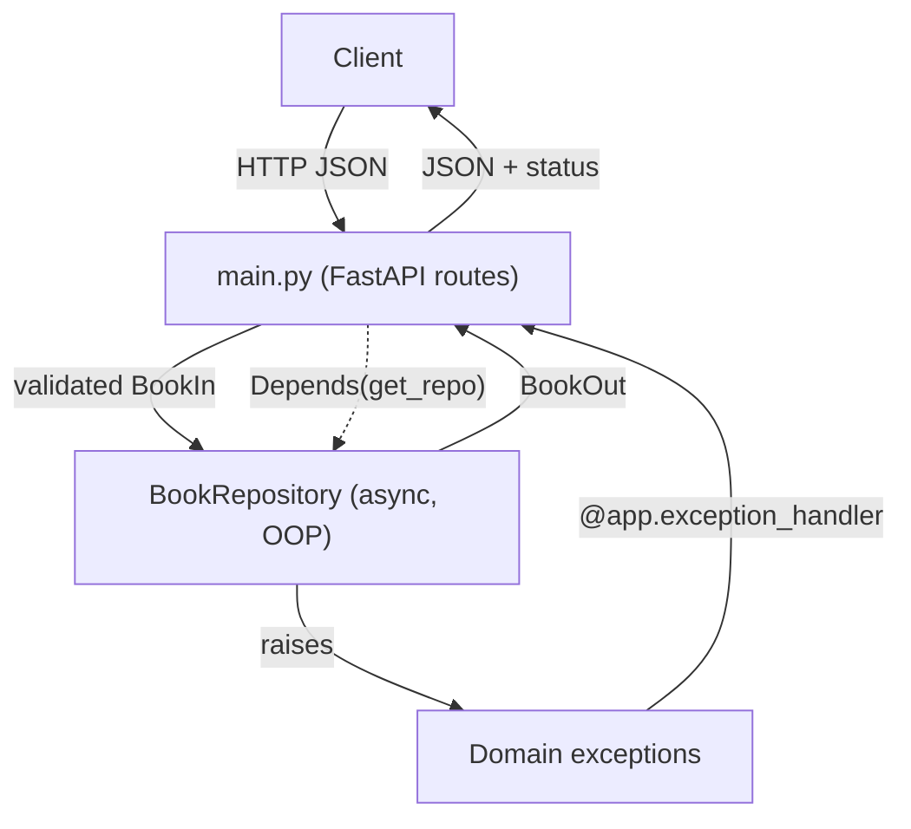

# 99 · Capstone Project — The Bookshelf API

> **Time:** ~3–4 hours · **Prerequisites:** Sections 00–09
> **Verified:** 2026-06-04 against Python 3.12.13, FastAPI 0.136.3, Pydantic 2.13.4, pytest 9.0.3 — every snippet was executed and the test suite passes.

## What you'll build

A complete, tested **async REST API** for managing a bookshelf — create, list, fetch, and delete books. It's small enough to hold in your head but real enough to combine *everything* you've learned: classes, custom exceptions, async, Pydantic validation, dependency injection, and tests. This is the kind of service that backs real apps.

By the end you'll have a clean, layered project:

```text
bookshelf/
├── bookshelf/
│   ├── __init__.py
│   ├── exceptions.py     # custom exception hierarchy (Section 05)
│   ├── models.py         # Pydantic models (Section 09.03)
│   ├── repository.py     # OOP + async data layer (Sections 04, 08)
│   └── main.py           # FastAPI app wiring it together (Section 09)
└── test_bookshelf.py     # pytest suite (Section 09.07)
```

## Requirements → where each concept comes from

| Feature | Built with | From |
|---------|-----------|------|
| Typed, validated book data | Pydantic models, `Field`, validators | [09.03](09_fastapi/03_request_bodies_pydantic.md), [03.03](03_functions_and_modules/03_type_hints.md) |
| Data storage with rules | a `BookRepository` class | [Section 04 (OOP)](04_oop/README.md) |
| Non-blocking data access | `async def` methods, `asyncio.Lock` | [Section 08 (async)](08_async/README.md) |
| Meaningful errors | custom exception hierarchy | [Section 05 ⭐](05_exceptions_and_errors/README.md) |
| Clean HTTP error responses | `@app.exception_handler` | [09.05](09_fastapi/05_error_handling.md) |
| Swappable data layer | dependency injection | [09.06](09_fastapi/06_dependencies.md) |
| Confidence it works | pytest + `TestClient` + overrides | [09.07](09_fastapi/07_testing.md) |
| Safe output (no leaks) | `response_model` | [09.04](09_fastapi/04_responses_and_status.md) |



## Setup

```bash
mkdir bookshelf && cd bookshelf
python3 -m venv .venv && source .venv/bin/activate
pip install "fastapi" "uvicorn[standard]" "pytest" "httpx"
mkdir bookshelf && touch bookshelf/__init__.py
```

---

## Build it in phases

### Phase 1 — the exception hierarchy (`bookshelf/exceptions.py`)

Start with the errors, so the rest of the code can raise meaningful ones. Each carries an HTTP `status_code`, so a *single* handler (Phase 4) can translate the whole family — the pattern from [Section 05.05](05_exceptions_and_errors/05_raising_and_custom_exceptions.md) and [09.05](09_fastapi/05_error_handling.md).

```python
# bookshelf/exceptions.py
"""Domain exceptions for the bookshelf — pure business logic, no HTTP."""


class BookshelfError(Exception):
    """Base class for all bookshelf errors. Carries an HTTP status code."""
    status_code = 400

    def __init__(self, message: str):
        self.message = message
        super().__init__(message)


class BookNotFoundError(BookshelfError):
    status_code = 404

    def __init__(self, book_id: int):
        self.book_id = book_id
        super().__init__(f"no book with id {book_id}")


class DuplicateISBNError(BookshelfError):
    status_code = 409

    def __init__(self, isbn: str):
        self.isbn = isbn
        super().__init__(f"a book with ISBN {isbn} already exists")
```

The base `BookshelfError` defines `status_code` and a `message`; subclasses override the code and add structured data (`book_id`, `isbn`). Business code raises these — it never mentions HTTP.

### Phase 2 — the data models (`bookshelf/models.py`)

Pydantic models define and validate the data shapes. Note the **input/output split** ([09.04](09_fastapi/04_responses_and_status.md)): `BookIn` is what clients send; `BookOut` adds the server-assigned `id`.

```python
# bookshelf/models.py
"""Pydantic models — the validated shapes of data in and out."""
from pydantic import BaseModel, Field, field_validator


class BookIn(BaseModel):
    """What a client sends to create a book."""
    title: str = Field(min_length=1, max_length=200)
    author: str = Field(min_length=1, max_length=120)
    isbn: str = Field(min_length=10, max_length=17)
    year: int = Field(ge=1450, le=2100)        # printing press → near future

    @field_validator("title", "author")
    @classmethod
    def not_blank(cls, v: str) -> str:
        if not v.strip():
            raise ValueError("must not be blank")
        return v.strip()


class BookOut(BookIn):
    """What we send back — the input fields plus a server-assigned id."""
    id: int
```

`BookOut` *inherits* from `BookIn` ([Section 04.03](04_oop/03_inheritance.md)) — it's all the input fields plus `id`. The `Field` constraints and the shared validator reject bad data automatically with `422`.

### Phase 3 — the repository (`bookshelf/repository.py`)

The data layer: a class ([Section 04](04_oop/README.md)) with **async** methods ([Section 08](08_async/README.md)) that store books and enforce rules, raising the domain exceptions from Phase 1. An `asyncio.Lock` ([Section 08](08_async/03_tasks_and_gather.md)) guards the shared dict against concurrent writes.

```python
# bookshelf/repository.py
"""An in-memory, async-safe book repository (stands in for a database)."""
import asyncio

from .exceptions import BookNotFoundError, DuplicateISBNError
from .models import BookIn, BookOut


class BookRepository:
    """Stores books in memory. Async methods simulate real I/O latency."""

    def __init__(self) -> None:
        self._books: dict[int, BookOut] = {}
        self._next_id = 1
        self._lock = asyncio.Lock()          # guard the shared dict across tasks

    async def add(self, data: BookIn) -> BookOut:
        async with self._lock:               # only one writer at a time
            if any(b.isbn == data.isbn for b in self._books.values()):
                raise DuplicateISBNError(data.isbn)
            book = BookOut(id=self._next_id, **data.model_dump())
            self._books[book.id] = book
            self._next_id += 1
            return book

    async def get(self, book_id: int) -> BookOut:
        await asyncio.sleep(0)               # yield, as a real async DB would
        if book_id not in self._books:
            raise BookNotFoundError(book_id)
        return self._books[book_id]

    async def list_all(self) -> list[BookOut]:
        await asyncio.sleep(0)
        return list(self._books.values())

    async def delete(self, book_id: int) -> None:
        async with self._lock:
            if book_id not in self._books:
                raise BookNotFoundError(book_id)
            del self._books[book_id]
```

The repository is the *only* thing that touches storage. It raises `DuplicateISBNError`/`BookNotFoundError` — domain errors, not HTTP. The `async with self._lock:` makes `add`/`delete` safe even if many requests arrive at once (recall the race conditions of [Section 07.03](07_concurrency/03_synchronization.md) — async needs the same care for check-then-act on shared state).

### Phase 4 — the API (`bookshelf/main.py`)

Wire it together: async routes, dependency injection for the repository, `response_model` for safe output, and one exception handler mapping *every* domain error to HTTP.

```python
# bookshelf/main.py
"""The Bookshelf API — async REST endpoints over the repository."""
from fastapi import Depends, FastAPI, Request, status
from fastapi.responses import JSONResponse
from typing import Annotated

from .exceptions import BookshelfError
from .models import BookIn, BookOut
from .repository import BookRepository

app = FastAPI(title="Bookshelf API", version="1.0.0")

_repo = BookRepository()                     # one shared repo for the app's lifetime


def get_repo() -> BookRepository:
    """Dependency: provides the repository (easy to override in tests)."""
    return _repo


@app.exception_handler(BookshelfError)       # ONE handler for the whole family
async def handle_bookshelf_error(request: Request, exc: BookshelfError):
    return JSONResponse(
        status_code=exc.status_code,         # each subclass carries its code
        content={"error": type(exc).__name__, "detail": exc.message},
    )


@app.get("/books", response_model=list[BookOut])
async def list_books(repo: Annotated[BookRepository, Depends(get_repo)]):
    return await repo.list_all()


@app.post("/books", response_model=BookOut, status_code=status.HTTP_201_CREATED)
async def create_book(book: BookIn, repo: Annotated[BookRepository, Depends(get_repo)]):
    return await repo.add(book)


@app.get("/books/{book_id}", response_model=BookOut)
async def get_book(book_id: int, repo: Annotated[BookRepository, Depends(get_repo)]):
    return await repo.get(book_id)


@app.delete("/books/{book_id}", status_code=status.HTTP_204_NO_CONTENT)
async def delete_book(book_id: int, repo: Annotated[BookRepository, Depends(get_repo)]):
    await repo.delete(book_id)
```

Notice how *thin* the routes are: each just `await`s a repository method. Validation (Pydantic), error translation (the handler), and output filtering (`response_model`) are all handled around them. The `get_repo` dependency means we can swap the repository in tests (Phase 6).

### Phase 5 — run it

```bash
uvicorn bookshelf.main:app --reload
```

Open <http://127.0.0.1:8000/docs> for the auto-generated interactive docs — every route, model, and status code is documented and you can try them live. Then exercise it from another terminal (or the docs UI). Verified via `TestClient`:

```python
from fastapi.testclient import TestClient
from bookshelf.main import app

c = TestClient(app)
print(c.post("/books", json={"title": "Dune", "author": "Herbert",
                             "isbn": "9780441013593", "year": 1965}).json())
print(c.post("/books", json={"title": "1984", "author": "Orwell",
                             "isbn": "9780451524935", "year": 1949}).json())
print("list:", c.get("/books").json())
print("dup:", c.post("/books", json={"title": "x", "author": "y",
                                     "isbn": "9780441013593", "year": 2000}).status_code)
print("missing:", c.get("/books/99").json())
print("delete:", c.delete("/books/1").status_code)
```

Output (verified):

```text
{'title': 'Dune', 'author': 'Herbert', 'isbn': '9780441013593', 'year': 1965, 'id': 1}
{'title': '1984', 'author': 'Orwell', 'isbn': '9780451524935', 'year': 1949, 'id': 2}
list: [{'title': 'Dune', ...'id': 1}, {'title': '1984', ...'id': 2}]
dup: 409
missing: {'error': 'BookNotFoundError', 'detail': 'no book with id 99'}
delete: 204
```

Create returns `201` with the new `id`; a duplicate ISBN gives `409`; a missing book gives a clean `404` with your custom error body; delete gives `204`. Every layer is doing its job.

### Phase 6 — test it (`test_bookshelf.py`)

A real project needs tests. This suite uses `TestClient`, a fixture, and `dependency_overrides` to give **each test a fresh repository** ([09.07](09_fastapi/07_testing.md)) — so tests are independent.

```python
# test_bookshelf.py
import pytest
from fastapi.testclient import TestClient
from bookshelf.main import app, get_repo
from bookshelf.repository import BookRepository


@pytest.fixture
def client():
    # give each test its own empty repository, then clean up
    repo = BookRepository()
    app.dependency_overrides[get_repo] = lambda: repo
    yield TestClient(app)
    app.dependency_overrides.clear()


VALID = {"title": "Dune", "author": "Herbert", "isbn": "9780441013593", "year": 1965}


def test_create_and_get(client):
    r = client.post("/books", json=VALID)
    assert r.status_code == 201
    book = r.json()
    assert book["id"] == 1 and book["title"] == "Dune"
    r2 = client.get(f"/books/{book['id']}")
    assert r2.status_code == 200 and r2.json()["author"] == "Herbert"


def test_list(client):
    client.post("/books", json=VALID)
    client.post("/books", json={**VALID, "isbn": "9780000000001", "title": "Other"})
    r = client.get("/books")
    assert r.status_code == 200 and len(r.json()) == 2


def test_not_found(client):
    r = client.get("/books/999")
    assert r.status_code == 404
    assert r.json() == {"error": "BookNotFoundError", "detail": "no book with id 999"}


def test_duplicate_isbn(client):
    client.post("/books", json=VALID)
    r = client.post("/books", json={**VALID, "title": "Dupe"})
    assert r.status_code == 409
    assert r.json()["error"] == "DuplicateISBNError"


def test_validation(client):
    r = client.post("/books", json={**VALID, "year": 1000})   # before 1450
    assert r.status_code == 422


def test_delete(client):
    client.post("/books", json=VALID)
    assert client.delete("/books/1").status_code == 204
    assert client.get("/books/1").status_code == 404
```

Run `pytest -v`:

```text
test_bookshelf.py::test_create_and_get PASSED
test_bookshelf.py::test_list PASSED
test_bookshelf.py::test_not_found PASSED
test_bookshelf.py::test_duplicate_isbn PASSED
test_bookshelf.py::test_validation PASSED
test_bookshelf.py::test_delete PASSED
6 passed
```

All six pass (verified). The suite covers the happy path, both error families (`404`, `409`), validation (`422`), and the full create→delete→gone lifecycle — and each test starts from a clean repository thanks to the dependency override.

---

## How every section shows up

This one small project touches the entire course:

- **Fundamentals (01):** variables, functions, control flow, f-strings — everywhere.
- **Data structures (02):** the repository's `dict` store, list responses, `**data.model_dump()` unpacking.
- **Functions & modules (03):** the package layout, imports, type hints on every function.
- **OOP (04):** `BookRepository` class, model **inheritance** (`BookOut(BookIn)`), encapsulated state.
- **Exceptions (05 ⭐):** the custom hierarchy, raising domain errors, one base-class handler.
- **Pythonic (06):** the `async with` lock (context manager), comprehensions (`any(...)`), decorators (`@app...`).
- **Concurrency (07):** the lock prevents check-then-act races on shared state.
- **Async (08):** `async def` methods and routes, `asyncio.Lock`, `await`.
- **FastAPI (09):** routing, Pydantic bodies, `response_model`, dependencies, error handlers, tests.

## Extend it (graded challenges)

Try these in order of difficulty — each reinforces specific skills:

| Difficulty | Enhancement | Teaches |
|-----------|-------------|---------|
| 🟢 Easy | Add `PUT /books/{id}` to update a book (raise `BookNotFoundError` if absent) | routes, reusing the repo |
| 🟢 Easy | Add query params to `GET /books`: filter by `author`, paginate with `skip`/`limit` | [params](09_fastapi/02_parameters_and_validation.md), dependencies |
| 🟡 Medium | Add a `genre` field with a `Literal[...]` of allowed values | [advanced typing](06_pythonic_intermediate/05_advanced_typing.md), validation |
| 🟡 Medium | Require an API key via a `Depends` auth dependency on write routes | [dependencies](09_fastapi/06_dependencies.md) |
| 🟠 Harder | Persist to a JSON file on disk (load on startup, save on change) | [pathlib + json](03_functions_and_modules/06_standard_library_tour.md), `with` |
| 🟠 Harder | Add an endpoint that fetches book covers from several URLs **concurrently** | [async gather](08_async/03_tasks_and_gather.md) |
| 🔴 Hard | Swap the in-memory repo for a real database (SQLite via `aiosqlite`); the `get_repo` dependency makes this a localised change | DI payoff, async I/O |
| 🔴 Hard | Add bulk create that validates all items and reports *all* failures with an `ExceptionGroup` | [exception groups](05_exceptions_and_errors/07_exception_groups.md) |

Each extension is *localised* because the project is layered — that's the reward of clean design.

---

## 🎉 You did it

You started not knowing what a variable is. You now can:

- **Write fluent Python** — data, logic, functions, files, idioms.
- **Model the world** with classes and design clean exception hierarchies.
- **Handle failure gracefully** and read any traceback (the special skill).
- **Run work concurrently** with threads, processes, and async.
- **Build, validate, document, and test a real web API.**

### Where to go next

- **Databases:** SQLAlchemy (async), `aiosqlite`, or an ORM — make data persist.
- **Deployment:** Docker + a cloud host; serve with `uvicorn`/`gunicorn` behind a proxy.
- **Auth for real:** OAuth2 + JWT with FastAPI's `security` utilities.
- **Frontend:** consume your API from a React/Vue app, or build server-rendered pages.
- **Go deeper:** the official docs — <https://docs.python.org/3/> and <https://fastapi.tiangolo.com/> — are excellent and now fully approachable to you.

Keep building. The best way to cement all of this is to invent your own small project and make it real — you have every tool you need.

← Back to the [course index](README.md)
