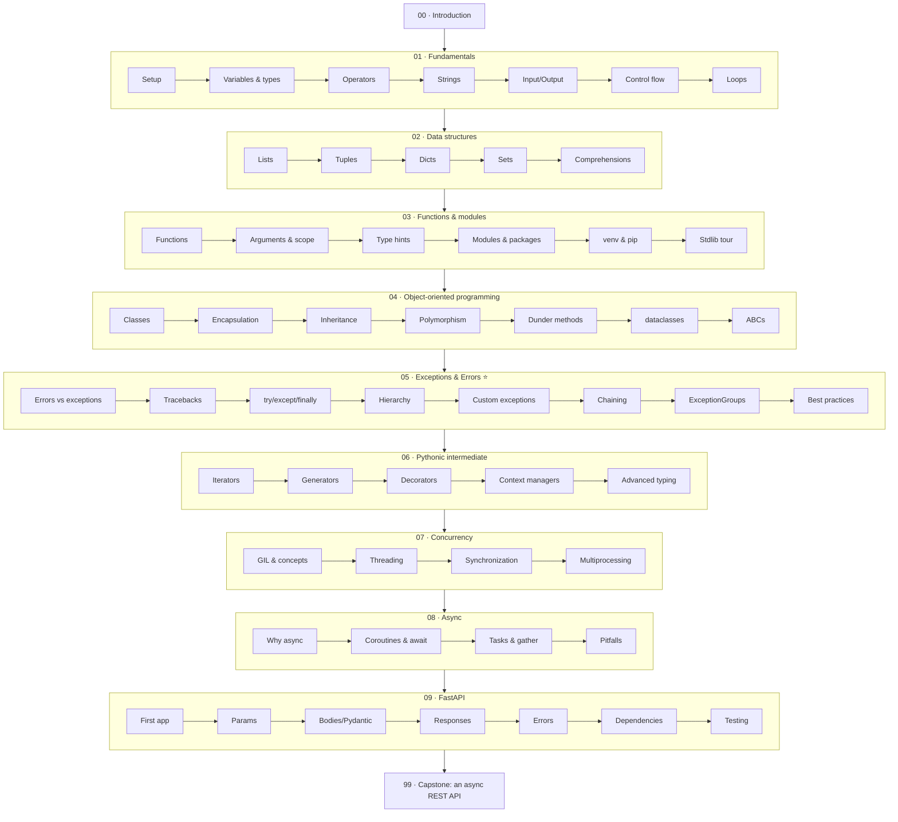

# Python — From Scratch to FastAPI

> **A complete, progressive Python course for absolute beginners.** Start with *"what is a variable"* and finish by building, testing, and reasoning about a real asynchronous web API. A dedicated, in-depth section on **Exceptions & Errors** sits at the heart of the course (Section 05 ⭐).

> **Verified:** 2026-06-04 against **Python 3.12.13**, **FastAPI 0.136.3**, **Pydantic 2.13.4**, **Starlette 1.2.1**, **Uvicorn 0.49.0**, **httpx 0.28.1**, **pytest 9.0.3**, **pytest-asyncio 1.4.0**.
> Every code sample in this course was **actually executed** in that environment and the **real output is shown**. Where a feature is new in a specific version (e.g. `ExceptionGroup` is Python 3.11+), that's called out inline.

---

## Who this is for

**You have never written a line of code** — or you've dabbled and want to learn Python *properly*, from the ground up. This course assumes:

- **No programming knowledge.** We define every term before using it.
- You can **install software** and **open a terminal** (we walk you through both in Section 01).
- You can give it **time**: this is a full course, roughly **40–60 hours** end to end. You do not have to do it all at once.

You do **not** need any maths beyond basic arithmetic, and you do **not** need a powerful computer.

## What you'll be able to do at the end

- Read and write Python comfortably — variables, logic, loops, functions, files.
- Model real things with **classes** (object-oriented programming).
- **Handle errors gracefully** instead of letting your program crash — and read any traceback Python throws at you.
- Run work **concurrently** with threads and processes, and write **asynchronous** code.
- Build, validate, document, and **test a real web API** with **FastAPI**.

## Prerequisites & setup

- A computer running **Windows, macOS, or Linux**.
- About **2 GB** of free disk space.
- We install **Python 3.12+** together in [Section 01](01_fundamentals/01_setup_and_first_program.md) — nothing to install beforehand.

> 💡 This course targets **Python 3.12+** and uses modern idioms (built-in generics like `list[int]`, the `type` statement, `match`, `ExceptionGroup`). Anything that requires a specific newer version is labelled so you're never surprised on an older interpreter.

---

## The learning path

## Sections at a glance

| # | Section | You'll learn to… | Time |
|---|---------|------------------|------|
| 00 | [Introduction](00_introduction.md) | Understand what Python is and how this course works | ~20 min |
| 01 | [Fundamentals](01_fundamentals/README.md) | Write, run, and debug basic programs | ~8 h |
| 02 | [Data structures](02_data_structures/README.md) | Store and transform collections of data | ~5 h |
| 03 | [Functions & modules](03_functions_and_modules/README.md) | Organise code into reusable pieces and projects | ~6 h |
| 04 | [Object-oriented programming](04_oop/README.md) | Model real-world things with classes | ~7 h |
| 05 | [Exceptions & Errors ⭐](05_exceptions_and_errors/README.md) | Handle failure cleanly; read any traceback | ~7 h |
| 06 | [Pythonic intermediate](06_pythonic_intermediate/README.md) | Write idiomatic, efficient Python | ~6 h |
| 07 | [Concurrency](07_concurrency/README.md) | Run work in parallel with threads/processes | ~5 h |
| 08 | [Async](08_async/README.md) | Write high-throughput asynchronous I/O code | ~5 h |
| 09 | [FastAPI](09_fastapi/README.md) | Build a validated, documented, tested web API | ~6 h |
| 99 | [Capstone project](99_capstone_project.md) | Combine *everything* into one real application | ~4 h |

## How to use this course

1. **Go in order.** Each module assumes the ones before it. Section 05 (errors) is placed right after OOP because by then you've written enough code to *hit* real errors — and everything after it (concurrency, async, FastAPI) leans on solid error handling.
2. **Type the code yourself.** Don't copy-paste. Muscle memory matters when you're starting out.
3. **Do the exercises.** Each module ends with practice and a collapsible solution. Try before you peek.
4. **Keep the official docs open:** <https://docs.python.org/3/> is the source of truth.

> ⭐ **The special focus — errors.** Most beginners fear the red error text. By the end of Section 05 you'll *welcome* it: a traceback is Python telling you exactly what went wrong and where. Learning to read and shape errors is the single biggest jump from "writes code" to "engineer".

→ Start here: **[00 · Introduction](00_introduction.md)**
