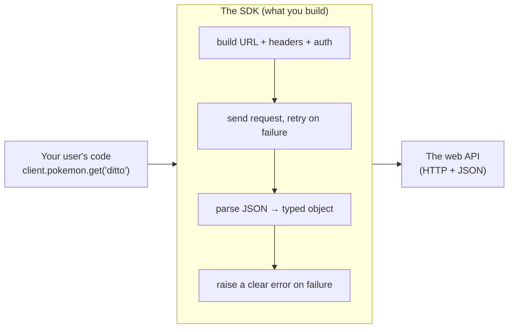

# 00: Introduction

> **Level:** Beginner (comfortable with Python) · **Prerequisites:** Python 3.10+, basic terminal use
> **Time:** ~20 min · **Verified:** 2026-06-04

## Welcome 👋

By the end of this course you'll have written a **Python SDK** — a real, installable client library — and it will let *anyone* talk to an API like this:

```python
from pokesdk import PokeClient

with PokeClient() as client:
    ditto = client.pokemon.get("ditto")
    print(ditto.name, ditto.weight)   # ditto 40
```

No URL building. No header juggling. No "did I handle the 404?" No `response.json()["name"]` and praying the key exists. Just `client.pokemon.get("ditto")` returning a **typed object** your editor autocompletes. That two-line ergonomics is the entire product an SDK sells — and building it well is the skill this course teaches.

We'll wrap the free, no-API-key **[PokéAPI](https://pokeapi.co)** because it's real, stable, and lets you run every example today. But nothing here is Pokémon-specific: the exact same design wraps the Stripe API, the Anthropic API, or your company's internal service.

## What *is* an SDK, really?

When a company says "we have a Python SDK," they mean: a package on PyPI you `pip install`, that exposes a friendly object (usually a `Client`) whose methods make HTTP calls *for* you and hand back clean Python objects. The SDK is a **translation layer** between two worlds:



Everything inside that box is plumbing the user *shouldn't* have to write. Your job as an SDK author is to write it **once, carefully**, so thousands of users never have to.

## Why not just call the API directly?

You can. For one throwaway script, `httpx.get(url)` is fine. The trouble is what happens as real usage grows — and feeling that pain is exactly where Section 01 starts. A quick preview of what an SDK gives you that a raw call doesn't:

| Concern | Raw API call | A good SDK |
|---|---|---|
| Discoverability | Read the docs, guess the URL | `client.` + autocomplete |
| Auth | Remember to add the header *every call* | Set the key once on the client |
| Errors | Check `status_code` by hand each time | Catch `NotFoundError`, `RateLimitError`, … |
| Types | `data["name"]` — hope it's there | `pokemon.name` — typed, autocompleted |
| Flaky network | Manual retry loops, copy-pasted | Built-in retries with backoff |
| Big lists | Manual `?offset=` looping | `for p in client.pokemon.list_all()` |
| Async | Rewrite everything with `httpx.AsyncClient` | `AsyncPokeClient`, same shape |

## The pieces you'll build, and where

Each row below is a real concern in shipped SDKs, mapped to where you'll tackle it:

| Need | Tool you'll use | Taught in |
|------|-----------------|-----------|
| Make it installable & importable | `pyproject.toml`, `src/` layout, hatchling | Section 02 |
| A friendly client object | a `Client` class wrapping `httpx` | Section 03 |
| Set auth once, send it everywhere | default headers on the client | Section 03 |
| Return typed objects, not dicts | Pydantic models + `py.typed` | Section 04 |
| Clear, catchable failures | a custom exception hierarchy | Section 05 |
| Survive flaky networks | retries with exponential backoff | Section 05 |
| Walk multi-page lists effortlessly | pagination iterators | Section 05 |
| Serve async users too | an async client sharing one core | Section 06 |
| Trust your code | `pytest` + `respx` (mocked HTTP) | Section 07 |
| Ship it to the world | `build`, `twine`, PyPI, GitHub Actions | Section 08 |
| Make it pleasant to adopt | docstrings, README, examples | Section 09 |

## Key terms (skim now, refer back later)

- **SDK (Software Development Kit):** here, a client *library* — a pip-installable package wrapping an API.
- **API / REST API:** a web service you talk to over HTTP, usually exchanging JSON. (Refresher in Section 01.)
- **Client:** the central object users create (`PokeClient()`) and call methods on.
- **Resource / namespace:** a grouping of related methods, like `client.pokemon.*`. Mirrors the API's "nouns."
- **Endpoint:** one URL the API responds to, e.g. `/pokemon/ditto`.
- **httpx:** the modern Python HTTP library we build on; it has both a sync `Client` and an async `AsyncClient`.
- **Pydantic:** a library that turns JSON into validated, typed Python objects.
- **Wheel / sdist:** the two file formats you build and upload to PyPI (`.whl` and `.tar.gz`).
- **PyPI:** the Python Package Index — where `pip install yourpackage` downloads from.
- **`py.typed`:** an empty marker file that tells type checkers "this package ships type hints."

> **Don't worry** if several of these are fuzzy. Each gets a module with runnable code.

## Why we chose these tools

- **httpx over requests:** it has a first-class **async** client with the *same* API as its sync one — essential for Section 06, where one design serves both. (`requests` is sync-only.)
- **Pydantic v2:** the de-facto standard for typed data models in modern Python; it's what FastAPI and most new SDKs use.
- **hatchling** as the build backend and **`pyproject.toml`** as the single config file: the current standard ([PEP 621](https://peps.python.org/pep-0621/)), replacing the old `setup.py`.
- **respx** for tests: it mocks `httpx` so the test suite runs **offline and instantly** — you never hit the real API in tests.
- **uv** (optional): a very fast, increasingly popular installer/packaging tool; we show it alongside the standard `pip`/`build`/`twine` flow.

## How this course verifies code

Every snippet was **run** in the environment listed in the [README](README.md). The SDK's logic is covered by an offline test suite (Section 07) you can run yourself. Examples that hit the live PokéAPI/httpbin are labelled **live** and their real output is shown — for instance, this is genuine output captured while writing this course:

```text
LIVE get: ditto | id 132 | weight 40 | types ['normal']
LIVE list_all first 5: ['bulbasaur', 'ivysaur', 'venusaur', 'charmander', 'charmeleon']
LIVE 404 -> NotFoundError | status 404
```

You'll never be told "this works" about code that wasn't checked.

## Recap & next

- ✅ An SDK is a **client library**: a translation layer that turns HTTP plumbing into one clean method call.
- ✅ You'll build `pokesdk` incrementally — packaging, client, types, robustness, async, tests, publishing.
- ✅ Self-check: in one sentence each, what does an SDK give a user that a raw `httpx.get` doesn't, for **auth**, **errors**, and **types**?

→ Next: **[01 · Foundations](01_foundations/README.md)** — what an SDK actually does for its users, a quick HTTP/REST refresher, and the naive client whose pain motivates everything that follows.
