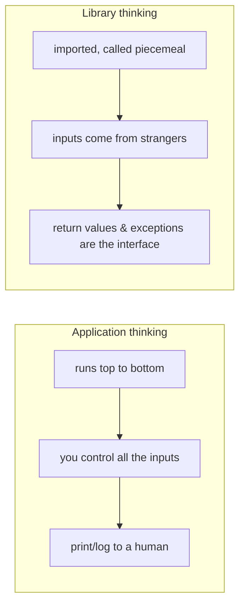
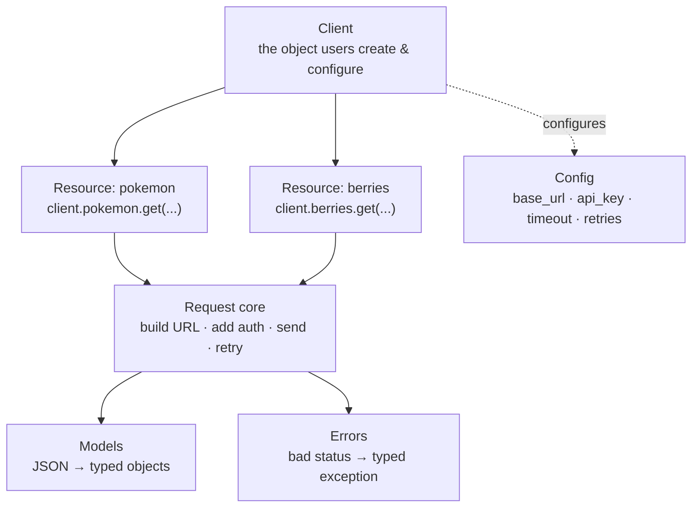

# 01: What is an SDK?

> **Level:** Beginner · **Prerequisites:** [00 · Introduction](../00_introduction.md)
> **Time:** ~45 min · **Verified:** 2026-06-04

## Why this matters

You can't build a good SDK until you can say precisely what an SDK *is for*. The answer isn't "it calls the API" — `httpx` already does that. An SDK exists to move work and decisions **off the user's plate and onto yours, once**. This module defines the parts of an SDK so that every later module has a name to hang on the thing it builds.

## A definition that fits in one breath

> An SDK (here, a **client library**) is a pip-installable package that exposes a friendly object whose methods make API calls for you and return clean, typed Python — handling auth, errors, retries, and parsing so callers don't.

The keyword is **for you**. Every feature of an SDK is a decision the author made so the user doesn't have to make it (or make it wrong) at every call site.

## The library vs. the application

It helps to notice you're switching roles. Most code you've written is an **application**: it has a `main`, it runs, it's used by *people*. A library is different — it's used by *other code*, written by *other developers* you'll never meet.



This reframing drives a lot of decisions later:

- **Your public API is a contract.** Once someone `from pokesdk import PokeClient`, renaming `PokeClient` breaks their code. (That's why Section 02 is careful about what's public, and Section 08 about versioning.)
- **You don't own the call site.** You can't `print()` errors and hope — you must *raise* something the caller can catch. (Section 05.)
- **You can't see their data.** Inputs are whatever a stranger passes. Validation and clear errors aren't niceties; they're the product.

## The anatomy of a client SDK

Almost every API SDK — Stripe's, Anthropic's, GitHub's, and the one you're building — has the same parts. Learn the parts once and you'll recognise them everywhere:



| Part | What it is | You'll build it in |
|------|-----------|--------------------|
| **Client** | The entry object users instantiate (`PokeClient()`), holding config and an HTTP connection pool | Section 03 |
| **Config** | base URL, API key, timeout, retry count — set once at construction | Section 03 / 05 |
| **Resources (namespaces)** | Method groups mirroring the API's nouns: `client.pokemon`, `client.berries` | Section 03 |
| **Request core** | The single function every method routes through: build → auth → send → retry → parse | Section 03 / 05 |
| **Models** | Typed objects (`Pokemon`) parsed from the JSON response | Section 04 |
| **Errors** | A hierarchy (`PokeError → NotFoundError`, …) users catch | Section 05 |

> **Design rule you'll see everywhere:** *one* request core. Every public method, sync or async, funnels through a single place that does auth, retries, and error mapping. Cross-cutting concerns get written once. Keep this in mind — it's the spine of the whole design.

## The "resource namespace" idea

Why `client.pokemon.get("ditto")` and not `client.get_pokemon("ditto")`? Because real APIs have *many* nouns, each with several verbs. Flat naming explodes:

```python
# Flat — gets unwieldy fast, no grouping, poor autocomplete
client.get_pokemon("ditto")
client.list_pokemon()
client.get_berry("cheri")
client.list_berries()

# Namespaced — groups by noun; `client.pokemon.` autocompletes to just pokemon verbs
client.pokemon.get("ditto")
client.pokemon.list_all()
client.berries.get("cheri")
client.berries.list_all()
```

Namespacing mirrors the API's own structure (`/pokemon`, `/berry`), keeps autocomplete focused, and scales to dozens of resources without a 200-method client class. This is exactly how the Stripe (`stripe.Customer`), Anthropic (`client.messages`), and OpenAI (`client.chat.completions`) SDKs are organised.

## What a *good* SDK adds beyond "it works"

A working SDK calls the API. A *good* one is judged on developer experience:

- **Discoverable:** typing `client.` reveals what's possible. Good names beat good docs.
- **Typed:** methods return objects with known fields, so editors autocomplete and type checkers catch mistakes *before* runtime.
- **Predictable errors:** failures are specific exceptions, documented and catchable — never a raw dict or a silent `None`.
- **Hard to misuse:** sensible defaults (timeouts on, retries on), and dangerous things require explicit opt-in.
- **Honest about the network:** it retries transient blips, surfaces real failures, and never hangs forever.
- **Installable & versioned:** `pip install pokesdk`, semantic version, changelog. Upgrades don't silently break callers.

We'll hit every one of these. Keep this list — it's the rubric your finished SDK is graded against in the [capstone](../99_project_pokesdk/README.md).

## Recap & next

- ✅ An SDK is a **client library**: it moves auth/errors/retries/parsing off the user, *once*.
- ✅ You're writing a **library**, not an app — return values and exceptions are your interface; the public API is a contract.
- ✅ The standard parts: **Client → Resources → Request core → Models / Errors**, configured once.
- ✅ Self-check: name the six anatomy parts and one thing each does. Why namespaces over flat method names?

→ Next: **[02 · HTTP & REST refresher](02_http_and_rest_refresher.md)** — the protocol details you're about to wrap.

## Exercises

1. **Spot the parts.** Open any SDK you've used (or skim Anthropic's/Stripe's Python README online). Identify its Client, at least one resource namespace, and how it reports errors.

<details><summary>Solution (Anthropic SDK, as an example)</summary>

- **Client:** `Anthropic(api_key=...)` — configured once.
- **Resource namespace:** `client.messages.create(...)` — `messages` groups message verbs.
- **Errors:** a hierarchy like `anthropic.APIError`, `anthropic.RateLimitError`, `anthropic.AuthenticationError` — catchable subclasses, exactly the pattern you build in Section 05.

The point: every mature SDK shows the same skeleton.
</details>

2. **Library vs app.** You wrote `print("not found")` inside an SDK method when the API returns 404. Why is that the wrong move, and what should happen instead?

<details><summary>Solution</summary>

A library doesn't own the call site, so it can't assume there's a human watching stdout — the caller might be a web server, a worker, or another library. `print` is invisible to code. Instead **raise** a specific exception (`NotFoundError`) the caller can `try/except`, log, or convert to an HTTP 404 of their own. Communication between library and caller happens through **return values and exceptions**, not side effects.
</details>

3. **Namespace design.** Sketch the method names for an SDK wrapping an API with `/users` and `/orders`, each supporting "get one," "list all," and "create." Show both flat and namespaced styles; note which scales better and why.

<details><summary>Solution</summary>

```python
# Flat: 6 methods on one class, prefixes carry the grouping
client.get_user(id);   client.list_users();   client.create_user(data)
client.get_order(id);  client.list_orders();  client.create_order(data)

# Namespaced: 2 resources × 3 verbs, grouping is structural
client.users.get(id);   client.users.list_all();   client.users.create(data)
client.orders.get(id);  client.orders.list_all();  client.orders.create(data)
```

Namespaced scales better: adding `/products` adds a `client.products` object, not three more methods diluting the client's autocomplete. Verbs stay short and consistent (`get`/`list_all`/`create`) across resources, so the API feels regular.
</details>
