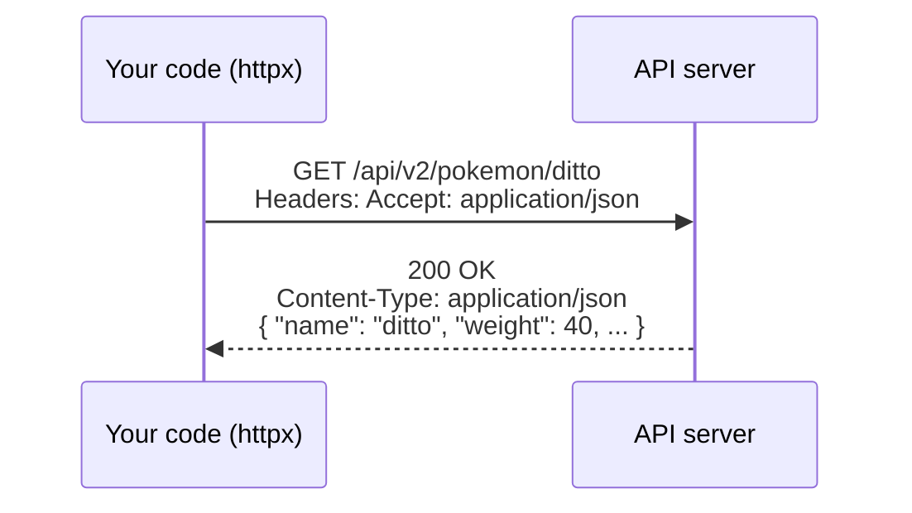
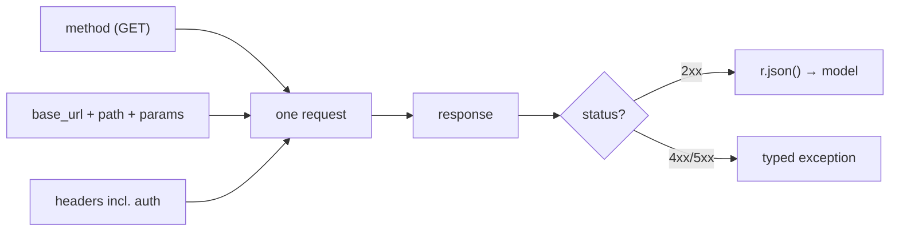

# 02: HTTP & REST refresher

> **Level:** Beginner · **Prerequisites:** [01 · What is an SDK](01_what_is_an_sdk.md)
> **Time:** ~45 min · **Verified:** 2026-06-04 (httpx 0.28.1, live PokéAPI & httpbin)

## Why this matters

Your SDK wraps HTTP. You don't need to be an HTTP expert, but you must fluently read the handful of things an API client touches every call: the **method**, the **URL + query params**, the **headers** (especially auth), the **status code**, and the **JSON body**. This module is a fast, hands-on tour using the real PokéAPI — and it doubles as your first look at `httpx`, the library the SDK is built on.

## Install httpx

```bash
python -m venv .venv && source .venv/bin/activate   # Windows: .venv\Scripts\activate
pip install httpx
```

> We use a **virtual environment** (`.venv`) so this project's packages stay isolated from your system Python. Activate it in any terminal you work in.

## A request and a response, end to end

Every HTTP exchange is: client sends a **request** (method + URL + headers + optional body), server sends back a **response** (status code + headers + optional body).



Here it is for real:

```python
import httpx

r = httpx.get("https://pokeapi.co/api/v2/pokemon/ditto", timeout=10)
print("status_code :", r.status_code)
print("content-type:", r.headers["content-type"])
data = r.json()                       # parse JSON body into a Python dict
print("name        :", data["name"])
print("weight      :", data["weight"])
print("types       :", [t["type"]["name"] for t in data["types"]])
```

**Live output:**

```text
status_code : 200
content-type: application/json; charset=utf-8
name        : ditto
weight      : 40
types       : ['normal']
```

That `data["types"]` line — reaching three dicts deep and hoping every key exists — is the kind of fragile access your SDK will replace with `pokemon.types[0].type.name` on a typed object (Section 04).

## HTTP methods (verbs)

The method says *what kind of action* you want. REST APIs map them to CRUD:

| Method | Means | CRUD | Has a body? |
|--------|-------|------|-------------|
| `GET` | read a resource | Read | no |
| `POST` | create a resource | Create | yes (JSON) |
| `PUT` / `PATCH` | replace / update | Update | yes |
| `DELETE` | remove a resource | Delete | usually no |

PokéAPI is read-only, so you'll use `GET`. But your SDK's request core (Section 03) takes the method as an argument, so adding `POST` later is trivial — the design doesn't assume read-only.

## REST resources & URLs

REST models the API as **resources** (nouns) addressed by URL:

```
https://pokeapi.co/api/v2/pokemon/ditto
└────────── base URL ──────────┘└ resource ┘└ id ┘
```

- **Base URL:** the unchanging prefix (`https://pokeapi.co/api/v2`). Your SDK stores this once as config; methods only supply the part after it (`/pokemon/ditto`).
- **Collection vs item:** `/pokemon` is the collection (list), `/pokemon/ditto` is one item. This is exactly the `list_all()` vs `get(id)` split in your resource methods.

## Query parameters

Extra instructions go in the query string after `?`, as `key=value` pairs joined by `&`. `httpx` builds them for you from a dict:

```python
import httpx

r = httpx.get("https://pokeapi.co/api/v2/pokemon", params={"limit": 3, "offset": 0}, timeout=10)
print("url     :", r.url)
d = r.json()
print("count   :", d["count"])
print("next    :", d["next"])
print("results :", [x["name"] for x in d["results"]])
```

**Live output:**

```text
url     : https://pokeapi.co/api/v2/pokemon?limit=3&offset=0
count   : 1350
next    : https://pokeapi.co/api/v2/pokemon?offset=3&limit=3
results : ['bulbasaur', 'ivysaur', 'venusaur']
```

Notice `count: 1350` and a `next` URL — the server returns **one page** and tells you where the next is. That's pagination, which your SDK will hide behind a simple `for` loop (Section 05).

## Status codes — the response's headline

The status code is a 3-digit number summarising the outcome. You only need the families plus a few specifics:

| Range | Family | Meaning | What your SDK does |
|-------|--------|---------|--------------------|
| 2xx | Success | it worked (200 OK, 201 Created) | parse and return |
| 4xx | Client error | *you* messed up | raise a specific error, **don't** retry |
| 5xx | Server error | *they* messed up | retry a few times, then raise |
| — | (network) | no response at all (timeout, DNS) | retry, then raise a connection error |

The specific codes your error hierarchy will care about (Section 05):

| Code | Name | Typical cause | SDK exception |
|------|------|---------------|---------------|
| 401 / 403 | Unauthorized / Forbidden | bad or missing API key | `AuthenticationError` |
| 404 | Not Found | resource doesn't exist | `NotFoundError` |
| 429 | Too Many Requests | rate limited | `RateLimitError` (retryable) |
| 500–504 | Server errors | server hiccup | `ServerError` (retryable) |

`httpx` exposes this as `r.status_code` and the convenience `r.is_success`:

```python
import httpx
r = httpx.get("https://pokeapi.co/api/v2/pokemon/nope-not-real", timeout=10)
print("status_code:", r.status_code)   # 404
print("is_success :", r.is_success)     # False
```

**Live output:**

```text
status_code: 404
is_success : False
```

> **Crucial gotcha:** `httpx.get()` does **not** raise on a 404 or 500 — it returns a response with that status. A 404 is still a perfectly valid HTTP *response*. If you forget to check `status_code`, you'll happily call `.json()` on an error body. Turning "check the status" from a thing every caller must remember into a thing the SDK does once is half the reason SDKs exist.

## Headers, and auth specifically

Headers are key–value metadata on the request/response. The one your SDK cares most about is **authentication** — proving who you are. Common schemes:

- **Bearer token:** `Authorization: Bearer <token>` — the most common for modern APIs (and what your SDK will send).
- **API key header:** e.g. `X-API-Key: <key>`.
- **Query-param key:** `?api_key=<key>` (older style).

PokéAPI needs no auth, but [httpbin.org](https://httpbin.org) echoes what you send, so we can *prove* an auth header arrives:

```python
import httpx
r = httpx.get("https://httpbin.org/bearer", headers={"Authorization": "Bearer my-secret"}, timeout=10)
print("authenticated:", r.json()["authenticated"])
print("token        :", r.json()["token"])
```

**Live output:**

```text
authenticated: True
token        : my-secret
```

The lesson for the SDK: the user sets their key **once** on the client, and the client attaches this header to **every** request automatically (Section 03). No per-call header juggling.

## JSON, the lingua franca

Request and response bodies are almost always **JSON** — a text format that maps cleanly to Python dicts/lists/str/int/bool/None. `r.json()` parses a response body into Python; passing `json=...` to a request serialises a Python dict into the body. Section 04 takes the next step: turning that loose dict into a *typed* object.

## The whole picture, mapped to your SDK



Every box on the left is something your SDK assembles *for* the user; every box on the right is something it interprets *for* them. That's the job.

## Recap & next

- ✅ A request = **method + URL(+params) + headers(+body)**; a response = **status + headers + body**.
- ✅ **Status families:** 2xx ok, 4xx your fault (don't retry), 5xx their fault (retry), network errors (retry). `httpx` **doesn't raise** on 4xx/5xx — you check.
- ✅ Auth is just a header (`Authorization: Bearer …`) the SDK attaches to every call.
- ✅ JSON bodies parse via `r.json()`; `params={...}` builds the query string.
- ✅ Self-check: which status families should an SDK retry, and which must it *not*? Why doesn't `httpx.get` raise on a 500?

→ Next: **[03 · The naive client & its problems](03_the_naive_client_and_its_problems.md)** — we write the "just call the API" version and watch it buckle.

## Exercises

1. **Read a new endpoint.** Use `httpx.get` to fetch `https://pokeapi.co/api/v2/berry/cheri` and print its `name`, `id`, and `growth_time`. Then fetch the *collection* `https://pokeapi.co/api/v2/berry` with `params={"limit": 5}` and print the names.

<details><summary>Solution</summary>

```python
import httpx
r = httpx.get("https://pokeapi.co/api/v2/berry/cheri", timeout=10).json()
print(r["name"], r["id"], r["growth_time"])           # cheri 1 3

page = httpx.get("https://pokeapi.co/api/v2/berry", params={"limit": 5}, timeout=10).json()
print([b["name"] for b in page["results"]])
# ['cheri', 'chesto', 'pecha', 'rawst', 'aspear']
```
</details>

2. **Classify statuses.** For each, say success/client-error/server-error and whether an SDK should retry: `200`, `404`, `429`, `503`, `401`.

<details><summary>Solution</summary>

- `200` success — return the result.
- `404` client error — **don't** retry; the resource simply isn't there (`NotFoundError`).
- `429` client error *but* retryable — back off and retry (`RateLimitError`).
- `503` server error — retry (`ServerError`).
- `401` client error — **don't** retry; the key is wrong, retrying won't fix it (`AuthenticationError`).
</details>

3. **Prove a header is sent.** Send a custom header `X-Demo: hello` to `https://httpbin.org/headers` and confirm the server saw it.

<details><summary>Solution</summary>

```python
import httpx
r = httpx.get("https://httpbin.org/headers", headers={"X-Demo": "hello"}, timeout=10)
print(r.json()["headers"]["X-Demo"])    # hello
```

httpbin echoes back the headers it received — handy for verifying your SDK sends what you think it does (you'll use it again in Section 03).
</details>
