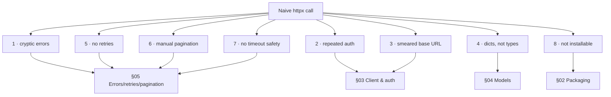

# 03: The naive client & its problems

> **Level:** Beginner · **Prerequisites:** [02 · HTTP & REST refresher](02_http_and_rest_refresher.md)
> **Time:** ~50 min · **Verified:** 2026-06-04 (httpx 0.28.1, live PokéAPI)

## Why this matters

The fastest way to understand *why* every SDK feature exists is to live without it for ten minutes. In this module we write the API call the way everyone first writes it, then poke it until it hurts. Each thing that breaks becomes a named problem — and a forward link to the section that fixes it. This is the motivation map for the whole course.

## The naive version

Here's how an API call usually starts life — a function with the URL inline:

```python
# naive.py
import httpx

def get_pokemon(name):
    r = httpx.get(f"https://pokeapi.co/api/v2/pokemon/{name}")
    return r.json()

p = get_pokemon("ditto")
print("ok :", p["name"], p["weight"])
```

**Live output:**

```text
ok : ditto 40
```

It works! Ship it, right? Let's see what happens the moment reality intrudes.

## Problem 1 — A wrong name gives a baffling error

A user makes a typo. The resource doesn't exist, so PokéAPI returns **404 with an empty body**. Remember from Module 02: `httpx` doesn't raise on a 404. So `.json()` runs on an empty body:

```python
bad = get_pokemon("dittoo")   # typo
print(bad["name"])
```

**Live output:**

```text
JSONDecodeError: Expecting value: line 1 column 1 (char 0)
```

Think about what just happened. The real problem is "that Pokémon doesn't exist" (a 404), but the user sees a `JSONDecodeError` about *parsing* — pointing at the wrong layer entirely. They'll waste time debugging JSON when the issue is the name. A good SDK raises `NotFoundError` here.

> **→ Fixed in [Section 05 · Error hierarchy](../05_robustness/01_error_hierarchy.md):** check the status *before* parsing, and translate it into a precise, catchable exception.

## Problem 2 — Auth gets copy-pasted (and forgotten)

PokéAPI is open, but pretend it needs a key. With the naive style, every call site must remember the header:

```python
def get_pokemon(name, api_key):
    return httpx.get(
        f"https://pokeapi.co/api/v2/pokemon/{name}",
        headers={"Authorization": f"Bearer {api_key}"},   # repeated EVERYWHERE
    ).json()

def list_pokemon(api_key):
    return httpx.get(
        "https://pokeapi.co/api/v2/pokemon",
        headers={"Authorization": f"Bearer {api_key}"},   # ...again
    ).json()
```

The key is threaded through every function and the header is duplicated at every call. Forget it in one place → a confusing 401. Rotate the key → edit it everywhere. The auth scheme is a copy-paste convention instead of a guarantee.

> **→ Fixed in [Section 03 · Auth & headers](../03_the_sync_client/02_auth_and_headers.md):** set the key **once** on a client object; it attaches the header to **every** request automatically.

## Problem 3 — The base URL is smeared across the code

`https://pokeapi.co/api/v2` is hard-coded in every function. Want to hit a staging server, a mock, or a new API version (`/api/v3`)? Find-and-replace across the codebase, hoping you catch them all.

> **→ Fixed in [Section 03 · Request helper & base URL](../03_the_sync_client/03_request_helper_and_base_url.md):** base URL is config on the client; methods only name the path.

## Problem 4 — You're handed dicts, not objects

`p["name"]`, `p["types"][0]["type"]["name"]` — every access is a string key the editor can't autocomplete and the type checker can't verify. Typo `p["naem"]` and you get a `KeyError` at runtime, in production, not in your editor.

```python
p = get_pokemon("ditto")
p["weihgt"]      # KeyError at runtime — nothing warned you
```

> **→ Fixed in [Section 04 · Response models](../04_data_models/01_response_models_pydantic.md):** return a typed `Pokemon` object; `p.weight` autocompletes and `p.weihgt` is flagged *before* you run it.

## Problem 5 — One network blip = one failure

The naive call has no resilience. A momentary `503` or a dropped connection — common at scale — fails the whole operation, even though retrying once would have succeeded. So every *caller* ends up writing their own retry loop, all slightly different and slightly wrong.

> **→ Fixed in [Section 05 · Retries & backoff](../05_robustness/02_retries_and_backoff.md):** the SDK retries transient failures (5xx, 429, connection errors) with exponential backoff — once, correctly, for everyone.

## Problem 6 — Big lists are a manual chore

Recall `/pokemon` returned `count: 1350` and a `next` URL. To get them all, every caller must write the same offset-walking loop:

```python
results, url = [], "https://pokeapi.co/api/v2/pokemon?limit=100"
while url:
    page = httpx.get(url).json()
    results += page["results"]
    url = page["next"]      # everyone re-implements this, every time
```

> **→ Fixed in [Section 05 · Pagination](../05_robustness/03_pagination.md):** `for p in client.pokemon.list_all(): ...` hides the loop entirely.

## Problem 7 — No timeout = a potential hang

Did you notice the naive `httpx.get(...)` had no `timeout`? `httpx` *does* default to a sane timeout, but the moment someone writes `httpx.Client(timeout=None)` for "reliability," a single unresponsive server can hang their program forever. An SDK should make a sane timeout the default and the dangerous choice explicit.

> **→ Fixed in [Section 05 · Timeouts, logging, config](../05_robustness/04_timeouts_logging_config.md).**

## Problem 8 — It's not even installable

`naive.py` is a file you copy around. It's not `pip install`-able, not versioned, not importable as `from pokesdk import …`. Two projects that need it copy-paste it and drift apart. There's no way to say "I depend on version 1.2 of this."

> **→ Fixed in [Section 02 · Packaging](../02_packaging_basics/README.md) and [Section 08 · Publishing](../08_packaging_publishing/README.md).**

## The pain map

Every problem you just felt has a home in the course:



| Problem | Symptom | Fixed in |
|---|---|---|
| Cryptic errors | `JSONDecodeError` instead of "not found" | §05 Errors |
| Repeated auth | header copy-pasted, easy to forget | §03 Auth |
| Smeared base URL | find-and-replace to change API host | §03 Request helper |
| Dicts not types | `KeyError` at runtime, no autocomplete | §04 Models |
| No retries | one blip = total failure | §05 Retries |
| Manual pagination | every caller re-writes the loop | §05 Pagination |
| No timeout safety | can hang forever | §05 Config |
| Not installable | copy-paste, no versioning | §02 / §08 |

## The shape we're building toward

Hold this target in mind. Every section closes one gap above until the naive snippet becomes:

```python
from pokesdk import PokeClient, NotFoundError

with PokeClient(api_key="...") as client:   # auth set once, timeout & retries on
    try:
        ditto = client.pokemon.get("ditto") # typed object, retried, parsed
        print(ditto.name, ditto.weight)      # autocompleted, type-checked
    except NotFoundError:
        print("no such pokemon")             # precise, catchable
    for p in client.pokemon.list_all():      # pagination hidden
        ...
```

## Recap & next

- ✅ The naive `httpx.get` works for a demo and fails for a product: cryptic errors, copy-pasted auth, hard-coded URLs, dict access, no resilience, manual pagination, no packaging.
- ✅ Each pain maps to a section. The SDK isn't one feature — it's the sum of these fixes behind one clean call.
- ✅ Self-check: from memory, list four problems with the naive client and the SDK feature that fixes each.

→ Next: **[Section 02 · Packaging basics](../02_packaging_basics/README.md)** — we fix Problem 8 first, turning a folder into a real installable package, so everything we build from here is importable as `pokesdk`.

## Exercises

1. **Reproduce the cryptic error.** Run the naive `get_pokemon("dittoo")` yourself and confirm you get a `JSONDecodeError`. Then add a single `if not r.is_success: raise ...` line and observe how much clearer the failure becomes. (This is a preview of the error layer.)

<details><summary>Solution</summary>

```python
import httpx
def get_pokemon(name):
    r = httpx.get(f"https://pokeapi.co/api/v2/pokemon/{name}")
    if not r.is_success:
        raise RuntimeError(f"request failed: {r.status_code}")
    return r.json()

get_pokemon("dittoo")   # RuntimeError: request failed: 404  ← points at the real problem
```

Even this crude check converts a misleading `JSONDecodeError` into an honest "404." Section 05 makes it a typed `NotFoundError` you can catch specifically.
</details>

2. **Count the call sites.** Imagine an app with 12 functions each calling this API with auth. If the header format changes from `Bearer X` to `Token X`, how many edits with the naive approach? How many if auth lived on a client object?

<details><summary>Solution</summary>

Naive: **12 edits** (one per call site), with the risk of missing one. With auth centralised on the client: **1 edit**, in the client's header-building code. This is the entire argument for a client object, in one number.
</details>

3. **Predict the failure mode.** A caller using the naive client hits a transient `503` once per ~100 calls. Over a 10,000-call batch job, roughly how many spurious failures? What would a single retry do to that number?

<details><summary>Solution</summary>

~100 failures (1%). If each `503` is independent and a single retry succeeds ~99% of the time, one retry drops expected failures to ~1 (0.01%). Cheap retries with backoff turn an unreliable batch into a reliable one — which is why it belongs *in* the SDK, not in every caller's code.
</details>
