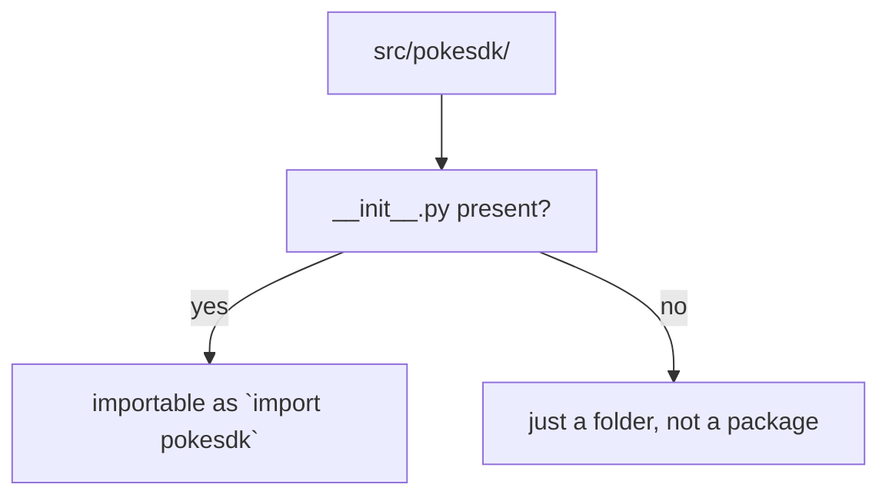
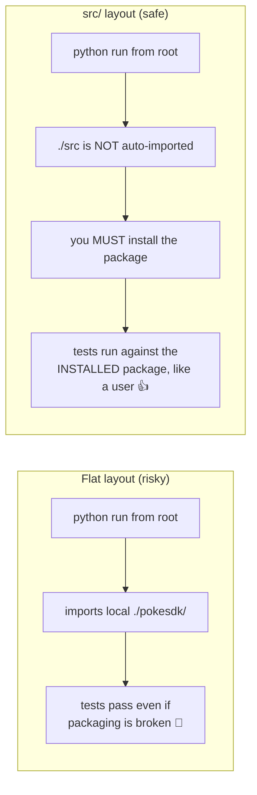

# 01: Project layout & the `src/` directory

> **Level:** Beginner · **Prerequisites:** [Section 01](../01_foundations/README.md)
> **Time:** ~45 min · **Verified:** 2026-06-04

## Why this matters

Where files live in a package isn't cosmetic — the wrong layout lets bugs hide until your users hit them. This module shows the **`src/` layout** that mature projects (including the SDK you're building) use, and explains the subtle reason it's worth the extra folder.

## The target layout

Here's the shape `pokesdk` will have by the end of the course. Don't worry about files you haven't met yet — note the *structure*:

```
pokesdk/                     # the project (repo) root
├── pyproject.toml           # the one config file: metadata, deps, build (Module 02)
├── README.md                # shown on PyPI and GitHub
├── src/
│   └── pokesdk/             # THE IMPORTABLE PACKAGE (what `import pokesdk` finds)
│       ├── __init__.py      # the public API surface (Module 03)
│       ├── _version.py      # single source of the version string
│       ├── client.py        # the sync client (Section 03)
│       ├── async_client.py  # the async client (Section 06)
│       ├── _base.py         # shared core (private — note the leading _)
│       ├── models.py        # Pydantic response models (Section 04)
│       ├── exceptions.py    # the error hierarchy (Section 05)
│       ├── pagination.py    # page iterators (Section 05)
│       └── py.typed         # marker: "this package ships type hints" (Section 04)
└── tests/                   # the test suite (Section 07) — NOT shipped to users
    ├── conftest.py
    └── test_*.py
```

Two names that look the same but aren't:

- The **project** (outer `pokesdk/`) — your repo, holding config, tests, docs. Its name is informal.
- The **package** (`src/pokesdk/`) — the directory users actually `import`. Its name *is* the import name and must match `[project] name` (roughly) in `pyproject.toml`.

## What makes a directory a "package"?

A directory is an importable package when it contains an `__init__.py` file (even an empty one). That file runs when the package is first imported, and — as you'll see in Module 03 — it's where you choose what the package exposes.



## Why `src/`? The shadowing trap

You *could* put `pokesdk/` straight at the repo root (the "flat layout"). It even seems simpler. But it creates a sneaky problem.

When Python runs from your project root, the **current directory is on the import path**. With a flat layout, `import pokesdk` finds the folder sitting *right there* — whether or not the package is actually installed correctly. So your tests pass, your scripts run… and you never discover that your packaging is broken until a *user* installs the published wheel and a file you forgot to include is missing.



With `src/`, the package isn't importable until you `pip install` it (next module). That sounds like friction, but it's the point: **you test what you ship.** If a file is missing from your build config, your own tests catch it, not your users. This is why the Python Packaging Authority recommends the `src/` layout, and why every SDK in this course uses it.

> **One-line summary:** the `src/` layout forces you to install your package the same way a user would, so packaging mistakes surface in *your* terminal instead of theirs.

## Verified: where an installed package imports from

After you install `pokesdk` editable (Module 02), Python imports it straight from your `src/` tree — so edits are live, but the import goes through the *installed* machinery:

```python
import pokesdk
print(pokesdk.__file__)
```

**Output (from the real package):**

```text
/path/to/pokesdk/src/pokesdk/__init__.py
```

That path proves two things at once: the code is your editable `src/` (so changes apply immediately) *and* it was resolved via the install, not a happens-to-be-here folder.

## Files that don't ship

Note `tests/` lives at the project root, **outside** `src/pokesdk/`. Tests are for *you*; users who `pip install pokesdk` shouldn't download them. Keeping tests out of the package directory makes that automatic — the build only packages what's under `src/pokesdk/`. (Same goes for `pyproject.toml`, CI config, and the dev-only `README` sections.)

## Recap & next

- ✅ A package is a directory with `__init__.py`; the **package** name is the import name, distinct from the **project** name.
- ✅ The **`src/` layout** prevents the flat-layout trap where local folders shadow the installed package and hide packaging bugs.
- ✅ With `src/`, you must install the package to import it — so your tests run against what users get.
- ✅ Tests live outside the package and aren't shipped.
- ✅ Self-check: why can a flat-layout project's tests pass while its published wheel is broken?

→ Next: **[02 · pyproject.toml & editable install](02_pyproject_and_editable_install.md)** — the config that turns this folder into an installable package.

## Exercises

1. **Build the skeleton.** Create the project root with `src/pokesdk/__init__.py` (put `__version__ = "0.1.0"` in it) and an empty `tests/` folder. Don't add `pyproject.toml` yet.

<details><summary>Solution</summary>

```bash
mkdir -p pokesdk/src/pokesdk pokesdk/tests
cd pokesdk
printf '__version__ = "0.1.0"\n' > src/pokesdk/__init__.py
```

Try `python -c "import pokesdk"` from the project root — it **fails** (`ModuleNotFoundError`), because `src/` isn't on the path and nothing is installed. That failure is the `src/` layout doing its job; Module 02 fixes it the right way (by installing).
</details>

2. **Demonstrate the trap.** In a *flat* layout (a `pokesdk/` folder at the root, no `src/`), run `python -c "import pokesdk; print(pokesdk.__file__)"` from the root. Where does it import from, and what packaging bug could this hide?

<details><summary>Solution</summary>

It imports from `./pokesdk/__init__.py` — the local folder, found because the current directory is on `sys.path`. This works *even with no install and no valid `pyproject.toml`*. So you could have a completely broken build config and still pass tests, then ship a wheel that's missing files. The `src/` layout removes the current dir as an accidental source.
</details>

3. **Package vs project.** If `[project] name = "poke-sdk"` but the importable folder is `src/pokesdk/`, what does a user type to import it — `import poke-sdk` or `import pokesdk`? (Hint: hyphens.)

<details><summary>Solution</summary>

`import pokesdk`. The **install/PyPI name** can contain hyphens (`poke-sdk`), but the **import name** is the directory name and must be a valid Python identifier — no hyphens. They're allowed to differ, which trips people up; keeping them aligned (`pokesdk` / `pokesdk`) avoids confusion. (`pip install poke-sdk` then `import pokesdk` is a common real-world mismatch.)
</details>
