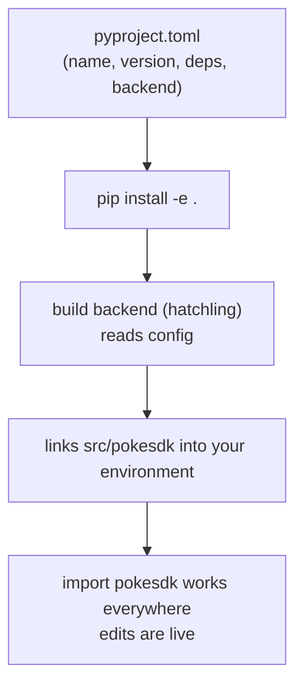

# 02: pyproject.toml & editable install

> **Level:** Beginner · **Prerequisites:** [01 · Project layout](01_project_layout_src.md)
> **Time:** ~50 min · **Verified:** 2026-06-04 (hatchling 1.30.1, pip 25.3)

## Why this matters

`pyproject.toml` is the single file that turns your `src/pokesdk/` folder into a real package: it declares the name, the version, the dependencies, and **how to build it**. Then an *editable install* makes the package importable from anywhere while you keep editing the source. Together they fix the naive client's "it's not even installable" problem and unblock everything after.

## The one config file: `pyproject.toml`

Modern Python packaging uses one declarative file, `pyproject.toml`, defined by [PEP 621](https://peps.python.org/pep-0621/). It replaced the old executable `setup.py`. Here's a minimal-but-real version for `pokesdk`:

```toml
[build-system]
requires = ["hatchling"]
build-backend = "hatchling.build"

[project]
name = "pokesdk"
version = "0.1.0"
description = "A small, typed Python client for the PokéAPI."
readme = "README.md"
requires-python = ">=3.10"
dependencies = [
    "httpx>=0.27",
    "pydantic>=2.0",
]

[tool.hatch.build.targets.wheel]
packages = ["src/pokesdk"]
```

Reading it section by section:

### `[build-system]` — *who* builds the package

```toml
requires = ["hatchling"]
build-backend = "hatchling.build"
```

Building a package (into a wheel) is done by a **build backend**. You declare which one here. We use **hatchling** — modern, fast, zero-boilerplate, and a good default in 2026. Alternatives you'll see in the wild: `setuptools` (the classic), `flit-core`, `pdm-backend`. They all read the same `[project]` table, so switching is low-stakes. `pip` reads `requires`, installs the backend into an isolated environment, and asks it to build — you never call the backend directly.

### `[project]` — *what* the package is (PEP 621 metadata)

| Field | What it does |
|-------|--------------|
| `name` | the PyPI / `pip install` name |
| `version` | the version string (more on managing this in Section 08) |
| `description` | one-line summary shown on PyPI |
| `readme` | file whose contents become the PyPI long description |
| `requires-python` | minimum Python; pip refuses to install on older |
| `dependencies` | packages auto-installed alongside yours |

> **Dependencies are a promise.** `httpx>=0.27` means "my SDK needs httpx, at least 0.27." When a user `pip install pokesdk`, pip pulls httpx and pydantic too. Pin a *lower bound* you actually support; avoid pinning an exact version (`==`) in a library — it causes conflicts in the user's environment. (Section 08 covers version ranges in depth.)

### `[tool.hatch.build.targets.wheel]` — backend-specific config

```toml
packages = ["src/pokesdk"]
```

Because we use the `src/` layout, we tell hatchling where the importable package lives. Without this, a backend might guess wrong and ship an empty or mislaid package. (Each backend has its own `[tool.<backend>]` table; this one is hatchling's.)

## Editable install: edit and import at the same time

Now make it importable. From the project root (where `pyproject.toml` lives):

```bash
pip install -e .
```

- `-e` / `--editable`: link the package to your `src/` source instead of copying it. Edit a `.py` file and the change is live on the next `import` — no reinstall.
- `.`: "the package described by the `pyproject.toml` in the current directory."

This is the everyday developer-loop install. (Building a *distributable* wheel for PyPI is a different command, `python -m build` — Section 08.)

### Verified: install then import

```bash
$ pip install -e .
$ python -c "import pokesdk; print(pokesdk.__version__)"
```

**Output (real run):**

```text
0.1.0
```

And confirming it resolves to your editable `src/` tree:

```python
import pokesdk
print(pokesdk.__file__)
# /path/to/pokesdk/src/pokesdk/__init__.py
```

The import works from *any* directory now (not just the project root), because it went through a real install — exactly the property the `src/` layout was protecting.

## The mental model



## Bonus: the same flow with `uv`

`uv` is a fast, increasingly popular packaging tool (a single binary covering venv + install + build). The editable install is:

```bash
uv pip install -e .
```

It reads the *same* `pyproject.toml` — the standard is the standard, the tool is just faster. We'll use plain `pip` in the course text and note `uv` equivalents; either works.

## Common errors & fixes

| Symptom | Cause | Fix |
|---|---|---|
| `ModuleNotFoundError: No module named 'pokesdk'` after install | wheel `packages` path wrong, or `__init__.py` missing | check `[tool.hatch.build.targets.wheel] packages = ["src/pokesdk"]` and that `src/pokesdk/__init__.py` exists |
| `No module named 'hatchling'` during install | build backend not reachable | ensure `[build-system] requires = ["hatchling"]`; pip installs it into an isolated build env automatically — a stale cache can interfere (`pip install -e . --no-build-isolation` only as a debugging step) |
| pip installs a *copy*, edits don't apply | forgot `-e` | reinstall with `pip install -e .` |
| `error: Multiple top-level packages discovered` (setuptools) | flat layout confused the backend | use the `src/` layout and declare the package path |

## Recap & next

- ✅ `pyproject.toml` is the single declarative config: `[build-system]` (who builds), `[project]` (metadata + deps), `[tool.*]` (backend specifics).
- ✅ A **build backend** (hatchling) does the building; pip drives it. The `src/` layout needs `packages = ["src/pokesdk"]`.
- ✅ `pip install -e .` links your source so it's importable everywhere *and* edits are live.
- ✅ Self-check: what's the difference between the `[build-system]` table and the `[project]` table? Why `-e`?

→ Next: **[03 · Imports & your public API](03_imports_and_public_api.md)** — deciding what `pokesdk` exposes and how users import it.

## Exercises

1. **Make it installable.** Add the minimal `pyproject.toml` above to the skeleton from Module 01, then `pip install -e .` and confirm `import pokesdk` works from your home directory (not just the project root).

<details><summary>Solution</summary>

```bash
cd pokesdk
# (paste the minimal pyproject.toml)
pip install -e .
cd ~                                  # leave the project dir
python -c "import pokesdk; print(pokesdk.__version__)"   # 0.1.0
```

Working from `~` proves it's a real install, not the current-directory accident the flat layout relied on.
</details>

2. **Break it on purpose.** Change `packages = ["src/pokesdk"]` to `packages = ["src/wrong"]`, reinstall, and observe the import failure. Then fix it. What does this teach about the `src/` layout catching mistakes?

<details><summary>Solution</summary>

After reinstalling, `import pokesdk` raises `ModuleNotFoundError` — the build config points at a folder that doesn't exist, so nothing importable is linked. With a flat layout you might *not* have noticed (the local folder would shadow the broken config). The `src/` layout surfaced the bug in your terminal. Fix by restoring `["src/pokesdk"]`.
</details>

3. **Read the dependency promise.** Your `pyproject.toml` lists `httpx>=0.27`. A user has `httpx==0.30` already installed. Does `pip install pokesdk` downgrade it, upgrade it, or leave it? What if it lists `httpx==0.27` exactly?

<details><summary>Solution</summary>

With `httpx>=0.27`, their `0.30` already satisfies the constraint, so pip leaves it untouched. With `httpx==0.27` (an exact pin), pip would try to *downgrade* their httpx to 0.27, which can break their other packages and cause resolution conflicts. That's why libraries specify a **lower bound**, not an exact pin — you state what you need, and let the application decide the exact version.
</details>
