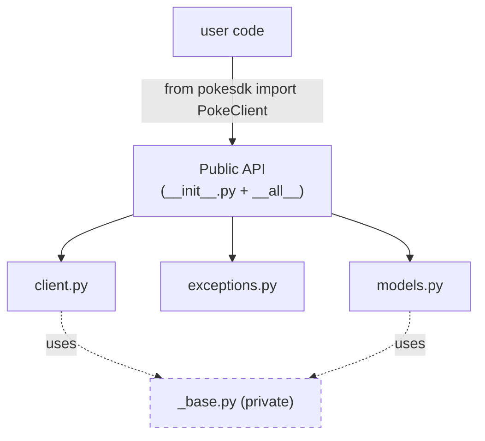

# 03: Imports & your public API

> **Level:** Beginner · **Prerequisites:** [02 · pyproject.toml & editable install](02_pyproject_and_editable_install.md)
> **Time:** ~45 min · **Verified:** 2026-06-04

## Why this matters

Recall from Section 01: a library's public API is a **contract**. Anything a user can `import` is something you've implicitly promised not to break. So you must *decide* — deliberately — what `pokesdk` exposes, rather than letting it be "whatever happens to be importable." This module covers `__init__.py` as your front door, `__all__` as the guest list, and the `_private` naming convention for everything users shouldn't touch.

## `__init__.py` is the front door

When someone runs `import pokesdk`, Python executes `src/pokesdk/__init__.py`. Whatever names exist there after it runs are `pokesdk.something`. So `__init__.py` is where you *re-export* the things you want users to reach directly — pulling them up from the internal modules they actually live in.

Without re-exporting, users would have to know your internal file structure:

```python
# Ugly: users must know which file each thing lives in
from pokesdk.client import PokeClient
from pokesdk.exceptions import NotFoundError
from pokesdk.models import Pokemon
```

With re-exporting in `__init__.py`, they import everything from the top:

```python
# Clean: one obvious place
from pokesdk import PokeClient, NotFoundError, Pokemon
```

The second form is the contract you want. It also means you can **move `PokeClient` to a different file later** without breaking anyone — as long as `__init__.py` still re-exports it. The internal layout becomes yours to refactor; only the top-level names are promised.

## `pokesdk/__init__.py`

Here's the SDK's actual front door (you'll fill in the pieces as you build them; this is the finished version):

```python
"""pokesdk — a small, typed Python client for the PokéAPI."""

from ._version import __version__
from .async_client import AsyncPokeClient
from .client import PokeClient
from .exceptions import (
    APIError,
    AuthenticationError,
    NotFoundError,
    PokeConnectionError,
    PokeError,
    RateLimitError,
    ServerError,
)
from .models import NamedResource, Page, Pokemon

__all__ = [
    "__version__",
    "PokeClient",
    "AsyncPokeClient",
    "Pokemon",
    "NamedResource",
    "Page",
    "PokeError",
    "PokeConnectionError",
    "APIError",
    "AuthenticationError",
    "NotFoundError",
    "RateLimitError",
    "ServerError",
]
```

Note the **relative imports** (`from .client import ...`). The leading `.` means "from this package," so it works regardless of what the package is installed as.

## `__all__` — the explicit guest list

`__all__` is a list of strings naming your public API. It does two jobs:

1. It defines what `from pokesdk import *` brings in (rarely used, but it's the formal definition of "public").
2. It's **documentation and intent**: it tells readers, type checkers, and doc tools exactly what's public. Many linters warn if a name is imported into `__init__.py` but missing from `__all__`.

Think of `__init__.py`'s imports as "what's reachable" and `__all__` as "what's *promised*." Keep them in sync.

### Verified

```python
import pokesdk
print("__all__ length:", len(pokesdk.__all__))
print("first items   :", pokesdk.__all__[:6])

from pokesdk import PokeClient, NotFoundError
print(PokeClient.__name__, NotFoundError.__name__)
```

**Output (real run):**

```text
__all__ length: 13
first items   : ['__version__', 'PokeClient', 'AsyncPokeClient', 'Pokemon', 'NamedResource', 'Page']
PokeClient NotFoundError
```

## The `_private` convention

Python has no `private` keyword. Instead, a **leading underscore** signals "internal — don't depend on this." It's a convention, but a strong one: tools, docs, and reviewers all respect it.

In `pokesdk` you'll see it on:

- `_base.py` — the shared client core. Real, used internally, but **not** part of the promise. Users should never `from pokesdk._base import BaseClient`.
- `_version.py` — internal home of the version string (re-exported as the public `pokesdk.__version__`).

The underscore is your escape hatch: it lets you have lots of internal machinery while keeping the *promised* surface small. A small public API is a feature — fewer things you can't change later.



The private box is reachable (Python can't truly hide it) but **outside the contract** — you can rewrite `_base.py` freely between versions.

> **Verified nuance:** a determined user *can* still `import pokesdk._base` — and indeed `pokesdk._base.DEFAULT_BASE_URL` returns `https://pokeapi.co/api/v2`. The underscore doesn't enforce; it *communicates*. If they reach into it and you change it, that's on them — which is exactly what "not part of the public API" means.

## Why a small public API is a gift to your future self

Every public name is a promise that constrains future versions (Section 08's semantic versioning makes this formal: removing or renaming a public name is a *breaking* change requiring a major version bump). The fewer public names, the more freedom you keep to refactor internals without a major release. So: **expose the minimum users need, mark everything else private.** Your future self, shipping v1.3 without breaking anyone, will thank you.

## Recap & next

- ✅ `__init__.py` is the front door: re-export public names so users import from the top (`from pokesdk import PokeClient`) and you stay free to move internals.
- ✅ `__all__` is the explicit, documented guest list of public names — keep it in sync with the re-exports.
- ✅ A leading `_` marks internals (`_base.py`); it communicates intent, doesn't enforce. Keep the public surface small.
- ✅ Self-check: why does re-exporting in `__init__.py` let you refactor internal files safely? What does a leading underscore actually do?

→ Next: **[Section 03 · The sync client](../03_the_sync_client/README.md)** — now that we have an installable package with a clean front door, we build the `PokeClient` users will import through it.

## Exercises

1. **Design a minimal public API.** For an SDK with a `Client`, two models (`User`, `Order`), and a `NotFoundError`, write the `__init__.py` re-exports and `__all__`. Which internal modules would you mark private?

<details><summary>Solution</summary>

```python
from .client import Client
from .models import Order, User
from .exceptions import APIError, NotFoundError

__all__ = ["Client", "User", "Order", "APIError", "NotFoundError"]
```

Mark private: anything users don't call directly — e.g. `_base.py` (shared request core), `_transport.py`, `_version.py`. They're imported by your public modules but never promised to users.
</details>

2. **Spot the leaky API.** A teammate writes `from pokesdk.client import PokeClient` in the README example. Why is that worse than `from pokesdk import PokeClient`, even though both work today?

<details><summary>Solution</summary>

It hard-codes the internal module path `pokesdk.client`. If you later split `client.py` or move `PokeClient`, that import breaks — even though you only changed *internals*. By documenting the top-level `from pokesdk import PokeClient`, you keep the freedom to reorganise files. The README is a contract too; show users the stable path.
</details>

3. **Underscore semantics.** True or false: marking `_base.py` private makes it impossible for users to import. Explain.

<details><summary>Solution</summary>

**False.** The underscore is a convention, not enforcement — `import pokesdk._base` still works (we verified `pokesdk._base.DEFAULT_BASE_URL` resolves). What it does is *communicate* "not part of the public API," so anyone who imports it has opted out of your stability promise. Python deliberately trusts developers ("we're all adults here") rather than enforcing access control.
</details>
