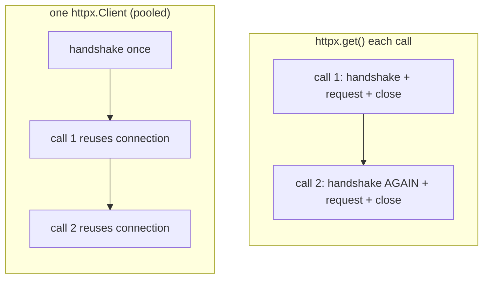
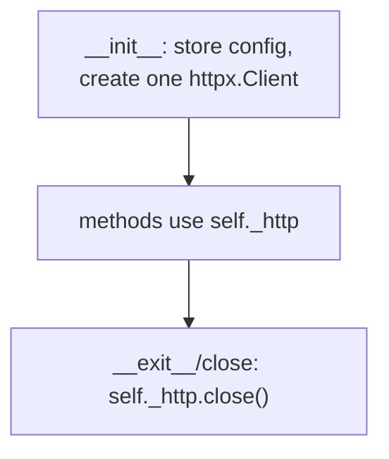

# 01: The client class & the session

> **Level:** Intermediate · **Prerequisites:** [Section 02](../02_packaging_basics/README.md)
> **Time:** ~1 hour · **Verified:** 2026-06-04 (httpx 0.28.1)

## Why this matters

Every SDK has a central **client object**. It's not decoration — it's *where configuration and the network connection live*. This module explains why a class beats loose functions, why you reuse a single `httpx.Client` instead of calling `httpx.get` each time (it's a real performance win), and how to make sure the connection gets cleaned up.

## Why a class, not functions?

The naive client was loose functions, each re-passing `api_key` and re-typing the base URL. A class lets you set that **once** in `__init__` and have every method read it from `self`:

```python
client = PokeClient(api_key="...", timeout=10)   # configure ONCE
client.pokemon.get("ditto")                        # config is implicit from here on
client.pokemon.get("pikachu")
```

The client holds the *state* of a session with the API: who you are (auth), where it is (base URL), and how to behave (timeout, retries). That's a textbook job for an object.

## The session: reuse one `httpx.Client`

`httpx.get(url)` is convenient but it opens a fresh connection every call and throws it away. A long-lived `httpx.Client` keeps a **connection pool**: TCP/TLS handshakes are reused across requests to the same host. For an SDK making many calls, that's a meaningful speedup and less load on the server.



So `PokeClient` creates **one** `httpx.Client` in `__init__` and reuses it for the client's whole life.

## A first cut of `PokeClient`

```python
# src/pokesdk/client.py
import httpx


class PokeClient:
    def __init__(self, api_key=None, *, base_url="https://pokeapi.co/api/v2", timeout=10.0):
        self.api_key = api_key
        self.base_url = base_url.rstrip("/")   # tidy trailing slash, once
        self._http = httpx.Client(             # the long-lived pooled client
            base_url=self.base_url,
            timeout=timeout,
        )
```

A few deliberate choices:

- **`base_url` on the `httpx.Client`.** Now methods supply only the path (`/pokemon/ditto`) and httpx joins them. Change hosts in one place. (Module 03 leans on this.)
- **`.rstrip("/")`** so `"https://.../v2"` and `"https://.../v2/"` behave the same — small robustness for users who pass either.
- **`self._http`** is *private* (leading underscore). Users shouldn't poke the raw httpx client; it's our implementation detail.
- **Keyword-only config** (the `*`): `base_url` and `timeout` must be passed by name, so call sites read clearly and we can reorder them later without breaking callers.

### Verified: base URL joining

The payoff of storing `base_url` on the client — methods name only the path:

```python
import httpx
c = httpx.Client(base_url="https://pokeapi.co/api/v2")
print(c.build_request("GET", "/pokemon/ditto").url)
print(c.build_request("GET", "/pokemon", params={"limit": 5}).url)
```

**Output (real run):**

```text
https://pokeapi.co/api/v2/pokemon/ditto
https://pokeapi.co/api/v2/pokemon?limit=5
```

## Cleaning up: `close()` and the context manager

A pooled client holds open sockets. Leaving them dangling leaks resources and triggers `ResourceWarning`s. So the client must be **closable**, and the Pythonic way is to support the `with` statement:

```python
class PokeClient:
    # ... __init__ as above ...

    def close(self):
        self._http.close()

    def __enter__(self):
        return self

    def __exit__(self, *exc):
        self.close()
```

Now both usage styles work:

```python
# Preferred: context manager closes for you, even on exceptions
with PokeClient() as client:
    ...   # use client
# connection pool closed here automatically

# Manual: you must remember to close
client = PokeClient()
try:
    ...
finally:
    client.close()
```

`__enter__` returns the object the `with` binds (so `as client` works); `__exit__` runs on the way out — *including* if the block raised — guaranteeing cleanup. This mirrors how `open()` files and database connections work, so it'll feel natural to your users.

> **API design note:** offering the context manager makes the *easy* path the *correct* path. Most users will write `with PokeClient() as client:` and never think about sockets again — which is exactly the kind of "hard to misuse" design from Section 01's rubric.

## The shape so far



We haven't added auth, the request helper, or resources yet — those are the next three modules, each slotting into this skeleton. Building it in layers is intentional: you'll see precisely what each concern adds.

## Recap & next

- ✅ The **client class** holds session state (auth, base URL, timeout) set once, read by every method.
- ✅ Reuse **one `httpx.Client`** for connection pooling — faster than `httpx.get` per call.
- ✅ Store `base_url` on the httpx client so methods name only the path; `.rstrip("/")` for tidy input.
- ✅ Make it closable and a **context manager** (`__enter__`/`__exit__`) so the easy path cleans up correctly.
- ✅ Self-check: why reuse one `httpx.Client`? What does `__exit__` guarantee that manual `close()` doesn't?

→ Next: **[02 · Auth & headers](02_auth_and_headers.md)** — set the API key once and send it on every request.

## Exercises

1. **Build the skeleton client.** Write the `PokeClient` with `__init__`, `close`, `__enter__`, `__exit__` as above. Construct one with `with`, print `client.base_url`, and confirm no `ResourceWarning` appears (run with `python -W error::ResourceWarning`).

<details><summary>Solution</summary>

```python
import httpx

class PokeClient:
    def __init__(self, api_key=None, *, base_url="https://pokeapi.co/api/v2", timeout=10.0):
        self.api_key = api_key
        self.base_url = base_url.rstrip("/")
        self._http = httpx.Client(base_url=self.base_url, timeout=timeout)
    def close(self): self._http.close()
    def __enter__(self): return self
    def __exit__(self, *exc): self.close()

with PokeClient() as c:
    print(c.base_url)   # https://pokeapi.co/api/v2
```

Running under `-W error::ResourceWarning` and getting no error confirms the pool was closed.
</details>

2. **Feel the difference.** Time 20 sequential GETs to `https://pokeapi.co/api/v2/pokemon/1` using (a) `httpx.get` each time vs (b) one reused `httpx.Client`. Which is faster and why?

<details><summary>Solution</summary>

```python
import time, httpx
url = "https://pokeapi.co/api/v2/pokemon/1"

t = time.time()
for _ in range(20): httpx.get(url)
print("per-call :", round(time.time()-t, 2), "s")

t = time.time()
with httpx.Client() as c:
    for _ in range(20): c.get(url)
print("pooled   :", round(time.time()-t, 2), "s")
```

The pooled client is typically faster because it reuses the TCP/TLS connection instead of re-handshaking every call (the exact gap varies with network/latency). At scale this difference compounds — the reason every SDK keeps a long-lived client.
</details>

3. **Why keyword-only?** We wrote `def __init__(self, api_key=None, *, base_url=..., timeout=...)`. What does the `*` prevent, and why is that good for a library?

<details><summary>Solution</summary>

The `*` forces `base_url` and `timeout` to be passed **by name** (`PokeClient(timeout=5)`), never positionally (`PokeClient("key", "url", 5)`). For a library this is valuable: positional args lock in an order you can never change without breaking callers. Keyword-only args let you add/reorder configuration later, and call sites self-document (`timeout=5` reads better than a bare `5`). `api_key` stays positional because it's the one argument users naturally pass first.
</details>
