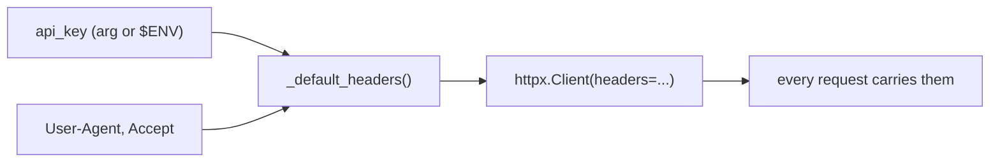

# 02: Auth & headers

> **Level:** Intermediate · **Prerequisites:** [01 · The client class & the session](01_client_class_and_session.md)
> **Time:** ~1 hour · **Verified:** 2026-06-04 (httpx 0.28.1, live httpbin)

## Why this matters

This module kills the naive client's most annoying problem: auth copy-pasted onto every call. The fix is one idea — **default headers on the client** — applied carefully (where to read the key from, how to format it, and a `User-Agent` so the API can identify your SDK). PokéAPI needs no key, but the pattern is identical for any API that does, and we'll *prove* the header is sent using httpbin.

## Default headers: set once, sent always

`httpx.Client` accepts a `headers=` dict that it merges into **every** request the client makes. That's the whole mechanism. Build the headers once in `__init__` and the auth problem disappears:

```python
# src/pokesdk/client.py
import httpx


class PokeClient:
    def __init__(self, api_key=None, *, base_url="https://pokeapi.co/api/v2", timeout=10.0):
        self.api_key = api_key
        self.base_url = base_url.rstrip("/")
        self._http = httpx.Client(
            base_url=self.base_url,
            headers=self._default_headers(),   # ← applied to every request
            timeout=timeout,
        )

    def _default_headers(self):
        headers = {
            "Accept": "application/json",
            "User-Agent": "pokesdk/0.1.0",
        }
        if self.api_key:                                   # only if provided
            headers["Authorization"] = f"Bearer {self.api_key}"
        return headers
```

Three headers, three reasons:

- **`Accept: application/json`** — tells the server we want JSON. Polite and explicit.
- **`User-Agent: pokesdk/0.1.0`** — identifies your SDK and version in the server's logs. APIs use this for debugging, analytics, and sometimes rate-limit policy. Real SDKs always send one. (We'll wire the *real* version in next module instead of hard-coding the string.)
- **`Authorization: Bearer <key>`** — the auth header, added **only if** a key was given. Conditional, so the SDK works with or without auth (perfect for PokéAPI, which needs none).

## Verified: the Bearer header is actually sent

Let's prove it with httpbin, which echoes the headers it received. We point a real `PokeClient` at `https://httpbin.org` and ask `/headers`:

```python
from pokesdk import PokeClient

with PokeClient(api_key="secret-xyz", base_url="https://httpbin.org") as client:
    data = client._request("GET", "/headers")    # _request lands in the next module
    print("Authorization:", data["headers"]["Authorization"])
    print("User-Agent   :", data["headers"]["User-Agent"])
```

**Live output (real run against the finished SDK):**

```text
Authorization: Bearer secret-xyz
User-Agent   : pokesdk/0.1.0
```

The user set `api_key` **once** at construction; the header rode along on a request to a *different* endpoint without any per-call effort. That's the entire payoff.

## Where should the key come from? Don't hard-code it

A subtle DX point: users shouldn't paste secrets into source code. The common, friendly pattern is to **accept an explicit key but fall back to an environment variable**:

```python
import os

class PokeClient:
    def __init__(self, api_key=None, **kwargs):
        # explicit arg wins; otherwise read the environment
        self.api_key = api_key or os.environ.get("POKE_API_KEY")
        ...
```

Now both work:

```python
client = PokeClient(api_key="sk-123")          # explicit
client = PokeClient()                            # reads $POKE_API_KEY
```

This is exactly what the Anthropic and OpenAI SDKs do (`ANTHROPIC_API_KEY`, `OPENAI_API_KEY`). It keeps secrets out of code and out of your shell history, and makes the client "just work" in environments where the key is configured once. (PokéAPI needs no key, so our capstone keeps `api_key` optional with no env fallback — but this is the pattern you'd use for a real authed API.)

> **Security note for a library author:** never *log* the API key, never put it in an error message, and never include it in a URL query string (URLs end up in server logs and browser history). The `Authorization` header is the right place.

## Different auth schemes, same idea

Not every API uses Bearer tokens. The mechanism is identical — only the header name/format changes:

| Scheme | Header you'd set |
|--------|------------------|
| Bearer token | `Authorization: Bearer <key>` |
| Custom API-key header | `X-API-Key: <key>` |
| Basic auth | `Authorization: Basic <base64(user:pass)>` (httpx has `auth=` for this) |

You localise all of it in `_default_headers()`, so supporting a new scheme is a one-method change — never a hunt across call sites.



## Recap & next

- ✅ Pass `headers=` to the `httpx.Client` once; httpx merges them into **every** request — auth is set one time.
- ✅ Send `Accept: application/json`, a versioned `User-Agent`, and `Authorization: Bearer <key>` **only when** a key is provided.
- ✅ Read the key from an explicit arg with an **environment-variable fallback**; never hard-code, log, or URL-embed secrets.
- ✅ New auth schemes are a one-method change in `_default_headers()`.
- ✅ Self-check: how does setting `headers=` on the client fix the naive client's repeated-auth problem? Why send a `User-Agent`?

→ Next: **[03 · The request helper & base URL](03_request_helper_and_base_url.md)** — the single method every call funnels through.

## Exercises

1. **Prove your own header.** Point a client at `https://httpbin.org`, send a request to `/headers` with `api_key="hello-123"`, and confirm `Authorization: Bearer hello-123` comes back. Then construct the client *without* a key and confirm no `Authorization` header is sent.

<details><summary>Solution</summary>

```python
from pokesdk import PokeClient

with PokeClient(api_key="hello-123", base_url="https://httpbin.org") as c:
    print(c._request("GET", "/headers")["headers"].get("Authorization"))
    # Bearer hello-123

with PokeClient(base_url="https://httpbin.org") as c:
    print(c._request("GET", "/headers")["headers"].get("Authorization"))
    # None  ← conditional header not added
```

The conditional `if self.api_key:` is why the no-key case sends nothing.
</details>

2. **Add an env fallback.** Modify `__init__` so `PokeClient()` with no argument reads `POKE_API_KEY` from the environment. Test both an explicit key and the env path.

<details><summary>Solution</summary>

```python
import os
# in __init__:
self.api_key = api_key or os.environ.get("POKE_API_KEY")
```

```bash
POKE_API_KEY=from-env python -c "from pokesdk import PokeClient; print(PokeClient().api_key)"
# from-env
python -c "from pokesdk import PokeClient; print(PokeClient(api_key='explicit').api_key)"
# explicit  ← explicit arg wins over env
```

`api_key or os.environ.get(...)` makes the explicit argument take priority, which is the expected precedence.
</details>

3. **Spot the security bug.** A teammate "improves" auth by putting the key in the URL: `f"/pokemon?api_key={self.api_key}"`. Name two reasons this is worse than the header.

<details><summary>Solution</summary>

(1) **Leakage:** URLs are logged by servers, proxies, and analytics, and saved in browser/CLI history — so the secret ends up in plaintext logs everywhere. The `Authorization` header is generally redacted/not logged. (2) **Caching & sharing:** a URL with a key embedded can be cached or accidentally shared (copy-paste a link), exposing the secret. Headers don't travel that way. Keep secrets in headers.
</details>
