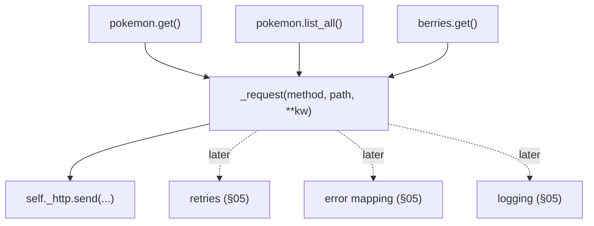

# 03: The request helper & base URL

> **Level:** Intermediate · **Prerequisites:** [02 · Auth & headers](02_auth_and_headers.md)
> **Time:** ~1 hour · **Verified:** 2026-06-04 (httpx 0.28.1, live PokéAPI)

## Why this matters

This module builds the **spine** of the whole SDK: a single private method, `_request`, that every public method routes through. Right now it just sends and parses. But because *every* call passes through it, it's the one place we'll later add retries (Section 05), error mapping (Section 05), and logging — written **once**, applying everywhere. Get this seam right and the rest of the SDK slots in cleanly.

## The principle: one funnel for all I/O

Imagine adding retries to an SDK where each method calls `httpx` directly — you'd copy the retry loop into every method. Instead, all methods call `self._request(...)`, and `_request` is the only thing that touches the network:



Cross-cutting concerns have exactly one home. This is the single most important design decision in the SDK — keep it in mind through every later section.

## A first `_request`

For now `_request` builds the request, sends it on the pooled client, and returns parsed JSON. (Error handling and retries are stubbed as "coming in Section 05" — we add them to *this method* without touching any caller.)

```python
# src/pokesdk/client.py
class PokeClient:
    # ... __init__, _default_headers, close, __enter__, __exit__ from prior modules ...

    def _request(self, method, path, **kwargs):
        """The one place that talks to the network."""
        request = self._http.build_request(method, path, **kwargs)
        response = self._http.send(request)
        response.raise_for_status()      # placeholder; §05 replaces with typed errors
        return response.json()
```

Why `build_request` + `send` instead of `self._http.get(path)`? Two reasons that matter later:

1. It separates *constructing* the request from *sending* it. When we add retries (Section 05), we build once and re-`send` on each attempt.
2. It's method-agnostic: `_request("GET", ...)`, `_request("POST", ..., json=body)` — the same funnel serves every verb. `**kwargs` passes through `params=`, `json=`, etc. straight to httpx.

> **Note on `raise_for_status()`:** this is a temporary stand-in. It raises httpx's generic `HTTPStatusError` on any 4xx/5xx — better than nothing, but not the *typed*, catchable `NotFoundError`/`RateLimitError` your users want. Section 05 replaces this one line with proper error mapping. The callers never change.

## Base URL: why methods only name the path

Because the `httpx.Client` was created with `base_url=` (Module 01), `_request` receives just the path and httpx joins them:

```python
self._http.build_request("GET", "/pokemon/ditto")
# → https://pokeapi.co/api/v2/pokemon/ditto
```

This is the fix for the naive client's "smeared base URL." The host lives in *one* place — the client's config — so pointing the SDK at staging, a mock server, or a new API version is a single constructor argument:

```python
PokeClient(base_url="http://localhost:8000")          # local mock for tests
PokeClient(base_url="https://staging.pokeapi.co/api/v2")  # staging
```

### Verified: full GET through `_request`

Using the finished SDK's `_request` against the live API:

```python
from pokesdk import PokeClient

with PokeClient() as client:
    data = client._request("GET", "/pokemon/ditto")
    print(type(data).__name__, "->", data["name"], data["weight"])
```

**Live output:**

```text
dict -> ditto 40
```

It returns a raw `dict` for now — Section 04 wraps this in a typed `Pokemon`. The point of this module is the *funnel*, not the return type.

### Verified: passing query params through `**kwargs`

```python
with PokeClient() as client:
    page = client._request("GET", "/pokemon", params={"limit": 3})
    print([r["name"] for r in page["results"]])
```

**Live output:**

```text
['bulbasaur', 'ivysaur', 'venusaur']
```

`params={"limit": 3}` flowed straight through `_request`'s `**kwargs` into `build_request`. The funnel doesn't need to know about pagination, params, or bodies — it just forwards them.

## Why `_request` is private

It's `_request`, not `request`, because it's internal plumbing. Users call `client.pokemon.get("ditto")`, not `client._request("GET", "/pokemon/ditto")`. Keeping it private means:

- The public API stays small and intentional (Section 02's lesson).
- You're free to change its signature — add a `retries=` param, change how it parses — without it being a breaking change.

In the verified examples above we call `_request` directly only to *demonstrate* it in isolation; real users go through the resource methods we build next.

## Recap & next

- ✅ Every public method funnels through **one** private `_request` — the single home for send, and later retries/errors/logging.
- ✅ Use `build_request` + `send` (not `.get`) so the funnel is verb-agnostic and re-sendable for retries.
- ✅ `**kwargs` forwards `params=`/`json=`/etc. to httpx unchanged.
- ✅ `base_url` on the client means methods name only the path — host changes in one place.
- ✅ `raise_for_status()` is a placeholder for Section 05's typed errors; callers won't change.
- ✅ Self-check: why route everything through one method? Why `build_request`+`send` over `self._http.get`?

→ Next: **[04 · Resource namespaces](04_resource_namespaces.md)** — turning `_request` into the friendly `client.pokemon.get(...)`.

## Exercises

1. **Add a generic GET helper and use it.** With the finished SDK installed, call `_request("GET", "/berry/cheri")` and print the berry's `name` and `growth_time`. Confirm you get a `dict`.

<details><summary>Solution</summary>

```python
from pokesdk import PokeClient
with PokeClient() as c:
    b = c._request("GET", "/berry/cheri")
    print(type(b).__name__, b["name"], b["growth_time"])   # dict cheri 3
```

`_request` doesn't care that it's a berry — it forwards the path and parses JSON. That generality is why one funnel serves every resource.
</details>

2. **Repoint the base URL.** Without changing any method, make a client talk to httpbin instead and fetch `/json`. What does this demonstrate about where the base URL lives?

<details><summary>Solution</summary>

```python
from pokesdk import PokeClient
with PokeClient(base_url="https://httpbin.org") as c:
    print(list(c._request("GET", "/json").keys()))   # ['slideshow']
```

The same `_request` and the same methods now hit a completely different host — because the base URL is a single piece of client config, not baked into the methods. This is exactly what makes the SDK testable against a mock server (Section 07) and usable against staging.
</details>

3. **Predict the refactor.** In Section 05 we'll add retries to `_request`. Roughly, where in the method does the retry loop go, and how many *caller* methods (`pokemon.get`, `list_all`, …) need to change?

<details><summary>Solution</summary>

The retry loop wraps the `build_request` → `send` → check-status portion *inside* `_request` (try send; if the status/exception is retryable and attempts remain, back off and loop; else return or raise). **Zero** caller methods change — that's the entire benefit of the single funnel. The callers said `self._request(...)` before and after; only the funnel got smarter.
</details>
