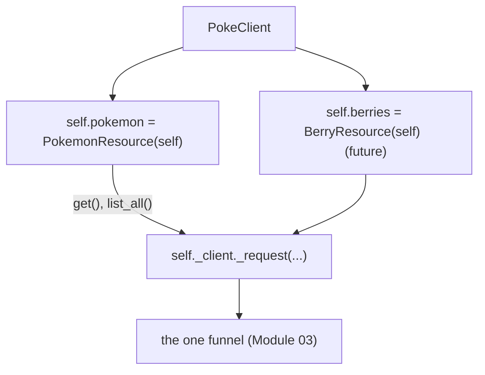

# 04: Resource namespaces

> **Level:** Intermediate · **Prerequisites:** [03 · The request helper & base URL](03_request_helper_and_base_url.md)
> **Time:** ~1 hour · **Verified:** 2026-06-04 (live PokéAPI)

## Why this matters

Now we make the SDK *feel* like an SDK. Instead of users calling `client._request("GET", "/pokemon/ditto")`, they'll write `client.pokemon.get("ditto")`. This module builds the **resource namespace** pattern — small objects hanging off the client that group related methods — which is how every major SDK (Stripe, Anthropic, OpenAI) is organised. It turns the internal funnel into a discoverable, autocompleting public API.

## The pattern: a resource object per noun

A "resource" is a small class that wraps the client and exposes the verbs for one API noun. The client creates one in `__init__` and stores it as an attribute:

```python
# src/pokesdk/client.py

class PokemonResource:
    """The `client.pokemon` namespace — methods that act on Pokémon."""

    def __init__(self, client):
        self._client = client          # a back-reference to reach _request

    def get(self, name_or_id):
        return self._client._request("GET", f"/pokemon/{name_or_id}")

    def list_all(self, *, limit=20):
        # full pagination comes in Section 05; for now, one page
        return self._client._request("GET", "/pokemon", params={"limit": limit})


class PokeClient:
    def __init__(self, api_key=None, **kwargs):
        # ... set up self._http etc. (prior modules) ...
        self.pokemon = PokemonResource(self)    # ← the namespace
```

Now the public API reads exactly as intended:

```python
with PokeClient() as client:
    client.pokemon.get("ditto")
    client.pokemon.list_all(limit=5)
```



The resource holds a back-reference to the client so its methods can reach the shared `_request` funnel. Each resource is tiny — it only knows its paths and verbs; *all* the HTTP machinery stays in the client.

### Verified: the real public call

Against the finished SDK and live API:

```python
from pokesdk import PokeClient

with PokeClient() as client:
    ditto = client.pokemon.get("ditto")          # returns a typed Pokemon (Section 04)
    print(ditto.name, ditto.weight)
    first5 = [p.name for p in client.pokemon.list_all(limit=20)][:5]
    print(first5)
```

**Live output:**

```text
ditto 40
['bulbasaur', 'ivysaur', 'venusaur', 'charmander', 'charmeleon']
```

(The finished SDK already returns typed objects and paginates — those are Sections 04 and 05. The *namespace shape* is what this module establishes.)

## Why namespaces beat flat methods (revisited concretely)

Section 01 argued this in the abstract; now it's concrete. Suppose PokéAPI grows in your SDK to cover `pokemon`, `berries`, `moves`, `abilities`, each with `get` and `list_all`. Flat naming gives the client **8 methods** with prefixed names (`get_pokemon`, `list_berries`, …); autocompleting `client.` dumps all eight mixed together. Namespaced, the client has **4 attributes**, and `client.pokemon.` autocompletes to *just* pokemon verbs. Discovery scales with the API instead of degrading.

```python
# Adding a new resource is additive and local:
class BerryResource:
    def __init__(self, client): self._client = client
    def get(self, name_or_id): return self._client._request("GET", f"/berry/{name_or_id}")

# in PokeClient.__init__:
self.berries = BerryResource(self)     # one line; nothing else changes
```

No existing code touches `_request`'s internals; you've just taught the client a new noun.

## Keeping verbs consistent

A regular, predictable API is a kind one. Across resources, use the **same verb names** for the same shapes of operation:

| Verb | Meaning | Returns |
|------|---------|---------|
| `get(id)` | fetch one item | a single model |
| `list_all()` | iterate the collection | an iterator of items |
| `create(data)` | make one (write APIs) | the created model |

If `pokemon.get` fetches one, then `berries.get` should too — never `berries.fetch` or `berries.retrieve`. Consistency means a user who learns one resource has learned them all. (This is also why we put the verb on the resource, not the client: `client.get_pokemon` vs `client.get_berry` invites inconsistent naming; `client.pokemon.get` / `client.berries.get` enforces it.)

## A note on construction order

The resource needs the client, and the client creates the resource — so create resources **last** in `__init__`, after `self._http` exists, since the resource captures `self`:

```python
def __init__(self, api_key=None, **kwargs):
    self._http = httpx.Client(...)      # set up I/O first
    self.pokemon = PokemonResource(self)  # then hand `self` to resources
```

The resource stores the reference but doesn't *use* it until a method is called, so even this ordering is forgiving — but doing setup-then-resources keeps it obviously correct.

## Recap & next

- ✅ A **resource** is a small class grouping one noun's verbs; the client stores instances as attributes (`self.pokemon = PokemonResource(self)`).
- ✅ Resources hold a back-reference to the client and route through the shared `_request` funnel — they own paths/verbs, not HTTP.
- ✅ Namespaces keep autocomplete focused and make adding a resource a one-line, additive change.
- ✅ Use **consistent verbs** (`get`/`list_all`/`create`) across resources.
- ✅ Self-check: what does a resource object hold a reference to, and why? Why is `client.pokemon.get` better than `client.get_pokemon` as the API grows?

→ Next: **[Section 04 · Data models](../04_data_models/README.md)** — stop returning dicts; return typed `Pokemon` objects users' editors understand.

## Exercises

1. **Add a `berries` namespace.** Following `PokemonResource`, add a `BerryResource` with `get(name_or_id)` and wire `self.berries` into the client. Fetch `client.berries.get("cheri")` and print its `name`.

<details><summary>Solution</summary>

```python
class BerryResource:
    def __init__(self, client): self._client = client
    def get(self, name_or_id):
        return self._client._request("GET", f"/berry/{name_or_id}")

# in PokeClient.__init__:
self.berries = BerryResource(self)

# usage:
with PokeClient() as c:
    print(c.berries.get("cheri")["name"])   # cheri  (dict for now; model in §04)
```

The new resource is fully additive — `pokemon` and `_request` are untouched.
</details>

2. **Refactor a flat client.** Given a flat client with `get_pokemon`, `list_pokemon`, `get_berry`, `list_berry`, sketch the namespaced version. How many client attributes vs. methods?

<details><summary>Solution</summary>

Namespaced: **2 attributes** (`client.pokemon`, `client.berries`), each with **2 methods** (`get`, `list_all`). The flat version had 4 methods on the client with redundant noun-prefixes. The namespaced one removes the prefixes (the namespace carries the noun), keeps verbs short and identical across resources, and `client.pokemon.` autocompletes to only two relevant methods.
</details>

3. **Why a back-reference, not the httpx client?** The resource stores `self._client` (the whole `PokeClient`), not `client._http` (the raw httpx client). Why is passing the whole client better?

<details><summary>Solution</summary>

Because the resource should go through `_request`, not raw httpx — `_request` is where auth, retries (Section 05), and error mapping live. If the resource grabbed `self._http` and called it directly, it would **bypass** all those cross-cutting concerns, re-creating the naive client's problems inside a nice-looking namespace. Holding the whole client keeps every call flowing through the one funnel.
</details>
