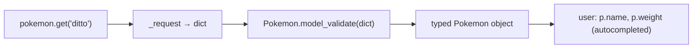

# 01: Response models with Pydantic

> **Level:** Intermediate · **Prerequisites:** [Section 03](../03_the_sync_client/README.md)
> **Time:** ~1.5 hours · **Verified:** 2026-06-04 (Pydantic 2.12.3, live PokéAPI)

## Why this matters

Returning `dict` from your methods pushes three problems onto every user: no autocomplete, no type checking, and silent `KeyError`s on typos. **Pydantic** solves all three at once — it turns a JSON dict into a typed object with named, validated fields. This is the single biggest ergonomics upgrade in the SDK, and it's what makes `pokemon.weight` (checked, autocompleted) replace `pokemon["weight"]` (hope-and-pray).

## Install Pydantic

```bash
pip install pydantic        # v2.x
```

It's already a dependency in your `pyproject.toml` (`pydantic>=2.0`), so an editable install pulled it in. We use **Pydantic v2**, the modern standard.

## A model is a class with typed fields

You declare the shape you expect; Pydantic enforces it:

```python
# src/pokesdk/models.py
from pydantic import BaseModel


class NamedResource(BaseModel):
    name: str
    url: str
```

`model_validate` turns a dict into an instance, validating types as it goes:

```python
ref = NamedResource.model_validate({"name": "normal", "url": "https://.../type/1/"})
print(ref.name)   # normal   ← attribute access, autocompleted, type str
```

If the data is wrong, you find out *immediately* and *clearly*, instead of three layers deep at use time:

```python
import pydantic
try:
    Pokemon.model_validate({"id": "not-an-int", "name": "x", "height": 1, "weight": 1})
except pydantic.ValidationError as e:
    print(e.errors()[0]["loc"], "->", e.errors()[0]["msg"])
```

**Output (real run):**

```text
('id',) -> Input should be a valid integer, unable to parse string as an integer
```

The error names the exact field (`id`) and the exact problem. Compare that to a `KeyError` or a `TypeError` surfacing somewhere random in the user's code.

## Nested models

API responses nest. Pydantic models nest to match — just reference one model as another's field type:

```python
# src/pokesdk/models.py
from typing import List, Optional
from pydantic import BaseModel, ConfigDict


class NamedResource(BaseModel):
    name: str
    url: str


class PokemonType(BaseModel):
    slot: int
    type: NamedResource          # ← nested model


class Pokemon(BaseModel):
    model_config = ConfigDict(frozen=True)

    id: int
    name: str
    height: int
    weight: int
    base_experience: Optional[int] = None    # may be absent → optional with default
    types: List[PokemonType] = []            # list of nested models
```

Pydantic recursively validates the whole tree, so `pokemon.types[0].type.name` is fully typed all the way down. Compare to the naive `data["types"][0]["type"]["name"]` from Section 01 — same data, but now every step is checked and autocompleted.

## Two design decisions worth understanding

### 1. Model a *subset*, and ignore unknown fields

The real PokéAPI `/pokemon/ditto` payload has **dozens** of fields (abilities, cries, game_indices, sprites, …). Your model lists only the ones you promise to support. By default, Pydantic **ignores** keys it doesn't know about — so the SDK keeps working when the API adds new fields, and you're not forced to model everything.

This is a real robustness property, verified against the live API: the full ditto payload (with all its extra keys) parses into our small model without complaint.

> **Why subset?** Every field you model is a field you promise. Modelling only what you support keeps your contract small (Section 02's lesson again) and immune to the API's unrelated additions. Add fields when you're ready to support them.

### 2. Freeze response objects

`model_config = ConfigDict(frozen=True)` makes instances **immutable**. A response object represents *what the server said* — mutating it locally is almost always a bug (it doesn't change anything on the server, and it confuses readers). Freezing makes that explicit:

```python
p = client.pokemon.get("ditto")
p.name = "mew"        # raises!
```

**Output (real run):**

```text
frozen -> ValidationError   (Instance is frozen)
```

Bonus: frozen models are hashable, so users can put them in sets or dict keys.

## Wiring models into the resource methods

The resource method's only change: parse the dict through the model before returning.

```python
# src/pokesdk/client.py
from .models import Pokemon

class PokemonResource:
    def __init__(self, client):
        self._client = client

    def get(self, name_or_id) -> Pokemon:               # ← typed return
        data = self._client._request("GET", f"/pokemon/{name_or_id}")
        return Pokemon.model_validate(data)             # ← dict → typed object
```

`_request` still returns a dict (its job is HTTP, not modelling); the *resource* owns the dict→model step. Clean separation: the funnel does transport, the resource does shape.



### Verified: the full path

```python
from pokesdk import PokeClient
with PokeClient() as client:
    p = client.pokemon.get("ditto")
    print(type(p).__name__, "|", p.name, "|", p.weight, "|", p.types[0].type.name)
```

**Live output:**

```text
Pokemon | ditto | 40 | normal
```

A typed `Pokemon`, nested type access working, parsed from the real (huge) payload.

## Recap & next

- ✅ Pydantic models turn dicts into **typed, validated** objects: attribute access, autocomplete, and clear `ValidationError`s naming the bad field.
- ✅ Models **nest** to mirror nested JSON; the whole tree is validated and typed.
- ✅ Model a **subset** of fields — Pydantic ignores unknowns, so the API can grow without breaking you.
- ✅ **Freeze** response models (`ConfigDict(frozen=True)`): they represent server state and shouldn't be mutated.
- ✅ Resource methods do the `model_validate` step; `_request` stays a dict-returning transport.
- ✅ Self-check: why model only a subset of fields? Why freeze responses? Where does the dict→model conversion happen?

→ Next: **[02 · Typing & py.typed](02_typing_and_py_typed.md)** — making sure your users' type checkers actually see these types.

## Exercises

1. **Add a `stats` field.** The ditto payload has a `stats` list of `{base_stat, stat: {name, url}}`. Add a `PokemonStat` model and a `stats: List[PokemonStat] = []` field to `Pokemon`, then print ditto's first stat name and value.

<details><summary>Solution</summary>

```python
class PokemonStat(BaseModel):
    base_stat: int
    stat: NamedResource

# add to Pokemon:
    stats: List[PokemonStat] = []

# usage:
p = client.pokemon.get("ditto")
print(p.stats[0].stat.name, p.stats[0].base_stat)   # hp 48
```

This is exactly how the capstone's model grows — add a nested model and a field; unknown keys you don't model are still ignored.
</details>

2. **Prove unknown-field tolerance.** Validate a dict that has all of `Pokemon`'s required fields *plus* a bogus `"banana": 5` key. Does it raise? What does that mean for API evolution?

<details><summary>Solution</summary>

```python
Pokemon.model_validate({"id": 1, "name": "x", "height": 1, "weight": 1, "banana": 5})
# succeeds — "banana" is ignored
```

No error: Pydantic's default ignores unknown fields. So when PokéAPI adds a new field next year, your SDK keeps parsing fine without a release. (If you ever *want* to reject unknowns — e.g. to catch typos in data you control — set `model_config = ConfigDict(extra="forbid")`.)
</details>

3. **Frozen in action.** Fetch a Pokémon and try to reassign one of its fields. What happens, and why is that the right default for a *response* object?

<details><summary>Solution</summary>

```python
p = client.pokemon.get("ditto")
p.weight = 999   # raises ValidationError: Instance is frozen
```

It raises because the model is frozen. That's right for a response: the object is a snapshot of what the server returned, so mutating it locally is meaningless (it changes nothing server-side) and misleading to other readers. Frozen makes the immutability explicit and the objects hashable as a bonus.
</details>
