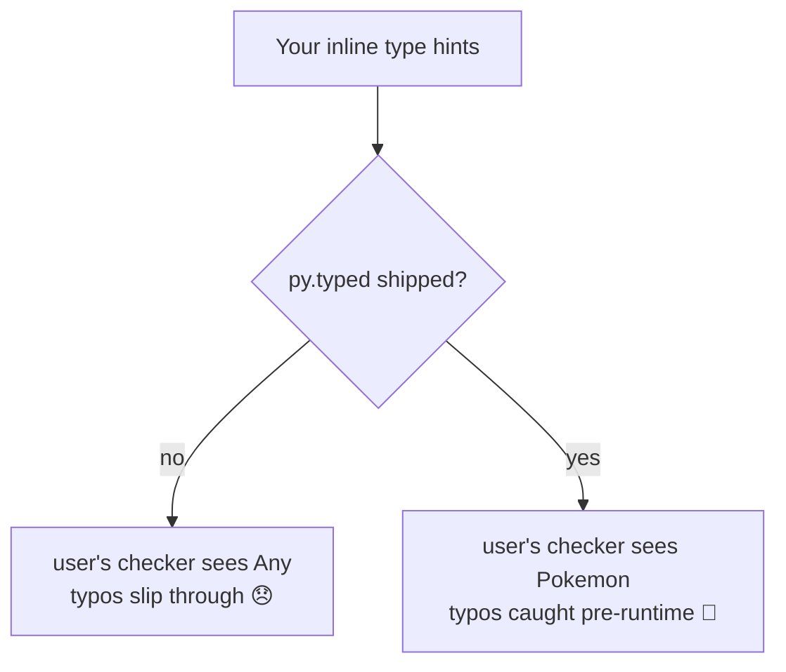

# 02: Typing & `py.typed`

> **Level:** Intermediate · **Prerequisites:** [01 · Response models with Pydantic](01_response_models_pydantic.md)
> **Time:** ~1 hour · **Verified:** 2026-06-04 (mypy 2.1.0)

## Why this matters

You added type hints and Pydantic models — your SDK is fully typed *internally*. But here's a trap that bites almost every first-time SDK author: **by default, your users' type checkers ignore your types entirely.** A single empty file, `py.typed`, flips that. This module shows the difference with real mypy output — it's one of those tiny details that separates a professional SDK from a homemade one.

## Type hints across the public API

First, make sure your public surface is annotated. Method signatures should state what they return:

```python
def get(self, name_or_id: str | int) -> Pokemon: ...
def list_all(self, *, limit: int = 20) -> Iterator[NamedResource]: ...
```

The return annotations are what let a user's editor know `client.pokemon.get("ditto")` is a `Pokemon`, so `.weight` autocompletes and `.weihgt` is flagged. Pydantic models already carry field types, so once the method's return type is annotated, the whole chain is typed.

## The trap: types don't ship by default

[PEP 561](https://peps.python.org/pep-0561/) defines how type information travels with a package. The rule that surprises people:

> A package's inline type hints are **invisible to downstream type checkers unless the package includes a `py.typed` marker file.**

Type checkers treat third-party packages as untyped *by default* (because most older packages had wrong or no hints). Your beautiful annotations exist in the source, but mypy/pyright on the *user's* machine won't look at them unless you opt in. The opt-in is a single empty file.

### Verified: without `py.typed`

Here's a user's code, type-checked with mypy, when the SDK is missing the marker:

```python
from pokesdk import PokeClient
with PokeClient() as client:
    p = client.pokemon.get("ditto")
    reveal_type(p)        # what does mypy think p is?
    print(p.weihgt)       # a typo — should be caught
```

**Real mypy output (marker absent):**

```text
error: Skipping analyzing "pokesdk": module is installed, but missing library stubs or py.typed marker  [import-untyped]
note: Revealed type is "Any"
```

Disaster: `p` is `Any`, so the `p.weihgt` typo sails through unflagged. All your typing work delivers **nothing** to users. The SDK *feels* untyped to everyone but you.

## The fix: add an empty `py.typed`

Create an empty file at the package root:

```bash
touch src/pokesdk/py.typed
```

That's it — the file's *presence* is the signal; its contents don't matter. Then make sure it gets packaged (hatchling includes package data by default; for setuptools you'd add it explicitly — see Section 08).

### Verified: with `py.typed`

Same user code, same mypy, marker present:

```text
note: Revealed type is "pokesdk.models.Pokemon"
error: "Pokemon" has no attribute "weihgt"; maybe "weight"?  [attr-defined]
```

Now `p` is correctly `Pokemon`, and mypy catches the typo **before the code runs** — even suggesting the right name. *This* is the experience a typed SDK promises. The only thing that changed between the two runs is one empty file.



## The `Typing :: Typed` classifier

A finishing touch: advertise that your package is typed in its PyPI metadata (`pyproject.toml`):

```toml
classifiers = [
    "Typing :: Typed",
    # ...
]
```

This is documentation/discoverability — it shows a "Typed" badge on PyPI and signals intent — but it does **not** replace `py.typed`. The marker file is what type checkers actually look for; the classifier is what humans browsing PyPI see. Ship both.

## A note on `from __future__ import annotations`

You'll see this at the top of the SDK's modules:

```python
from __future__ import annotations
```

It makes all annotations lazy (stored as strings, not evaluated at import). Two practical wins for a library: you can use newer typing syntax like `str | int` on older Pythons, and you avoid import-order headaches when models reference each other. It's a low-cost habit that prevents a category of annotation bugs.

## Recap & next

- ✅ Annotate your public API's return types so the whole Pydantic-typed chain is visible.
- ✅ **Without `py.typed`, downstream type checkers ignore your hints** (PEP 561) — users see `Any` and typos slip through. Verified with real mypy output.
- ✅ Add an **empty `src/pokesdk/py.typed`** and ensure it's packaged — that one file makes your types reach users.
- ✅ Add the `Typing :: Typed` classifier for PyPI discoverability (complements, doesn't replace, the marker).
- ✅ Self-check: what does mypy report `p` as when `py.typed` is missing? What single file fixes it?

→ Next: **[Section 05 · Robustness](../05_robustness/README.md)** — the error hierarchy, retries, pagination, and timeouts that make the SDK production-grade.

## Exercises

1. **Reproduce the contrast.** With the SDK installed, run mypy on the `reveal_type`/typo snippet above. Then rename `src/pokesdk/py.typed` to `py.typed.bak`, reinstall (or rely on the editable link), and run mypy again. Confirm you see `Pokemon` → `Any` flip and the typo error disappear.

<details><summary>Solution</summary>

With the marker: `Revealed type is "pokesdk.models.Pokemon"` and an `attr-defined` error on `weihgt`. Without it: `import-untyped` warning, `Revealed type is "Any"`, and **no** typo error. Restore the file afterward. (This is exactly the before/after captured in the module — your run should match.)
</details>

2. **Annotate a method.** Give `list_all` the return type `Iterator[NamedResource]` and confirm mypy understands `for r in client.pokemon.list_all(): r.name` (no error) but flags `r.nme` (error).

<details><summary>Solution</summary>

```python
from typing import Iterator
def list_all(self, *, limit: int = 20) -> Iterator[NamedResource]: ...
```

mypy then types `r` as `NamedResource`, so `r.name` is fine and `r.nme` raises `"NamedResource" has no attribute "nme"`. The annotation on the iterator's element type propagates to the loop variable.
</details>

3. **Marker vs classifier.** A teammate adds `"Typing :: Typed"` to classifiers but forgets the `py.typed` file. Will users' type checkers see the types? Why or why not?

<details><summary>Solution</summary>

**No.** Type checkers look for the `py.typed` *marker file* (PEP 561), not the PyPI classifier. The classifier only affects what humans see on the PyPI page (a "Typed" badge). Without the marker, mypy/pyright still treat the package as untyped (`Any`). You need the file; the classifier is a nice-to-have on top.
</details>
