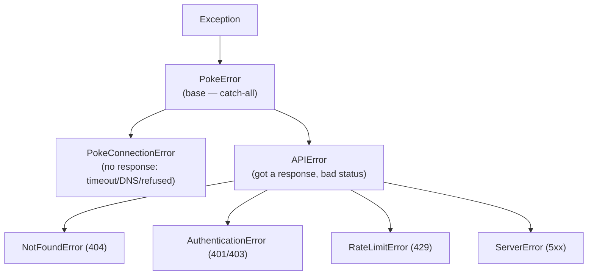

# 01: The error hierarchy

> **Level:** Intermediate · **Prerequisites:** [Section 03](../03_the_sync_client/README.md)
> **Time:** ~1 hour · **Verified:** 2026-06-04 (live PokéAPI)

## Why this matters

Back in Section 01, a typo gave the naive client a baffling `JSONDecodeError`. The real problem — "that resource doesn't exist" — was a 404, but the user saw a *parsing* error. This module fixes that for good with a **custom exception hierarchy**: every failure becomes a specific, documented, catchable exception. Good errors are a core feature of an SDK, not an afterthought — they're how your library communicates failure to code it can't see.

## Design goals for SDK errors

1. **One base class.** Users can `except PokeError` to catch *anything* from the SDK, distinguishing it from their own bugs.
2. **Specific subclasses.** `NotFoundError`, `RateLimitError`, etc., so callers can handle distinct cases differently.
3. **Carry context.** The exception should hold the status code and the response, so users can inspect headers/body when they need to.
4. **Map at one place.** Status → exception translation happens in the funnel, once.

## The hierarchy



The split that matters: **`PokeConnectionError`** (we never got a response) vs **`APIError`** (we got one, but it was an error status). They're fundamentally different failures — one is the network, one is the server's answer — and only `APIError` can carry a status code.

## The code

```python
# src/pokesdk/exceptions.py
from __future__ import annotations
from typing import Optional
import httpx


class PokeError(Exception):
    """Base class for every error raised by pokesdk."""


class PokeConnectionError(PokeError):
    """The request never got a response (DNS failure, timeout, refused, ...)."""
    def __init__(self, message: str, *, cause: Optional[Exception] = None) -> None:
        super().__init__(message)
        self.cause = cause


class APIError(PokeError):
    """The server returned a response, but it was an HTTP error status."""
    def __init__(self, message: str, *, response: httpx.Response) -> None:
        super().__init__(message)
        self.response = response
        self.status_code = response.status_code


class NotFoundError(APIError):
    """404 — the requested resource does not exist."""

class AuthenticationError(APIError):
    """401/403 — the API key is missing, wrong, or not allowed."""

class RateLimitError(APIError):
    """429 — too many requests; back off and retry later."""

class ServerError(APIError):
    """5xx — the server failed to handle a valid request."""
```

`APIError` stores both `response` (full httpx response — headers, body, request) and a convenient `status_code`. Subclasses add no fields; their *type* is the information ("this was a 404").

## Mapping a response to the right exception

One function turns a failed response into the most specific exception:

```python
# src/pokesdk/exceptions.py
def error_from_response(response: httpx.Response) -> APIError:
    status = response.status_code
    msg = f"{status} {response.reason_phrase} for {response.request.method} {response.request.url}"
    if status in (401, 403):
        return AuthenticationError(msg, response=response)
    if status == 404:
        return NotFoundError(msg, response=response)
    if status == 429:
        return RateLimitError(msg, response=response)
    if status >= 500:
        return ServerError(msg, response=response)
    return APIError(msg, response=response)     # any other 4xx
```

The message includes status, method, and URL — so even an uncaught error prints something diagnostic, not just `APIError`.

## Wiring it into the funnel

This replaces the placeholder `raise_for_status()` from Section 03 — *one line changes in `_request`*, and every method gains typed errors:

```python
# src/pokesdk/client.py  (inside _request, after sending)
from .exceptions import PokeConnectionError, error_from_response

def _request(self, method, path, **kwargs):
    try:
        request = self._http.build_request(method, path, **kwargs)
        response = self._http.send(request)
    except httpx.HTTPError as exc:                 # no response at all
        raise PokeConnectionError(str(exc), cause=exc) from exc

    if response.is_success:
        return response.json()
    raise error_from_response(response)            # got a bad status → typed error
```

Two failure paths, two exception families: connection problems → `PokeConnectionError`; bad statuses → an `APIError` subclass. (The retry loop goes around this in the next module — but notice the error mapping is already complete and lives in one place.)

> `raise ... from exc` preserves the original exception as `__cause__`, so a full traceback still shows the underlying httpx error. Good libraries don't swallow the root cause — they wrap it in something friendlier while keeping it reachable.

## Verified: a 404 becomes a catchable `NotFoundError`

```python
from pokesdk import PokeClient, NotFoundError, APIError, PokeError

with PokeClient() as client:
    try:
        client.pokemon.get("definitely-not-real")
    except NotFoundError as e:
        print("caught NotFoundError | status", e.status_code)
        print("is APIError :", isinstance(e, APIError))
        print("is PokeError:", isinstance(e, PokeError))
        print("mro         :", [k.__name__ for k in type(e).__mro__[:4]])
```

**Live output:**

```text
caught NotFoundError | status 404
is APIError : True
is PokeError: True
mro         : ['NotFoundError', 'APIError', 'PokeError', 'Exception']
```

Compare to Section 01's `JSONDecodeError`. Now the user catches exactly what they expect — and because of the hierarchy, they can be as specific (`except NotFoundError`) or as broad (`except PokeError`) as they like.

## How users catch errors — specificity ladder

The hierarchy gives callers a choice of precision:

```python
from pokesdk import PokeClient, NotFoundError, RateLimitError, APIError, PokeError

with PokeClient() as client:
    try:
        p = client.pokemon.get(name)
    except NotFoundError:
        ...   # handle "doesn't exist" specifically
    except RateLimitError:
        ...   # back off
    except APIError as e:
        ...   # any other HTTP error status; inspect e.status_code / e.response
    except PokeError:
        ...   # catch-all for the SDK (incl. connection errors)
```

Because subclasses inherit from `APIError` and `PokeError`, ordering from specific to general does the right thing. This ladder — specific handlers on top, broad safety net below — is exactly how the Anthropic and Stripe SDKs structure their errors too.

## Recap & next

- ✅ Build a hierarchy: **`PokeError`** (base) → **`PokeConnectionError`** (no response) and **`APIError`** (bad status) → `NotFoundError`/`AuthenticationError`/`RateLimitError`/`ServerError`.
- ✅ `APIError` carries `status_code` and the full `response`; subclasses convey meaning by *type*.
- ✅ Map status → exception in **one** function, called from the single funnel; replace Section 03's `raise_for_status()`.
- ✅ `raise ... from exc` keeps the root cause in the traceback.
- ✅ Self-check: why separate `PokeConnectionError` from `APIError`? How does one base class help users?

→ Next: **[02 · Retries & backoff](02_retries_and_backoff.md)** — surviving the transient failures (429, 5xx, dropped connections).

## Exercises

1. **Catch at two levels.** Write code that calls `client.pokemon.get(name)` and handles `NotFoundError` with a friendly message, but lets any other SDK error propagate after logging it as "unexpected SDK error." Test it with a bad name and (by pointing at httpbin `/status/500`) a server error.

<details><summary>Solution</summary>

```python
from pokesdk import PokeClient, NotFoundError, PokeError
import logging

def fetch(name):
    with PokeClient() as c:
        try:
            return c.pokemon.get(name)
        except NotFoundError:
            print(f"No pokemon named {name!r}")
            return None
        except PokeError as e:
            logging.error("unexpected SDK error: %s", e)
            raise
```

`NotFoundError` is handled specifically; everything else from the SDK is caught by `PokeError`, logged, and re-raised. Non-SDK bugs (e.g. a `TypeError` in your own code) are *not* swallowed — they aren't `PokeError`.
</details>

2. **Add a `ConflictError`.** Suppose a write API returns 409 on conflicts. Add a `ConflictError(APIError)` and a branch in `error_from_response`. Where else, if anywhere, must you change code?

<details><summary>Solution</summary>

```python
class ConflictError(APIError):
    """409 — the request conflicts with current state."""

# in error_from_response:
    if status == 409:
        return ConflictError(msg, response=response)
```

Add it to `__init__.py`'s exports and `__all__` so users can `from pokesdk import ConflictError`. **No** change to `_request` or any resource method — the funnel already calls `error_from_response` for every bad status. That's the payoff of mapping in one place.
</details>

3. **Why not just `raise_for_status()`?** httpx already has `response.raise_for_status()` which raises `HTTPStatusError` on 4xx/5xx. Why build a custom hierarchy instead?

<details><summary>Solution</summary>

`raise_for_status()` raises a single generic `HTTPStatusError` for *all* error statuses, so callers can't easily distinguish "not found" from "rate limited" from "auth failed" without inspecting the status code by hand at every call site — re-creating the naive client's checking burden. A typed hierarchy lets users write `except NotFoundError` / `except RateLimitError`, encodes meaning in the type, and is *your* stable contract (you control the names) rather than leaking httpx's exception type through your public API.
</details>
