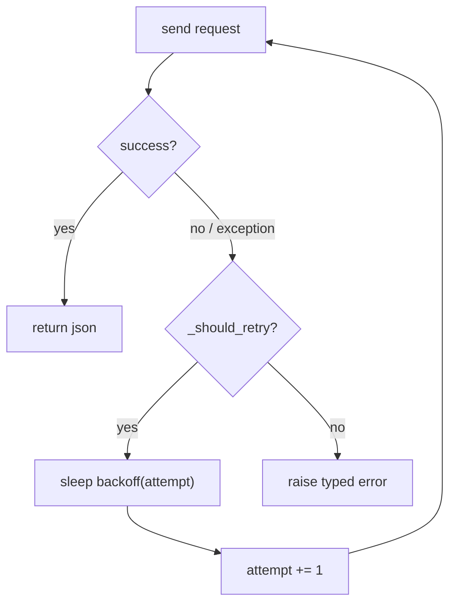

# 02: Retries & backoff

> **Level:** Intermediate · **Prerequisites:** [01 · The error hierarchy](01_error_hierarchy.md)
> **Time:** ~1.5 hours · **Verified:** 2026-06-04 (live httpbin, offline tests)

## Why this matters

At any real scale, the network *will* blip: a momentary `503`, a `429` rate-limit, a dropped connection. Without retries, each blip fails an operation that a single retry would have rescued — so every caller writes their own retry loop, all slightly wrong. This module adds retries with **exponential backoff** to the one funnel, retrying *only what's safe*, so it happens once, correctly, for everyone.

## What's safe to retry — and what isn't

Retrying is only correct for **transient** failures. Retrying a `404` is pointless (the resource still won't exist); retrying a `401` is pointless (the key is still wrong). Worse, retrying a non-idempotent write could double-charge a customer. The rules:

| Outcome | Retry? | Why |
|---|---|---|
| `429 Too Many Requests` | ✅ | rate limit; backing off helps |
| `500/502/503/504` | ✅ | transient server problem |
| connection error / timeout (no response) | ✅ | network blip |
| `404`, `401`, `403`, other `4xx` | ❌ | your request is wrong; retrying won't fix it |
| `2xx` | — | success |

For PokéAPI (read-only `GET`s), all retries are safe. For write APIs you'd also gate on the HTTP method (only retry idempotent ones by default) — a caveat worth documenting; we note it at the end.

## Exponential backoff

Retrying *immediately* and repeatedly just hammers a struggling server (a "retry storm"). **Exponential backoff** waits longer between each attempt: 0.5s, then 1s, then 2s, … Each wait gives the server room to recover.

```python
def _backoff_seconds(self, attempt):     # attempt is 0-based
    return 0.5 * (2 ** attempt)          # 0.5, 1.0, 2.0, 4.0, ...
```

**Verified:**

```text
backoff attempt 0: 0.5
backoff attempt 1: 1.0
backoff attempt 2: 2.0
```

> **Production note:** real SDKs add **jitter** (a small random amount) so that many clients retrying at once don't synchronise into waves. We keep plain exponential backoff for clarity; the exercise explores adding jitter.

## Two pure decisions, shared by sync & async

Notice that *whether* to retry and *how long* to wait are pure logic — no I/O. So they live in the shared `BaseClient` (Section 06 will reuse them for the async client unchanged):

```python
# src/pokesdk/_base.py
RETRYABLE_STATUSES = frozenset({429, 500, 502, 503, 504})

class BaseClient:
    def __init__(self, api_key=None, *, base_url=..., timeout=10.0, max_retries=2):
        ...
        self.max_retries = max_retries

    def _should_retry(self, *, attempt, status_code):
        if attempt >= self.max_retries:
            return False                          # out of attempts
        if status_code is None:                   # connection error, no response
            return True
        return status_code in RETRYABLE_STATUSES

    def _backoff_seconds(self, attempt):
        return 0.5 * (2 ** attempt)
```

**Verified decisions:**

```text
should_retry 503 a0/max2: True     # transient + attempts left
should_retry 404 a0/max2: False    # not retryable
should_retry 503 a2/max2: False    # out of attempts (attempt == max_retries)
should_retry conn a0    : True     # connection error → retry
```

## The retry loop in `_request`

The loop wraps the build→send→check sequence from the previous module. Each iteration is one attempt; on a retryable outcome with attempts left, we sleep and loop; otherwise we return or raise:

```python
# src/pokesdk/client.py
import time
import httpx
from .exceptions import PokeConnectionError, error_from_response

def _request(self, method, path, **kwargs):
    attempt = 0
    while True:
        try:
            request = self._http.build_request(method, path, **kwargs)
            response = self._http.send(request)
        except httpx.HTTPError as exc:                       # no response
            if self._should_retry(attempt=attempt, status_code=None):
                self._sleep(attempt)
                attempt += 1
                continue
            raise PokeConnectionError(str(exc), cause=exc) from exc

        if response.is_success:
            return response.json()

        if self._should_retry(attempt=attempt, status_code=response.status_code):
            self._sleep(attempt)
            attempt += 1
            continue

        raise error_from_response(response)                  # give up → typed error

def _sleep(self, attempt):
    time.sleep(self._backoff_seconds(attempt))
```



`max_retries=2` means **up to 3 total attempts** (the initial try + 2 retries). We pulled `time.sleep` into its own `_sleep` method for one reason: tests can monkeypatch it to run instantly (Section 07), and the async client overrides it with `await asyncio.sleep` (Section 06).

## Verified: real retries against a flaky endpoint

Pointing the client at httpbin's `/status/503` (always 503) with `max_retries=2` and debug logging:

```python
import logging
log = logging.getLogger("pokesdk"); log.setLevel(logging.DEBUG)
log.addHandler(logging.StreamHandler())

from pokesdk import PokeClient, ServerError
with PokeClient(base_url="https://httpbin.org", max_retries=2) as c:
    try:
        c._request("GET", "/status/503")
    except ServerError as e:
        print("gave up:", type(e).__name__, e.status_code)
```

**Live output:**

```text
request GET https://httpbin.org/status/503 (attempt 0)
retrying after status 503
request GET https://httpbin.org/status/503 (attempt 1)
retrying after status 503
request GET https://httpbin.org/status/503 (attempt 2)
gave up: ServerError 503
```

Three attempts (0, 1, 2), backoff between each, then a clean `ServerError`. And the **success-after-retry** path is covered by the offline test suite (Section 07): two `503`s then a `200` returns the result and makes exactly 3 calls.

## Don't retry forever

`max_retries` is a hard ceiling — bounded attempts, bounded total wait. An SDK that retried indefinitely could hang a caller for minutes on a truly-down service. Two or three retries rescues the *transient* blips (the common case) without masking a real outage. Expose `max_retries` as config (default 2) so users can tune it, including `max_retries=0` to disable.

## Recap & next

- ✅ Retry only **transient** failures: `429`, `5xx`, and connection errors. **Never** retry `404`/`401`/other `4xx`.
- ✅ Use **exponential backoff** (0.5·2ⁿ) so retries don't hammer a struggling server; production adds jitter.
- ✅ Keep the *decisions* (`_should_retry`, `_backoff_seconds`) pure in `BaseClient` so sync and async share them.
- ✅ The retry **loop** wraps build→send→check in `_request`; `max_retries=2` ⇒ 3 attempts max. Isolate `_sleep` for tests/async.
- ✅ Self-check: which statuses are retryable and which aren't, and why? What does `max_retries=2` mean in total attempts?

→ Next: **[03 · Pagination](03_pagination.md)** — one `for` loop over thousands of items.

## Exercises

1. **Add jitter.** Modify `_backoff_seconds` to add up to ±20% random jitter. Why does jitter matter when *many* clients retry at once?

<details><summary>Solution</summary>

```python
import random
def _backoff_seconds(self, attempt):
    base = 0.5 * (2 ** attempt)
    return base * (1 + random.uniform(-0.2, 0.2))
```

Without jitter, if 1,000 clients all hit a `503` at the same instant, they all wait exactly 0.5s and retry *simultaneously* — re-creating the spike that caused the failure (a "thundering herd"). Jitter spreads the retries over a window, smoothing load. (Note: random backoff makes tests non-deterministic — which is why the SDK isolates sleeping in `_sleep`, so tests monkeypatch it away entirely.)
</details>

2. **Disable retries.** A user wants no retries (e.g. they have their own logic). What do they pass, and trace `_should_retry` to confirm it never retries.

<details><summary>Solution</summary>

`PokeClient(max_retries=0)`. On the first failure, `attempt` is `0` and `_should_retry` checks `attempt >= self.max_retries` → `0 >= 0` → `True`, so it returns `False` immediately: no retry, the error is raised on the first attempt. One try, no waiting.
</details>

3. **Why gate writes on method?** PokéAPI is read-only so we retry every `GET`. For a write API, why might you *not* retry a `POST` by default, and how would you decide?

<details><summary>Solution</summary>

A `POST` is often **non-idempotent** — retrying "create order" after a timeout might create *two* orders if the first actually succeeded but the response was lost. `GET`/`PUT`/`DELETE` are idempotent (same effect if repeated), so they're safe to retry. A robust SDK retries idempotent methods automatically and either skips `POST` or relies on an **idempotency key** (a client-supplied token the server dedupes on) before retrying writes. You'd gate the retry decision on `request.method` and/or the presence of an idempotency key. Document the policy clearly so users aren't surprised.
</details>
