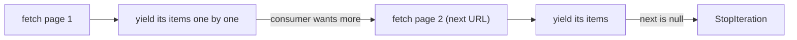

# 03: Pagination

> **Level:** Intermediate · **Prerequisites:** [02 · Retries & backoff](02_retries_and_backoff.md)
> **Time:** ~1 hour · **Verified:** 2026-06-04 (live PokéAPI, offline tests)

## Why this matters

`/pokemon` has 1,350 entries but returns ~20 per page with a `next` URL (you saw this in Section 01). Without help, every user re-writes the same offset-walking loop. This module hides it behind a Python iterator so users write `for p in client.pokemon.list_all(): ...` and the SDK fetches pages **lazily** as they iterate — never loading everything into memory, never making them think about `offset`.

## The shape of a paginated response

PokéAPI list endpoints return a page object:

```json
{
  "count": 1350,
  "next": "https://pokeapi.co/api/v2/pokemon?offset=20&limit=20",
  "previous": null,
  "results": [ {"name": "bulbasaur", "url": "..."}, ... ]
}
```

`next` is either the full URL of the following page, or `null` on the last page. That `null` is your loop's stop condition. We model it with the generic `Page` from Section 04:

```python
# src/pokesdk/models.py
from typing import Generic, List, Optional, TypeVar
from pydantic import BaseModel
T = TypeVar("T")

class Page(BaseModel, Generic[T]):
    count: int
    next: Optional[str] = None
    previous: Optional[str] = None
    results: List[T] = []
```

`Page[NamedResource]` is "a page whose results are `NamedResource`s" — typed all the way through.

## A lazy generator that walks `next`

The key insight: a Python **generator** (`yield`) lets us fetch one page, hand out its items, and only fetch the next page when the consumer asks for more. Memory stays flat regardless of total size.

```python
# src/pokesdk/pagination.py
from .models import NamedResource, Page

def iterate_pages(client, path, *, limit=20):
    params = {"limit": limit, "offset": 0}
    next_url = path
    while next_url is not None:
        data = client._request("GET", next_url, params=params)
        page = Page[NamedResource].model_validate(data)
        yield from page.results          # hand out this page's items
        next_url = page.next             # already a full URL, or None at the end
        params = None                    # the `next` URL carries its own query string
```

Two subtleties worth noticing:

- **First call uses `params`** (`limit`/`offset`); after that, `next` is already a complete URL with its own query string, so we drop `params` to avoid duplicating it. `httpx` resolves the absolute `next` URL fine even though the client has a `base_url`.
- **`yield from page.results`** emits each item, then control returns to the consumer. The `while` only advances — fetching the next page — when the consumer requests another item past this page's end. That's the laziness.



## Exposing it as a resource method

The resource method just returns the generator:

```python
# src/pokesdk/client.py
from .pagination import iterate_pages

class PokemonResource:
    def list_all(self, *, limit=20):
        return iterate_pages(self._client, "/pokemon", limit=limit)
```

So the user writes a plain `for` loop and can `break` early, pass it to `list()`, or use it in a comprehension — it's just an iterable:

```python
with PokeClient() as client:
    for p in client.pokemon.list_all():
        print(p.name)
        if p.name == "charizard":
            break          # stops fetching — later pages are never requested
```

## Verified: it really crosses page boundaries

Walking 250 items with `limit=100` means the generator transparently fetched **three** pages:

```python
from pokesdk import PokeClient
with PokeClient() as client:
    n = 0
    for p in client.pokemon.list_all(limit=100):
        n += 1
        if n >= 250:
            break
    print("walked", n, "items across multiple pages (limit=100/page)")
```

**Live output:**

```text
walked 250 items across multiple pages (limit=100/page)
```

The user never saw an `offset`, a `next` URL, or a page boundary — exactly the point. The page-walking logic is also covered deterministically by the offline test suite (Section 07): two mock pages, asserting the items come out flattened in order.

## Why lazy beats eager

You could write `list_all` to loop internally and return one big `list`. Don't, as the default:

- **Memory:** a lazy iterator holds one page at a time; an eager list holds *everything* (imagine 100k items).
- **Early exit:** with lazy iteration, `break` after finding what you want stops fetching. An eager version already paid to fetch every page before returning.
- **Latency to first item:** lazy yields the first item after one request; eager makes the user wait for *all* pages before they see anything.

If a user genuinely wants everything in a list, they write `list(client.pokemon.list_all())` — explicit, and their choice. Defaulting to lazy keeps the cheap path cheap.

## Recap & next

- ✅ Paginated endpoints return a `Page` with `results` and a `next` URL (`None` on the last page).
- ✅ A **generator** that `yield`s items and follows `next` makes pagination a transparent `for` loop, fetching pages **lazily**.
- ✅ Use `params` for the first request only; the `next` URL already carries its query string.
- ✅ Lazy iteration wins on memory, early-exit, and time-to-first-item; users can opt into `list(...)` for eager.
- ✅ Self-check: what stops the loop? Why is lazy iteration better than returning one big list by default?

→ Next: **[04 · Timeouts, logging & config](04_timeouts_logging_config.md)** — the last robustness layer.

## Exercises

1. **Count without loading all.** Use `list_all` to count how many Pokémon names start with "char", iterating lazily (don't build a full list). 

<details><summary>Solution</summary>

```python
from pokesdk import PokeClient
with PokeClient() as c:
    n = sum(1 for p in c.pokemon.list_all(limit=100) if p.name.startswith("char"))
    print(n)   # e.g. 6: charmander, charmeleon, charizard, charjabug, charcadet, ...
```

`sum(1 for ...)` consumes the generator one item at a time — memory stays flat even though it walks all 1,350 entries across many pages.
</details>

2. **Early break saves requests.** Iterate `list_all(limit=20)` and `break` after the first item. How many HTTP requests were made, and why does that demonstrate laziness?

<details><summary>Solution</summary>

**One** request. The generator fetches page 1, yields `bulbasaur`, you `break` — so `next` is never followed and page 2 is never requested. An eager implementation would have fetched *all 68 pages* before returning anything. The single request proves pages are pulled on demand.
</details>

3. **Generic page typing.** Why is `Page` defined as `Page(BaseModel, Generic[T])` rather than hard-coding `results: List[NamedResource]`?

<details><summary>Solution</summary>

Generics let one `Page` model serve *every* list endpoint with the correct element type: `Page[NamedResource]` for `/pokemon`, `Page[BerrySummary]` for some richer endpoint, etc. The `next`/`previous`/`count` plumbing is identical across all of them, so you write it once and parameterise the result type — keeping full type information (`page.results[0]` is typed as `T`) without duplicating the page model per resource.
</details>
