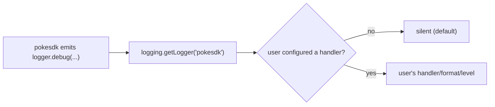

# 04: Timeouts, logging & config

> **Level:** Intermediate · **Prerequisites:** [03 · Pagination](03_pagination.md)
> **Time:** ~1 hour · **Verified:** 2026-06-04 (live, httpx 0.28.1)

## Why this matters

Three smaller-but-essential robustness layers finish the SDK's core: **timeouts** so a call never hangs forever, **logging** so users (and you) can debug what the SDK did, and clean **configuration** so all these knobs are discoverable and overridable. None is glamorous; all are the difference between an SDK that's pleasant in production and one that mysteriously freezes at 3am.

## Timeouts: never hang forever

The naive client could hang indefinitely if a server stopped responding mid-request. An SDK must default to a **finite timeout** and surface a timeout as a clear error. We already set `timeout` on the `httpx.Client` (Section 03) and map connection-level failures — including timeouts — to `PokeConnectionError` (Section 05.01):

```python
# in __init__
self._http = httpx.Client(base_url=self.base_url, headers=..., timeout=self.timeout)
# default self.timeout = 10.0
```

### Verified: a timeout becomes a `PokeConnectionError`

Pointing at an unreachable host with a 1-second timeout and retries off:

```python
from pokesdk import PokeClient, PokeConnectionError

with PokeClient(base_url="http://10.255.255.1", timeout=1.0, max_retries=0) as c:
    try:
        c._request("GET", "/anything")
    except PokeConnectionError as e:
        print("caught PokeConnectionError")
        print("cause type:", type(e.cause).__name__)
```

**Live output:**

```text
caught PokeConnectionError
cause type: ConnectTimeout
```

The underlying `httpx.ConnectTimeout` is wrapped in your friendly `PokeConnectionError`, but kept reachable via `.cause` (and `__cause__` in the traceback) for anyone who needs to inspect it. The call returned in ~1 second instead of hanging.

> **Design rule:** make the safe default automatic and the dangerous choice explicit. `timeout=10.0` is the default; a user who *really* wants no timeout must pass `timeout=None` deliberately — they can't get an infinite hang by accident.

### Finer-grained timeouts (optional)

httpx lets you split the timeout into connect/read/write/pool phases via `httpx.Timeout(...)`. A single float (our default) sets all of them, which is fine for most SDKs. Expose the `httpx.Timeout` object as an advanced option if your users need it; don't complicate the common case.

## Logging: a quiet, namespaced logger

A library must **never** configure logging globally or print to stdout — that's the application's job (Section 01: you don't own the call site). Instead, get a **named logger** and emit at `DEBUG`; stay silent unless the *user* turns it on:

```python
# src/pokesdk/_base.py
import logging
logger = logging.getLogger("pokesdk")     # named after the package

# in _request:
logger.debug("request %s %s (attempt %d)", method, request.url, attempt)
# in the retry path:
logger.debug("retrying after status %d", response.status_code)
```

By default this produces **no output** — Python loggers with no configured handler are silent (modulo a "last resort" warning-level handler). The user opts in:

```python
import logging
logging.getLogger("pokesdk").setLevel(logging.DEBUG)
logging.getLogger("pokesdk").addHandler(logging.StreamHandler())
```

### Verified: opt-in debug logging (from the retry demo)

```text
request GET https://httpbin.org/status/503 (attempt 0)
retrying after status 503
request GET https://httpbin.org/status/503 (attempt 1)
...
```

Two rules that keep you a good citizen:

- **Name the logger after the package** (`"pokesdk"`), so users can target *just* your SDK's logs (`getLogger("pokesdk")`) without drowning in everyone else's.
- **Never log secrets.** The API key is in the `Authorization` header; don't log full headers at any level, and don't put the key in messages.



## Configuration: one clear place for knobs

All the behaviour we've added is controlled by constructor arguments on `BaseClient`, so every knob is discoverable in one signature and overridable per client:

```python
# src/pokesdk/_base.py
class BaseClient:
    def __init__(
        self,
        api_key=None,
        *,
        base_url="https://pokeapi.co/api/v2",
        timeout=10.0,
        max_retries=2,
    ):
        self.api_key = api_key
        self.base_url = base_url.rstrip("/")
        self.timeout = timeout
        self.max_retries = max_retries
```

| Knob | Default | What it controls |
|------|---------|------------------|
| `api_key` | `None` | auth (Section 03) — optional for PokéAPI |
| `base_url` | PokéAPI v2 | which server (staging/mock/version) |
| `timeout` | `10.0`s | max wait before `PokeConnectionError` |
| `max_retries` | `2` | retry attempts on transient failures |

Principles behind these defaults:

- **Safe defaults, no required config.** `PokeClient()` with zero arguments just works (timeouts and retries on). The simplest call is also a sane one.
- **Keyword-only** (the `*`): every option is passed by name, so call sites read clearly and you can add options later without breaking anyone.
- **One config home.** Both the sync and async clients inherit these from `BaseClient`, so there's a single source of truth (the subject of Section 06).

## Recap & next

- ✅ Default to a **finite timeout** (10s); a timeout surfaces as `PokeConnectionError` (root cause kept in `.cause`). `timeout=None` is an explicit opt-in to hang.
- ✅ Use a **named, DEBUG-level logger** (`getLogger("pokesdk")`); stay silent by default, never configure global logging or log secrets.
- ✅ Expose all behaviour as **keyword-only constructor config** with safe defaults, in one place (`BaseClient`).
- ✅ Self-check: why must a library not call `logging.basicConfig`? Why default `timeout=10` rather than `None`?

→ Next: **[Section 06 · Async client](../06_async_client/README.md)** — adding an async client that reuses every decision we just centralised in `BaseClient`.

## Exercises

1. **Make it hang, then make it safe.** Construct a client pointing at `http://10.255.255.1` with `timeout=None, max_retries=0` and a long outer timeout — observe it hang (cancel it). Then set `timeout=1.0` and confirm it raises `PokeConnectionError` within ~1s.

<details><summary>Solution</summary>

With `timeout=None`, the connect attempt to a non-routable host blocks until the OS gives up (could be minutes) — a hang. With `timeout=1.0`, httpx raises `ConnectTimeout` after ~1s, which the SDK wraps as `PokeConnectionError`. This is the whole argument for a finite default: users shouldn't be able to hang by omission.
</details>

2. **Turn on logging for just the SDK.** Configure logging so you see `pokesdk`'s DEBUG lines but *not* httpx's internal DEBUG noise. 

<details><summary>Solution</summary>

```python
import logging
log = logging.getLogger("pokesdk")        # target ONLY the pokesdk logger
log.setLevel(logging.DEBUG)
log.addHandler(logging.StreamHandler())
```

Because the SDK logs under the `"pokesdk"` name, raising *that* logger's level shows your SDK's lines while httpx's `"httpx"`/`"httpcore"` loggers stay at their default level (quiet). If you'd used `logging.basicConfig(level=DEBUG)` you'd get everyone's debug logs — which is why the SDK never calls that itself.
</details>

3. **Add a `user_agent` override.** Let users append their app name to the `User-Agent` (e.g. `"pokesdk/0.1.0 myapp/2.0"`). Where does this go, and why is it useful for an API provider?

<details><summary>Solution</summary>

Add a `user_agent: str | None = None` keyword to `__init__`, and in `_default_headers` build `f"pokesdk/{__version__}" + (f" {self.user_agent}" if self.user_agent else "")`. It's useful because the API provider sees in their logs *which downstream app* is making calls (not just "some pokesdk user"), helping them with analytics, debugging a misbehaving integration, or contacting heavy users. Many SDKs support this exact "append your app to the UA" pattern.
</details>
