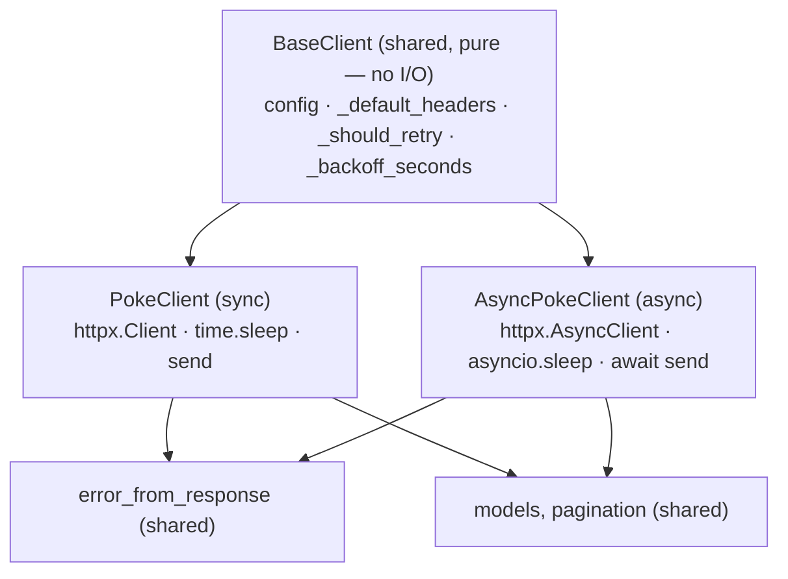

# 02: The async client & the shared core

> **Level:** Intermediate · **Prerequisites:** [01 · Why & how async](01_why_and_how_async.md)
> **Time:** ~1.5 hours · **Verified:** 2026-06-04 (live PokéAPI)

## Why this matters

This is where the `BaseClient` design from Section 05 pays off completely. We'll add a full async client — get, list, pagination, retries, typed errors — and you'll see it duplicates almost *nothing*, because every decision already lives in the shared base. The lesson generalises: **separate the I/O from the policy, and a second transport is nearly free.**

## The architecture: one base, two transports



What's **shared** (written once, in `BaseClient`/`exceptions`/`models`): config, header building, the retry *decision*, the backoff *formula*, the error mapping, the Pydantic models. What's **per-client** (the only real difference): owning a sync vs async httpx client, and *how* it sends and sleeps.

## `BaseClient` recap — the decisions live here

From Section 05, the base holds everything transport-agnostic:

```python
# src/pokesdk/_base.py (the parts both clients use)
class BaseClient:
    def __init__(self, api_key=None, *, base_url=..., timeout=10.0, max_retries=2):
        self.api_key = api_key
        self.base_url = base_url.rstrip("/")
        self.timeout = timeout
        self.max_retries = max_retries

    def _default_headers(self): ...       # auth + User-Agent + Accept
    def _should_retry(self, *, attempt, status_code): ...   # pure policy
    def _backoff_seconds(self, attempt): ...                # pure formula
```

Neither method touches the network. That's the property that lets both clients inherit them verbatim.

## `AsyncPokeClient`

Now compare it to the sync client side by side — the structure is identical; only the marked lines differ:

```python
# src/pokesdk/async_client.py
import asyncio
import httpx
from ._base import BaseClient, logger
from .exceptions import PokeConnectionError, error_from_response
from .models import Pokemon
from .pagination import aiterate_pages


class AsyncPokemonResource:
    def __init__(self, client):
        self._client = client

    async def get(self, name_or_id):                              # async def
        data = await self._client._request("GET", f"/pokemon/{name_or_id}")   # await
        return Pokemon.model_validate(data)                       # same parsing

    def list_all(self, *, limit=20):
        return aiterate_pages(self._client, "/pokemon", limit=limit)


class AsyncPokeClient(BaseClient):                                # same base!
    def __init__(self, api_key=None, **kwargs):
        super().__init__(api_key, **kwargs)                       # same config
        self._http = httpx.AsyncClient(                           # AsyncClient
            base_url=self.base_url,
            headers=self._default_headers(),                      # shared headers
            timeout=self.timeout,
        )
        self.pokemon = AsyncPokemonResource(self)

    async def aclose(self):                                       # async close
        await self._http.aclose()

    async def __aenter__(self):                                   # async context mgr
        return self

    async def __aexit__(self, *exc):
        await self.aclose()

    async def _request(self, method, path, **kwargs):             # async funnel
        attempt = 0
        while True:
            try:
                request = self._http.build_request(method, path, **kwargs)
                response = await self._http.send(request)         # await send
            except httpx.HTTPError as exc:
                if self._should_retry(attempt=attempt, status_code=None):   # SHARED policy
                    await asyncio.sleep(self._backoff_seconds(attempt))     # SHARED formula
                    attempt += 1
                    continue
                raise PokeConnectionError(str(exc), cause=exc) from exc

            if response.is_success:
                return response.json()

            if self._should_retry(attempt=attempt, status_code=response.status_code):
                await asyncio.sleep(self._backoff_seconds(attempt))
                attempt += 1
                continue

            raise error_from_response(response)                   # SHARED mapping
```

Read the `_request` retry loop against the sync one from Section 05.02 — it's line-for-line the same *logic*. The diffs are purely mechanical:

| Sync | Async |
|------|-------|
| `httpx.Client` | `httpx.AsyncClient` |
| `self._http.send(request)` | `await self._http.send(request)` |
| `time.sleep(...)` | `await asyncio.sleep(...)` |
| `def _request` | `async def _request` |
| `close` / `__enter__`/`__exit__` | `aclose` / `__aenter__`/`__aexit__` |

Every *decision* — `_should_retry`, `_backoff_seconds`, `_default_headers`, `error_from_response` — is called identically in both. If you change the retry policy, you change it once in `BaseClient` and **both** clients get it. That's the win, and it's why this module is short.

## Async pagination

The page-walker mirrors the sync generator, using `async def` + `async for`:

```python
# src/pokesdk/pagination.py
async def aiterate_pages(client, path, *, limit=20):
    params = {"limit": limit, "offset": 0}
    next_url = path
    while next_url is not None:
        data = await client._request("GET", next_url, params=params)
        page = Page[NamedResource].model_validate(data)
        for item in page.results:
            yield item
        next_url = page.next
        params = None
```

Users consume it with `async for`:

```python
async with AsyncPokeClient() as client:
    async for p in client.pokemon.list_all():
        ...
```

## Verified: the async client works end to end

```python
import asyncio
from pokesdk import AsyncPokeClient

async def main():
    async with AsyncPokeClient() as client:
        d = await client.pokemon.get("pikachu")
        print("async get:", d.name, "| id", d.id, "| base_exp", d.base_experience)

asyncio.run(main())
```

**Live output:**

```text
async get: pikachu | id 25 | base_exp 112
```

And concurrent fetches via `asyncio.gather` (from the previous module's benchmark) return correctly interleaved results — same typed `Pokemon` objects, same errors, same retries, just overlapped.

## Add it to the public API

Export the async client alongside the sync one so users `from pokesdk import AsyncPokeClient`:

```python
# src/pokesdk/__init__.py
from .async_client import AsyncPokeClient
from .client import PokeClient
__all__ = ["PokeClient", "AsyncPokeClient", ...]
```

Now your SDK serves both audiences from one codebase, with one source of truth for behaviour.

## Recap & next

- ✅ Put all **decisions** (headers, retry policy, backoff, error mapping, models) in shared code; only **I/O mechanics** differ per client.
- ✅ `AsyncPokeClient` mirrors `PokeClient` line-for-line, swapping `Client→AsyncClient`, `send→await send`, `time.sleep→await asyncio.sleep`, `with→async with`.
- ✅ Because policy is shared via `BaseClient`, a behaviour change happens **once** and both clients inherit it.
- ✅ Export both clients; one codebase serves sync and async users.
- ✅ Self-check: which parts are shared vs duplicated between the two clients? Why does that make a policy change a one-line edit?

→ Next: **[Section 07 · Testing](../07_testing/README.md)** — proving all of this works, fast and offline, by mocking HTTP.

## Exercises

1. **Diff the two clients.** Put `client.py` and `async_client.py` side by side and list every line that genuinely differs in `_request`. How many are *logic* differences vs *mechanical* (await/async) ones?

<details><summary>Solution</summary>

The differing lines are all **mechanical**: `async def`, `await self._http.send(...)`, `await asyncio.sleep(...)` (×2). The control flow — try/except, the two `_should_retry` checks, `is_success`, the raises — is identical, and every *decision* is a shared `BaseClient`/`exceptions` call. Zero logic differences. That's the signal that your shared core is well-factored: if you found logic duplicated, it should move into `BaseClient`.
</details>

2. **Change a policy once.** Add `408` (Request Timeout) to the retryable statuses. How many files/lines change, and do both clients pick it up?

<details><summary>Solution</summary>

One line, one file: add `408` to `RETRYABLE_STATUSES` in `_base.py`. Both `PokeClient` and `AsyncPokeClient` call the shared `_should_retry`, which reads that set — so both immediately retry 408s with no other change. This is the concrete payoff of the shared core.
</details>

3. **Why not inherit `AsyncPokeClient` from `PokeClient`?** We made both inherit from `BaseClient`, not async from sync. Why is that the right shape?

<details><summary>Solution</summary>

`PokeClient` and `AsyncPokeClient` are *siblings*, not parent/child — neither is a specialisation of the other; they're two transports over the same policy. Inheriting async from sync would drag in the sync client's `httpx.Client`, `time.sleep`, and sync `__enter__` that the async client must *replace*, leading to confusing overrides and a broken Liskov relationship. Putting the shared, I/O-free policy in `BaseClient` and having both transports inherit it keeps each client clean and the shared logic in exactly one place.
</details>
