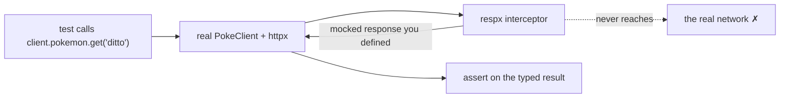

# 01: Testing with respx

> **Level:** Intermediate · **Prerequisites:** Section 05
> **Time:** ~1.5 hours · **Verified:** 2026-06-04 (pytest 9.0.3, respx 0.23.1)

## Why this matters

You must *not* hit the real API in your test suite — it's slow, flaky, rate-limited, and may need secrets, making tests unreliable and CI painful. Yet you still want to test the *real* client code, not a fake. **respx** squares this circle: it intercepts httpx requests and returns responses *you* define, so the genuine `PokeClient` runs end to end against a scripted server. Fast, deterministic, offline — and able to simulate failures (404, 503, rate limits) that are hard to trigger for real.

## Install the test tools

```bash
pip install pytest respx pytest-asyncio
```

These are dev-only — they belong in your `pyproject.toml`'s optional `dev` extras, not the runtime `dependencies` (Section 08), because users of your SDK don't need them.

## The core idea: intercept, don't connect



The client code under test is 100% real — only the *transport* is swapped for a scripted one. That's exactly the right seam: you test your auth, parsing, error mapping, and retry logic, without depending on PokéAPI being up.

## A first test: the happy path

```python
# tests/test_client.py
import httpx
import respx
from pokesdk import PokeClient

DITTO = {"id": 132, "name": "ditto", "height": 3, "weight": 40,
         "types": [{"slot": 1, "type": {"name": "normal", "url": "..."}}]}

@respx.mock                                            # activate interception for this test
def test_get_pokemon_parses_model():
    respx.get("https://pokeapi.co/api/v2/pokemon/ditto").mock(
        return_value=httpx.Response(200, json=DITTO)   # the scripted reply
    )

    with PokeClient() as client:
        result = client.pokemon.get("ditto")           # real client, mocked transport

    assert result.name == "ditto"                      # assert on the typed model
    assert result.types[0].type.name == "normal"
```

- `@respx.mock` turns on interception for the test and asserts no *unmocked* request escapes.
- `respx.get(url).mock(return_value=...)` scripts the response for that URL.
- The assertions check the **typed `Pokemon`**, so this one test covers the request path *and* the Pydantic parsing.

## Testing the error path (the bit you can't easily do for real)

Triggering a 404 against the live API means knowing a name that doesn't exist; triggering a 500 is nearly impossible on demand. With respx it's one line — and we assert the SDK raised the *right typed exception*:

```python
import pytest
from pokesdk import NotFoundError, AuthenticationError

@respx.mock
def test_404_raises_not_found():
    respx.get("https://pokeapi.co/api/v2/pokemon/nope").mock(return_value=httpx.Response(404))
    with PokeClient() as client:
        with pytest.raises(NotFoundError) as exc:      # assert the exception type
            client.pokemon.get("nope")
    assert exc.value.status_code == 404                # and its carried context

@respx.mock
def test_401_raises_authentication_error():
    respx.get("https://pokeapi.co/api/v2/pokemon/ditto").mock(return_value=httpx.Response(401))
    with PokeClient(api_key="bad") as client:
        with pytest.raises(AuthenticationError):
            client.pokemon.get("ditto")
```

This is where mocking earns its keep: you can exhaustively test your error hierarchy (every status → its exception) deterministically, which would be flaky or impossible against a real server.

## Asserting on the *outgoing* request (auth headers)

respx records the requests it intercepted, so you can verify the SDK *sent* the right thing — e.g. that the API key became a Bearer header:

```python
@respx.mock
def test_api_key_sent_as_bearer():
    route = respx.get("https://pokeapi.co/api/v2/pokemon/ditto").mock(
        return_value=httpx.Response(200, json=DITTO)
    )
    with PokeClient(api_key="secret-123") as client:
        client.pokemon.get("ditto")

    sent = route.calls.last.request                    # inspect what was sent
    assert sent.headers["authorization"] == "Bearer secret-123"
```

## Testing retries deterministically

The retry logic was hard to demonstrate live (we needed a flaky server). With respx you script a *sequence* of responses via `side_effect`, and monkeypatch the sleep so the test is instant:

```python
# tests/test_retries.py
from pokesdk import PokeClient, ServerError

@respx.mock
def test_retries_then_succeeds(monkeypatch):
    monkeypatch.setattr(PokeClient, "_sleep", lambda self, attempt: None)   # no real waiting

    route = respx.get("https://pokeapi.co/api/v2/pokemon/ditto").mock(
        side_effect=[
            httpx.Response(503),                # attempt 0 → retry
            httpx.Response(503),                # attempt 1 → retry
            httpx.Response(200, json=DITTO),    # attempt 2 → success
        ]
    )
    with PokeClient(max_retries=2) as client:
        result = client.pokemon.get("ditto")

    assert result.name == "ditto"
    assert route.call_count == 3                # proves it retried exactly twice
```

Two things to notice:

- **`side_effect=[...]`** returns each response in turn — perfect for "fail, fail, succeed."
- **Monkeypatching `_sleep`** is why we isolated sleeping into its own method (Section 05). The test runs in milliseconds instead of waiting 1.5s for real backoff. `route.call_count == 3` is the assertion that the retry loop actually looped.

The give-up path is just as easy: mock a constant 503 and assert it raises `ServerError` after `max_retries + 1` calls.

## Verified: the suite runs green and fast

Running the real `pokesdk` test suite:

```text
tests/test_async.py::test_async_get PASSED                        [ 11%]
tests/test_async.py::test_async_list_all PASSED                   [ 22%]
tests/test_client.py::test_get_pokemon_parses_model PASSED        [ 33%]
tests/test_client.py::test_404_raises_not_found PASSED            [ 44%]
tests/test_client.py::test_api_key_sent_as_bearer PASSED          [ 55%]
tests/test_client.py::test_401_raises_authentication_error PASSED [ 66%]
tests/test_pagination.py::test_list_all_walks_pages PASSED        [ 77%]
tests/test_retries.py::test_retries_then_succeeds PASSED          [ 88%]
tests/test_retries.py::test_gives_up_after_max_retries PASSED     [100%]

============================== 9 passed in 0.21s ===============================
```

Nine tests covering parsing, errors, auth, pagination, and retries — in **0.21 seconds**, with **no network**. That's a suite you'll happily run on every commit.

## Recap & next

- ✅ Never hit the real API in tests — **mock the transport** with `respx` so the real client runs against scripted responses: fast, deterministic, offline.
- ✅ `@respx.mock` + `respx.get(url).mock(return_value=httpx.Response(...))` scripts replies; `side_effect=[...]` scripts a sequence (for retries).
- ✅ Mocking lets you test the hard paths — every error status, retry-then-success — that are flaky or impossible to trigger live.
- ✅ Inspect `route.calls.last.request` to assert what the SDK *sent* (e.g. auth headers); monkeypatch `_sleep` to make retry tests instant.
- ✅ Self-check: why mock instead of calling the real API? How do you test "fails twice then succeeds"?

→ Next: **[02 · Fixtures, async tests & coverage](02_fixtures_and_coverage.md)** — cleaner tests, async testing, and measuring gaps.

## Exercises

1. **Test pagination.** Write a respx test that mocks two pages (`next` URL on page 1, `null` on page 2) and asserts `list(client.pokemon.list_all())` returns the items from both pages in order.

<details><summary>Solution</summary>

```python
@respx.mock
def test_list_all_walks_pages():
    base = "https://pokeapi.co/api/v2"
    page1 = {"count": 3, "next": f"{base}/pokemon?offset=2&limit=2", "previous": None,
             "results": [{"name": "bulbasaur", "url": f"{base}/pokemon/1/"},
                         {"name": "ivysaur", "url": f"{base}/pokemon/2/"}]}
    page2 = {"count": 3, "next": None, "previous": f"{base}/pokemon?offset=0&limit=2",
             "results": [{"name": "venusaur", "url": f"{base}/pokemon/3/"}]}
    respx.get(f"{base}/pokemon").mock(
        side_effect=[httpx.Response(200, json=page1), httpx.Response(200, json=page2)])
    with PokeClient() as client:
        names = [p.name for p in client.pokemon.list_all(limit=2)]
    assert names == ["bulbasaur", "ivysaur", "venusaur"]
```

`side_effect` serves page1 then page2; the generator follows `next` until it's `None`. This is the exact deterministic pagination test in the capstone.
</details>

2. **Test give-up.** Write the test where the server always returns 500 and assert the SDK raises `ServerError` after exactly `max_retries + 1` calls.

<details><summary>Solution</summary>

```python
@respx.mock
def test_gives_up_after_max_retries(monkeypatch):
    monkeypatch.setattr(PokeClient, "_sleep", lambda self, a: None)
    route = respx.get("https://pokeapi.co/api/v2/pokemon/ditto").mock(
        return_value=httpx.Response(500))
    with PokeClient(max_retries=2) as client:
        with pytest.raises(ServerError):
            client.pokemon.get("ditto")
    assert route.call_count == 3      # initial + 2 retries
```

`return_value` (not `side_effect`) gives the same 500 every time; the loop exhausts `max_retries` and raises. `call_count == 3` confirms the attempt count.
</details>

3. **Why monkeypatch `_sleep`?** What happens to the retry tests if you *don't* patch it, and what does that reveal about designing for testability?

<details><summary>Solution</summary>

Without patching, each retry actually `time.sleep`s the backoff (0.5s, 1.0s, …), so the two retry tests would take ~1.5s+ each — slow, and slowing the whole suite. Patching `_sleep` to a no-op keeps them in milliseconds. The lesson: isolating side-effecting bits (sleeping, time, randomness) into small overridable methods makes code *testable*. We split out `_sleep` in Section 05 partly for exactly this — testability is a design input, not an afterthought.
</details>
