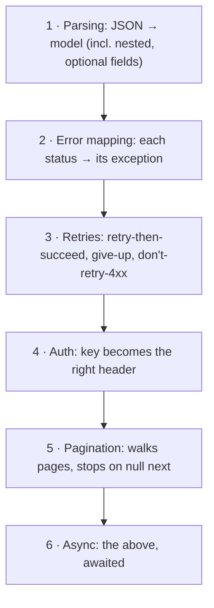

# 02: Fixtures, async tests & coverage

> **Level:** Intermediate · **Prerequisites:** [01 · Testing with respx](01_testing_with_respx.md)
> **Time:** ~1 hour · **Verified:** 2026-06-04 (pytest 9.0.3, pytest-asyncio 1.4.0, pytest-cov)

## Why this matters

Three things turn a pile of tests into a maintainable suite: **fixtures** (shared, reusable test data and setup), **async test support** (so the async client is tested too), and **coverage** (an honest measure of what your tests actually exercise). This module rounds out the testing story so your SDK is trustworthy to change.

## Fixtures: shared setup without copy-paste

The sample payload (`DITTO`) was repeated across tests in the last module. A pytest **fixture** defines it once; tests request it by naming it as a parameter. Put shared fixtures in `tests/conftest.py` (pytest finds it automatically):

```python
# tests/conftest.py
import pytest

DITTO = {
    "id": 132, "name": "ditto", "height": 3, "weight": 40, "base_experience": 101,
    "types": [{"slot": 1, "type": {"name": "normal", "url": "https://pokeapi.co/api/v2/type/1/"}}],
    "stats": [{"base_stat": 48, "stat": {"name": "hp", "url": "https://pokeapi.co/api/v2/stat/1/"}}],
}

@pytest.fixture
def ditto():
    return DITTO
```

Any test that wants the payload just takes `ditto` as an argument:

```python
@respx.mock
def test_get_pokemon_parses_model(ditto):                  # ← fixture injected
    respx.get("https://pokeapi.co/api/v2/pokemon/ditto").mock(
        return_value=httpx.Response(200, json=ditto)
    )
    with PokeClient() as client:
        assert client.pokemon.get("ditto").id == 132
```

pytest sees the `ditto` parameter, runs the fixture, and passes its return value in. Change the sample data in one place and every test updates. Fixtures can also manage setup/teardown (e.g. a client instance), using `yield` to clean up after — the same pattern as your client's context manager.

## Testing the async client

Async tests need an event loop to run the coroutine. `pytest-asyncio` provides it. Your `pyproject.toml` already sets `asyncio_mode = "auto"` (Section 08), which means any `async def test_...` is automatically treated as an async test — no decorator needed:

```python
# tests/test_async.py
import httpx
import respx
from pokesdk import AsyncPokeClient

@respx.mock
async def test_async_get(ditto):                           # async def + fixture
    respx.get("https://pokeapi.co/api/v2/pokemon/ditto").mock(
        return_value=httpx.Response(200, json=ditto)
    )
    async with AsyncPokeClient() as client:                # async with
        result = await client.pokemon.get("ditto")         # await
    assert result.name == "ditto"
```

respx mocks **both** httpx's sync and async transports, so the *same* mocking style works for the async client. Testing async pagination uses an async comprehension:

```python
@respx.mock
async def test_async_list_all():
    base = "https://pokeapi.co/api/v2"
    page = {"count": 1, "next": None, "previous": None,
            "results": [{"name": "ditto", "url": f"{base}/pokemon/132/"}]}
    respx.get(f"{base}/pokemon").mock(return_value=httpx.Response(200, json=page))
    async with AsyncPokeClient() as client:
        names = [p.name async for p in client.pokemon.list_all()]   # async for
    assert names == ["ditto"]
```

> Without `asyncio_mode = "auto"` you'd mark each async test with `@pytest.mark.asyncio`. The auto mode just saves the decorator — pick whichever your team prefers and set it in `pyproject.toml`.

## Coverage: measure what you actually test

`pytest-cov` reports which lines ran during the suite — turning "I think it's tested" into a number, and pointing at the lines you missed:

```bash
pip install pytest-cov
pytest --cov=pokesdk --cov-report=term-missing
```

**Real output from the `pokesdk` suite:**

```text
Name                          Stmts   Miss  Cover   Missing
-----------------------------------------------------------
src/pokesdk/__init__.py           6      0   100%
src/pokesdk/_base.py             29      3    90%   59, 64, 68
src/pokesdk/_version.py           1      0   100%
src/pokesdk/async_client.py      47     11    77%   68-73, 78-83
src/pokesdk/client.py            50      7    86%   70-75, 89
src/pokesdk/exceptions.py        29      4    86%   23-24, 65, 68
src/pokesdk/models.py            27      0   100%
src/pokesdk/pagination.py        22      0   100%
-----------------------------------------------------------
TOTAL                           211     25    88%
```

How to *read* this rather than chase a number:

- **88% total** with 9 small tests is solid for an SDK. The core paths (models, pagination, the public API) are at 100%.
- **`async_client.py` at 77%** — the `Missing` column points at lines `68-73, 78-83`: the async **retry and connection-error branches**. We tested async get/list but not async retries. That's a real, specific gap the report surfaced — add an async retry test to close it.
- **`exceptions.py` lines 23-24, 65, 68** — the `PokeConnectionError.__init__` body and a couple of `error_from_response` branches (e.g. the generic-4xx fallback) we didn't trigger.

> **Coverage is a flashlight, not a goal.** 100% coverage doesn't mean bug-free (you can execute a line with a useless assertion), and chasing the last few percent often tests trivia. Use the `Missing` column to find *meaningful* untested paths — here, async retries — and judge whether they're worth a test. They usually are for the risky bits (retries, errors); rarely for a one-line `__init__`.

## What's worth testing in an SDK (priority order)



These are the behaviours users depend on and the ones most likely to break in a refactor. The `pokesdk` suite hits 1–6; the coverage report tells you where 3 and 6 overlap is thin (async retries) so you know what to add next.

## Recap & next

- ✅ **Fixtures** (`conftest.py`) define shared test data/setup once; tests request them by parameter name. Use `yield` for teardown.
- ✅ **`pytest-asyncio`** (`asyncio_mode = "auto"`) runs `async def` tests; respx mocks both sync and async transports identically.
- ✅ **`pytest-cov`** with `term-missing` shows untested lines — read the `Missing` column to find *meaningful* gaps (here: async retries), don't chase 100%.
- ✅ Prioritise testing parsing, error mapping, retries, auth, pagination, and their async twins.
- ✅ Self-check: where do shared fixtures live? What did the coverage report reveal was under-tested, and why does that matter?

→ Next: **[Section 99 · The complete pokesdk project](../99_project_pokesdk/README.md)** — read and run the whole package end to end. Then **[Section 08](../08_packaging_publishing/README.md)** publishes it.

## Exercises

1. **Close the async-retry gap.** Write an async test that mocks `[503, 503, 200]` and asserts the async client returns the result after 3 calls (monkeypatch `asyncio.sleep`). Re-run coverage and watch `async_client.py` climb.

<details><summary>Solution</summary>

```python
import asyncio, httpx, respx
from pokesdk import AsyncPokeClient

@respx.mock
async def test_async_retries(ditto, monkeypatch):
    async def no_sleep(_): return None
    monkeypatch.setattr(asyncio, "sleep", no_sleep)
    route = respx.get("https://pokeapi.co/api/v2/pokemon/ditto").mock(
        side_effect=[httpx.Response(503), httpx.Response(503), httpx.Response(200, json=ditto)])
    async with AsyncPokeClient(max_retries=2) as c:
        result = await c.pokemon.get("ditto")
    assert result.name == "ditto"
    assert route.call_count == 3
```

This exercises the async `_request` retry branch the report flagged (lines 68-73), pushing `async_client.py` coverage up. Patching `asyncio.sleep` keeps it instant.
</details>

2. **Fixture with teardown.** Write a `client` fixture that yields a `PokeClient` and closes it afterward, so tests don't each manage the context manager.

<details><summary>Solution</summary>

```python
import pytest
from pokesdk import PokeClient

@pytest.fixture
def client():
    c = PokeClient()
    yield c           # test runs here
    c.close()         # teardown after the test, even on failure
```

Tests then take `client` as a parameter and use it directly. The code after `yield` runs as teardown — the fixture equivalent of the client's own `__exit__`.
</details>

3. **Coverage interpretation.** Your report shows `client.py` at 86% with `89` in Missing — the line that raises `PokeConnectionError`. Is that worth a test? How would you cover it?

<details><summary>Solution</summary>

Yes — it's the connection-error path, a real failure mode users rely on. Cover it by mocking a transport error instead of a response: `respx.get(url).mock(side_effect=httpx.ConnectError("boom"))`, then `pytest.raises(PokeConnectionError)`. That executes line 89 and verifies the wrapping behaviour. (Contrast with a trivial `__repr__` line, which usually isn't worth a dedicated test.)
</details>
