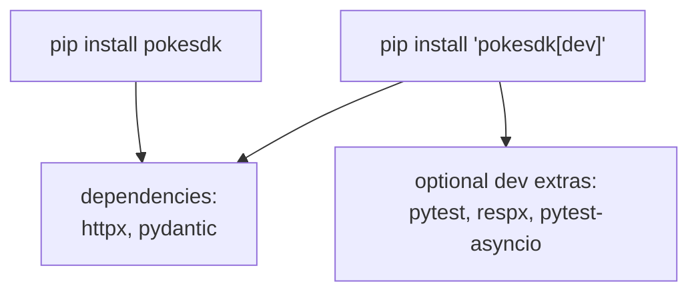

# 01: Metadata & dependencies

> **Level:** Intermediate · **Prerequisites:** [Section 02.02](../02_packaging_basics/02_pyproject_and_editable_install.md)
> **Time:** ~1 hour · **Verified:** 2026-06-04 (hatchling 1.30.1, build 1.5.0)

## Why this matters

The minimal `pyproject.toml` from Section 02 was enough to *install locally*. To *publish*, you need the metadata that appears on your PyPI page, tells pip what Python and dependencies you support, separates runtime vs dev dependencies, and ensures non-code files (like `py.typed`) actually ship. This module is the complete, release-ready `pyproject.toml` for `pokesdk`, field by field.

## The complete `pyproject.toml`

This is the capstone's actual config (verified to build and pass `twine check`):

```toml
[build-system]
requires = ["hatchling"]
build-backend = "hatchling.build"

[project]
name = "pokesdk"
version = "0.1.0"
description = "A small, typed Python client for the PokéAPI."
readme = "README.md"
requires-python = ">=3.10"
license = { text = "MIT" }
authors = [{ name = "Your Name", email = "you@example.com" }]
keywords = ["pokeapi", "sdk", "api-client", "httpx"]
classifiers = [
    "Development Status :: 3 - Alpha",
    "Intended Audience :: Developers",
    "License :: OSI Approved :: MIT License",
    "Programming Language :: Python :: 3",
    "Programming Language :: Python :: 3.10",
    "Typing :: Typed",
]
dependencies = [
    "httpx>=0.27",
    "pydantic>=2.0",
]

[project.optional-dependencies]
dev = [
    "pytest>=8",
    "pytest-asyncio>=0.23",
    "respx>=0.21",
]

[project.urls]
Homepage = "https://github.com/you/pokesdk"
Issues = "https://github.com/you/pokesdk/issues"

[tool.hatch.build.targets.wheel]
packages = ["src/pokesdk"]

[tool.pytest.ini_options]
asyncio_mode = "auto"
```

## The fields that matter for publishing

### Discoverability & display

- **`description`** — the one-liner under your package name in PyPI search results.
- **`readme = "README.md"`** — the file rendered as your PyPI front page (the long description). Markdown is auto-detected.
- **`keywords`** — search terms for PyPI.
- **`classifiers`** — a *controlled* vocabulary ([the full list](https://pypi.org/classifiers/)) describing your package. They power PyPI's filters and badges. Notable ones for an SDK:
  - `Development Status :: 3 - Alpha` — signals maturity (3=alpha, 4=beta, 5=production/stable).
  - `Typing :: Typed` — the "this package ships types" badge (complements `py.typed`, Section 04.02).
  - `License :: OSI Approved :: MIT License` and `Programming Language :: Python :: 3.10`.
  > Classifiers are validated on upload — a typo'd classifier *rejects* your release, which is a good early check.

### Compatibility & legal

- **`requires-python = ">=3.10"`** — pip refuses to install on older Pythons, so users get a clear message instead of a syntax error. Set it to the oldest version you actually test.
- **`license`** and **`authors`** — legal clarity and contact.

### `[project.urls]`

The links shown in PyPI's sidebar (Homepage, Issues, Docs, Changelog). Users and tools rely on these; always include at least a source/issues link.

### Verified: this metadata in the built artifact

After `python -m build`, the wheel's `METADATA` file contains exactly these fields — proof the config reached the artifact users download:

```text
Name: pokesdk
Version: 0.1.0
Summary: A small, typed Python client for the PokéAPI.
License: MIT
Keywords: api-client,httpx,pokeapi,sdk
Classifier: Typing :: Typed
Requires-Python: >=3.10
Requires-Dist: httpx>=0.27
Requires-Dist: pydantic>=2.0
Provides-Extra: dev
Requires-Dist: pytest>=8; extra == 'dev'
```

## Runtime vs dev dependencies — keep them separate

This distinction trips up beginners and bloats installs:



- **`dependencies`** — what your SDK needs *at runtime*. Every user gets these. Keep this list **minimal** — each one is imposed on everyone who installs you.
- **`[project.optional-dependencies] dev`** — tools only *you* need to develop/test. Installed with `pip install "pokesdk[dev]"`, never for end users.

Putting `pytest` in `dependencies` would force every user of your SDK to download a test framework they'll never run. That's why the test tools live in the `dev` extra.

### Dependency version ranges (revisited)

For a *library*, specify a **lower bound** you support and avoid upper caps unless you know a version breaks you:

- ✅ `httpx>=0.27` — "I need at least this; newer is fine."
- ⚠️ `httpx>=0.27,<0.29` — only if you've confirmed 0.29 breaks you; caps cause resolution conflicts in users' environments.
- ❌ `httpx==0.28.1` — an exact pin in a library forces a downgrade/upgrade war in the user's project. Pin exactly only in *applications*, not libraries.

## Shipping non-code files: `py.typed`

A subtle release bug: `py.typed` is not a `.py` file, so a build backend might not include it — silently un-typing your SDK for users (Section 04.02). **hatchling includes package data by default**, so a file under `src/pokesdk/` ships automatically; we verified `py.typed` is in the wheel. With **setuptools** you'd need to opt in explicitly:

```toml
# setuptools only — hatchling handles this automatically
[tool.setuptools.package-data]
pokesdk = ["py.typed"]
```

Always *verify* it shipped (next modules show how) rather than assume — a missing `py.typed` is invisible until a user's type checker complains.

## Recap & next

- ✅ Release metadata = `description`, `readme`, `keywords`, **`classifiers`** (validated vocabulary, incl. `Typing :: Typed`), `requires-python`, `license`, `[project.urls]`.
- ✅ Separate **runtime `dependencies`** (everyone gets them — keep minimal) from **`[optional-dependencies] dev`** (`pip install "pokesdk[dev]"`).
- ✅ Libraries use **lower-bound** version ranges; avoid exact pins and unjustified upper caps.
- ✅ Ensure data files like **`py.typed`** are packaged (automatic with hatchling; explicit `package-data` with setuptools) — and verify.
- ✅ Self-check: why keep `pytest` out of `dependencies`? Why is `httpx==0.28.1` wrong for a library?

→ Next: **[02 · Versioning & changelog](02_versioning_and_changelog.md)** — choosing version numbers that don't surprise your users.

## Exercises

1. **Find a wrong classifier.** Add `"Programming Language :: Python :: 4.0"` (doesn't exist) to classifiers and run `python -m build` then `twine check`. What happens, and why is that validation useful?

<details><summary>Solution</summary>

`twine check` (and PyPI on upload) rejects unknown classifiers. The build may succeed, but `twine check`/upload fails with an "invalid classifier" error. This validation catches typos *before* a broken release reaches users — a free correctness gate. Remove the bogus classifier to fix.
</details>

2. **Add a docs URL.** Add a `Documentation` entry to `[project.urls]` pointing at a Read the Docs page, rebuild, and confirm it appears in the wheel METADATA as a `Project-URL`.

<details><summary>Solution</summary>

```toml
[project.urls]
Homepage = "https://github.com/you/pokesdk"
Documentation = "https://pokesdk.readthedocs.io"
Issues = "https://github.com/you/pokesdk/issues"
```

After `python -m build`, the METADATA shows `Project-URL: Documentation, https://pokesdk.readthedocs.io`, and PyPI renders it as a sidebar link. URLs are how users find your docs/source from the PyPI page.
</details>

3. **Classify maturity.** Your SDK is now stable and you're releasing 1.0.0. Which `Development Status` classifier should you switch to, and what does it signal to users?

<details><summary>Solution</summary>

`Development Status :: 5 - Production/Stable` (from `3 - Alpha`). It signals the public API is considered stable and suitable for production — consistent with a 1.0.0 release under semantic versioning (next module). Setting it honestly matters: users filter PyPI by maturity, and an "alpha" label on a 1.0 release sends mixed messages.
</details>
