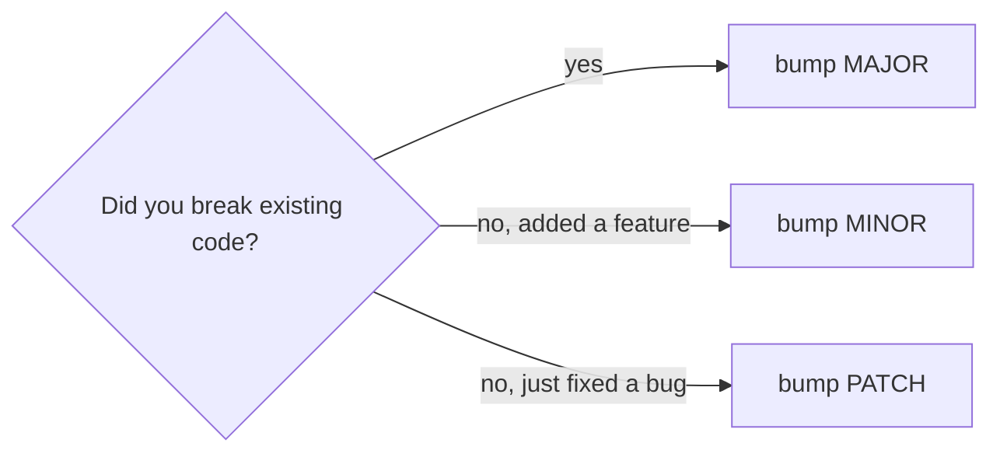
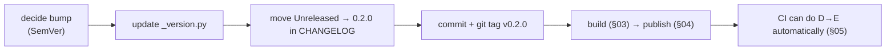

# 02: Versioning & changelog

> **Level:** Intermediate · **Prerequisites:** [01 · Metadata & dependencies](01_pyproject_metadata_deps.md)
> **Time:** ~1 hour · **Verified:** 2026-06-04

## Why this matters

Recall Section 01: your public API is a **contract**. A version number is how you tell users, in one glance, whether upgrading is safe. Get versioning wrong and an innocuous `pip install -U` breaks someone's production system without warning. This module covers **semantic versioning** (the rules everyone expects), where the version number should live (one source of truth), and the **changelog** that documents what changed.

## Semantic Versioning (SemVer)

A version is `MAJOR.MINOR.PATCH` (e.g. `1.4.2`), and each part has a *meaning* you promise to honour:

| Bump | When | Example | Safe to auto-upgrade? |
|------|------|---------|----------------------|
| **PATCH** (`0.1.0→0.1.1`) | backwards-compatible bug fix | fix a retry edge case | ✅ yes |
| **MINOR** (`0.1.0→0.2.0`) | backwards-compatible new feature | add `client.berries` | ✅ yes |
| **MAJOR** (`0.1.0→1.0.0`) | a **breaking** change | rename `PokeClient`→`Client` | ❌ no — read the changelog |



The contract this creates: a user can safely write `pokesdk>=1.4,<2` in *their* project, confident that any `1.x` upgrade won't break them — because you promised MAJOR is the only place breaks happen. SemVer only works if you're disciplined about it.

### What counts as "breaking"?

For an SDK, breaking changes are the ones that touch your **public API** (the things in `__all__`, Section 02.03):

- Renaming/removing a public class, method, or exception.
- Changing a method signature (removing a parameter, reordering positionals).
- Removing a field from a response model, or renaming one.
- Changing exception types raised for a given condition.

*Not* breaking (so MINOR/PATCH): adding a new method, adding an *optional* parameter, adding a new model field, fixing a bug, internal refactors (that `_private` code you kept free to change — this is the payoff).

### The `0.x` special case

Before `1.0.0`, SemVer allows breaking changes in **MINOR** bumps (`0.1→0.2` may break). `0.x` means "still stabilising — no stability promise yet." Our SDK is `0.1.0` for exactly this reason. Releasing `1.0.0` is a commitment: "the public API is stable; I'll only break it in `2.0.0`." Don't release `1.0` until you mean it.

## One source of version truth

The version appears in several places (the package's `__version__`, `pyproject.toml`, git tags). If they drift, users get confused. Keep **one** canonical source. Our SDK puts it in `_version.py`:

```python
# src/pokesdk/_version.py
__version__ = "0.1.0"
```

re-exported as the public `pokesdk.__version__` (Section 02.03). Two common ways to keep `pyproject.toml` in sync:

1. **Manual** (what the capstone does): the same string in `pyproject.toml`'s `version` and `_version.py`. Simple; just remember to bump both.
2. **Dynamic** (one source, automated): tell the build backend to read the version *from* the code or a git tag:

```toml
# hatchling: read version from the module, so _version.py is the only place
[project]
dynamic = ["version"]

[tool.hatch.version]
path = "src/pokesdk/_version.py"
```

With this, `__version__` in `_version.py` is the single source; the build backend injects it into the package metadata. (`hatch-vcs` can even derive it from git tags, so tagging `v0.2.0` *is* the version bump.) Pick manual for simplicity now; dynamic scales better as releases get frequent.

> **Why users care about `__version__`:** they include it in bug reports, gate features on it, and log it. Exposing `pokesdk.__version__` is expected of a real SDK.

## The changelog

A version number says *whether* something changed; the **changelog** says *what*. Keep a `CHANGELOG.md` in the [Keep a Changelog](https://keepachangelog.com/) format — grouped by version, newest first, with `Added`/`Changed`/`Fixed`/`Removed` sections:

```markdown
# Changelog

## [Unreleased]

## [0.1.0] - 2026-06-04
### Added
- Synchronous `PokeClient` and asynchronous `AsyncPokeClient`.
- `client.pokemon.get(...)` returning a typed `Pokemon`.
- Pagination, retries with backoff, typed exception hierarchy.
```

Discipline that makes it useful:

- **Maintain an `[Unreleased]` section** as you work; on release, rename it to the new version + date. (You're never scrambling to remember what changed.)
- **Call out breaking changes loudly** under the MAJOR version — this is the document a user reads before a major upgrade.
- **Write for the user**, not the commit log: "Added `client.berries`" not "refactor resource base class."

This is exactly the file in the capstone (`99_project_pokesdk/CHANGELOG.md`), and linking it from `[project.urls]` puts it one click from your PyPI page.

## A release, end to end (preview)

The version/changelog discipline feeds the release flow (next modules):



## Recap & next

- ✅ **SemVer**: PATCH = safe fix, MINOR = safe feature, MAJOR = breaking. Breaking = anything that changes the **public API**.
- ✅ `0.x` allows breaks in MINOR (still stabilising); release `1.0.0` only when you'll honour stability.
- ✅ Keep **one source of version truth** (`_version.py`), exposed as `pokesdk.__version__`; optionally make the build read it dynamically.
- ✅ Maintain a **changelog** (Keep a Changelog format), with a live `[Unreleased]` section and loud breaking-change notes; link it from PyPI.
- ✅ Self-check: which bump for "added `client.berries`"? For "renamed `PokeClient`"? Why does SemVer let users pin `>=1.4,<2`?

→ Next: **[03 · Building wheels & sdists](03_building_wheels.md)** — turning the project into uploadable artifacts.

## Exercises

1. **Classify the bumps.** For each change, give the SemVer bump (assume you're at 1.2.3 and post-1.0): (a) fix a bug in pagination; (b) add `client.moves`; (c) remove the deprecated `timeout_seconds` alias; (d) add an optional `retries=` arg to `get`.

<details><summary>Solution</summary>

(a) PATCH → 1.2.4 (backwards-compatible fix). (b) MINOR → 1.3.0 (new feature, nothing breaks). (c) MAJOR → 2.0.0 (removing a public name breaks callers using it). (d) MINOR → 1.3.0 (adding an *optional* arg is backwards-compatible — existing calls still work). The rule: did existing user code break? Only (c) did.
</details>

2. **Set up dynamic versioning.** Convert the capstone to read its version from `_version.py` via hatchling, so you only edit one file to bump. Verify `python -m build` produces the right version.

<details><summary>Solution</summary>

```toml
[project]
dynamic = ["version"]      # remove the static `version = "0.1.0"` line
# ...
[tool.hatch.version]
path = "src/pokesdk/_version.py"
```

Now bumping is editing `__version__ = "0.2.0"` in `_version.py` alone; `python -m build` reads it and stamps the wheel `pokesdk-0.2.0-...`. One source of truth, no drift between code and metadata.
</details>

3. **Why not just always bump MAJOR to be safe?** A teammate suggests bumping MAJOR on every release "so we never surprise anyone." Why is that bad?

<details><summary>Solution</summary>

It destroys the *information* SemVer carries. If every release is MAJOR, users can't tell a bug fix from a breaking change, so they must treat *every* upgrade as risky — reading the full changelog and re-testing each time, or never upgrading. SemVer's value is that MINOR/PATCH are *safe* by promise, enabling `>=1.4,<2` pins and confident auto-upgrades. Bumping MAJOR needlessly also blows past version numbers meaninglessly. Bump to match what actually changed.
</details>
