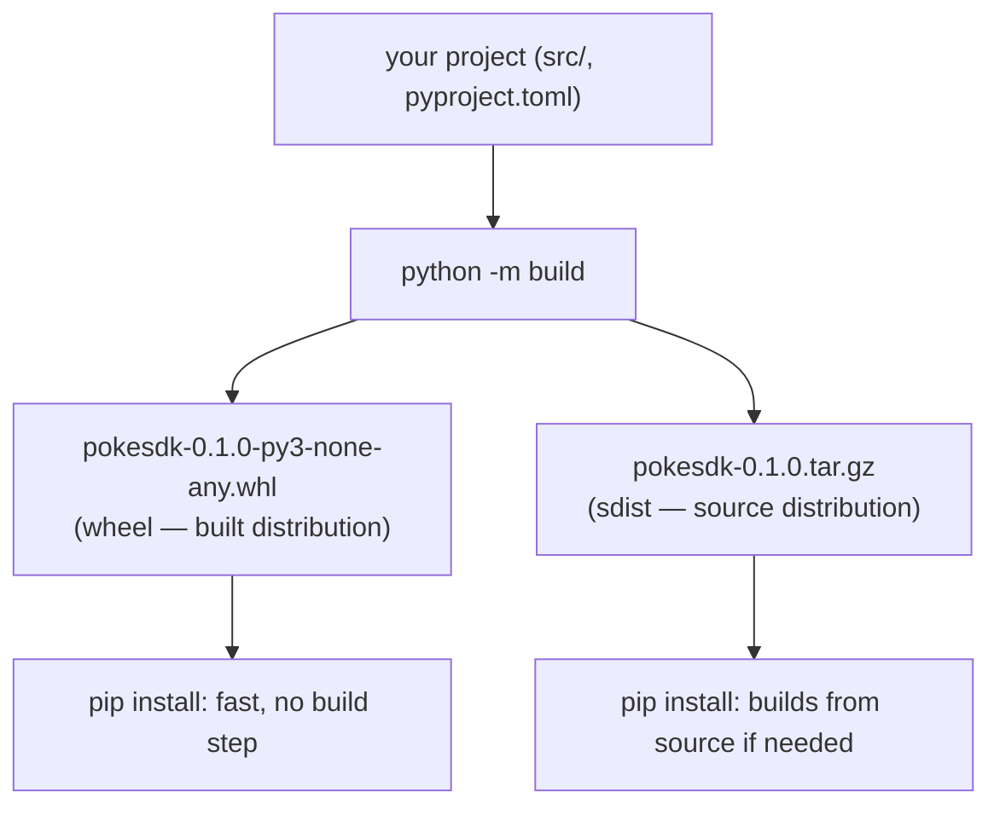

# 03: Building wheels & sdists

> **Level:** Intermediate · **Prerequisites:** [01 · Metadata](01_pyproject_metadata_deps.md)
> **Time:** ~50 min · **Verified:** 2026-06-04 (build 1.5.0, uv 0.11.19)

## Why this matters

PyPI doesn't host your source tree — it hosts **distribution artifacts**: a *wheel* and an *sdist*. Building them is a distinct step from the editable install you've been using (Section 02): `pip install -e .` linked your source; `python -m build` produces the actual files users download. This module builds them, explains the two formats, and — crucially — shows how to *inspect* them so you ship the right files (not, say, a wheel missing `py.typed`).

## Two artifacts: wheel and sdist



| Artifact | What it is | Why it exists |
|----------|-----------|---------------|
| **Wheel** (`.whl`) | a pre-built, ready-to-install zip; pip just unpacks it | fast installs, no build tools needed on the user's machine |
| **sdist** (`.tar.gz`) | your source + `pyproject.toml`, packaged | a buildable fallback (e.g. odd platforms) and the canonical source archive |

You publish **both**. Wheels make the common install fast; the sdist guarantees anyone can rebuild from source. (`py3-none-any` in the wheel name means: pure Python, any interpreter, any platform — true for our SDK since it has no compiled code.)

## Build them

Install the build frontend once, then build:

```bash
pip install build
python -m build
```

**Verified output:**

```text
* Creating isolated environment: venv+pip...
* Installing packages in isolated environment:
  - hatchling
* Getting build dependencies for wheel...
* Building wheel...
Successfully built pokesdk-0.1.0.tar.gz and pokesdk-0.1.0-py3-none-any.whl
```

```text
$ ls dist/
pokesdk-0.1.0-py3-none-any.whl   pokesdk-0.1.0.tar.gz
```

Note "Creating isolated environment" — `build` makes a clean throwaway env, installs *only* your declared build backend (hatchling), and builds there. This catches a common bug: if your build secretly depended on something only *you* have installed, the isolated build fails — just like it would on a user's machine or in CI.

## Inspect the wheel — trust but verify

A wheel is just a zip. **Always look inside** before publishing — this is how you catch a missing `py.typed` or accidentally-shipped tests:

```python
import zipfile
z = zipfile.ZipFile("dist/pokesdk-0.1.0-py3-none-any.whl")
print("\n".join(z.namelist()))
```

**Verified contents:**

```text
pokesdk/__init__.py
pokesdk/_base.py
pokesdk/_version.py
pokesdk/async_client.py
pokesdk/client.py
pokesdk/exceptions.py
pokesdk/models.py
pokesdk/pagination.py
pokesdk/py.typed                 ← the type marker shipped ✅
pokesdk-0.1.0.dist-info/METADATA
pokesdk-0.1.0.dist-info/WHEEL
pokesdk-0.1.0.dist-info/RECORD
```

Two things to check every time:

- ✅ **`py.typed` is present** — if it's missing, your SDK is silently untyped for users (Section 04.02). This is the #1 packaging bug for typed SDKs.
- ✅ **No `tests/`** — tests live outside `src/pokesdk/` (Section 02.01), so they're correctly excluded. Shipping them bloats installs and leaks fixtures.

## Validate metadata with `twine check`

Before uploading, `twine check` validates that your metadata and README will render correctly on PyPI (a malformed README is a common, embarrassing failure):

```bash
pip install twine
python -m twine check dist/*
```

**Verified output:**

```text
Checking dist/pokesdk-0.1.0-py3-none-any.whl: PASSED
Checking dist/pokesdk-0.1.0.tar.gz: PASSED
```

`PASSED` means the long description (your README) renders and the metadata is well-formed. Run this in CI too (Section 05) so a broken README never reaches PyPI.

## The same build with `uv`

`uv` builds the identical artifacts, faster, with one command (no separate frontend install):

```bash
uv build
```

**Verified output:**

```text
Building source distribution...
Building wheel from source distribution...
Successfully built dist/pokesdk-0.1.0.tar.gz
Successfully built dist/pokesdk-0.1.0-py3-none-any.whl
```

Same `pyproject.toml`, same backend (hatchling), same outputs — `uv` is just a faster frontend. Use whichever your team prefers; the artifacts are interchangeable.

## Clean rebuilds

`dist/` accumulates old versions, and a stale build can confuse you (or get uploaded by accident). Clear it before a release build:

```bash
rm -rf dist/ && python -m build
```

(`build` doesn't clean by default.) A `.gitignore` entry for `dist/` and `*.egg-info/` keeps build artifacts out of version control.

## Recap & next

- ✅ Publishing needs **two artifacts**: a **wheel** (`.whl`, pre-built, fast install) and an **sdist** (`.tar.gz`, buildable source). Ship both.
- ✅ `python -m build` builds them in an **isolated env** (catches hidden build deps); `uv build` does the same, faster.
- ✅ **Inspect the wheel** (`zipfile.namelist()`): confirm `py.typed` is in and `tests/` is out — the two most common packaging bugs.
- ✅ `twine check dist/*` validates metadata + README rendering before upload.
- ✅ `rm -rf dist/` before a release build to avoid shipping stale files.
- ✅ Self-check: difference between a wheel and an sdist? What two things do you verify in the wheel's file list?

→ Next: **[04 · Publishing to PyPI](04_publishing_to_pypi.md)** — uploading, TestPyPI first.

## Exercises

1. **Catch a missing marker.** Temporarily rename `src/pokesdk/py.typed`, rebuild, and inspect the wheel. Confirm the marker is gone, then restore it and rebuild. Why is inspecting the wheel more reliable than assuming the config is right?

<details><summary>Solution</summary>

With `py.typed` renamed, the wheel's file list no longer contains `pokesdk/py.typed` — and nothing *errors*, which is exactly the danger: the broken release would install fine and only fail users' type checkers silently. Inspecting the artifact catches what the build won't complain about. Restore the file and rebuild; the marker reappears. "Verify the output, don't trust the config" is the habit that prevents silent release bugs.
</details>

2. **Read the sdist.** Extract `pokesdk-0.1.0.tar.gz` and list its contents. What's in the sdist that's *not* in the wheel, and why?

<details><summary>Solution</summary>

```bash
tar tzf dist/pokesdk-0.1.0.tar.gz
```

The sdist includes the *source layout* and build inputs — `pyproject.toml`, `README.md`, `src/pokesdk/...`, often `PKG-INFO` — because it must be *buildable* from scratch. The wheel omits `pyproject.toml`/`README` source and contains only the installable `pokesdk/` package plus `.dist-info` metadata, because it's already built. The sdist is "how to make it"; the wheel is "the made thing."
</details>

3. **Isolated build value.** Suppose your build accidentally relied on `hatch-vcs` (which you have installed but didn't declare in `[build-system].requires`). How would `python -m build` reveal the mistake, where a plain `pip install -e .` might not?

<details><summary>Solution</summary>

`python -m build` builds in an **isolated environment** containing *only* the declared `requires`. If your build needs `hatch-vcs` but it's not listed, the isolated build fails with a missing-module error — reproducing what a user/CI would hit. A local `pip install -e .` might succeed because your everyday environment happens to have `hatch-vcs` installed, masking the missing declaration. Isolation makes "works on my machine" failures surface at build time.
</details>
