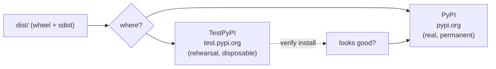
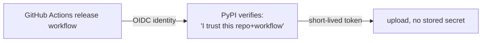

# 04: Publishing to PyPI

> **Level:** Intermediate · **Prerequisites:** [03 · Building wheels & sdists](03_building_wheels.md)
> **Time:** ~1 hour · **Verified:** 2026-06-04 (twine 6.2.0) — *build & `twine check` were run here; the actual upload requires your own account and is shown as exact commands, clearly marked.*

## Why this matters

This is the moment your SDK becomes `pip install pokesdk` for the world. The mechanics are simple, but the *order* matters: publish to **TestPyPI first** to rehearse safely, because **a real PyPI release is permanent** — you cannot re-upload the same version, ever. This module walks the safe path: accounts, tokens (or trusted publishing), TestPyPI dry-run, then the real thing.

> **What's verified vs instructional:** building and `twine check` were executed in the course environment (previous module). The `twine upload` steps need *your* PyPI account, so they're given as exact, correct commands you run yourself — not executed here. They're marked **(you run this)**.

## The publishing landscape



- **[TestPyPI](https://test.pypi.org)** — a separate, throwaway index for rehearsing uploads. Mistakes here don't matter.
- **[PyPI](https://pypi.org)** — the real index. **Immutable**: once `pokesdk 0.1.0` is uploaded, that version is forever; fixing a mistake means releasing `0.1.1`.

## One-time setup

1. **Create accounts** on both [pypi.org](https://pypi.org/account/register/) and [test.pypi.org](https://test.pypi.org/account/register/) (separate accounts).
2. **Enable 2FA** (required by PyPI).
3. **Get an API token** (the modern auth method — never your password):
   - PyPI → Account settings → *API tokens* → create one (scope it to the project after first upload).
   - The token looks like `pypi-AgEI...`. Treat it like a password.

## Authenticate without leaking the token

Don't paste the token on the command line (it lands in shell history). Use a `~/.pypirc` file or environment variables. With `twine`, the username is the literal `__token__` and the password is the token:

```ini
# ~/.pypirc  (chmod 600 this file)
[testpypi]
  username = __token__
  password = pypi-AgENdGVzdC5weXBp...        # your TestPyPI token

[pypi]
  username = __token__
  password = pypi-AgEIcHlwaS5vcmc...          # your PyPI token
```

Or per-invocation via env vars (handy in scripts):

```bash
export TWINE_USERNAME=__token__
export TWINE_PASSWORD=pypi-AgEI...
```

## Step 1 — Rehearse on TestPyPI **(you run this)**

```bash
rm -rf dist/ && python -m build          # fresh artifacts (verified earlier)
python -m twine check dist/*             # validate (verified: PASSED)
python -m twine upload --repository testpypi dist/*
```

Then verify it actually installs *from* TestPyPI in a clean environment:

```bash
python -m venv /tmp/verify && source /tmp/verify/bin/activate
pip install --index-url https://test.pypi.org/simple/ \
            --extra-index-url https://pypi.org/simple/ pokesdk
python -c "import pokesdk; print(pokesdk.__version__)"   # 0.1.0
```

> The `--extra-index-url https://pypi.org/simple/` is important on TestPyPI: your *dependencies* (httpx, pydantic) usually aren't on TestPyPI, so pip falls back to real PyPI for them. This rehearses the real install while uploading only your package to the test index.

If the import works and the version is right, your release is sound.

## Step 2 — Publish to real PyPI **(you run this)**

```bash
python -m twine upload dist/*            # defaults to the real PyPI
```

Now anyone can:

```bash
pip install pokesdk
```

🎉 Your SDK is live. Confirm on `https://pypi.org/project/pokesdk/` — your README renders as the page, classifiers show as badges, and `[project.urls]` appear in the sidebar (all the metadata from Module 01).

## The immutability rule — internalise it

You **cannot**:

- re-upload `0.1.0` after fixing a typo (the version is taken, forever);
- delete a version and reuse the number (a deleted version's number stays burned).

You **can** only move forward: spot a bug in `0.1.0`? Fix it, bump to `0.1.1` (Module 02), rebuild, re-upload. This is *why* TestPyPI exists and why `twine check` + a clean-env install test come *before* the real upload. Measure twice, publish once.

## Trusted Publishing (the modern, token-free way)

The current best practice — and what we'll wire up in CI next module — is **[Trusted Publishing](https://docs.pypi.org/trusted-publishers/)**: instead of storing a long-lived token, you tell PyPI to trust a specific **GitHub Actions workflow** in a specific repo. PyPI and GitHub exchange a short-lived OIDC token automatically at publish time.



Why it's better: **no token to leak, rotate, or accidentally commit.** You configure it once on PyPI (Publishing → add a trusted publisher: your repo, workflow filename, environment). For *manual* uploads from your laptop, API tokens are still fine; for *automated* CI releases, trusted publishing is the standard.

## Recap & next

- ✅ Publish to **TestPyPI first** to rehearse; a real **PyPI release is permanent and immutable** — you can only move forward with a new version.
- ✅ Authenticate with an **API token** (`username=__token__`), stored in `~/.pypirc` or env vars — never your password, never on the command line.
- ✅ Flow: `build` → `twine check` → upload to TestPyPI → **install-test in a clean venv** → upload to PyPI.
- ✅ For automated releases, prefer **Trusted Publishing** (OIDC, no stored token).
- ✅ Self-check: why TestPyPI before PyPI? What do you do if you find a bug *after* uploading `0.1.0`?

→ Next: **[05 · CI with GitHub Actions](05_ci_github_actions.md)** — test on every push and release on every tag, automatically.

## Exercises

1. **Plan a fix-after-release.** You published `0.1.0` and discover the retry backoff is too aggressive. Write the exact sequence of steps (versioning + changelog + build + publish) to ship the fix. Can you reuse `0.1.0`?

<details><summary>Solution</summary>

No — `0.1.0` is permanent. Steps: (1) fix the code; (2) bump `_version.py` to `0.1.1` (PATCH — a bug fix); (3) move the change from `[Unreleased]` to a `## [0.1.1]` section in the changelog; (4) `rm -rf dist/ && python -m build`; (5) `twine check dist/*`; (6) optionally rehearse on TestPyPI; (7) `twine upload dist/*`. Users get the fix via `pip install -U pokesdk`. The immutability is why the version bump is mandatory.
</details>

2. **Spot the auth mistake.** A teammate runs `twine upload -u myusername -p hunter2 dist/*`. Name two problems.

<details><summary>Solution</summary>

(1) **Password auth is rejected** — PyPI requires API tokens (or trusted publishing), not account passwords, for uploads. The username must be `__token__` and the password the token. (2) **The secret is on the command line**, so it's saved in shell history and may appear in process listings/logs — a leak. Use `~/.pypirc` (chmod 600) or `TWINE_USERNAME`/`TWINE_PASSWORD` env vars with a token.
</details>

3. **Why the extra-index-url on TestPyPI?** Installing from TestPyPI without `--extra-index-url https://pypi.org/simple/` often fails to resolve `httpx`/`pydantic`. Why, and what does adding it do?

<details><summary>Solution</summary>

TestPyPI is a separate index that generally doesn't have your runtime dependencies (or has random stale uploads of them). Without a fallback, pip can't find `httpx`/`pydantic` and the install fails. `--extra-index-url https://pypi.org/simple/` tells pip to also look at real PyPI for anything TestPyPI lacks — so your package comes from TestPyPI while its dependencies come from the real index, faithfully rehearsing the production install.
</details>
