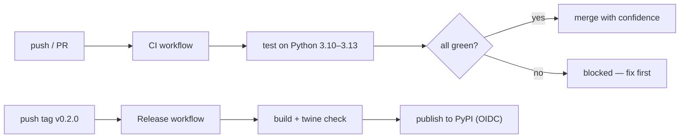

# 05: CI with GitHub Actions

> **Level:** Intermediate · **Prerequisites:** [04 · Publishing to PyPI](04_publishing_to_pypi.md)
> **Time:** ~1 hour · **Verified:** 2026-06-04 — *workflow YAML validated; the workflows run on GitHub's infrastructure, not here, so runs aren't executed in-course (clearly marked).*

## Why this matters

Publishing by hand works once. Doing it reliably, release after release, without leaking a token or forgetting to run tests, needs **automation**. This module sets up two GitHub Actions workflows: **CI** that runs your test suite on every push/PR across Python versions, and **Release** that builds and publishes to PyPI automatically when you push a version tag — using trusted publishing so there's no secret to leak. This is how every serious SDK is maintained.

> **What's verified:** the workflow files are validated as correct YAML with the expected jobs. They execute on GitHub's runners (not in this environment), so the *runs* are instructional, not captured here. The commands inside them (`pip install -e ".[dev]"`, `pytest`, `python -m build`, `twine check`) are the exact ones we ran and verified in earlier modules.

## What CI does for an SDK



The payoff: you (and contributors) can't merge code that breaks tests or breaks on a supported Python version, and releasing is a single `git tag` — no manual build/upload to get wrong.

## Workflow 1 — CI on every push

Save as `.github/workflows/ci.yml`:

```yaml
name: CI

on:
  push:
    branches: [main]
  pull_request:

jobs:
  test:
    runs-on: ubuntu-latest
    strategy:
      fail-fast: false
      matrix:
        python-version: ["3.10", "3.11", "3.12", "3.13"]
    steps:
      - uses: actions/checkout@v4

      - name: Set up Python ${{ matrix.python-version }}
        uses: actions/setup-python@v5
        with:
          python-version: ${{ matrix.python-version }}

      - name: Install package with dev extras
        run: |
          python -m pip install --upgrade pip
          pip install -e ".[dev]"

      - name: Run tests
        run: pytest -q
```

The important pieces:

- **`on:`** — runs on pushes to `main` and on every pull request.
- **`strategy.matrix.python-version`** — runs the suite on **each** Python you claim to support (your `requires-python = ">=3.10"`). This catches "works on my 3.12, breaks on 3.10" bugs *before* users hit them. `fail-fast: false` lets all versions report even if one fails.
- **`pip install -e ".[dev]"`** — installs your package plus the `dev` extras (pytest, respx) — exactly why those are a separate extra (Module 01).
- **`pytest -q`** — the same command you run locally; CI just runs it everywhere.

Because the test suite is **offline** (respx-mocked, Section 07), CI is fast and never flakes on network — a direct payoff of how you designed the tests.

## Workflow 2 — Release on a version tag

Save as `.github/workflows/release.yml`. It builds, checks, and publishes when you push a tag like `v0.2.0`:

```yaml
name: Release

on:
  push:
    tags: ["v*"]

jobs:
  build:
    runs-on: ubuntu-latest
    steps:
      - uses: actions/checkout@v4
      - uses: actions/setup-python@v5
        with:
          python-version: "3.12"
      - name: Build sdist and wheel
        run: |
          python -m pip install --upgrade pip build twine
          python -m build
      - name: Check artifacts
        run: python -m twine check dist/*
      - name: Upload artifacts
        uses: actions/upload-artifact@v4
        with:
          name: dist
          path: dist/

  publish:
    needs: build
    runs-on: ubuntu-latest
    environment: pypi
    permissions:
      id-token: write          # REQUIRED for Trusted Publishing (OIDC)
    steps:
      - uses: actions/download-artifact@v4
        with:
          name: dist
          path: dist/
      - name: Publish to PyPI
        uses: pypa/gh-action-pypi-publish@release/v1
```

Why it's split into two jobs:

- **`build`** produces and *validates* the artifacts (`twine check` — the gate from Module 03), then stashes them.
- **`publish`** downloads them and uploads. It's separate so you can add a manual-approval gate (`environment: pypi` can require a reviewer) between "built" and "published" — a human checkpoint before the irreversible PyPI upload.

The two lines that make this safe and token-free:

- **`permissions: id-token: write`** — lets the job mint a short-lived OIDC identity.
- **`pypa/gh-action-pypi-publish`** — the official action; with trusted publishing configured on PyPI, it needs **no token at all**. You set up the trusted publisher once (Module 04): on PyPI, add a publisher pointing at your repo + `release.yml` + the `pypi` environment.

## Releasing becomes one command

With both workflows in place, shipping `0.2.0` is:

```bash
# bump _version.py to 0.2.0, update CHANGELOG (Module 02), commit
git tag v0.2.0
git push origin v0.2.0        # ← this triggers the Release workflow
```

CI already proved the code works on every Python; the tag triggers build → check → publish. No local build, no token, no manual upload to fumble. That's the end state every SDK maintainer wants.

## Optional CI additions worth having

- **Lint/format gate:** add a step running `ruff check .` (lint) and `ruff format --check .` so style is enforced automatically.
- **Type-check gate:** `mypy src/pokesdk` — catches the kind of error Section 04 showed, on every PR.
- **Coverage upload:** `pytest --cov` plus a coverage service, to track the gaps Section 07 surfaced.

Add these as extra steps in the `test` job. Each one is a class of bug that can no longer reach `main`.

## Recap & next

- ✅ **CI workflow** runs `pytest` on every push/PR across a **matrix** of supported Python versions — bugs blocked before merge. Offline tests keep it fast and flake-free.
- ✅ **Release workflow** triggers on a `v*` **tag**: build → `twine check` → publish, split into two jobs so you can gate the irreversible upload.
- ✅ Use **Trusted Publishing** (`id-token: write` + the official action) — **no stored PyPI token** to leak.
- ✅ Releasing reduces to `git tag v0.2.0 && git push --tags`.
- ✅ Self-check: why test across a Python *matrix*? Why does trusted publishing beat storing a token in CI secrets?

→ Next: **[Section 09 · Docs & developer experience](../09_docs_and_dx/README.md)** — the docs and ergonomics that make people *want* to use your SDK.

## Exercises

1. **Add a type-check gate.** Add a step to the CI `test` job that runs `mypy src/pokesdk` and fails the build on type errors. Where in the job does it go, and what does it protect against?

<details><summary>Solution</summary>

Add after the install step (so the package and its types are available):

```yaml
      - name: Type check
        run: |
          pip install mypy
          mypy src/pokesdk
```

It protects against type regressions — e.g. someone changes a method's return type and breaks the typed contract users rely on (Section 04). Failing CI on `mypy` errors keeps the public types correct on every PR, not just when you remember to check locally.
</details>

2. **Why tag-triggered release?** Why trigger publishing on a `v*` tag rather than on every push to `main`?

<details><summary>Solution</summary>

Publishing is irreversible and version-bound (Module 04), so it must be a deliberate act — not something that happens on every commit. A tag is an explicit "this exact commit is release X" marker that you create only when you mean to release, and it carries the version (`v0.2.0`). Pushing to `main` happens constantly (merges, docs fixes) and shouldn't each mint a PyPI release. Tag-triggering ties releases to intentional, versioned milestones.
</details>

3. **Trusted publishing vs secret token.** A teammate proposes storing a PyPI token in GitHub Secrets and using it in the release job. Compare that to trusted publishing on two axes: leak risk and maintenance.

<details><summary>Solution</summary>

**Leak risk:** a stored token is a long-lived secret that can be exfiltrated by a malicious dependency/action, printed in a log, or copied to a fork; trusted publishing uses a *short-lived* OIDC token minted per-run and bound to your repo+workflow, so there's nothing durable to steal. **Maintenance:** tokens must be rotated, scoped, and re-added when they expire or leak; trusted publishing is configured once on PyPI and needs no rotation. Trusted publishing wins on both — which is why it's the current recommended default for CI releases.
</details>
