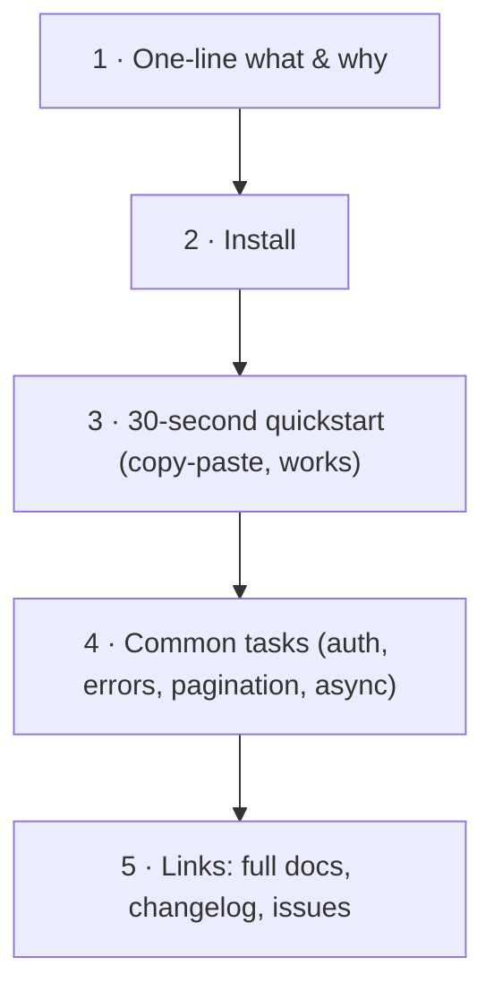

# 01: Docs & developer experience

> **Level:** Intermediate · **Prerequisites:** the finished SDK
> **Time:** ~1.5 hours · **Verified:** 2026-06-04

## Why this matters

Two SDKs with identical features can have wildly different adoption — the one with a great README and pleasant ergonomics wins. Docs and DX are not the afterthought; for a *library*, they *are* the product surface (Section 01: your users are strangers reading return values, exceptions, and docs). This module covers how to make those strangers successful fast.

## The README is the most important file you'll write

More people will read your README than any code or doc site. It's your PyPI front page (Section 08.01) and your GitHub landing. Optimise it for one thing: **time-to-first-successful-call.** A proven structure:



1. **One sentence** on what it is and who it's for: *"A small, typed Python client for the PokéAPI."*
2. **Install:** `pip install pokesdk` — nothing more for the basic case.
3. **Quickstart:** the smallest *complete, runnable* example. It must work when pasted, with no setup beyond install. This is the make-or-break moment.

```python
from pokesdk import PokeClient

with PokeClient() as client:
    ditto = client.pokemon.get("ditto")
    print(ditto.name, ditto.weight)
```

4. **Common tasks** — short snippets for the things users will need within the hour: setting an API key, handling errors, pagination, the async client. (Examples below.)
5. **Links** to fuller docs, the changelog, and where to file issues.

> **Test your own quickstart in a clean venv.** If *you* can't go from `pip install` to working output by copy-pasting your README, neither can your users. (This is the same "verify, don't assume" discipline as inspecting your wheel.)

### The common-tasks snippets users want

Put these in the README so nobody has to read source to find them:

```python
# Auth (for an API that needs it)
client = PokeClient(api_key="sk-...")              # or set $POKE_API_KEY

# Handle errors specifically
from pokesdk import NotFoundError, RateLimitError, PokeError
try:
    p = client.pokemon.get(name)
except NotFoundError:
    ...                                            # doesn't exist
except RateLimitError:
    ...                                            # back off
except PokeError as e:
    ...                                            # any other SDK error

# Paginate without thinking about pages
for ref in client.pokemon.list_all():
    print(ref.name)

# Async + concurrency
import asyncio
from pokesdk import AsyncPokeClient
async def main():
    async with AsyncPokeClient() as client:
        results = await asyncio.gather(
            client.pokemon.get("pikachu"),
            client.pokemon.get("charizard"),
        )
asyncio.run(main())
```

Each maps to a feature you built; the README is where they become *discoverable*.

## Docstrings: docs that live in the code

Docstrings power three things at once: editor hover-help, `help()` in the REPL, and auto-generated API docs (Sphinx/MkDocs). Write them on public classes and methods, focused on *how to use* the thing, not how it's implemented:

```python
class PokemonResource:
    def get(self, name_or_id: str | int) -> Pokemon:
        """Fetch a single Pokémon by name or numeric id.

        Args:
            name_or_id: e.g. "ditto" or 132.

        Returns:
            A `Pokemon` with id, name, height, weight, types, and stats.

        Raises:
            NotFoundError: if no such Pokémon exists.
            PokeConnectionError: if the request never completes.
        """
        ...
```

The **Raises** section matters especially for an SDK — it tells users exactly which of your typed exceptions to catch, turning the error hierarchy from Section 05 into documented, discoverable behaviour. A consistent docstring style (Google or NumPy format) lets a doc generator build a polished API reference for free.

## Runnable examples beat prose

Ship an `examples/` directory with complete, runnable scripts — not fragments. Users learn by running and tweaking. The capstone's [`examples/demo.py`](../99_project_pokesdk/examples/demo.py) is exactly this: it covers sync get, pagination, error handling, and async concurrency in one file that runs against the live API with no key. Verified output:

```text
== sync ==
got ditto: id=132, weight=40, types=['normal']
first 5 names: ['bulbasaur', 'ivysaur', 'venusaur', 'charmander', 'charmeleon']
handled NotFoundError (status 404)
== async (concurrent) ==
  pikachu: id=25
  charizard: id=6
  snorlax: id=143
```

An example that *actually runs* is worth pages of prose — and if you run it in CI, it can't silently rot.

## Small DX touches that signal quality

These are quick and disproportionately raise how "finished" your SDK feels:

| Touch | Why it matters |
|-------|----------------|
| **Helpful error messages** | Our `APIError` message includes status, method, and URL — so even an uncaught error is diagnostic, not just `APIError`. |
| **Good `__repr__`** (Pydantic gives this free) | `repr(pokemon)` shows the fields, so REPL exploration and debugging are pleasant. |
| **Consistent naming** | `get`/`list_all` across every resource (Section 03) — learn one, know all. |
| **Sensible defaults** | `PokeClient()` with zero args works, with timeout + retries on (Section 05). |
| **`__version__` exposed** | users put it in bug reports and feature gates (Section 08.02). |
| **Type hints + `py.typed`** | autocomplete and pre-runtime error catching (Section 04). |

None is glamorous; together they're the difference between "this feels like a real SDK" and "this feels like someone's weekend script."

## A docs checklist for your SDK

Before calling the SDK "done":

- ☐ README: one-liner, install, runnable quickstart, common-tasks (auth/errors/pagination/async), links.
- ☐ Quickstart verified by copy-paste in a clean venv.
- ☐ Docstrings on every public class/method, with **Raises** listing your exceptions.
- ☐ `examples/` with at least one complete runnable script (ideally run in CI).
- ☐ A documented errors guide (which exception means what).
- ☐ Changelog linked from PyPI (Section 08.02).
- ☐ `__version__` exposed; `Typing :: Typed` classifier + `py.typed` shipped.

## Course wrap-up

You've gone the whole distance: from a naive `httpx.get` with eight named problems, to a packaged, typed, sync-and-async, retrying, paginating, tested, **published** SDK with docs people can actually use. The throughlines worth keeping:

- **One funnel.** Every call routes through a single `_request`; cross-cutting concerns are written once.
- **Decisions in the shared core.** Auth, retries, errors, models live in one place, so sync/async never drift.
- **The public API is a contract.** Small surface, deliberate exports, SemVer, changelog.
- **Verify, don't assume.** Inspect the wheel, test the quickstart, read the coverage report.

That's the skill that transfers to *any* API — LLM providers, payments, your company's internal services. Go wrap one.

## Recap

- ✅ The **README** is your most-read file: optimise for time-to-first-successful-call (one-liner → install → runnable quickstart → common tasks → links). Verify it in a clean venv.
- ✅ **Docstrings** power editor help and generated docs; include a **Raises** section listing your typed exceptions.
- ✅ Ship **runnable examples** (run them in CI so they can't rot).
- ✅ Small **DX touches** — diagnostic error messages, good `repr`, consistent naming, sane defaults, exposed `__version__` — signal quality.
- ✅ Self-check: what's the single most important property of a README's quickstart? Why does a docstring's Raises section matter more for an SDK than for an app?

→ **You've finished the course.** Revisit the [capstone](../99_project_pokesdk/README.md) and ship an SDK for an API you care about.

## Exercises

1. **Write the README quickstart for a different API.** Pick any API you know. Write its README's one-liner + install + 30-second quickstart, following the structure above. Could a stranger run it from a clean venv?

<details><summary>Solution (shape, not specifics)</summary>

```markdown
# acme-sdk
A typed Python client for the Acme API.

## Install
pip install acme-sdk

## Quickstart
from acme_sdk import AcmeClient
with AcmeClient(api_key="...") as client:
    widget = client.widgets.get("w_123")
    print(widget.name)
```

Test: in a fresh venv, `pip install acme-sdk`, paste the quickstart, run. If it needs steps you didn't list (a config file, an env var), add them — the quickstart must be *complete*. The bar is "stranger to working call in two minutes."
</details>

2. **Add a Raises section.** Take the capstone's `PokemonResource.get` and write a complete docstring including `Raises:` for `NotFoundError` and `PokeConnectionError`. Why is documenting raised exceptions especially important for a library vs an app?

<details><summary>Solution</summary>

(Docstring as shown in the module.) It matters more for a library because the caller is *other code by strangers* who can only handle failures they know about — the SDK communicates through exceptions (Section 01). Undocumented exceptions mean users either over-catch (`except Exception`) or get surprised by an uncaught error in production. Listing `Raises:` makes your error contract explicit and catchable, completing the value of the typed hierarchy from Section 05.
</details>

3. **DX audit.** Run `repr()` on a `Pokemon` and on a caught `APIError` in the REPL. Are both informative? If an SDK's `repr` showed `<Pokemon object at 0x7f...>`, what would you change?

<details><summary>Solution</summary>

Pydantic models give a field-showing `repr` for free (e.g. `Pokemon(id=132, name='ditto', ...)`), and our `APIError`'s message includes status/method/URL — both informative. If a `repr` showed only `<Pokemon object at 0x...>` (the default for a plain class), you'd add a `__repr__` (or use a dataclass/Pydantic model) so REPL exploration and logs show the actual data. Opaque reprs make debugging miserable; informative ones are a cheap, high-impact DX win.
</details>
