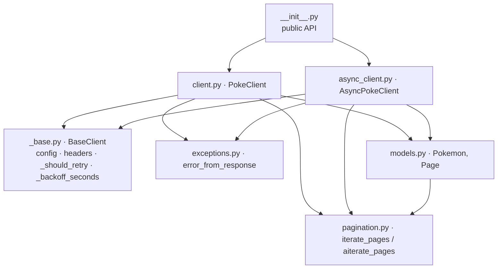

# Section 99 · The complete `pokesdk` project

> **Prerequisites:** Sections 01–07. (Section 08 then publishes this exact package.)
> **Time:** ~2 hours · **Verified:** 2026-06-04 — installs, runs live, 9/9 tests pass, builds a wheel.

`pokesdk` is a small, typed Python client for the [PokéAPI](https://pokeapi.co):

```python
from pokesdk import PokeClient

with PokeClient() as client:
    ditto = client.pokemon.get("ditto")
    print(ditto.name, ditto.weight)        # ditto 40
```

This folder is the **finished SDK** — every concept from Sections 01–07 assembled into one real, installable, tested package. Read it as the reference implementation: each file is the "after" of a section you worked through. Then run it against the live PokéAPI and run its test suite offline.

> This is not pseudo-code. Everything here was executed in the course's verified environment: the demo hits the real API, the 9 tests pass in ~0.2s, and `python -m build` produces a valid wheel that `twine check` approves.

## Layout

```
99_project_pokesdk/
├── pyproject.toml          # metadata, deps, build backend, pytest config  (§02, §08)
├── README.md               # this file
├── CHANGELOG.md            # Keep a Changelog format                       (§08)
├── LICENSE                 # MIT
├── examples/
│   └── demo.py             # runnable live demo (no API key needed)
├── src/pokesdk/
│   ├── __init__.py         # public API surface + re-exports               (§02.03)
│   ├── _version.py         # single source of the version string           (§08.02)
│   ├── py.typed            # PEP 561 marker: "this package is typed"        (§04.02)
│   ├── _base.py            # BaseClient: shared config, headers, retry policy (§05, §06)
│   ├── exceptions.py       # PokeError hierarchy + error_from_response      (§05.01)
│   ├── models.py           # Pydantic response models (Pokemon, Page, ...)  (§04.01)
│   ├── client.py           # PokeClient (sync) + PokemonResource            (§03, §05)
│   ├── async_client.py     # AsyncPokeClient (async) + AsyncPokemonResource (§06)
│   └── pagination.py       # sync + async page iterators                    (§05.03)
└── tests/
    ├── conftest.py         # shared fixtures                                (§07.02)
    ├── test_client.py      # parsing, 404→NotFound, auth header, 401        (§07.01)
    ├── test_retries.py     # retry-then-succeed, give-up                    (§07.01)
    ├── test_pagination.py  # walks pages, stops on null next                (§07.01)
    └── test_async.py       # async get + async pagination                   (§07.02)
```

About 440 lines of source — small, because the design avoids duplication (one funnel, one shared core).

## Run it yourself

```bash
cd 99_project_pokesdk
python -m venv .venv && source .venv/bin/activate
pip install -e ".[dev]"          # install with the dev extras (pytest, respx, ...)
```

**Live demo against the real PokéAPI** (no key required):

```bash
python examples/demo.py
```

**Verified output:**

```text
== sync ==
got ditto: id=132, weight=40, types=['normal']
first 5 names: ['bulbasaur', 'ivysaur', 'venusaur', 'charmander', 'charmeleon']
handled NotFoundError (status 404)
== async (concurrent) ==
  pikachu: id=25
  charizard: id=6
  snorlax: id=143
```

**Run the offline test suite:**

```bash
pytest -q
```

**Verified output:**

```text
.........                                                                [100%]
9 passed in 0.21s
```

## How the pieces connect



The spine, one more time: every public method (`client.pokemon.get`, `.list_all`, sync or async) funnels through a single `_request`, the only place that touches the network. Auth, retries, backoff, and error mapping are **decided** in the shared `_base.py`/`exceptions.py` and **applied** by both clients — so the sync and async versions can never drift.

## The "naive client" scorecard

Section 01 listed eight problems with the naive `httpx.get`. Here's where each is solved:

| Naive problem | Solved by | File |
|---|---|---|
| Cryptic errors (`JSONDecodeError` on 404) | typed exception hierarchy | `exceptions.py` |
| Auth copy-pasted per call | default headers on the client | `_base.py`, `client.py` |
| Base URL smeared everywhere | `base_url` config + single funnel | `_base.py`, `client.py` |
| Dicts, not types | Pydantic models | `models.py` |
| One blip = total failure | retries + backoff | `_base.py`, `client.py` |
| Manual pagination | lazy page iterators | `pagination.py` |
| Can hang forever | default timeout → `PokeConnectionError` | `_base.py`, `client.py` |
| Not installable | `pyproject.toml`, `src/` layout, `py.typed` | `pyproject.toml` |

## Reading guide (map each file to its section)

- **`exceptions.py`** → [§05.01](../05_robustness/01_error_hierarchy.md). The hierarchy and `error_from_response`.
- **`models.py`** → [§04.01](../04_data_models/01_response_models_pydantic.md). Frozen, subset, nested, generic `Page`.
- **`_base.py`** → [§05](../05_robustness/README.md) + [§06](../06_async_client/README.md). The pure shared core.
- **`client.py`** → [§03](../03_the_sync_client/README.md) + [§05.02](../05_robustness/02_retries_and_backoff.md). The sync funnel, retry loop, resources.
- **`async_client.py`** → [§06.02](../06_async_client/02_async_client_and_shared_core.md). The async mirror; diff it against `client.py`.
- **`pagination.py`** → [§05.03](../05_robustness/03_pagination.md). Sync + async generators.
- **`__init__.py`** → [§02.03](../02_packaging_basics/03_imports_and_public_api.md). Re-exports + `__all__`.
- **`tests/`** → [§07](../07_testing/README.md). respx mocking, fixtures, retry/pagination/async tests.

## Self-assessment against the SDK rubric (§01.01)

- ☑ **Discoverable** — `client.pokemon.` autocompletes to `get`/`list_all`.
- ☑ **Typed** — Pydantic models + `py.typed`; mypy sees `Pokemon`, not `Any`.
- ☑ **Predictable errors** — `PokeError` hierarchy; catch broad or specific.
- ☑ **Hard to misuse** — context managers, sane defaults (timeout + retries on).
- ☑ **Honest about the network** — retries transient failures, surfaces real ones, never hangs.
- ☑ **Installable & versioned** — `pip install`, `__version__`, CHANGELOG (publishing in §08).

## Where to go next

This package is *built*; now **ship it**.

→ **[Section 08 · Packaging & publishing](../08_packaging_publishing/README.md)** versions, builds, and publishes this exact project to PyPI with CI — and **[Section 09](../09_docs_and_dx/README.md)** polishes docs and developer experience.

## Exercises

1. **Add a `berries` resource end to end.** Add a `Berry` model, a `BerryResource` with `get`, wire `self.berries` into both clients, export the model, and write a respx test. Run `pytest` and the live demo.

<details><summary>Solution sketch</summary>

- `models.py`: `class Berry(BaseModel): id: int; name: str; growth_time: int` (frozen).
- `client.py`: `BerryResource` with `get(self, name_or_id) -> Berry` calling `_request("GET", f"/berry/{name_or_id}")` then `Berry.model_validate(...)`; `self.berries = BerryResource(self)` in `__init__`.
- `async_client.py`: the async twin.
- `__init__.py`: export `Berry`, add to `__all__`.
- `tests/`: `respx.get(".../berry/cheri").mock(return_value=httpx.Response(200, json={...}))`, assert `client.berries.get("cheri").growth_time == 3`.

Because the funnel/auth/retries/errors are shared, the new resource is purely additive — you touch no existing logic.
</details>

2. **Trace one request.** For `client.pokemon.get("ditto")`, write the exact sequence of functions from the resource method to the returned `Pokemon`, naming every shared component.

<details><summary>Solution</summary>

`PokemonResource.get` → `PokeClient._request` (funnel) → `_http.build_request` (headers from `BaseClient._default_headers`) → `_http.send` → on success `response.json()` → back in `get`, `Pokemon.model_validate(dict)` → typed `Pokemon`. On a bad status it hits `_should_retry` (`_base.py`) and either loops with `_backoff_seconds`/`_sleep` or raises via `error_from_response` (`exceptions.py`). Shared components: `_default_headers`, `_should_retry`, `_backoff_seconds`, `error_from_response`, the models — all reused by the async client.
</details>

3. **Prove the wheel is correct.** Build (`python -m build`) and inspect the wheel's file list. Confirm `py.typed` is included and `tests/` is not. Why do both matter?

<details><summary>Solution</summary>

List `dist/pokesdk-0.1.0-py3-none-any.whl`. You'll see `pokesdk/py.typed` present (so users' type checkers use your hints — §04.02) and **no** `tests/` (tests are for you, not shipped — §02.01). A missing `py.typed` silently un-types the SDK for everyone; shipped tests bloat the install and leak fixtures. Section 08 verifies this as part of releasing.
</details>
