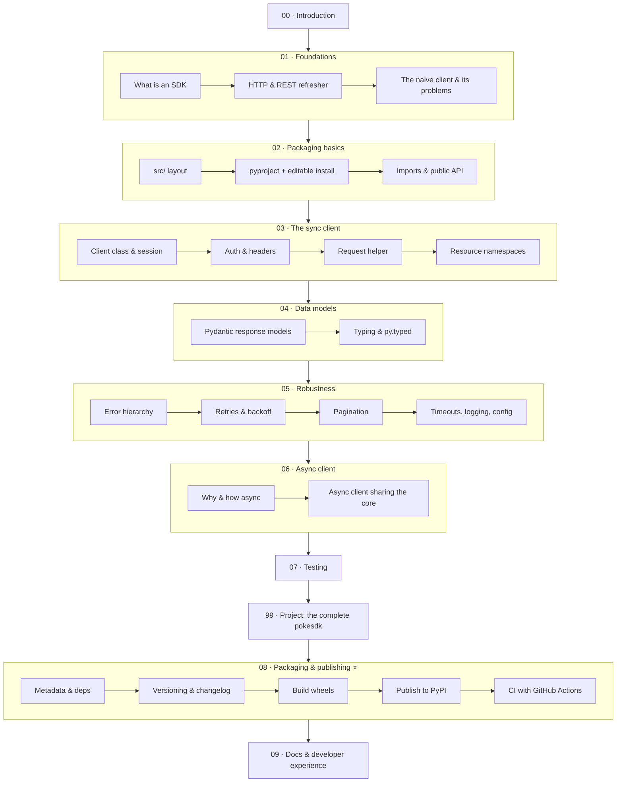

# Building a Python SDK — from a hand-rolled API call to a published, typed, async-ready client library

> **Verified:** 2026-06-04 against **Python 3.10.12**, **httpx 0.28.1**, **Pydantic 2.12.3**, **pytest 9.0.3**, **pytest-asyncio 1.4.0**, **respx 0.23.1**, **hatchling 1.30.1**, **build 1.5.0**, **twine 6.2.0**, **uv 0.11.19**.
> Every code sample was **actually run** in that environment. Examples that hit a live API call the **free, no-key [PokéAPI](https://pokeapi.co)** and [httpbin.org](https://httpbin.org) — their real output is shown. Where output depends on the network it's labelled **live**; all the SDK's own logic is also covered by an **offline** test suite you run yourself.

This is a hands-on course. You'll start from the messy way everyone first calls an API (a bare `requests.get` buried in business logic), feel exactly why that doesn't scale, and then **build a real, installable, typed Python SDK** — the kind of client library that companies like Anthropic, OpenAI, and Stripe ship so that *other* developers can use their API in one line. By the end you'll have `pokesdk`: a package with a clean sync client, a matching async client sharing one core, typed Pydantic models, a proper error hierarchy, automatic retries and pagination, a real test suite, and a `pyproject.toml` that builds a wheel you publish to PyPI with CI.

## Why this skill is "booming"

Every API company now ships an SDK — it's how they make their product easy to adopt. "We have an API" increasingly means "we have a great Python SDK." Knowing how to design one (good ergonomics, typing, async, retries, versioning, publishing) is a high-leverage, in-demand skill, and it's the same skill whether you're wrapping an LLM, a payments API, or your own company's internal services.

## Who this is for

You're **comfortable with Python** — functions, classes, dicts, type hints you can read, `with` blocks, decorators you've at least seen. You do **not** need prior experience with HTTP libraries, async, Pydantic, packaging, or PyPI. This course teaches all of those *in service of building the SDK*; it does not re-explain core Python.

## Prerequisites

- Python **3.10+** (`python3 --version`).
- A terminal, a code editor, and basic command-line comfort.
- A free [PyPI](https://pypi.org) / [TestPyPI](https://test.pypi.org) account *only* for Section 08 (publishing) — optional, you can read along.

You'll install everything else (`httpx`, `pydantic`, `pytest`, `respx`, `build`, `twine`, optionally `uv`) as you go.

## What "SDK" means here

A **Software Development Kit** in the Python/API world is a **client library**: a pip-installable package that wraps a web API so users write `client.pokemon.get("ditto")` instead of hand-assembling URLs, headers, retries, JSON parsing, and error handling every time. A good SDK turns *"read the API docs and write HTTP plumbing"* into *"import the library and call a method."*

## The learning path

| # | Section | Modules | You'll be able to… | Time |
|---|---------|---------|--------------------|------|
| 00 | [Introduction](00_introduction.md) | — | Explain what an SDK is and what you're building | ~20 min |
| 01 | [Foundations](01_foundations/README.md) | 3 | Articulate what an SDK gives users and why the naive approach fails | ~2–3 h |
| 02 | [Packaging basics](02_packaging_basics/README.md) | 3 | Turn a folder into a real, importable, installable package | ~2–3 h |
| 03 | [The sync client](03_the_sync_client/README.md) | 4 | Build a clean client with auth, one request path, and resource namespaces | ~4–5 h |
| 04 | [Data models](04_data_models/README.md) | 2 | Return typed Pydantic objects and ship type info to users | ~2–3 h |
| 05 | [Robustness](05_robustness/README.md) | 4 | Add a typed error hierarchy, retries, pagination, timeouts & logging | ~4–5 h |
| 06 | [Async client](06_async_client/README.md) | 2 | Add an async client that reuses the sync client's core | ~2–3 h |
| 07 | [Testing](07_testing/README.md) | 2 | Test an SDK fast and offline by mocking HTTP | ~2–3 h |
| 99 | [Project: the complete pokesdk](99_project_pokesdk/README.md) | — | Read & run the whole package end-to-end | ~2 h |
| 08 | [Packaging & publishing](08_packaging_publishing/README.md) ⭐ | 5 | Version, build, and publish to PyPI with CI | ~4–6 h |
| 09 | [Docs & developer experience](09_docs_and_dx/README.md) | 1 | Write the docs and ergonomics that make an SDK pleasant | ~1–2 h |

**Total:** ~25–32 hours. Each module ends with a recap, a self-check, and exercises with collapsible solutions.

### Two tracks

- **Build-the-SDK track (recommended):** `00 → 01 → … → 07 → 99 → 08 → 09`. You build the library, then read it whole, then publish it.
- **"I just need to ship a package" track:** `00 → 02 → 08`. If you already have code and only need packaging + PyPI, Sections **02** and **08** stand on their own.

## How to use this course

1. Go in order — each module builds on the previous one's code.
2. **Type the code yourself** and run it. The whole point of an SDK is ergonomics; you only feel them by using what you build.
3. Keep the [capstone source](99_project_pokesdk/) open as a reference — it's the finished version of everything you build.
4. Do the exercises before opening the solution.

→ Start here: **[00 · Introduction](00_introduction.md)**
