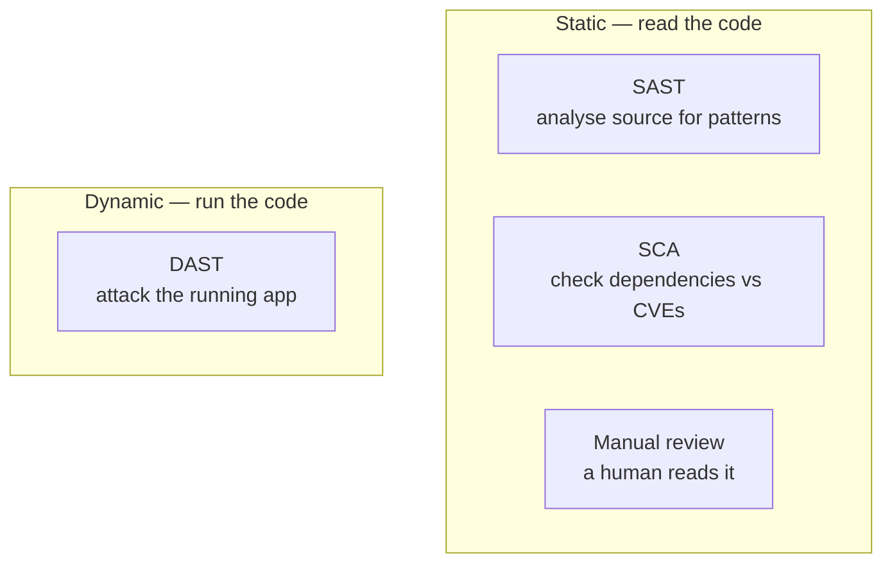

# 00 · Introduction

> **Level:** Beginner (comfortable Python) · **Time:** 15 min · **Verified:** 2026-07-15

Most security courses teach you to *attack* running software. This one teaches you
to find the bug **before it ships** — by reading the source. That's **code
auditing**, and for a working programmer it's the highest-leverage security skill
there is: you already read code all day; you just need to learn what to look for.

---

## What you'll build

A real static-analysis tool you can read end to end:

```bash
python -m codeaudit.cli samples/vulnerable_app
```

```
🔴 CRITICAL CA101  samples/vulnerable_app/app.py:76
    Dangerous call to `eval()` — arbitrary code/command execution risk.
    | return str(eval(tmpl))
    (CWE-95)
🟠 HIGH     CA201  samples/vulnerable_app/app.py:32
    User input reaches SQL execute() — SQL injection.
    | cur.execute(f"SELECT * FROM users WHERE name = '{username}'")
    (CWE-89)
...
── 14 findings (2 critical, 7 high, 5 medium) ──
```

> ☝️ **Real output** from running the capstone in the verified environment. It's
> ~300 lines of pure-stdlib Python — no dependencies — and by the end you'll
> understand every rule and be able to add your own.

---

## The three ways to find a vulnerability



| Approach | When | This course |
|---|---|---|
| **Manual review** | Always — the durable skill | Section 02 |
| **SAST** (static analysis) | Every commit, in CI | Section 03 (build one), 04 (real tools) |
| **SCA** (dependencies) | Every dependency change | Section 04-3 |
| **DAST** (attack it) | Against a running deploy | The [Ethical Hacking](../ethical_hacking/) course |

The [Ethical Hacking](../ethical_hacking/) course covers DAST and explicitly
defers SAST/SCA/secure code review to "the AppSec path." **You're on it now.**

---

## Why build a scanner instead of just running bandit?

Because a tool you don't understand is a tool you can't trust. When bandit flags
50 things and 40 are false positives, you need to know *why* — and that only comes
from having written a rule yourself. So the arc is:

1. **Learn to see the bugs by hand** (Section 02) — the skill no tool replaces.
2. **Build a small SAST tool** (Section 03) — understand patterns and taint.
3. **Run the real tools** (Section 04) — bandit/semgrep/pip-audit, and where each
   is blind.
4. **Ship it** (Section 05) — LLM-assisted triage and CI integration.

---

## What you need

- **Python 3.10+** and everyday fluency (functions, classes, dicts, comprehensions).
- Curiosity about how programs are structured — you'll meet the **AST** (abstract
  syntax tree), the shape the parser turns your code into.
- **No security background.** Every vulnerability class is taught from scratch.
- **No paid tools or API keys.** The auditor is stdlib-only; bandit/semgrep and a
  local LLM are optional extras.

---

## A word on ethics

You'll be handed an *intentionally vulnerable* app to practise on. That's the safe,
legal way to learn — like a flight simulator. The rule is simple: **audit only
code you own or are explicitly authorised to review.** Finding a bug in someone
else's production code without permission isn't research; it's trespass. Section
05-2 covers responsible disclosure when you *do* find something real.

---

**Next → [01-1 · What is code audit?](01_foundations/01_what_is_code_audit.md)**
