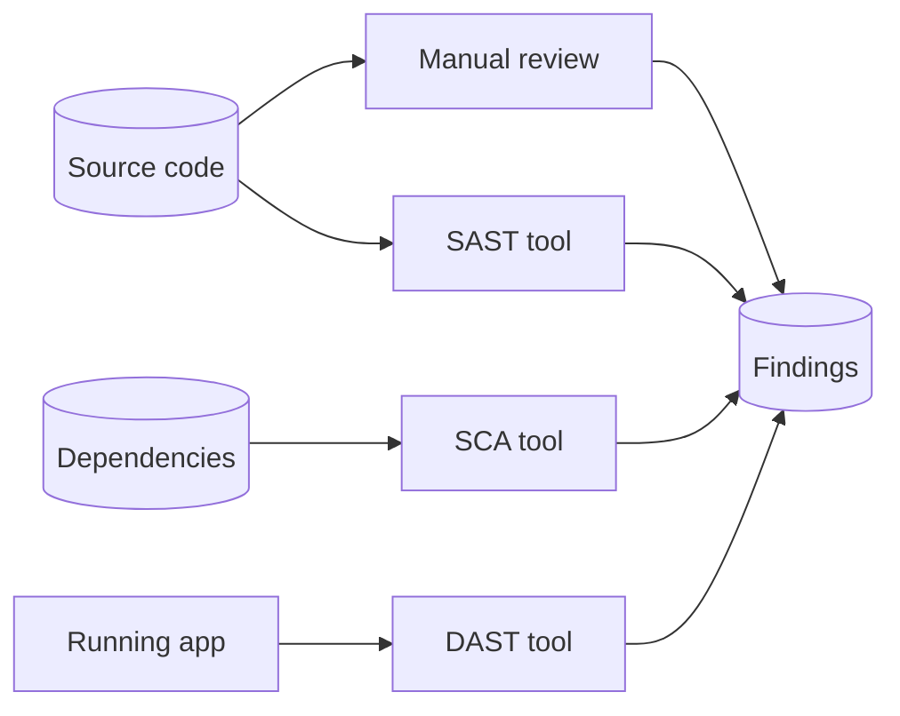
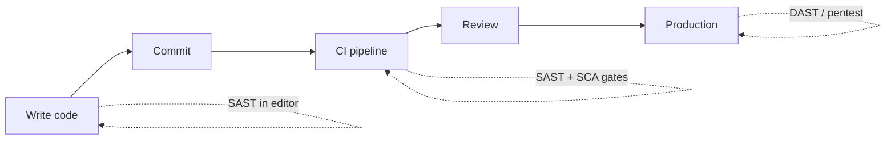

# 01-1 · What is code audit? SAST vs DAST vs SCA

> **Level:** Beginner · **Prerequisites:** [00 Introduction](../00_introduction.md)
> **Time:** 20 min · **Verified:** 2026-07-15

"Code audit" is the practice of examining source code to find security defects.
It splits into a few techniques that answer different questions. Knowing which is
which — and their blind spots — is the foundation for everything after.

---

## The four techniques

| Technique | Full name | What it examines | Classic tools |
|---|---|---|---|
| **Manual review** | Secure code review | Source, read by a human | Your eyes + a checklist |
| **SAST** | Static Application Security Testing | Source / bytecode, automatically | bandit, semgrep, CodeQL |
| **SCA** | Software Composition Analysis | Your **dependencies** vs known CVEs | pip-audit, Dependabot, Snyk |
| **DAST** | Dynamic Application Security Testing | The **running** app, from outside | Burp, sqlmap, ZAP |

DAST is the [Ethical Hacking](../../ethical_hacking/) course. The other three are
this one.

---

## What each is good and bad at

No single technique is complete — they catch different bugs.

| | Catches well | Misses / weak at |
|---|---|---|
| **Manual review** | Logic flaws, broken access control, design bugs | Slow; humans miss repetitive patterns; doesn't scale |
| **SAST** | Repetitive dangerous patterns (eval, string SQL, weak hashes) at scale | Business logic; **false positives**; can't see runtime config |
| **SCA** | Known-vulnerable library versions (CVEs) | *Your* bugs; unmaintained-but-not-yet-CVE'd deps |
| **DAST** | What's actually exploitable on a live target | Root cause; unreachable-yet code; needs a running deploy |

> **The takeaway that runs through this course:** tools and humans are
> complementary. SAST finds the boring-but-common bugs fast so humans can spend
> their attention on the subtle logic flaws (like the [access-control bugs](../02_reading_code_for_vulns/06_access_control_idor.md)
> that *no* scanner reliably finds).

---

## Where "shift left" comes from

Fixing a vulnerability is cheapest the earlier you catch it. A bug found while
*writing* the code costs a code change; the same bug found by an attacker in
production costs an incident. "Shift left" means moving detection earlier — from
the pentest (far right, DAST) toward the developer's editor and the CI pipeline
(far left, SAST/SCA). That's why this course ends by wiring your auditor into
[CI](../05_llm_assisted_and_shipping/02_ci_integration_and_reporting.md).

---

## Recap & next

- ✅ **Manual review, SAST, SCA** all read the code/deps; **DAST** attacks the
  running app.
- ✅ Each catches different bugs — **use them together**; SAST for scale, humans
  for logic.
- ✅ **Shift left**: the earlier a bug is caught, the cheaper the fix — which is
  why SAST/SCA belong in CI.

**Self-check:** A reviewer says "our scanner passed, so we're secure." What two
categories of vulnerability might it still have missed?

Answer

**Business-logic / access-control flaws** (SAST can't reason about *who should*
be allowed to do *what*) and **vulnerable dependencies** if only SAST (not SCA)
was run. A clean SAST run says "no known dangerous *patterns* in our code" — not
"secure."

**→ Next: [01-2 · Environment setup](02_environment_setup.md)**
