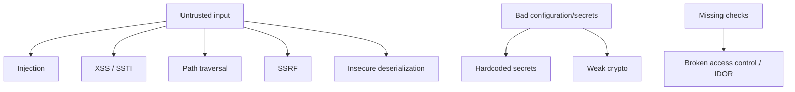

# 01-3 · Vulnerability classes you can see in source

> **Level:** Beginner · **Prerequisites:** [01-2 Environment setup](02_environment_setup.md)
> **Time:** 25 min · **Verified:** 2026-07-15

Before hunting bugs you need a taxonomy — the recurring *shapes* of vulnerability.
This is your mental checklist for the rest of the course. Each maps to a **CWE**
(Common Weakness Enumeration id) and to the [OWASP Top 10](https://owasp.org/www-project-top-ten/).

---

## The map

---

## The classes this course detects

| Class | CWE | The shape in code | Module |
|---|---|---|---|
| **SQL injection** | CWE-89 | User data concatenated/f-stringed into a query passed to `.execute()` | [02-2](../02_reading_code_for_vulns/02_injection.md) |
| **Command injection** | CWE-78 | User data in `os.system`, `subprocess(..., shell=True)` | [02-2](../02_reading_code_for_vulns/02_injection.md) |
| **Code injection** | CWE-95 | `eval` / `exec` on any dynamic input | [02-2](../02_reading_code_for_vulns/02_injection.md) |
| **XSS / SSTI** | CWE-79 / CWE-1336 | Unescaped user data rendered into HTML / a template string | [02-3](../02_reading_code_for_vulns/03_xss_ssti_and_output.md) |
| **Hardcoded secrets** | CWE-798 | API keys / passwords as string literals | [02-4](../02_reading_code_for_vulns/04_auth_secrets_crypto.md) |
| **Weak crypto** | CWE-327 | `md5`/`sha1` for passwords; predictable tokens | [02-4](../02_reading_code_for_vulns/04_auth_secrets_crypto.md) |
| **Path traversal** | CWE-22 | User data in a file path passed to `open()` | [02-5](../02_reading_code_for_vulns/05_traversal_ssrf_deser.md) |
| **SSRF** | CWE-918 | User-controlled URL in an outbound request | [02-5](../02_reading_code_for_vulns/05_traversal_ssrf_deser.md) |
| **Insecure deserialization** | CWE-502 | `pickle.loads`, `yaml.load` on untrusted bytes | [02-5](../02_reading_code_for_vulns/05_traversal_ssrf_deser.md) |
| **Broken access control / IDOR** | CWE-284 / CWE-639 | A route that acts on an id without checking ownership | [02-6](../02_reading_code_for_vulns/06_access_control_idor.md) |

Each becomes a rule id in your tool (`CA101`…`CA107`, plus taint `CA201`–`CA203`).

---

## Two families, two detection strategies

Notice the classes split into two groups — and this split *is* why the course has
both Section 03 (patterns) and Section 03-4 (taint):

1. **"This construct is dangerous regardless"** — `eval`, `md5` for passwords, a
   hardcoded key, `debug=True`. You can flag these on **sight**, wherever they
   appear. → simple **pattern rules**.
2. **"This is dangerous only if user data reaches it"** — `.execute(q)`,
   `open(path)`, `requests.get(url)`. `open()` is fine with a constant path;
   dangerous with a user-supplied one. → needs **taint tracking** (does untrusted
   data flow here?).

Access control (IDOR) is a third, harder family: it's the *absence* of a check,
which no simple tool sees reliably — the human's job.

---

## Recap & next

- ✅ Vulnerabilities come in recognisable **classes**, each with a **CWE** and a
  **code shape**.
- ✅ Some are dangerous **on sight** (pattern rules); others only **when tainted
  data reaches them** (taint tracking).
- ✅ **Missing checks** (access control) are the hardest — reserved for human eyes.

**Self-check:** Why is `open(path)` not something you can flag on sight, while
`eval(x)` is?

Answer

`open()` with a **constant** path (`open("/etc/config")`) is perfectly safe — it's
only a vulnerability when a **user-controlled** value reaches it, so you need taint
analysis to know. `eval()` executes whatever it's given; there's essentially no
safe reason to `eval` dynamic input, so its mere presence is worth flagging.

**→ Next: [01-4 · Data flow & taint](04_data_flow_and_taint.md)**
