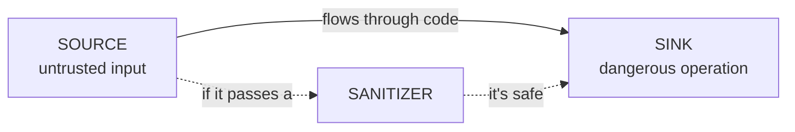

# 01-4 · Data flow & taint: sources and sinks

> **Level:** Beginner · **Prerequisites:** [01-3 Vulnerability classes](03_vulnerability_classes.md)
> **Time:** 25 min · **Verified:** 2026-07-15

This is the single most important idea in the course. Almost every injection-style
vulnerability is the same story: **untrusted data reaches a dangerous operation
without being made safe.** Learn to trace that flow and you can find bugs in any
language.

---

## Three words: source, sink, sanitizer



- **Source** — where untrusted data enters: `request.args`, `request.form`, a
  request body, a CLI argument, `input()`, a file you didn't write, a database row
  that came from a user.
- **Sink** — a dangerous operation: `cursor.execute()`, `os.system()`,
  `open()`, `eval()`, an HTTP request, `render_template_string()`.
- **Sanitizer** — something that neutralises the data for that sink: parameterised
  query placeholders, `shlex.quote`, path normalisation + allow-list, HTML
  escaping.

**A vulnerability exists when a source reaches a sink with no sanitizer in
between.** That sentence is the definition of taint analysis.

---

## Read a flow by hand

```python
@app.route("/read")
def read_file():
    name = request.args.get("name", "")   # ① SOURCE: user controls `name`
    path = "/var/data/" + name            # ② `name` flows into `path` — path is now tainted
    with open(path) as fh:                # ③ SINK: open() with a tainted path → path traversal
        return fh.read()
```

Trace it: user data (`①`) flows into `path` (`②`) and reaches `open` (`③`) with no
check. Attacker sends `?name=../../etc/passwd` → reads any file. **Tainted from
source to sink, no sanitizer → vulnerability.** The fix adds a sanitizer between
② and ③ (normalise the path and confirm it stays under `/var/data`).

---

## Taint "propagates"

Taint spreads through assignments and expressions:

```python
a = request.args.get("x")   # a is tainted
b = a                       # b is tainted (copied)
c = "prefix" + b            # c is tainted (concatenation carries it)
d = f"SELECT {c}"           # d is tainted (f-string carries it)
cur.execute(d)              # tainted value reaches a sink → SQLi
```

Your Section 03-4 taint tracker implements exactly this: mark sources, propagate
through assignments, and alarm when a tainted value lands in a sink.

---

## Why this is hard to do perfectly

Real taint analysis is subtle, and knowing the limits keeps you humble (and
explains false positives/negatives):

- **Across functions** — if `b = clean(a)`, is `b` still tainted? Depends what
  `clean` does. Following data *between* functions (interprocedural) is much harder;
  our tool stays *within* one function (intraprocedural).
- **Sanitizer recognition** — the tool must know which functions make data safe,
  or it will flag already-safe code (false positive).
- **Aliasing / containers** — `d["k"] = tainted; use(d["k"])`. Tracking taint
  through dicts/objects is where real tools earn their complexity.

Our teaching tracker gets the common cases right and is honest about the rest —
which is precisely the motivation for bandit/semgrep in Section 04.

---

## Recap & next

- ✅ **Source → Sink** with no **Sanitizer** = the anatomy of an injection bug.
- ✅ Taint **propagates** through assignments, concatenation, and f-strings.
- ✅ Perfect taint tracking is hard (interprocedural flow, sanitizers, aliasing) —
  our tool is intraprocedural and honest about it.

**Self-check:** In `q = "SELECT * FROM t WHERE id = " + str(request.args["id"])`,
name the source, the sink (on the next line `cur.execute(q)`), and whether
`str(...)` sanitizes it.

<details>
<summary>Answer</summary>

**Source:** `request.args["id"]`. **Sink:** `cur.execute(q)`. `str(...)` does **not**
sanitize for SQL — it just stringifies; an attacker's `id` like `1 OR 1=1` sails
straight through. The real sanitizer is a **parameterised query**
(`cur.execute("... id = ?", (id,))`).

</details>

**→ Next: [02-1 · The review workflow](../02_reading_code_for_vulns/01_the_review_workflow.md)**
