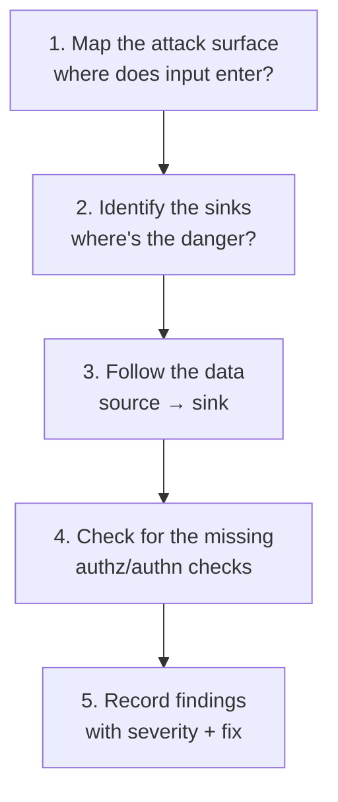

# 02-1 · The review workflow

> **Level:** Beginner · **Prerequisites:** [01-4 Data flow & taint](../01_foundations/04_data_flow_and_taint.md)
> **Time:** 20 min · **Verified:** 2026-07-15

Opening an unfamiliar codebase to look for security bugs feels overwhelming until
you have a method. Here's one that scales from a 200-line Flask app to a large
service.

---

## The method: map, then follow the data



### 1. Map the attack surface (find the sources)

Where does untrusted data enter? For a web app: every **route/endpoint** and every
read of `request.*`. Grep is your friend:

```bash
grep -rn "request\." samples/vulnerable_app     # every use of request data
grep -rn "@app.route" samples/vulnerable_app    # every endpoint
```

### 2. Locate the sinks (find the danger)

Grep for the dangerous operations from your [taxonomy](../01_foundations/03_vulnerability_classes.md):

```bash
grep -rn -E "execute|os\.system|subprocess|eval|exec|pickle|yaml.load|open\(" samples/vulnerable_app
```

### 3. Follow the data from source to sink

For each sink, ask: **can user input reach here?** Read backwards from the sink to
where each argument came from. If a source reaches it unsanitized → finding. This
is [taint analysis](../01_foundations/04_data_flow_and_taint.md) done by hand.

### 4. Look for what *isn't* there

The bugs tools miss: **is there an authorization check?** A route that loads
`/user/<id>/profile` — does it verify the *logged-in* user may see that id? Absence
of a check is a finding too ([02-6](06_access_control_idor.md)).

### 5. Record every finding

File, line, class/CWE, severity, and the fix. Consistent records become your
report ([04-4](../04_tools_and_dependencies/04_triage_and_false_positives.md)).

---

## grep-first, then read

Grep gets you to the interesting lines fast; it can't understand code (it'll match
`execute` in a comment, miss `exec` aliased to another name). So grep to *locate*,
then **read** to *confirm*. This exact limitation — text vs structure — is why
Section 03 upgrades from grep to the **AST**.

```bash
# grep finds candidates...
grep -rn "execute" samples/vulnerable_app
# samples/vulnerable_app/app.py:32:    cur.execute(f"SELECT ...")   ← read this one
# ...then YOU decide if the argument is tainted.
```

---

## A quick pass on the sample app

Try the workflow now, before any tool:

```bash
grep -rn -E "@app.route|request\.|execute|os\.system|subprocess|eval|pickle|yaml|open\(" \
    samples/vulnerable_app/app.py | head
```

You'll see the routes and every sink lined up. For each sink, trace the argument
back to a `request.*`. You've just done a manual audit — the next modules go class
by class.

---

## Recap & next

- ✅ **Map sources → locate sinks → follow the data → check for missing authz →
  record.**
- ✅ **grep to locate, read to confirm** — text search finds candidates but can't
  understand code.
- ✅ The absence of a check is a finding; that part is all human.

**Self-check:** Why isn't `grep "execute"` enough to conclude you have SQL
injection?

<details>
<summary>Answer</summary>

grep only tells you `execute` *appears* — not whether its argument is a **tainted,
string-built query** vs a safe parameterised call, and it can miss aliased or
dynamically-named calls. You still have to read the line and trace the argument's
origin.

</details>

**→ Next: [02-2 · Injection](02_injection.md)**
