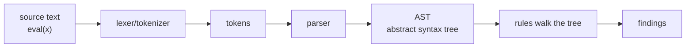

# 03-1 · How SAST works

> **Level:** Beginner · **Prerequisites:** [02-1 The review workflow](../02_reading_code_for_vulns/01_the_review_workflow.md)
> **Time:** 20 min · **Verified:** 2026-07-15

You've reviewed code by hand and hit the wall: it doesn't scale, and grep can't
*understand* code. A static analyzer fixes both. Here's how every one of them —
bandit, semgrep, CodeQL, your `codeaudit` — works under the hood.

---

## The pipeline: text → tokens → tree → rules



1. **Tokenize** — split the text into tokens (`eval`, `(`, `x`, `)`). This is the
   `tokenize` module.
2. **Parse** — assemble tokens into an **AST**: a tree that captures *structure*.
   `eval(x)` becomes a `Call` node whose `func` is a `Name('eval')`. This is
   `ast.parse`.
3. **Analyze** — walk the tree and match dangerous shapes. "A `Call` to `eval`" is
   a precise, structural query — no regex guessing.

Python hands you steps 1–2 for free in the standard library. Your job — and this
section — is step 3.

---

## Why the AST beats grep

`grep "eval"` is text matching; it can't tell these apart:

```python
eval(user_input)          # a real call — dangerous
retrieval = 5             # the letters "eval" inside a word — not a call
x = "eval is risky"       # in a string — not a call
# eval(x) here            # in a comment — not a call
```

The AST knows the first is a `Call` whose function is the name `eval`, and the rest
aren't calls at all. Structure removes the false positives text search can't avoid.
Conversely, the AST also *catches* things grep misses — like `eval` reached via an
alias — because it looks at what the code *is*, not how it's spelled.

---

## Pattern rules vs data-flow

Two levels of analysis, both in your tool:

| | Question | Example | Module |
|---|---|---|---|
| **Pattern rule** | "Does this dangerous *shape* appear?" | Is there a `Call` to `eval`? | [03-3](03_writing_detection_rules.md) |
| **Data-flow (taint)** | "Does *untrusted data* reach a sink?" | Does `request.args` flow into `.execute`? | [03-4](04_simple_taint_tracking.md) |

Pattern rules are cheap and catch "always dangerous" constructs. Taint is needed
for "dangerous only if user-controlled" sinks like `open`/`execute`. Real tools
layer both, exactly as you will.

---

## The limits (why bandit/semgrep still matter)

Your tool — like all SAST — is an **approximation**:

- **False positives** — it flags things that turn out safe (a constant reaching a
  sink). Annoying but safe.
- **False negatives** — it misses real bugs (taint through another function it
  doesn't follow). Dangerous, and why you never rely on one tool.
- **No runtime knowledge** — it can't see config, environment, or which routes are
  actually exposed.

Understanding these limits *is* the skill. Section 04 shows where the industrial
tools push the boundary further.

---

## Recap & next

- ✅ SAST = **tokenize → parse to an AST → walk the tree with rules**. Python's
  stdlib gives you the first two.
- ✅ The **AST beats grep** because it matches *structure*, not text.
- ✅ Two rule levels: **pattern** ("dangerous shape present?") and **taint** ("does
  user data reach a sink?").
- ✅ All SAST is an approximation — **false positives and negatives are inherent**.

**Self-check:** Why can an AST-based rule tell `eval(x)` from the variable
`retrieval`, when `grep eval` cannot?

<details>
<summary>Answer</summary>

The parser has already classified the code by structure: `eval(x)` is a `Call`
node whose `func` is `Name(id="eval")`, while `retrieval` is just a `Name` (and
the substring "eval" inside it is meaningless to the tree). The rule queries the
structure, so it only matches actual calls to `eval`.

</details>

**→ Next: [03-2 · AST basics](02_ast_basics.md)**
