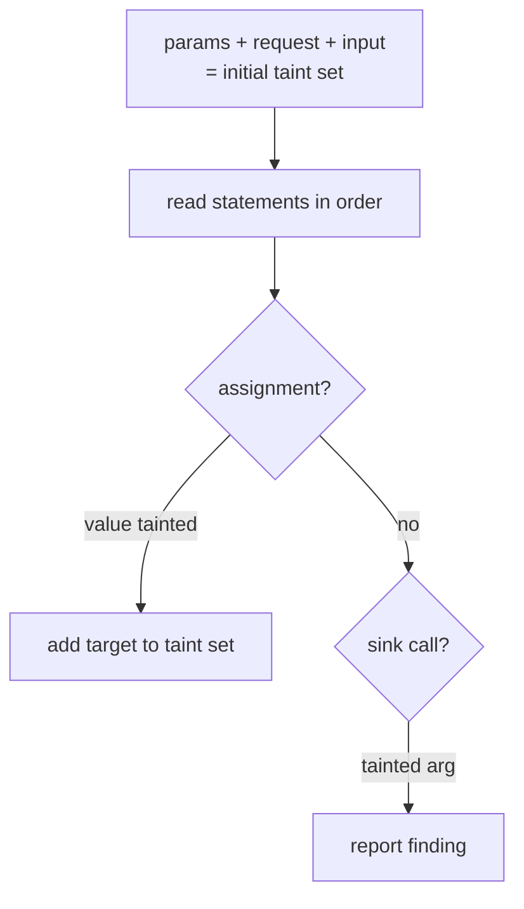

# 03-4 · Simple taint tracking

> **Level:** Intermediate · **Prerequisites:** [03-3 Writing detection rules](03_writing_detection_rules.md)
> **Time:** 30 min · **Verified:** 2026-07-15

Pattern rules can't tell `open("/etc/config")` (safe) from `open(user_path)`
(traversal). For that you need to answer: *does untrusted data reach this sink?*
That's taint tracking — [`codeaudit/taint.py`](../99_project_codeaudit/codeaudit/taint.py).

---

## The algorithm, in four rules

Within one function, keep a **set of tainted variable names** and update it as you
read statements top to bottom:

1. **Seed sources.** Function parameters, `input()`, and anything touching
   `request` start tainted.
2. **Propagate on assignment.** `x = <expr>` → `x` is tainted iff the expression
   reads a tainted name or a source.
3. **Check sinks.** At a sink call (`execute`, `open`, `requests.get`), if any
   argument is tainted → emit a finding.
4. **Recurse into blocks** (if/for/while/with) — but not into nested function
   scopes (they get their own pass).



---

## Is an expression tainted?

The core predicate — walk the expression; it's tainted if it mentions a tainted
name or contains a source:

```python
def _is_source(node):
    if isinstance(node, ast.Call) and call_name(node) == "input":
        return True
    if isinstance(node, ast.Name) and node.id == "request":   # flask request global
        return True
    return False

def _expr_is_tainted(node, tainted):
    for sub in ast.walk(node):
        if isinstance(sub, ast.Name) and sub.id in tainted:
            return True
        if _is_source(sub):
            return True
    return False
```

`request.args.get("x")` is tainted because walking it hits `Name("request")`.
`"/data/" + name` is tainted when `name` is in the set. Simple and effective.

---

## Propagation and sinks

The ordered pass (simplified from `taint.py`):

```python
def _process(self, stmts, tainted):
    for stmt in stmts:
        self._check_leaf_expressions(stmt, tainted)          # sinks evaluated here
        if isinstance(stmt, ast.Assign):
            is_tainted = _expr_is_tainted(stmt.value, tainted)
            for tgt in stmt.targets:
                if isinstance(tgt, ast.Name):
                    (tainted.add if is_tainted else tainted.discard)(tgt.id)
        # recurse into if/for/while/with bodies (not nested defs)
        ...
```

The sinks and what they map to:

```python
_SINKS_BY_SUFFIX = {
    "execute": ("CA201", "high", "CWE-89", "User input reaches SQL execute() — SQL injection."),
    "open":    ("CA202", "medium", "CWE-22", "User input reaches open() — path traversal."),
}
_HTTP_SINKS = {"requests.get", "requests.post", ..., "urlopen"}   # → CA203 SSRF
```

A sink fires only when `_call_has_tainted_arg` is true — that's the difference
between `open(constant)` (silent) and `open("/data/" + name)` (CA202).

---

## See it distinguish safe from unsafe

```bash
python -m codeaudit.cli samples/vulnerable_app --min-severity medium
```

Real findings include the taint results the pattern rules *couldn't* produce:

```
🟠 HIGH   CA201  app.py:44   User input reaches SQL execute() — SQL injection.
                             | rows = conn.execute(query).fetchall()
🟡 MEDIUM CA202  app.py:...  User input reaches open() — path traversal.
🟡 MEDIUM CA203  app.py:69   User input reaches an outbound HTTP request — SSRF.
```

`conn.execute(query)` (line 44) has a *variable* argument — a pattern rule sees
nothing suspicious, but taint knows `query` was built from `request.args`.

---

## Honest limitations (this is the lesson)

Your tracker is deliberately simple, and naming its gaps is the point:

- **Intraprocedural only** — if taint passes through *another function*, it's lost
  (false negative).
- **Flow-insensitive-ish** — once tainted in a function, always tainted; a later
  reassignment to a constant may not fully clear it (possible false positive).
- **No sanitizer awareness** — it doesn't know `shlex.quote(x)` makes `x` safe, so
  it may over-report.
- **No container tracking** — taint through `d["k"]` or object attributes isn't
  followed.

These are exactly the frontiers where **semgrep's `taint` mode and CodeQL** invest
enormous engineering. You now know what they're doing — and why it's hard.

---

## Recap & next

- ✅ Taint = **seed sources → propagate through assignments → alarm at sinks**,
  within one function.
- ✅ It catches variable-argument sinks (`execute(query)`) that pattern rules miss.
- ✅ Its **limits** (interprocedural flow, sanitizers, containers) are inherent and
  motivate the industrial tools.

## Exercise

Add `subprocess` (with a tainted arg, even without `shell=True`) as a taint sink
`CA204` (command injection). Why is this a *useful* addition even though CA102
already flags `shell=True`?

<details>
<summary>Solution</summary>

Add `"check_output"/"run"/"call"/"Popen"` (or match `name.startswith("subprocess.")`)
to the sink set mapping to `CA204`/CWE-78, firing when an argument is tainted. It's
useful because CA102 only catches `shell=True`; a tainted value used as the
*command name* (`subprocess.run([user_cmd, ...])`) is still dangerous without a
shell, and only taint — not the pattern rule — can see the user data reaching it.

</details>

**→ Next: [04-1 · bandit](../04_tools_and_dependencies/01_bandit.md)**
