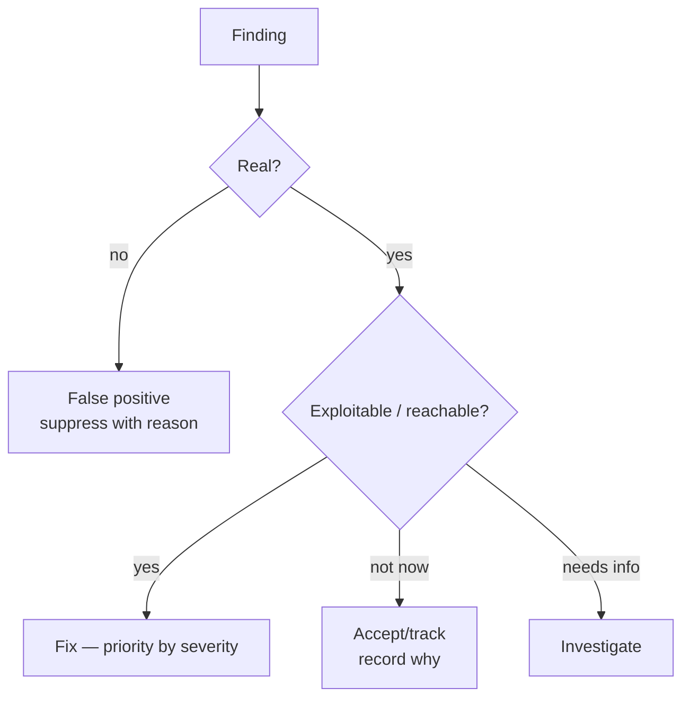

# 04-4 · Triage & false positives

> **Level:** Beginner · **Prerequisites:** [04-3 Dependency scanning (SCA)](03_dependency_scanning_sca.md)
> **Time:** 20 min · **Verified:** 2026-07-15

You now have several tools that each emit dozens of findings. The skill that
separates a useful audit from an ignored wall of red is **triage**: deciding what's
real, what matters, and what to do about each. A scanner that cries wolf gets
turned off — so this is as important as detection.

---

## Every finding gets one of four verdicts



- **True positive, exploitable** → fix, prioritised by severity × reachability.
- **True positive, not currently reachable** → track (it may become reachable).
- **False positive** → suppress *with a documented reason*.
- **Needs investigation** → dig in; don't guess.

---

## Prioritise: severity × reachability × exposure

Severity alone is a trap. A "critical" in dead code beats a "medium" on your login
page — reversed. Rank by:

1. **Reachability** — can untrusted input actually get here? (This is why your
   taint findings, CA201–203, are higher-signal than a pattern match on a constant.)
2. **Exposure** — is it on an unauthenticated, internet-facing path?
3. **Severity/impact** — RCE > SQLi > info leak.
4. **Confidence** — bandit's confidence axis; low-confidence needs a human first.

---

## False positives: expected, not failures

Every static tool over-approximates ([03-4](../03_static_analysis_with_ast/04_simple_taint_tracking.md)),
so false positives are normal. Handle them well:

- **Confirm** it's actually safe (read the code — don't suppress on a hunch).
- **Suppress specifically, with a reason** — never blanket-disable:

```python
query = build_trusted_query()  # nosec B608 — query is a constant template, no user input
```

```yaml
# semgrep: per-line
result = eval(EXPR)  # nosemgrep: dangerous-eval — EXPR is a validated numeric literal
```

- **Baseline** the existing pile so you gate only on *new* findings while you burn
  down the backlog.

A suppression without a reason is a landmine for the next reviewer. Always say
*why*.

---

## Write it up

A finding nobody can act on is wasted. Each report entry:

| Field | Example |
|---|---|
| **Where** | `app.py:32` |
| **What / CWE** | SQL injection (CWE-89) |
| **Severity** | High |
| **Evidence** | the tainted `execute(f"...{username}...")` |
| **Impact** | auth bypass / data exfiltration |
| **Fix** | parameterised query |
| **Status** | open / fixed / accepted (+ who/when) |

Your `codeaudit` **SARIF** output already carries where/what/severity per finding —
[05-2](../05_llm_assisted_and_shipping/02_ci_integration_and_reporting.md) feeds it
straight into CI and GitHub's security tab so the report writes itself.

---

## Recap & next

- ✅ Triage every finding to **fix / track / suppress / investigate** — a noisy
  scanner nobody reads is worthless.
- ✅ Prioritise by **reachability × exposure × severity**, not severity alone;
  taint findings outrank constant-pattern matches.
- ✅ **False positives are normal** — suppress *specifically and with a reason*;
  baseline the backlog.

## Exercise

bandit flags `import subprocess` (B404) in the sample app. Is that a true positive,
a false positive, or something else — and what's the right verdict?

<details>
<summary>Solution</summary>

It's neither exactly — B404 is an **informational prompt**, not a bug claim:
"you're using subprocess, make sure you use it safely." The *real* issue is the
`shell=True` call it enables (B602 / your CA102). Verdict: address the `shell=True`
finding; for the bare import, suppress with a reason (`# nosec B404 — subprocess
used with an argv list, reviewed`) or lower B404's priority in your config.

</details>

**→ Next: [05-1 · LLM-assisted code review](../05_llm_assisted_and_shipping/01_llm_assisted_review.md)**
