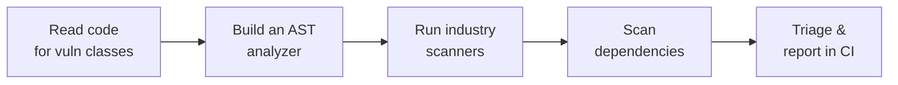

# Secure Code Audit & Vulnerability Detection (Python)

> **What you build:** a real, readable **static analysis tool** — `codeaudit` —
> that reads Python source with the stdlib `ast` module and reports
> vulnerabilities (SQL injection, command injection, insecure deserialization,
> weak crypto, hardcoded secrets, SSRF, path traversal), does a dependency
> (SCA) scan, emits **SARIF for CI**, and can add optional LLM triage. Along the
> way you learn to find these bugs **by hand**, then compare your tool to
> **bandit / semgrep / pip-audit**.

> **Verified:** 2026-07-15 against **Python 3.10.12** (stdlib `ast`/`tokenize`),
> **bandit 1.9.4**, **pip-audit**. The capstone auditor runs with **zero
> third-party dependencies** and was executed in this environment — scanning the
> bundled vulnerable app produced **14 findings** and the SCA check flagged **4**
> known-vulnerable pins; **all 16 tests pass**. Every sample output shown is real.
> Industry scanners and a local LLM are clearly labelled optional upgrades.

---

## This course vs. Ethical Hacking

The [Ethical Hacking](../ethical_hacking/) course finds vulnerabilities by
**attacking a running app** (curl, sqlmap, Burp, hydra against a live target).
This course finds them by **reading the source code** — before it ever runs. The
two are complementary halves of application security:

| | [Ethical Hacking](../ethical_hacking/) (DAST) | **This course** (SAST / SCA / review) |
|---|---|---|
| Method | Attack the running system from outside | Read the source from inside |
| Needs | A deployed, running target | Just the code |
| Finds | What's exploitable *right now* | Root causes, including unreachable-yet code |
| Tools | nmap, sqlmap, Burp, hydra | `ast`, bandit, semgrep, pip-audit |

The Ethical Hacking course explicitly hands off "SAST, secure code review, and
dependency scanning" to a later course. **This is that course.** Where a
vulnerability class overlaps (SQLi, XSS, IDOR) we link straight to its
"attack it" counterpart so you see both sides.

---

## What you'll be able to do



- **Read a Python codebase cold** and spot the major source-visible vulnerability
  classes.
- **Understand how SAST works** by building one — lexing/parsing, the AST,
  pattern rules, and simple taint tracking (source → sink).
- **Drive the real tools** — bandit, semgrep, pip-audit — and know each one's
  blind spots.
- **Triage findings** (severity, exploitability, false positives) and wire audits
  into **CI** with SARIF.

---

## The stack (and why)

| Piece | We use | Why |
|---|---|---|
| **Analyzer core** | stdlib **`ast`** | Zero deps; you can read every line. Teaches how *all* SAST works. |
| **Sample target** | a bundled **intentionally-vulnerable Flask app** | A safe, legal, annotated thing to audit (`# VULN:` markers) |
| **Industry SAST** | **bandit**, **semgrep** | The real tools; compared against your own for limits |
| **SCA** | offline dataset (default) → **pip-audit** | Dependency CVEs, offline first then live |
| **LLM triage** | built-in fake → local **Ollama** | Optional `--explain`; honest about where LLMs help vs hallucinate |

> **Why build our own before using bandit?** You don't truly understand a scanner
> until you've written one. Fifty lines of `ast` teach you what "pattern rule" and
> "taint" mean, why false positives happen, and exactly where the real tools are
> stronger. Then bandit/semgrep stop being magic.

---

## Course map

| # | Module | Time |
|---|---|---|
| 00 | [Introduction](00_introduction.md) | 15 min |
| **01** | **Foundations** | |
| 01-1 | [What is code audit? SAST vs DAST vs SCA](01_foundations/01_what_is_code_audit.md) | 20 min |
| 01-2 | [Environment setup](01_foundations/02_environment_setup.md) | 20 min |
| 01-3 | [Vulnerability classes you can see in source](01_foundations/03_vulnerability_classes.md) | 25 min |
| 01-4 | [Data flow & taint: sources and sinks](01_foundations/04_data_flow_and_taint.md) | 25 min |
| **02** | **Reading code for vulnerabilities (manual review)** | |
| 02-1 | [The review workflow](02_reading_code_for_vulns/01_the_review_workflow.md) | 20 min |
| 02-2 | [Injection: SQL, command, eval](02_reading_code_for_vulns/02_injection.md) | 30 min |
| 02-3 | [XSS, SSTI & output handling](02_reading_code_for_vulns/03_xss_ssti_and_output.md) | 25 min |
| 02-4 | [Auth, secrets & crypto](02_reading_code_for_vulns/04_auth_secrets_crypto.md) | 25 min |
| 02-5 | [Path traversal, SSRF & deserialization](02_reading_code_for_vulns/05_traversal_ssrf_deser.md) | 25 min |
| 02-6 | [Access control & IDOR](02_reading_code_for_vulns/06_access_control_idor.md) | 20 min |
| **03** | **Static analysis with AST (build your own)** | |
| 03-1 | [How SAST works](03_static_analysis_with_ast/01_how_sast_works.md) | 20 min |
| 03-2 | [AST basics](03_static_analysis_with_ast/02_ast_basics.md) | 25 min |
| 03-3 | [Writing detection rules](03_static_analysis_with_ast/03_writing_detection_rules.md) | 30 min |
| 03-4 | [Simple taint tracking](03_static_analysis_with_ast/04_simple_taint_tracking.md) | 30 min |
| **04** | **Industry tools & dependencies** | |
| 04-1 | [bandit](04_tools_and_dependencies/01_bandit.md) | 20 min |
| 04-2 | [semgrep & custom rules](04_tools_and_dependencies/02_semgrep.md) | 25 min |
| 04-3 | [Dependency scanning (SCA)](04_tools_and_dependencies/03_dependency_scanning_sca.md) | 25 min |
| 04-4 | [Triage & false positives](04_tools_and_dependencies/04_triage_and_false_positives.md) | 20 min |
| **05** | **LLM-assisted review & shipping** | |
| 05-1 | [LLM-assisted code review](05_llm_assisted_and_shipping/01_llm_assisted_review.md) | 25 min |
| 05-2 | [CI integration & reporting](05_llm_assisted_and_shipping/02_ci_integration_and_reporting.md) | 20 min |
| **99** | [Capstone: the `codeaudit` tool](99_project_codeaudit/README.md) | — |

**Total: ~7 hours** | Prerequisites: comfortable Python (functions, classes,
dicts); no security background needed.

---

## Quick start (offline, zero dependencies)

```bash
cd 99_project_codeaudit
python -m venv .venv && source .venv/bin/activate
pip install -r requirements.txt          # only pytest; the auditor itself needs nothing

# scan the bundled vulnerable app — real output, no network, no API key
python -m codeaudit.cli samples/vulnerable_app

# machine-readable for CI
python -m codeaudit.cli samples/vulnerable_app --format sarif

# add a dependency (SCA) scan
python -m codeaudit.cli samples/vulnerable_app --deps samples/vulnerable_app/requirements.txt

# all tests (offline)
python -m pytest -q          # 16 passed
```

> ⚠️ **Ethics:** the bundled app is *intentionally vulnerable* — audit it freely,
> but never deploy it or copy its patterns. Only audit code you own or are
> authorised to review.

---

## Related guides

- [Ethical Hacking](../ethical_hacking/) — the DAST/attack counterpart (SQLi, XSS, IDOR)
- [Docker](../docker/) — the security-scanning & CI/CD lesson pairs well with Section 05
- [LangChain & RAG](../langchain_rag/) / [LangGraph Proposal Agent](../langgraph_proposal_agent/) — the providers/`fake`-model pattern reused for `--explain`

→ Start here: **[00 · Introduction](00_introduction.md)**
