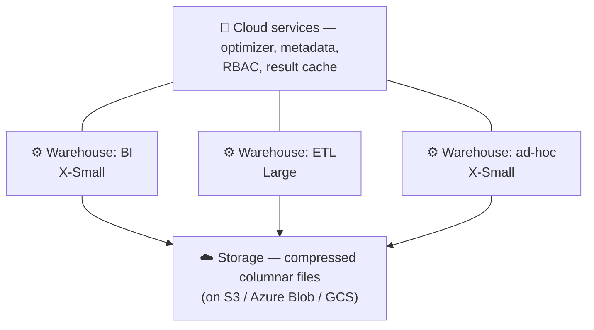

# 00 · Introduction

> **Level:** Beginner · **Prerequisites:** SQL (`SELECT`/`JOIN`/`GROUP BY`) and Python. A browser and an email address for the trial.
> **Time:** 15 min · **Verified:** 2026-08-22 (course conventions; every section verified against a live trial)

Your app's database and your company's *analytics* database are different animals. Postgres is built to serve a thousand tiny transactions a second; nobody wants it scanning three years of click events to answer "which links convert best by country?" That second job belongs to a **data platform** — and in a large share of companies, that platform is **Snowflake**.

This course teaches it the way you'd actually use it as a backend engineer: land your app's events, model them, query them from Python, secure them, and keep the bill sane.

---

## The one idea that explains Snowflake

Traditional databases couple **storage** and **compute** — the same machine holds the data and runs the queries, so scaling one means scaling both. Snowflake splits them into three independent layers:

One copy of the data; as many independent compute clusters as you want. The analytics team's dashboard doesn't slow down because ETL is running, because they're on different warehouses reading the same storage. **You pay for storage and compute separately**, and compute only while a warehouse is awake.

That single design decision explains nearly everything else in this course: why warehouses suspend, why credits are per-second, why there are no indexes, and why you can clone a whole database in seconds.

---

## ⚠️ What this course costs

Be clear-eyed before you start:

| | Other cloud courses here | **This course** |
|---|---|---|
| Environment | LocalStack — an emulator in a container | a **real Snowflake account** |
| Cost | free, offline | **real credits** (trial: 30 days / $400) |
| Can you fake it? | yes | **no — there is no Snowflake emulator** |

$400 over 30 days is a lot for learning — an X-Small warehouse that suspends properly costs very little. But it is finite and it is real. Three rules, from lesson one:

1. **X-Small warehouse, `AUTO_SUSPEND = 60`.** Never leave compute running.
2. **A resource monitor on day one** ([05-3](05_performance_and_cost/03_cost_guardrails.md)) — a hard cap that suspends spend at your quota.
3. **Drop what you create.** Teardown is part of the workflow, not an afterthought.

The upside: cost engineering *is* the job. [Section 05](05_performance_and_cost/) turns this constraint into one of the most marketable things you'll learn here.

---

## Snowflake is not an AWS service

Worth saying plainly, because it trips people up: Snowflake is an **independent company's platform that runs on top of** AWS, Azure, or GCP. You pick a cloud + region at signup, and your data sits in that provider's object storage — but you're using Snowflake's engine, billing, and console, not Amazon's.

| | Snowflake | Redshift | BigQuery |
|---|---|---|---|
| Vendor | Snowflake (multi-cloud) | AWS only | Google only |
| Compute model | virtual warehouses you size | clusters / serverless | fully serverless slots |
| Sold on | portability, ease, separation of storage/compute | AWS-native integration | zero-ops scale |

That independence is exactly why this is its own course and not a chapter of the [AWS/LocalStack](../aws_localstack/) one — and why the AWS course's LocalStack trick can't help you here.

---

## One project, six sections: linkstash analytics

You build an analytics warehouse for the **linkstash** link shortener (the same app the FastAPI and AWS courses build):

| Section | What happens |
|---------|--------------|
| 01 | Account, warehouse, credits — the ground rules |
| 02 | `linkstash_analytics` database; raw JSON clicks loaded via stage + `COPY INTO`; typed views over `VARIANT` |
| 03 | Query and load it from **Python** — connector, `write_pandas`, **Snowpark** |
| 04 | Lock it down: access roles, functional roles, future grants — and prove a denied query is denied |
| 05 | Read the Query Profile, fix pruning, cap the spend with a resource monitor |
| 06 | Automate it: **Snowpipe → stream → task**, plus Time Travel and zero-copy clones |

By section 06 you have a working, automated, secured, cost-capped pipeline — the thing a data-platform job description is describing.

---

## House rules

| ✅ Do | ❌ Don't |
|------|---------|
| `USE ROLE sysadmin` to create objects | work as `ACCOUNTADMIN` daily |
| `AUTO_SUSPEND = 60`, X-Small to start | leave a warehouse running "just in case" |
| Select the columns you need | `SELECT *` on a wide columnar table |
| Grants to **roles**, `FUTURE` grants for new objects | grant privileges to `PUBLIC` |
| Credentials from env / key-pair auth | hardcode a password in a script |
| Set a resource monitor before you experiment | discover the spend at the end of the month |

---

## Where this ends

[Section 99](99_capstone_linkstash_analytics.md) is a **specification**, not a walkthrough: build the whole linkstash analytics platform yourself — raw layer, modeled layer, Python loader, RBAC, cost guardrails, and an automated pipeline — and document what it cost you. That, plus a public repo of the SQL and Python, is a credible "I have used Snowflake" claim.

→ Start: **[Section 01 · Foundations](01_foundations/README.md)**
