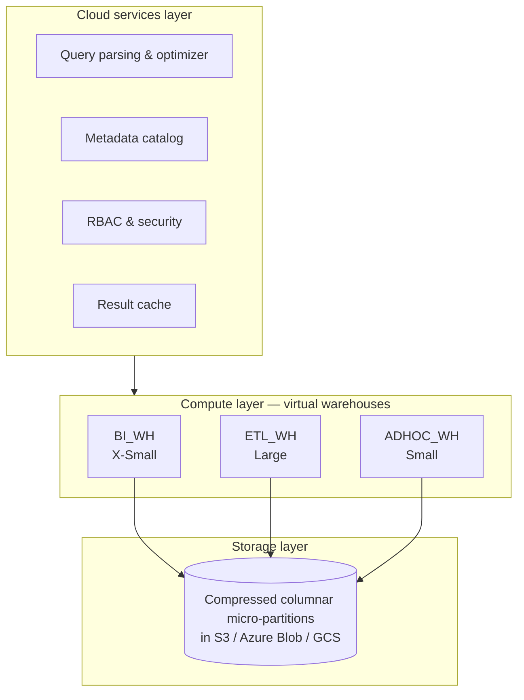

# 01-1 · What is Snowflake?

> **Level:** Beginner · **Prerequisites:** SQL basics; a browser
> **Time:** 20 min · **Verified:** 2026-08-22 (Snowflake trial: 30 days / $400 credits)

Snowflake is a **cloud data platform**: a SQL warehouse you rent rather than run.
You upload data, point compute at it, and pay for the seconds that compute is
awake. Nothing to install, no nodes to size, no vacuum jobs at 3am.

The problem it solves: your app's Postgres is fine at 10k rows and dies at 10
billion. Analysts want to scan every row of two years of events; that scan
competes with the checkout endpoint for the same CPU. Traditional answer — buy a
bigger box and hope. Snowflake's answer — put the data somewhere cheap and
durable, and rent as much or as little compute as each query deserves.

---

## The architecture

Three layers, each scaling independently:

- **Storage** — your tables, stored as compressed columnar files in the cloud
  provider's object storage. You never touch the files; you pay per TB stored per
  month. Cheap and effectively unlimited.
- **Compute** — **virtual warehouses**: independent clusters that spin up on
  demand, execute queries, and spin down. Each has its own local cache. Billed in
  **credits, per second, with a 60-second minimum** per start/resume ([01-3](03_warehouses_and_credits.md)).
- **Cloud services layer** — the brain: parses and optimises SQL, holds metadata
  and statistics, enforces RBAC, and serves the **result cache** (a repeated
  identical query can return with no warehouse running at all).

**The key idea: storage and compute are separated and billed separately.** In
Postgres, MySQL, or a classic Redshift cluster, the disk and the CPU are the same
machine — to get more CPU you also buy more disk, and to store more data you also
pay for CPU you may not need. Snowflake decouples them.

---

## Why decoupling actually matters

Three consequences you'll feel within a week:

- **No resource contention.** The BI team's dashboards run on `BI_WH`; the nightly
  ETL runs on `ETL_WH`. Same tables, same single copy of the data, zero fighting.
  In a coupled database, the ETL job slows the dashboards down — there is only one
  pool of CPU.
- **Right-size per job, not per cluster.** One ETL job needs to rewrite 500 GB?
  Resize its warehouse to Large for the run, then back to X-Small. The resize is a
  SQL statement, not a migration.
- **Scale to zero.** Storage keeps costing (a few dollars a month for a hobby
  dataset); compute costs *nothing* while suspended. This is why auto-suspend is
  the single most important setting in the product.

---

## Snowflake vs your app's Postgres

They are not competitors. They are different shapes of database.

| | Snowflake (OLAP) | Postgres (OLTP) |
|---|---|---|
| Workload | analytics: scan/aggregate many rows, few columns | transactions: read/write single rows |
| Storage layout | **columnar** — a column's values sit together, compress hard | **row-based** — a whole row sits together |
| Typical query | `SUM(amount) GROUP BY month` over 2B rows | `SELECT * FROM users WHERE id = 42` |
| Good at | full-table scans, wide joins, aggregation | point lookups, single-row updates, low latency |
| Bad at | serving a web request in 5 ms; per-row updates | scanning a billion rows for one report |
| Latency | hundreds of ms to minutes | sub-millisecond |
| Concurrency model | separate warehouses per workload | one connection pool, one machine |
| Indexes | none to manage (micro-partition pruning instead) | you design them |

Columnar is the whole trick: `SUM(amount)` reads only the `amount` column and skips
the other 40, and because a column holds one data type it compresses far better
than a row does.

**Snowflake is NOT a replacement for your app's Postgres.** Do not put your
FastAPI app's `users` table in it. The correct architecture is *both*: Postgres
serves the application, and data flows from Postgres into Snowflake for analytics.

---

## Snowflake vs Redshift vs BigQuery

Honest version: all three are columnar cloud warehouses and any of them will do
the job. The real differences are operational. **Snowflake is multi-cloud — it
runs *on top of* AWS, Azure, or GCP, but it is not an AWS service**; you sign up
with Snowflake, pick a provider and region, and Snowflake rents the infrastructure
on your behalf. Redshift is AWS-native (cheaper if you are all-in on AWS, more
cluster management historically), BigQuery is GCP-native and bills per byte
scanned rather than per second of compute. Snowflake's pitch is that it hides the
infrastructure most completely and lets you move clouds without a rewrite — that
neutrality is exactly why so many companies standardise on it.

Editions come in tiers — **Standard**, **Enterprise**, **Business Critical** —
gating features rather than performance (Enterprise adds multi-cluster warehouses
and longer Time Travel; Business Critical adds stricter compliance and encryption
controls). The trial gives you Enterprise; assume Standard when in doubt.

---

## Why it's on job descriptions

Snowflake is the default analytics warehouse at a large share of mid-size and
enterprise companies, which makes it the place data-engineering work actually
happens: pipelines land data in it, dbt transforms inside it, BI tools read from
it. For a Python/backend engineer it's a short hop — it's SQL plus a Python
connector — and it's the piece that turns "backend engineer" into "engineer who
can own the data path". Add cost awareness on top and you are ahead of most
candidates, because the expensive mistakes in Snowflake are all compute mistakes.

---

## Recap & next

- ✅ **Three layers** — storage (columnar files in S3/Blob/GCS), compute (virtual
  warehouses), cloud services (optimizer, metadata, RBAC, result cache) — each
  scaling independently.
- ✅ **Storage and compute are separated and billed separately**: one copy of the
  data, many independent warehouses, compute costs nothing while suspended.
- ✅ **OLAP, not OLTP** — columnar scans and aggregation, *not* a replacement for
  your app's Postgres. Run both, and pipe one into the other.
- ✅ Snowflake **runs on** AWS/Azure/GCP and is not an AWS service; that
  multi-cloud neutrality is its differentiator against Redshift and BigQuery.

## Exercise

You have a FastAPI app on Postgres with an `orders` table. Product wants a
dashboard showing revenue per country per month over three years — a query that
currently takes 40 seconds and locks up the API. Where does each piece live, and
why not simply add an index in Postgres?

Solution

- **Postgres keeps `orders`** — it serves the app: writes, order lookups, the
  checkout path. Unchanged.
- **A copy of `orders` lands in Snowflake** (loading is [section 02](../02_sql_and_loading/README.md)), and the dashboard queries Snowflake on its own small warehouse.

An index doesn't fix it because the query isn't a lookup — it's an *aggregation
over nearly every row*. An index helps you find few rows among many; here you need
all of them, so Postgres does a full row-based scan, pulling every column of every
row off disk to sum one of them. Snowflake reads only `amount`, `country`, and
`created_at`, compressed, in parallel. The second, larger win is isolation: the
scan runs on a warehouse that shares no CPU with your API, so a slow dashboard can
no longer slow down checkout.

**→ Next: [01-2 · Trial setup & Snowsight](02_trial_setup_and_snowsight.md)**
