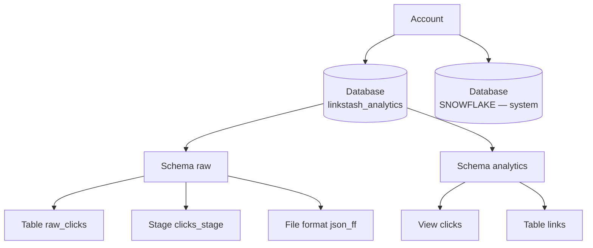

# 02-1 · Databases, schemas & tables

> **Level:** Beginner · **Prerequisites:** [01-3 Virtual warehouses & credits](../01_foundations/03_warehouses_and_credits.md)
> **Time:** 25 min · **Verified:** 2026-08-22 (Snowflake trial)

A warehouse gives you compute; now you need somewhere to put data. Snowflake's
namespace is three levels deep and every object lives in exactly one schema. Get the
layout right once and the rest of the course has a home — we're building
**linkstash analytics**, the warehouse behind the link shortener.

---

## The hierarchy



Four levels of naming, three of which you create: **account → database → schema →
object**. Tables, views, stages, file formats, streams, tasks — all of them are
*schema-level* objects, which is why a stage and a table can collide on a name.

The fully-qualified name is `database.schema.object`:

```sql
SELECT * FROM linkstash_analytics.raw.raw_clicks;   -- always unambiguous
```

### Context vs qualification

A session carries a current database and schema, so you can drop the prefix:

```sql
USE DATABASE linkstash_analytics;
USE SCHEMA raw;
SELECT * FROM raw_clicks;                 -- resolves to linkstash_analytics.raw.raw_clicks
SELECT CURRENT_DATABASE(), CURRENT_SCHEMA();
```

Convenient while you're poking around in Snowsight. **Bad in anything saved** — a
script, a task, a dbt model, a Python job. Context is per-session state: run the same
file with a different `USE SCHEMA` in effect and it silently reads or *writes* the
wrong table. Interactive work uses context; committed code uses fully-qualified names.

---

## Create the database and schemas

```sql
CREATE DATABASE IF NOT EXISTS linkstash_analytics;

CREATE SCHEMA IF NOT EXISTS linkstash_analytics.raw;        -- landing zone: as-delivered data
CREATE SCHEMA IF NOT EXISTS linkstash_analytics.analytics;  -- modeled, typed, business-facing
```

Every new database also gets a `PUBLIC` schema and an `INFORMATION_SCHEMA` for free.
Ignore `PUBLIC`; it's the junk drawer.

The **raw → modeled** split is the convention worth adopting on day one:

- **`raw`** — whatever the source sent, unmodified, append-only. Reloadable from the
  source files, so a bug in your modeling never loses data.
- **`analytics`** — typed, cleaned, renamed, joined. What dashboards and colleagues
  query.

Two schemas also give you two blast radii: you can `DROP SCHEMA analytics` and rebuild
it from `raw` without touching anything expensive to re-fetch.

---

## Creating tables

```sql
CREATE OR REPLACE TABLE linkstash_analytics.analytics.links (
    slug        VARCHAR(32)    NOT NULL,   -- VARCHAR length is a constraint, not an allocation
    target_url  VARCHAR,                   -- no length = max (16 MB); costs nothing extra
    created_at  TIMESTAMP_NTZ  DEFAULT CURRENT_TIMESTAMP(),
    click_count NUMBER(38,0)   DEFAULT 0,
    is_active   BOOLEAN        DEFAULT TRUE
);
```

The types you'll actually use:

| Type | Notes |
|---|---|
| `NUMBER(p,s)` | The only numeric type that matters. `INT`, `BIGINT`, `DECIMAL`, `NUMERIC` are all aliases for `NUMBER(38,0)`. `FLOAT` exists for true approximate math. |
| `VARCHAR(n)` | Also `STRING`, `TEXT`. `n` is only a check — Snowflake stores the actual bytes, so `VARCHAR` and `VARCHAR(10)` cost the same. |
| `TIMESTAMP_NTZ` | "No time zone" — a wall-clock instant, stored as given. |
| `TIMESTAMP_TZ` | Stores the offset with the value. |
| `TIMESTAMP_LTZ` | Stored as UTC, *rendered* in the session's `TIMEZONE`. |
| `BOOLEAN` | Three-valued: `TRUE`/`FALSE`/`NULL`. |
| `VARIANT` | Self-describing JSON/Avro/XML in one column — [02-3](03_semi_structured_json.md). |
| `DATE`, `ARRAY`, `OBJECT`, `BINARY` | Round out the set. |

**Pick a timestamp type deliberately.** `clicked_at` arriving as an ISO string with a
`Z` should be `TIMESTAMP_NTZ` holding UTC (simple, comparable, no surprises) or
`TIMESTAMP_TZ` if you genuinely need the originating offset. `TIMESTAMP_LTZ` is the
trap: the same query returns different-looking results for two colleagues in different
time zones. Store UTC, convert at the edge.

---

## Permanent vs transient vs temporary

Same syntax, one keyword, very different bills:

```sql
CREATE TABLE           linkstash_analytics.analytics.links AS ...;      -- permanent
CREATE TRANSIENT TABLE linkstash_analytics.raw.raw_clicks   AS ...;     -- transient
CREATE TEMPORARY TABLE scratch_dedupe AS ...;                           -- session-only
```

| | Time Travel | Fail-safe | Lifetime | Storage cost |
|---|---|---|---|---|
| **Permanent** | 0–90 days (1 on trial/Standard) | **+7 days, non-negotiable** | until dropped | highest |
| **Transient** | 0–1 day | **none** | until dropped | lower |
| **Temporary** | 0–1 day | none | your session | lowest |

**Fail-safe** is the money line. It's a 7-day disaster-recovery window *after* Time
Travel expires that only Snowflake support can access — you pay for those bytes and
can never use them yourself. For a `raw` table you can re-`COPY INTO` from the source
files any time, that's pure waste.

Rules of thumb:

- **Transient** for anything reloadable: raw landing tables, staging/intermediate
  tables, tables a pipeline rebuilds nightly. This is most of a warehouse.
- **Permanent** for data that exists nowhere else — the source of truth you'd cry over.
- **Temporary** for scratch inside one script. It vanishes on disconnect, so it cannot
  leak cost. Note it *shadows* a permanent table of the same name in your session,
  which is either a handy trick or an evening of confusion.

A transient table also cannot be cloned to a permanent one, so decide before the data
matters.

---

## Constraints are documentation, not rules

Snowflake accepts the full constraint syntax and enforces almost none of it:

```sql
CREATE OR REPLACE TRANSIENT TABLE linkstash_analytics.analytics.clicks (
    click_id   NUMBER      PRIMARY KEY,                -- NOT enforced
    slug       VARCHAR(32) REFERENCES links(slug),     -- NOT enforced
    clicked_at TIMESTAMP_NTZ,
    country    VARCHAR(2)  UNIQUE,                     -- NOT enforced
    user_agent VARCHAR     NOT NULL                    -- *** enforced ***
);
```

**`NOT NULL` is the only constraint Snowflake enforces.** `PRIMARY KEY`, `UNIQUE`,
`FOREIGN KEY` are metadata only: they're stored, they show up in `DESC TABLE`, BI tools
and dbt read them to infer joins and generate ERDs — and you can insert ten rows with
the same "primary key" and an orphan `slug` that matches no link, with no error.

If you came from Postgres or MySQL this is the single most surprising thing in this
lesson, so internalise the consequence: **duplicate and referential-integrity checks
are your job.** In practice that means `MERGE` instead of blind `INSERT`, a
`QUALIFY ROW_NUMBER() OVER (PARTITION BY ... ORDER BY ...) = 1` dedupe in your
modeling views, and data tests (dbt's `unique`/`not_null`, or a scheduled query) that
*assert* what the constraint claims.

Why the design? Enforcing uniqueness on every insert means a read-check across the
whole table — the opposite of a columnar analytics store built for million-row bulk
loads. Snowflake trades the guarantee for the throughput. Declare the keys anyway;
they're free and they make your model legible.

---

## Micro-partitions, and why there are no indexes

Every table is stored as **micro-partitions**: immutable, compressed, columnar files of
roughly 50–500 MB of uncompressed data each, created automatically as you load. For
each partition and each column Snowflake keeps metadata — min/max value, distinct
count, null count. A `WHERE clicked_at >= '2026-08-01'` is answered by reading that
metadata and *skipping* every partition whose max is below the bound (**pruning**), and
within a surviving partition only the columns you selected are read. That's why there
are no indexes to create, no `VACUUM`, no `ANALYZE`, and no partitioning DDL: the
physical layout is not yours to manage. You influence it only by *insert order* (rows
loaded together land together, so time-ordered loads prune well on time) and, on big
tables, by paying for automatic clustering — a later concern. Immutability is also what
makes Time Travel and zero-copy cloning cheap: an update writes new partitions and the
old ones simply stay referenced by the older table version.

---

## Everyday commands

```sql
SHOW DATABASES;
SHOW SCHEMAS IN DATABASE linkstash_analytics;
SHOW TABLES IN SCHEMA linkstash_analytics.analytics;   -- kind, rows, bytes, retention
DESC TABLE linkstash_analytics.analytics.clicks;       -- columns, types, nullability, keys
```

```
+------------+--------------+--------+-------+---------+-------------+
| name       | type         | kind   | null? | default | primary key |
|------------+--------------+--------+-------+---------+-------------|
| CLICK_ID   | NUMBER(38,0) | COLUMN | Y     | NULL    | Y           |
| SLUG       | VARCHAR(32)  | COLUMN | Y     | NULL    | N           |
| CLICKED_AT | TIMESTAMP_NTZ| COLUMN | Y     | NULL    | N           |
| COUNTRY    | VARCHAR(2)   | COLUMN | Y     | NULL    | N           |
| USER_AGENT | VARCHAR      | COLUMN | N     | NULL    | N           |
+------------+--------------+--------+-------+---------+-------------+
```

Note `CLICK_ID` shows `primary key = Y` *and* `null? = Y` — the metadata-only story,
visible in the output.

Unquoted identifiers are folded to **UPPERCASE**. `create table Clicks` and
`CREATE TABLE CLICKS` are the same table; `CREATE TABLE "Clicks"` is a third, distinct
one that you must quote forever after. Don't quote identifiers.

`CREATE OR REPLACE` is the idiom you'll type most — it drops and recreates atomically,
which is perfect for rerunnable scripts. It also **discards the data and resets the
table's history**, so it's for definitions you can rebuild, not for tables you're
appending to.

Cleanup, since credits and storage are finite:

```sql
DROP TABLE IF EXISTS linkstash_analytics.analytics.clicks;
UNDROP TABLE linkstash_analytics.analytics.clicks;   -- within Time Travel: it's back
DROP DATABASE IF EXISTS linkstash_analytics;         -- takes schemas and tables with it
```

`UNDROP` and `SELECT ... AT(OFFSET => -600)` are Time Travel, covered properly later.
For now just know a `DROP` is recoverable for a day (trial retention) — a nice safety
net, and a reason dropped-but-not-yet-expired tables still cost storage.

---

## Recap & next

- ✅ **Account → database → schema → object**; qualify as `db.schema.object` in
  anything you save, use `USE` only interactively.
- ✅ `linkstash_analytics` with **`raw`** (as-delivered, transient) and **`analytics`**
  (typed, modeled) schemas.
- ✅ `NUMBER`/`VARCHAR`/`TIMESTAMP_NTZ`/`BOOLEAN`/`VARIANT` cover almost everything;
  store UTC in `TIMESTAMP_NTZ` rather than `TIMESTAMP_LTZ`.
- ✅ **Transient** for reloadable data (no Fail-safe = no 7 days of dead storage),
  **temporary** for scratch, **permanent** only for the source of truth.
- ✅ **Only `NOT NULL` is enforced** — PK/FK/UNIQUE are metadata for tools; dedupe and
  integrity are your job.
- ✅ **Micro-partitions** are automatic, immutable and columnar, so there are no
  indexes to build and no partitions to manage.

## Exercise

Create the `raw.raw_clicks` landing table for [02-2](02_stages_and_copy_into.md): it
takes one raw click event per row with `slug`, `clicked_at`, `country`, `user_agent`
and `referrer`, and will be reloaded from source files whenever the modeling changes.
Which table type, and why? Then prove that the `PRIMARY KEY` you declare on `slug` in
`analytics.links` isn't enforced.

<details>
<summary>Solution</summary>

```sql
CREATE OR REPLACE TRANSIENT TABLE linkstash_analytics.raw.raw_clicks (
    slug       VARCHAR(32),
    clicked_at TIMESTAMP_NTZ,        -- UTC wall clock; no LTZ surprises
    country    VARCHAR(2),
    user_agent VARCHAR,
    referrer   VARCHAR,
    loaded_at  TIMESTAMP_NTZ DEFAULT CURRENT_TIMESTAMP()   -- audit: when *we* ingested it
);
```

**Transient**, because every row can be re-created by re-running `COPY INTO` from the
staged files. Permanent would add a 7-day Fail-safe window you pay for and can never
query yourself — pure waste on data that has a source of record elsewhere. Note also
that the raw table has no constraints at all: filtering bad rows is the modeling
layer's job, and constraints wouldn't enforce it anyway.

Proving PK is metadata:

```sql
INSERT INTO linkstash_analytics.analytics.links (slug, target_url) VALUES ('abc123', 'https://a.com');
INSERT INTO linkstash_analytics.analytics.links (slug, target_url) VALUES ('abc123', 'https://b.com');
SELECT slug, COUNT(*) FROM linkstash_analytics.analytics.links GROUP BY slug;
```

```
+--------+----------+
| SLUG   | COUNT(*) |
|--------+----------|
| abc123 |        2 |
+--------+----------+
```

Two rows, same "primary key", no error. In a real pipeline this is why you write
`MERGE INTO links USING staged ON links.slug = staged.slug` instead of `INSERT`.

</details>

**→ Next: [02-2 · Stages, file formats & COPY INTO](02_stages_and_copy_into.md)**
