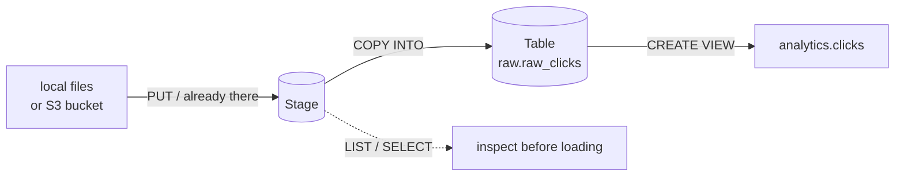

# 02-2 · Stages, file formats & COPY INTO

> **Level:** Intermediate · **Prerequisites:** [02-1 Databases, schemas & tables](01_databases_schemas_tables.md)
> **Time:** 30 min · **Verified:** 2026-08-22 (Snowflake trial)

Rows don't arrive as `INSERT` statements. They arrive as files — CSV exports, JSON
dumps, Parquet from a Spark job, gzipped logs on S3. Snowflake's bulk path for all of
them is the same three steps, and its loader is idempotent by default in a way that
saves you from the classic double-load incident.

---

## The load pattern



A **stage** is a file location Snowflake knows how to read. It is not a table and holds
no rows — just files, addressed with an `@` prefix. `COPY INTO` is the bulk loader that
parses staged files into a table using a **file format**.

---

## Internal vs external stages

**Internal** stages are storage Snowflake manages for you. Three flavours, and you
already have two:

```sql
LIST @~;                                  -- user stage: your personal scratch, always exists
LIST @%raw_clicks;                        -- table stage: implicit, one per table, loads only to that table
CREATE STAGE IF NOT EXISTS linkstash_analytics.raw.clicks_stage;   -- named stage
```

Prefer a **named stage**. It's a real schema object, so it can carry a default file
format, be granted to a role, and be shared between tables — the table stage can't do
any of that, and `@~` is per-user, which makes it useless for a pipeline.

**External** stages point at a bucket you own, via a **storage integration** that holds
the cloud credentials:

```sql
-- One-time, ACCOUNTADMIN: the integration is the credential, the stage is the pointer.
CREATE STORAGE INTEGRATION s3_linkstash
    TYPE = EXTERNAL_STAGE
    STORAGE_PROVIDER = 'S3'
    STORAGE_AWS_ROLE_ARN = 'arn:aws:iam::123456789012:role/snowflake-loader'
    STORAGE_ALLOWED_LOCATIONS = ('s3://linkstash-events/clicks/');

CREATE STAGE linkstash_analytics.raw.s3_clicks
    URL = 's3://linkstash-events/clicks/'
    STORAGE_INTEGRATION = s3_linkstash
    FILE_FORMAT = (TYPE = JSON);
```

**This is how real pipelines land data.** Your app writes click events to S3 (or the
Firehose does), and Snowflake reads them in place — no upload step, no local machine in
the path, and the same objects stay available to Athena, Glue or anything else. The
integration uses an **IAM role assumption**, not access keys: Snowflake gives you an
IAM user ARN and an external ID, you trust those in the role's trust policy. Same
cross-account pattern as any other AWS service integration.

Internal stages are for hand-loading, one-off files, and course exercises. External
stages are for production — and they're also the prerequisite for **Snowpipe**
auto-ingest, where an S3 event notification triggers the load seconds after the file
lands. Same stage, no `COPY` to schedule.

---

## File formats

A file format is a named, reusable parser config. Inlining the options in every `COPY`
works and is how you'll debug, but a named format means one place to fix when the
source adds a column or switches to CRLF.

```sql
CREATE OR REPLACE FILE FORMAT linkstash_analytics.raw.csv_clicks
    TYPE = CSV
    FIELD_DELIMITER = ','
    SKIP_HEADER = 1                        -- the header row is not data
    FIELD_OPTIONALLY_ENCLOSED_BY = '"'     -- required if any value contains a comma
    NULL_IF = ('', 'NULL', 'null', '\\N')  -- what counts as NULL, not as the string "NULL"
    EMPTY_FIELD_AS_NULL = TRUE
    TRIM_SPACE = FALSE
    DATE_FORMAT = 'AUTO'
    TIMESTAMP_FORMAT = 'AUTO';             -- AUTO handles ISO-8601; set explicitly for odd formats
```

```sql
CREATE OR REPLACE FILE FORMAT linkstash_analytics.raw.json_clicks
    TYPE = JSON
    STRIP_OUTER_ARRAY = TRUE               -- a file that is one big [ {...}, {...} ] → one row each
    COMPRESSION = AUTO;                    -- .gz detected from the extension
```

`STRIP_OUTER_ARRAY` is the JSON option that bites everyone: without it a 10 000-element
array file loads as **one** row containing an array. With it, 10 000 rows. NDJSON
(one object per line) needs it off.

`FIELD_OPTIONALLY_ENCLOSED_BY` is the CSV equivalent — leave it out and the first
`user_agent` containing a comma shifts every column after it.

```sql
SHOW FILE FORMATS IN SCHEMA linkstash_analytics.raw;
```

---

## Getting files onto an internal stage: `PUT`

```bash
# From SnowSQL (or the Python connector's execute()) — not from the browser.
snowsql -a <account> -u <user>
```

```sql
PUT file:///home/me/data/clicks_2026_08_21.csv @linkstash_analytics.raw.clicks_stage
    AUTO_COMPRESS = TRUE        -- gzip on upload: less network, less stage storage
    PARALLEL = 8;               -- concurrent upload threads for large/many files
```

```
+---------------------------+------------------------------+-------------+-------------+--------------------+--------------------+----------+---------+
| source                    | target                       | source_size | target_size | source_compression | target_compression | status   | message |
|---------------------------+------------------------------+-------------+-------------+--------------------+--------------------+----------+---------|
| clicks_2026_08_21.csv     | clicks_2026_08_21.csv.gz     |      184320 |       21456 | NONE               | GZIP               | UPLOADED |         |
+---------------------------+------------------------------+-------------+-------------+--------------------+--------------------+----------+---------+
```

**`PUT` does not work in a Snowsight worksheet.** It's a client-side command — the
client reads your filesystem and uploads the bytes — so it only runs where a client has
filesystem access: **SnowSQL**, the **Python/JDBC/ODBC connectors**, the Snowflake CLI.
A worksheet in your browser has no such access and will reject it. (Snowsight *does*
have a separate "Load data" wizard for small files, which does the equivalent behind
the scenes, and `GET` is the same story in reverse for downloads.)

Since `PUT` needs a client, this is the first place the course genuinely needs Python —
which is [Section 03](../03_python_and_snowpark/README.md).

Confirm and inspect:

```sql
LIST @linkstash_analytics.raw.clicks_stage;            -- name, size, md5, last_modified
LIST @linkstash_analytics.raw.clicks_stage PATTERN = '.*2026_08.*[.]gz';
REMOVE @linkstash_analytics.raw.clicks_stage/old.csv.gz;   -- staged files cost storage
```

---

## Peek before you load

You can query a stage directly. `$1` is the whole record for JSON, or column 1 for CSV:

```sql
-- CSV: positional columns, everything is text at this point
SELECT $1 AS slug, $2 AS clicked_at, $3 AS country
FROM @linkstash_analytics.raw.clicks_stage/clicks_2026_08_21.csv.gz
     (FILE_FORMAT => 'linkstash_analytics.raw.csv_clicks')
LIMIT 5;

-- JSON: $1 is a VARIANT, so paths work immediately
SELECT $1:slug::VARCHAR, $1:geo.country::VARCHAR
FROM @linkstash_analytics.raw.clicks_stage/events.json.gz
     (FILE_FORMAT => 'linkstash_analytics.raw.json_clicks')
LIMIT 5;
```

Thirty seconds of this beats a failed `COPY` and a guess about which column moved. It's
also how you discover the actual shape of a JSON payload before writing the DDL.

---

## `COPY INTO`

```sql
COPY INTO linkstash_analytics.raw.raw_clicks
       (slug, clicked_at, country, user_agent, referrer)   -- target columns, in order
FROM @linkstash_analytics.raw.clicks_stage
FILE_FORMAT = (FORMAT_NAME = 'linkstash_analytics.raw.csv_clicks')
PATTERN = '.*clicks_2026_08.*[.]csv[.]gz'   -- regex over the whole stage; skips unrelated files
ON_ERROR = ABORT_STATEMENT;                 -- default: one bad row and nothing loads
```

```
+---------------------------------+--------+-------------+-------------+-------------+-------------+
| file                            | status | rows_parsed | rows_loaded | error_limit | errors_seen |
|---------------------------------+--------+-------------+-------------+-------------+-------------|
| clicks_stage/clicks_2026_08_21… | LOADED |        4812 |        4812 |           1 |           0 |
| clicks_stage/clicks_2026_08_22… | LOADED |        5140 |        5140 |           1 |           0 |
+---------------------------------+--------+-------------+-------------+-------------+-------------+
```

If the file's columns don't line up with the table's, use a transforming `COPY` —
a `SELECT` over the stage, which also lets you cast and drop columns on the way in:

```sql
COPY INTO linkstash_analytics.raw.raw_clicks (slug, clicked_at, country)
FROM (
    SELECT $1,
           TO_TIMESTAMP_NTZ($2),            -- cast during load, not after
           UPPER($4)                         -- reorder/skip columns freely
    FROM @linkstash_analytics.raw.clicks_stage
)
FILE_FORMAT = (FORMAT_NAME = 'linkstash_analytics.raw.csv_clicks');
```

### `ON_ERROR`: pick per source, not per habit

| Value | Behaviour | Use when |
|---|---|---|
| `ABORT_STATEMENT` | *(default)* first bad row rolls back the whole statement | Financial/critical loads where a partial load is worse than no load. Also the right default while developing a new format. |
| `CONTINUE` | skip bad **rows**, load the rest | Messy, high-volume, best-effort feeds (clickstream, logs) where losing 3 malformed rows out of 5 million is fine. |
| `SKIP_FILE` | skip the whole **file** on any error | A file is one atomic delivery — a partial day of clicks would skew a daily aggregate more than a missing day. |
| `SKIP_FILE_<n>` / `SKIP_FILE_<n>%` | skip the file past *n* errors | Tolerate a little noise, quarantine genuinely broken files. `SKIP_FILE_5%` is a good production setting. |

With `CONTINUE` or `SKIP_FILE`, **check what you dropped** — a silent skip is a data
bug that shows up a month later in a dashboard:

```sql
SELECT * FROM TABLE(VALIDATE(linkstash_analytics.raw.raw_clicks, JOB_ID => '_last'));
```

### Dry-run first: `VALIDATION_MODE`

```sql
COPY INTO linkstash_analytics.raw.raw_clicks
FROM @linkstash_analytics.raw.clicks_stage
FILE_FORMAT = (FORMAT_NAME = 'linkstash_analytics.raw.csv_clicks')
VALIDATION_MODE = 'RETURN_ERRORS';   -- parse everything, load nothing
```

```
+-----------------------------------------+---------------------+------+-----------+-------------+
| error                                   | file                | line | character | rejected_record |
|-----------------------------------------+---------------------+------+-----------+-------------|
| Timestamp '21/08/2026 14:03' is not rec… | clicks_2026_08_21.… |  318 |        41 | abc123,21/08…  |
| Numeric value 'n/a' is not recognized   | clicks_2026_08_21.… |  902 |        64 | xy9,2026-08-…  |
+-----------------------------------------+---------------------+------+-----------+-------------+
```

Also `VALIDATION_MODE = 'RETURN_10_ROWS'` to see what would land, and
`'RETURN_ALL_ERRORS'`. Note the dry run **still runs the warehouse** and still costs
credits — it's cheap insurance, not free. Run it once on a new source, then drop it.

---

## Load idempotency — the feature that saves you

`COPY INTO` keeps **load metadata per table**: for every file it loaded, the path, ETag
and row count, retained for **~64 days**. Re-running the same `COPY` therefore *skips
files it has already loaded*:

```sql
COPY INTO linkstash_analytics.raw.raw_clicks FROM @linkstash_analytics.raw.clicks_stage
    FILE_FORMAT = (FORMAT_NAME = 'linkstash_analytics.raw.csv_clicks');
```

```
+-----------------------------------------------------------------------+
| status                                                                |
|-----------------------------------------------------------------------|
| Copy executed with 0 files processed.                                 |
+-----------------------------------------------------------------------+
```

This is what makes a load **rerunnable**. A `COPY` that timed out, a task that fired
twice, a nightly job re-run after a failure — none of them duplicate rows. Since
Snowflake enforces no primary key ([02-1](01_databases_schemas_tables.md)), this
metadata *is* your protection against double-loading. Write loaders as "COPY the whole
stage" and let Snowflake work out what's new, rather than tracking loaded filenames
yourself.

Three edges worth knowing:

- **The window is ~64 days.** A file still sitting on the stage 65 days later will load
  again on the next `COPY`. Real pipelines `REMOVE` or lifecycle files off the stage
  after load, which sidesteps this entirely.
- **The metadata is per target table.** Loading the same file into a second table
  works fine — the tables track independently.
- **Same filename, new contents** counts as a re-load candidate only if the ETag/size
  changed. Overwriting `latest.csv` in place is an anti-pattern; use dated filenames.

`FORCE = TRUE` ignores the metadata and loads everything:

```sql
COPY INTO linkstash_analytics.raw.raw_clicks FROM @linkstash_analytics.raw.clicks_stage
    FILE_FORMAT = (FORMAT_NAME = 'linkstash_analytics.raw.csv_clicks')
    FORCE = TRUE;   -- ⚠ re-loads already-loaded files: duplicate rows, no error, no warning
```

**`FORCE = TRUE` duplicates data.** It's correct in exactly two situations: you just
truncated the table and want a clean reload, or you're loading into a fresh table. It is
not a fix for "the COPY says 0 files processed" — that message usually means the load
already succeeded. Check before you force:

```sql
SELECT COUNT(*) FROM linkstash_analytics.raw.raw_clicks;
```

### Auditing loads: `COPY_HISTORY`

```sql
SELECT file_name, row_count, row_parsed, error_count, status, last_load_time
FROM TABLE(INFORMATION_SCHEMA.COPY_HISTORY(
    TABLE_NAME  => 'linkstash_analytics.raw.raw_clicks',
    START_TIME  => DATEADD(hour, -24, CURRENT_TIMESTAMP())
))
ORDER BY last_load_time DESC;
```

```
+--------------------------+-----------+------------+-------------+--------+-------------------------+
| FILE_NAME                | ROW_COUNT | ROW_PARSED | ERROR_COUNT | STATUS | LAST_LOAD_TIME          |
|--------------------------+-----------+------------+-------------+--------+-------------------------|
| clicks_stage/clicks_2026…|      5140 |       5140 |           0 | Loaded | 2026-08-22 09:14:02.113 |
| clicks_stage/clicks_2026…|      4809 |       4812 |           3 | Loaded | 2026-08-21 09:13:47.008 |
+--------------------------+-----------+------------+-------------+--------+-------------------------+
```

Row 2 parsed 4812 and loaded 4809 — three rows silently dropped by `ON_ERROR =
CONTINUE`. **This is the query to alert on** (`error_count > 0`), because nothing else
tells you. There's also `SNOWFLAKE.ACCOUNT_USAGE.COPY_HISTORY` with a longer retention
(365 days) but up to ~2 hours of latency; the `INFORMATION_SCHEMA` table function is
near-real-time over 14 days.

---

## Cost note: sizing a load

Loading is warehouse work, so it burns credits — but the arithmetic isn't what OLTP
instincts suggest.

- **A bigger warehouse costs more per second and finishes proportionally sooner**, so
  total credits for a well-parallelised load are roughly *flat* across sizes. X-Small
  for 8 minutes ≈ Small for 4 minutes ≈ Medium for 2 minutes. Size up for wall-clock,
  not to save money.
- **That only holds if there's work to spread.** Each warehouse node loads files in
  parallel — an X-Small has 8 threads, and every size up doubles them. **One 5 GB file
  is one thread**, so a Large warehouse loading a single file is 7/8 idle and you pay
  full price for it. Split into **100–250 MB compressed** chunks; that's Snowflake's
  own guidance and it's the single biggest load-throughput lever.
- **Compress and stage smart.** `AUTO_COMPRESS` on `PUT`, gzip/Snappy on external
  files. Less bytes to move, and the stage storage bill is smaller too.
- **For this course**, an X-Small with `AUTO_SUSPEND = 60` loads the sample click files
  in seconds. Don't size up; there's nothing to spread.
- **`REMOVE` files you no longer need** and drop the stage when the section's done —
  staged files are billed as storage like anything else.

Ordering matters too: files loaded together become the same micro-partitions
([02-1](01_databases_schemas_tables.md)), so loading click files **in date order**
gives you naturally time-clustered partitions and free pruning on `clicked_at` later.

---

## Recap & next

- ✅ The pattern is always **files → stage → `COPY INTO` table**; a stage holds files,
  not rows.
- ✅ **Internal** stages (`@~`, `@%tbl`, named) for hand-loading; **external** stages
  over S3 with a **storage integration** for real pipelines (and Snowpipe auto-ingest).
- ✅ **`CREATE FILE FORMAT`** once, reuse by `FORMAT_NAME`; `SKIP_HEADER` +
  `FIELD_OPTIONALLY_ENCLOSED_BY` for CSV, `STRIP_OUTER_ARRAY` for JSON arrays.
- ✅ **`PUT` needs a client** (SnowSQL/connector) — it cannot run in a Snowsight
  worksheet.
- ✅ **`ON_ERROR`**: `ABORT_STATEMENT` for critical, `CONTINUE` for messy clickstream,
  `SKIP_FILE_5%` for production tolerance — and check `VALIDATE`/`COPY_HISTORY` for
  what got dropped.
- ✅ **`VALIDATION_MODE = 'RETURN_ERRORS'`** as the dry run before a first real load.
- ✅ **COPY is idempotent for ~64 days** — re-runs skip loaded files, which is your
  duplicate protection given unenforced primary keys. `FORCE = TRUE` duplicates rows.
- ✅ Bigger warehouse ≈ same total credits *if* files are split (100–250 MB); one big
  file wastes a big warehouse.

## Exercise

You've been handed `clicks_2026_08_20.csv.gz` from a new upstream source. Write the
sequence that loads it into `raw.raw_clicks` without risking a partial load or a
duplicate load, and that tells you afterwards whether any rows were dropped. Then
explain why re-running your `COPY` a second time is safe but adding `FORCE = TRUE`
isn't.

<details>
<summary>Solution</summary>

```sql
-- 1. Look at the file before trusting the format.
SELECT $1, $2, $3, $4, $5
FROM @linkstash_analytics.raw.clicks_stage/clicks_2026_08_20.csv.gz
     (FILE_FORMAT => 'linkstash_analytics.raw.csv_clicks')
LIMIT 5;

-- 2. Dry run: parse everything, load nothing. New source = unknown format.
COPY INTO linkstash_analytics.raw.raw_clicks (slug, clicked_at, country, user_agent, referrer)
FROM @linkstash_analytics.raw.clicks_stage
FILE_FORMAT = (FORMAT_NAME = 'linkstash_analytics.raw.csv_clicks')
PATTERN = '.*clicks_2026_08_20[.]csv[.]gz'
VALIDATION_MODE = 'RETURN_ERRORS';

-- 3. Real load. SKIP_FILE_5% tolerates noise but quarantines a genuinely broken file.
COPY INTO linkstash_analytics.raw.raw_clicks (slug, clicked_at, country, user_agent, referrer)
FROM @linkstash_analytics.raw.clicks_stage
FILE_FORMAT = (FORMAT_NAME = 'linkstash_analytics.raw.csv_clicks')
PATTERN = '.*clicks_2026_08_20[.]csv[.]gz'
ON_ERROR = SKIP_FILE_5%;

-- 4. Did anything get dropped silently?
SELECT file_name, row_parsed, row_count, error_count, status
FROM TABLE(INFORMATION_SCHEMA.COPY_HISTORY(
    TABLE_NAME => 'linkstash_analytics.raw.raw_clicks',
    START_TIME => DATEADD(hour, -1, CURRENT_TIMESTAMP())));
```

Re-running step 3 is safe because the load metadata already records
`clicks_2026_08_20.csv.gz` as loaded for this table, so the second run reports
`0 files processed` and inserts nothing — that's the ~64-day idempotency window doing
its job.

`FORCE = TRUE` explicitly bypasses that metadata, so the same 4 800 rows land a second
time. And because `raw_clicks` has no enforced primary key
([02-1](01_databases_schemas_tables.md)), nothing errors — you just get a table with
double the clicks and a dashboard that quietly says traffic doubled on 20 August. The
only honest uses are "I truncated the table" or "this is a brand-new table".

</details>

**→ Next: [02-3 · Semi-structured data: VARIANT, JSON & FLATTEN](03_semi_structured_json.md)**
