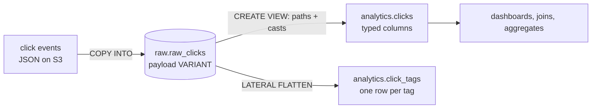

# 02-3 · Semi-structured data: VARIANT, JSON & FLATTEN

> **Level:** Intermediate · **Prerequisites:** [02-2 Stages, file formats & COPY INTO](02_stages_and_copy_into.md)
> **Time:** 30 min · **Verified:** 2026-08-22 (Snowflake trial)

Every click event linkstash emits is a JSON object, and it will grow fields you didn't
plan for. This lesson is where Snowflake earns its reputation: you can land that JSON
*as JSON*, query it with ordinary SQL, and put the typed schema in a view instead of in
your ingest path.

---

## Why this is the signature feature

A classic warehouse forces **schema-on-write**: define columns, then transform every
payload to fit before it can be stored. So when the app adds `payload.geo.city`, you
change the DDL, change the loader, redeploy, and — because the pipeline rejected rows it
couldn't parse — you've lost the data from the days in between.

Snowflake gives you **schema-on-read**. Store the object whole in a `VARIANT` column and
decide what the columns are at *query* time:



The raw table never rejects a payload and never needs a migration. New field upstream?
Add a line to the view — and the history is already there, because you stored the whole
object from day one. That's the tradeoff Snowflake makes for you: a little query-time
work in exchange for an ingest path that cannot lose data to a schema change.

Crucially this isn't a document store bolted on. Under the hood Snowflake *shreds*
repeated JSON paths into internal columnar sub-columns with their own micro-partition
statistics, so `WHERE payload:slug = 'abc123'` prunes partitions much like a real
column would. You get JSON flexibility at close-to-columnar speed.

---

## The `VARIANT` column

`VARIANT` holds any JSON/Avro/ORC/Parquet/XML value — object, array, string, number,
boolean, null — up to **16 MB compressed** per value. Sibling types `OBJECT` and `ARRAY`
are the constrained versions; in practice you use `VARIANT` and stop thinking about it.

The raw-layer pattern is one VARIANT column, plus your own ingest metadata:

```sql
-- Replaces the typed raw table from 02-1: upstream adding a field must not break ingest.
CREATE OR REPLACE TRANSIENT TABLE linkstash_analytics.raw.raw_clicks (
    payload    VARIANT,                                     -- the event, exactly as sent
    src_file   VARCHAR,                                      -- provenance: which file it came from
    loaded_at  TIMESTAMP_NTZ DEFAULT CURRENT_TIMESTAMP()      -- when we ingested it
);
```

Transient, because it's rebuildable from the staged files
([02-1](01_databases_schemas_tables.md)). `src_file` and `loaded_at` are the two columns
worth adding to every raw table — when a number looks wrong in a dashboard, "which file
did this row come from" is the first question.

### Loading JSON into it

```sql
COPY INTO linkstash_analytics.raw.raw_clicks (payload, src_file)
FROM (
    SELECT $1,                       -- $1 is the whole JSON object, already a VARIANT
           METADATA$FILENAME         -- stage metadata: free provenance
    FROM @linkstash_analytics.raw.clicks_stage
)
FILE_FORMAT = (FORMAT_NAME = 'linkstash_analytics.raw.json_clicks')
ON_ERROR = CONTINUE;                 -- clickstream: a malformed line shouldn't stop the file
```

No column list to maintain, no casting, no failure mode for unexpected fields. With
`STRIP_OUTER_ARRAY = TRUE` on the format ([02-2](02_stages_and_copy_into.md)) each
array element becomes its own row.

Our events look like this:

```json
{
  "slug": "abc123",
  "clicked_at": "2026-08-21T14:03:11Z",
  "geo": { "country": "IN", "city": "Ahmedabad" },
  "user_agent": "Mozilla/5.0 (X11; Linux x86_64)",
  "referrer": null,
  "tags": ["email", "newsletter", "q3-campaign"]
}
```

### `PARSE_JSON` and `TRY_PARSE_JSON`

If JSON reaches you as a *string* — a CSV column, an API response, a hand-written
`INSERT` — convert it explicitly:

```sql
INSERT INTO linkstash_analytics.raw.raw_clicks (payload, src_file)
SELECT PARSE_JSON('{"slug":"abc123","tags":["email"]}'), 'manual';

-- Bad string → PARSE_JSON errors and kills the statement; TRY_ returns NULL instead.
SELECT TRY_PARSE_JSON(raw_text) AS payload, raw_text
FROM staging_lines
WHERE TRY_PARSE_JSON(raw_text) IS NULL;   -- isolate the unparseable rows instead of failing
```

Use `TRY_PARSE_JSON` on any input you don't control — it turns "the whole batch failed"
into "these 12 rows need looking at". Every `TO_x` cast has a `TRY_TO_x` twin with the
same purpose. `TO_JSON` goes the other way (VARIANT → string).

---

## Path access

Traverse an object with `:` for fields and `.` or `[...]` for nesting:

```sql
SELECT
    payload:slug,                       -- top-level field
    payload:geo.country,                -- nested object (payload:geo:country also works)
    payload:tags[0],                    -- array index, zero-based
    payload:tags,                       -- the whole array, as a VARIANT
    ARRAY_SIZE(payload:tags),           -- element count
    payload:nonexistent                 -- missing path → SQL NULL, no error
FROM linkstash_analytics.raw.raw_clicks
LIMIT 1;
```

```
+----------+---------------+---------------+---------------------------------------+------+------+
| SLUG     | GEO.COUNTRY   | TAGS[0]       | TAGS                                  | SIZE | NON  |
|----------+---------------+---------------+---------------------------------------+------+------|
| "abc123" | "IN"          | "email"       | [ "email", "newsletter", "q3-camp…" ] |    3 | NULL |
+----------+---------------+---------------+---------------------------------------+------+------+
```

Two things to notice. **Missing paths return `NULL` rather than erroring** — that's what
makes optional fields painless, and also why a typo in a path fails silently as a column
of nulls. And **the values come back quoted**: `"abc123"`, not `abc123`. They're still
VARIANTs, not strings.

Field names in paths are **case-sensitive** (`payload:Slug` ≠ `payload:slug`), unlike
SQL identifiers — a real gotcha when the upstream service sends camelCase. Non-identifier
keys need brackets and quotes: `payload['user-agent']`.

---

## Casting with `::` — the part people skip

`::` is shorthand for `CAST`, and on a VARIANT it does two jobs: converts the type *and*
strips the JSON quoting.

```sql
SELECT
    payload:slug::VARCHAR              AS slug,          -- 'abc123', unquoted, comparable
    payload:clicked_at::TIMESTAMP_NTZ  AS clicked_at,     -- real timestamp: DATE_TRUNC, ranges, ordering
    payload:geo.country::VARCHAR       AS country,
    payload:is_bot::BOOLEAN            AS is_bot
FROM linkstash_analytics.raw.raw_clicks
LIMIT 3;
```

**Untyped VARIANT will bite you.** The failure modes, in the order you'll hit them:

```sql
-- 1. String comparison against a VARIANT: false, because '"abc123"' != 'abc123'.
SELECT COUNT(*) FROM raw_clicks WHERE payload:slug = 'abc123';          -- ❌ 0 rows
SELECT COUNT(*) FROM raw_clicks WHERE payload:slug::VARCHAR = 'abc123'; -- ✅

-- 2. Timestamps sort as strings. Fine for ISO-8601, silently wrong for anything else,
--    and DATE_TRUNC / DATEDIFF / date_range filters need a real timestamp regardless.
SELECT DATE_TRUNC('day', payload:clicked_at::TIMESTAMP_NTZ) AS d, COUNT(*)
FROM raw_clicks GROUP BY d;

-- 3. Numbers concatenate instead of adding — VARIANT '1' + '2' is not always 3.
SELECT SUM(payload:duration_ms::NUMBER) FROM raw_clicks;   -- cast before aggregating

-- 4. GROUP BY on an uncast VARIANT groups by JSON representation, so 'IN' and
--    a trailing-space 'IN ' become separate buckets.
```

The habit to build: **cast at the boundary**. Every path expression that leaves the raw
layer gets a `::TYPE`. That single rule removes almost all VARIANT confusion, and it's
exactly what the view below does.

There's also `IS_NULL_VALUE` for the JSON-vs-SQL null distinction, which matters more
than it sounds:

```sql
SELECT
    IS_NULL_VALUE(payload:referrer)  AS json_null,      -- the key exists, its value is JSON null
    payload:referrer IS NULL          AS sql_null        -- also TRUE if the key is absent entirely
FROM linkstash_analytics.raw.raw_clicks LIMIT 1;
```

```
+-----------+----------+
| JSON_NULL | SQL_NULL |
|-----------+----------|
| TRUE      | FALSE    |
+-----------+----------+
```

`"referrer": null` (explicitly unknown) and a missing `referrer` (the producer never
sent it) are different facts. `IS_NULL_VALUE` is how you tell "the field was omitted" —
old schema version, or a bug — from "the field was empty". `payload:referrer IS NULL`
conflates both. There's also `TYPEOF(payload:tags)` → `ARRAY`, handy when a source
sends a scalar sometimes and an array other times.

### Discovering the shape: `OBJECT_KEYS`

```sql
-- Which fields is upstream actually sending, and since when?
SELECT k.value::VARCHAR AS field, COUNT(*) AS rows_with_field, MIN(loaded_at) AS first_seen
FROM linkstash_analytics.raw.raw_clicks,
     LATERAL FLATTEN(input => OBJECT_KEYS(payload)) k
GROUP BY field
ORDER BY rows_with_field DESC;
```

```
+------------+-----------------+-------------------------+
| FIELD      | ROWS_WITH_FIELD | FIRST_SEEN              |
|------------+-----------------+-------------------------|
| SLUG       |            9952 | 2026-08-14 09:02:11.441 |
| CLICKED_AT |            9952 | 2026-08-14 09:02:11.441 |
| GEO        |            9952 | 2026-08-14 09:02:11.441 |
| TAGS       |            9952 | 2026-08-14 09:02:11.441 |
| REFERRER   |            9952 | 2026-08-14 09:02:11.441 |
| DEVICE     |            1204 | 2026-08-21 11:40:03.117 |
+------------+-----------------+-------------------------+
```

That last row is the whole argument for this lesson: upstream started sending `device`
yesterday, nothing broke, and the data is already stored waiting for you to expose it.
This query is the first thing to run against any unfamiliar VARIANT table.

---

## `LATERAL FLATTEN` — arrays into rows

`tags` is an array, and SQL wants rows. `FLATTEN` is a table function that emits one row
per element; `LATERAL` joins it to each row of the outer table.

```sql
SELECT
    c.payload:slug::VARCHAR AS slug,
    t.value::VARCHAR        AS tag,     -- the element itself
    t.index                 AS tag_pos  -- its position in the array, zero-based
FROM linkstash_analytics.raw.raw_clicks AS c,
     LATERAL FLATTEN(input => c.payload:tags) AS t
ORDER BY slug, tag_pos
LIMIT 6;
```

```
+--------+---------------+---------+
| SLUG   | TAG           | TAG_POS |
|--------+---------------+---------|
| abc123 | email         |       0 |
| abc123 | newsletter    |       1 |
| abc123 | q3-campaign   |       2 |
| xy9kfd | social        |       0 |
| xy9kfd | twitter       |       1 |
| zz01aa | direct        |       0 |
+--------+---------------+---------+
```

One 3-tag click became three rows — that's the fan-out to keep in mind when you count.
Now the aggregate you actually wanted:

```sql
SELECT t.value::VARCHAR AS tag,
       COUNT(*)                              AS clicks,
       COUNT(DISTINCT c.payload:slug::VARCHAR) AS distinct_links
FROM linkstash_analytics.raw.raw_clicks AS c,
     LATERAL FLATTEN(input => c.payload:tags) AS t
GROUP BY tag
ORDER BY clicks DESC;
```

```
+--------------+--------+----------------+
| TAG          | CLICKS | DISTINCT_LINKS |
|--------------+--------+----------------|
| email        |   4187 |            212 |
| social       |   2903 |            188 |
| newsletter   |   1642 |             41 |
| q3-campaign  |    908 |             17 |
+--------------+--------+----------------+
```

`FLATTEN` yields these columns: `SEQ` (a per-input-row group id), `KEY` (the object key,
`NULL` for arrays), `PATH`, `INDEX` (array position, `NULL` for objects), `VALUE` (the
element) and `THIS` (the collection being flattened).

Three arguments earn their keep:

```sql
-- OUTER => TRUE: keep rows whose array is empty/missing (a LEFT JOIN, not an INNER one).
SELECT c.payload:slug::VARCHAR AS slug, t.value::VARCHAR AS tag
FROM raw_clicks c, LATERAL FLATTEN(input => c.payload:tags, OUTER => TRUE) t;
-- untagged clicks now appear once with tag = NULL, instead of vanishing from the result

-- RECURSIVE => TRUE: walk the whole structure, any depth. Great for auditing unknown JSON.
SELECT f.path, f.value FROM raw_clicks c, LATERAL FLATTEN(input => c.payload, RECURSIVE => TRUE) f;

-- Flatten an object (not an array): KEY/VALUE pairs, e.g. arbitrary UTM parameters.
SELECT f.key::VARCHAR AS param, f.value::VARCHAR AS val
FROM raw_clicks c, LATERAL FLATTEN(input => c.payload:query_params) f;
```

**`OUTER => TRUE` is the one to remember.** Default `FLATTEN` behaves like an inner
join: a click with `"tags": []` disappears entirely. Count clicks off a flattened query
without it and your totals quietly under-report — the classic semi-structured bug.

Flattens nest, too — `FLATTEN` an array of objects, then flatten an array inside each:

```sql
SELECT s.value:name::VARCHAR AS step, i.value::VARCHAR AS item
FROM raw_clicks c,
     LATERAL FLATTEN(input => c.payload:journey)      s,   -- array of step objects
     LATERAL FLATTEN(input => s.value:items)          i;   -- array inside each step
```

---

## The payoff: a typed view over raw VARIANT

Here's the idiomatic raw → modeled step, and the reason the whole pattern works. The
view is your schema; the raw table just keeps bytes.

```sql
-- The demo table from 02-1 is in the way; a view can't replace a table of the same name.
DROP TABLE IF EXISTS linkstash_analytics.analytics.clicks;

CREATE OR REPLACE VIEW linkstash_analytics.analytics.clicks AS
SELECT
    payload:slug::VARCHAR                    AS slug,
    payload:clicked_at::TIMESTAMP_NTZ        AS clicked_at,    -- real timestamp: ranges & DATE_TRUNC work
    payload:geo.country::VARCHAR             AS country,
    payload:geo.city::VARCHAR                AS city,
    payload:user_agent::VARCHAR              AS user_agent,
    NULLIF(payload:referrer::VARCHAR, '')    AS referrer,      -- '' and JSON null both become NULL
    COALESCE(payload:device::VARCHAR, 'unknown') AS device,    -- field added 2026-08-21; older rows default
    ARRAY_SIZE(payload:tags)                 AS tag_count,
    src_file,                                                  -- keep provenance for debugging
    loaded_at
FROM linkstash_analytics.raw.raw_clicks
WHERE payload:slug IS NOT NULL;                                -- cheap quality gate at the boundary
```

Now everyone downstream writes plain SQL and never sees a colon:

```sql
SELECT country, DATE_TRUNC('day', clicked_at) AS day, COUNT(*) AS clicks
FROM linkstash_analytics.analytics.clicks
WHERE clicked_at >= DATEADD(day, -7, CURRENT_TIMESTAMP())
GROUP BY country, day
ORDER BY day, clicks DESC;
```

```
+---------+------------+--------+
| COUNTRY | DAY        | CLICKS |
|---------+------------+--------|
| IN      | 2026-08-21 |   1841 |
| US      | 2026-08-21 |   1122 |
| DE      | 2026-08-21 |    318 |
+---------+------------+--------+
```

Why this is the right default:

- **Zero storage, zero copy, zero staleness.** A view is a saved query; new raw rows are
  visible immediately with no rebuild step.
- **Schema changes are one line.** The `device` column above shipped without touching
  ingest, and it works retroactively over data loaded before the field existed.
- **Casts and quality rules live in exactly one place.** Nobody downstream can forget a
  `::VARCHAR` and get zero rows.
- **The raw table stays the audit trail.** If a cast turns out to be wrong, fix the view
  and the truth is still in `payload`.

The tag view is the same idea, flattened:

```sql
CREATE OR REPLACE VIEW linkstash_analytics.analytics.click_tags AS
SELECT payload:slug::VARCHAR             AS slug,
       payload:clicked_at::TIMESTAMP_NTZ AS clicked_at,
       t.value::VARCHAR                  AS tag
FROM linkstash_analytics.raw.raw_clicks c,
     LATERAL FLATTEN(input => c.payload:tags, OUTER => TRUE) t;   -- keep untagged clicks
```

---

## When to materialise instead

A view re-parses the VARIANT on **every** query. That's cheap at 10 000 rows and
expensive at 500 million, so switch to a real typed table when:

- **The table is large and queried often.** Path extraction plus casts, repeated by every
  dashboard refresh, is compute you pay for each time. Typed columns in their own
  micro-partitions prune and scan better than shredded VARIANT sub-columns.
- **The view has real work in it** — multi-level `FLATTEN`, joins, window functions,
  regex on `user_agent`. Fan-out especially: pay for it once, not per query.
- **You need to enforce or measure quality.** Typed columns fail loudly on bad casts at
  load time, rather than producing nulls at query time.
- **Consumers are external** (BI tools, a Snowflake data share) and you want a stable
  contract that doesn't shift when the raw payload does.

The materialised version, run on a schedule:

```sql
CREATE OR REPLACE TRANSIENT TABLE linkstash_analytics.analytics.clicks_t AS
SELECT * FROM linkstash_analytics.analytics.clicks;   -- reuse the view as the definition
```

Keeping the view as the transformation definition and materialising *from* it means one
source of truth for the logic — and it's exactly what dbt does when you flip a model
from `view` to `table`. Snowflake also offers **materialized views** (auto-maintained,
Enterprise edition, no joins or `FLATTEN` allowed) and **dynamic tables** (declarative
incremental refresh, the modern answer), but a scheduled `CREATE OR REPLACE TABLE` on a
task is the boring option that always works.

**Start with a view.** Materialise when a query plan or a credit bill tells you to, not
before.

---

## Recap & next

- ✅ **Schema-on-read**: land JSON whole in a `VARIANT`, define columns at query time.
  Ingest can't reject a payload, and new upstream fields are already stored.
- ✅ Raw-layer pattern: one **`VARIANT payload`** column plus `src_file` and `loaded_at`
  for provenance; `COPY INTO ... SELECT $1, METADATA$FILENAME` to load it.
- ✅ **`PARSE_JSON`** for strings, **`TRY_PARSE_JSON`** for input you don't control.
- ✅ Paths: `payload:slug`, `payload:geo.country`, `payload:tags[0]` — missing paths give
  `NULL`, keys are **case-sensitive**.
- ✅ **Always `::` cast at the boundary** — uncast VARIANT breaks string equality, date
  functions, sums and `GROUP BY`, silently.
- ✅ **`LATERAL FLATTEN(input => payload:tags)`** explodes arrays to rows (`VALUE`,
  `INDEX`, `KEY`, `PATH`); `OUTER => TRUE` keeps rows with empty arrays,
  `RECURSIVE => TRUE` walks everything.
- ✅ **`OBJECT_KEYS`** to discover an unfamiliar payload, **`IS_NULL_VALUE`** to tell a
  JSON null from an absent key.
- ✅ A **typed view** over the raw VARIANT table is the raw→modeled step; materialise
  only when size, query frequency or flatten cost justifies it.

## Exercise

Product wants a daily report: for each day and tag, the click count and how many
distinct countries clicked — untagged clicks must appear as tag `untagged`, not vanish.
Build it as a view over `raw.raw_clicks`, then say what would make you materialise it.

<details>
<summary>Solution</summary>

```sql
CREATE OR REPLACE VIEW linkstash_analytics.analytics.daily_tag_clicks AS
SELECT
    DATE_TRUNC('day', c.payload:clicked_at::TIMESTAMP_NTZ)  AS click_day,
    COALESCE(t.value::VARCHAR, 'untagged')                  AS tag,      -- OUTER gives NULL; label it
    COUNT(*)                                                AS clicks,
    COUNT(DISTINCT c.payload:geo.country::VARCHAR)          AS countries
FROM linkstash_analytics.raw.raw_clicks AS c,
     LATERAL FLATTEN(input => c.payload:tags, OUTER => TRUE) AS t        -- keeps [] and missing tags
WHERE c.payload:slug IS NOT NULL
GROUP BY click_day, tag
ORDER BY click_day DESC, clicks DESC;
```

```
+------------+-------------+--------+-----------+
| CLICK_DAY  | TAG         | CLICKS | COUNTRIES |
|------------+-------------+--------+-----------|
| 2026-08-21 | email       |    612 |        14 |
| 2026-08-21 | social      |    404 |        21 |
| 2026-08-21 | untagged    |    133 |         9 |
| 2026-08-21 | q3-campaign |     98 |         6 |
+------------+-------------+--------+-----------+
```

The three decisions that matter: `OUTER => TRUE` plus `COALESCE` so untagged clicks are
reported rather than silently dropped by `FLATTEN`'s default inner-join behaviour; a
`::TIMESTAMP_NTZ` cast before `DATE_TRUNC`, which won't accept a VARIANT; and
`::VARCHAR` inside `COUNT(DISTINCT ...)` so `"IN"` and `IN` don't count as two
countries.

**Materialise when** the raw table is large enough that the per-query cost of flatten +
cast shows up in `QUERY_HISTORY`, *and* the report runs often (a dashboard refreshing
every 15 minutes re-does the entire flatten each time). Because the grain is daily and
past days never change, the right shape is then an **incremental** table — append
yesterday once on a scheduled task — not a nightly full `CREATE OR REPLACE`. Until the
credit bill or a slow dashboard says otherwise, the view is correct and free.

</details>

**→ Next: [03 · Python & Snowpark](../03_python_and_snowpark/README.md)**
