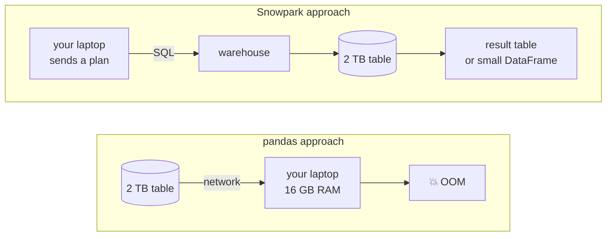

# 03-3 · Snowpark: DataFrames & Python in Snowflake

> **Level:** Intermediate · **Prerequisites:** [03-2 pandas & bulk I/O](02_pandas_and_bulk_io.md)
> **Time:** ~35 min · **Verified:** 2026-08-22 (snowflake-connector-python · snowflake-snowpark-python · Python 3.12)

Snowpark looks like pandas and behaves like SQL. That sentence is the whole
lesson: you write `df.filter(...).group_by(...).agg(...)` in Python, and Snowpark
compiles it to SQL that runs on a warehouse. **The rows never come to you.** The
previous module was about moving data efficiently across the boundary; this one is
about not crossing it at all.

---

## The one big idea: pushdown

A Snowpark DataFrame is **not data**. It is a **query plan**.

```python
df = session.table("analytics.clicks")     # zero rows fetched, zero credits spent
df = df.filter(col("COUNTRY") == "IN")     # still just a plan
df = df.group_by("SLUG").agg(count("*"))   # still just a plan
df.show()                                  # ← NOW SQL runs, in Snowflake
```

Compare the two architectures:



Three consequences that matter:

- **Data larger than local RAM is a non-problem.** The warehouse has the memory and
  the cores; your process holds a plan object of a few kilobytes.
- **You don't pay for the transfer or the wait.** No egress, no hours spent
  streaming rows over a network to compute a sum you could have computed in place.
- **You get Snowflake's optimizer for free** — micro-partition pruning, the result
  cache, parallel execution. You didn't hand-write the SQL, but you still get
  everything the SQL engine does.

This is *bring the code to the data* rather than the data to the code. It's the
same reason `write_pandas` stages files instead of inserting rows: the platform is
better at bulk work than your process is.

---

## The session

```bash
uv add snowflake-snowpark-python      # Python 3.10–3.13 supported
```

```python
# linkstash/snowpark_session.py
import os

from snowflake.snowpark import Session

CONNECTION_PARAMS = {
    "account": os.environ["SNOWFLAKE_ACCOUNT"],
    "user": os.environ["SNOWFLAKE_USER"],
    "private_key_file": os.environ["SNOWFLAKE_PRIVATE_KEY_FILE"],  # key-pair, as in 03-1
    "role": "LINKSTASH_ANALYST",
    "warehouse": "ADHOC_WH",
    "database": "LINKSTASH",
    "schema": "ANALYTICS",
}

session = Session.builder.configs(CONNECTION_PARAMS).create()
try:
    ...
finally:
    session.close()      # same rule as 03-1: an open session pins the warehouse awake
```

Same parameters, same secrets discipline, same auth options as the connector —
Snowpark sits **on top of** `snowflake-connector-python`, so everything from 03-1
still applies. `session.sql("SELECT ...")` is always available when you want raw
SQL, and it returns a DataFrame like anything else.

---

## Building a plan

```python
from snowflake.snowpark.functions import avg, col, count, countDistinct

clicks = session.table("analytics.clicks")     # or "LINKSTASH.ANALYTICS.CLICKS"

india = (
    clicks
    .filter((col("COUNTRY") == "IN") & (col("CLICKED_AT") >= "2026-01-01"))
    .select("SLUG", "DEVICE", "CLICKED_AT")    # column pruning → fewer bytes scanned
)

by_slug = (
    india
    .group_by("SLUG")
    .agg(count("*").alias("CLICKS"), countDistinct("DEVICE").alias("DEVICES"))
    .sort(col("CLICKS").desc())
    .limit(20)
)
```

Notes that save time:

- **`col("COUNTRY")`, upper case.** Snowflake folded the identifiers when the table
  was created; Snowpark passes your string through unquoted, so `col("country")`
  works too — but a *quoted* lower-case column would not. Stay upper-case and this
  never bites.
- **Python operators are overloaded** into SQL expressions: `==`, `!=`, `>`, `&`,
  `|`, `~`. Use `&` / `|` with parentheses, not `and` / `or` — `and` would evaluate
  the *objects'* truthiness, not build an expression.
- **`select` is column pruning**, and on a columnar store that's a real
  optimisation, not cosmetics: naming 3 of 40 columns means reading 3 columns'
  worth of bytes.
- **Joins** look like you'd expect:

```python
links = session.table("analytics.links")

enriched = by_slug.join(links, on="SLUG", how="left").select(
    "SLUG", "CLICKS", "DEVICES", links["TARGET_URL"], links["OWNER"],
)
```

Use `links["TARGET_URL"]` (or aliases via `.alias("l")`) to disambiguate when both
sides have a column of the same name — the same problem SQL has, with the same fix.

---

## Lazy vs action

Nothing above touched the warehouse. **Transformations return a new DataFrame;
actions execute.**

| Action | Gives you | Use for |
|---|---|---|
| `.show(n)` | prints the first `n` rows (default 10) | interactive checks |
| `.collect()` | `list[Row]` in your process | small results you iterate in Python |
| `.to_pandas()` | a pandas DataFrame | the last mile — charts, models, an API response |
| `.count()` | an int | sanity checks |
| `.write.save_as_table(...)` | a new/updated table in Snowflake | **results that stay in Snowflake** |
| `.write.copy_into_location(...)` | files on a stage | handing data to another system |

The mistake to avoid is calling `.to_pandas()` reflexively. If the result is going
back into Snowflake, `save_as_table` never materialises a single row locally:

```python
by_slug.write.mode("overwrite").save_as_table("analytics.top_slugs_in")
```

`mode` takes `"overwrite"`, `"append"`, `"errorifexists"`, `"ignore"`.

### Seeing the SQL

Because it's a plan, you can inspect it before paying for it:

```python
by_slug.explain()          # prints the logical plan AND the generated SQL
print(by_slug.queries)     # {"queries": ["SELECT ..."], "post_actions": [...]}
```

Do this the first few times. Reading the generated SQL is how you build trust that
a chain of `.filter()` calls collapses into one `WHERE`, and it's how you debug a
plan that scans more than you expected. It's also free — `explain` doesn't run the
query.

> **Watch out for accidental re-execution.** A DataFrame is a plan, not a cache, so
> two actions on the same DataFrame run the SQL twice and bill twice. If you need
> an intermediate result more than once, materialise it: `df.cache_result()` (a
> temporary table) or `save_as_table`.

---

## Worked example: top slugs per country, written back

The linkstash question: for each country, which three slugs get the most clicks?

```python
from snowflake.snowpark import Window
from snowflake.snowpark.functions import col, count, row_number

clicks = session.table("analytics.clicks")
links = session.table("analytics.links")

per_country = (
    clicks
    .group_by("COUNTRY", "SLUG")
    .agg(count("*").alias("CLICKS"))
)

# Rank within each country — a window function, expressed in Python.
ranked = per_country.with_column(
    "RANK_IN_COUNTRY",
    row_number().over(Window.partition_by("COUNTRY").order_by(col("CLICKS").desc())),
)

top3 = (
    ranked
    .filter(col("RANK_IN_COUNTRY") <= 3)
    .join(links, on="SLUG", how="left")                 # attach the target URL
    .select("COUNTRY", "RANK_IN_COUNTRY", "SLUG", "TARGET_URL", "CLICKS")
    .sort("COUNTRY", "RANK_IN_COUNTRY")
)

top3.write.mode("overwrite").save_as_table("analytics.top_slugs_by_country")
```

One statement runs on the warehouse. `analytics.clicks` could hold two billion
rows; your process transferred a query plan and received a confirmation. If you
*do* want to look at it, `top3.limit(30).to_pandas()` pulls thirty rows, not the
table.

---

## When Snowpark beats SQL — and when it doesn't

Be honest about this, because Snowpark is often oversold.

**Plain SQL is simpler when:**

- The transformation *is* SQL. `GROUP BY country, slug` is a `GROUP BY` — wrapping
  it in Python method chains adds a dependency, a translation layer, and one more
  thing for the next engineer to learn. `session.sql("...")` is right there.
- Your team's transformation layer already lives in SQL — dbt models, views,
  scheduled tasks. Don't fork the stack for one script.
- You want the query to be readable by an analyst.

**Snowpark earns its place when:**

- **Python logic belongs in the pipeline.** Branching on config, looping over a
  list of countries to build a union, a transformation whose *shape* depends on
  metadata. Generating SQL by string concatenation is how injection bugs and
  unreadable pipelines happen; building a plan with objects isn't.
- **Reuse.** `def daily_clicks(df, since): return df.filter(...)...` is a normal
  Python function — composable, importable, testable with pytest. Copy-pasted CTEs
  are not.
- **You need real Python at scale** — a library, a model, string parsing that SQL
  can't express. That's the `@udf` case below, and it's the thing SQL genuinely
  cannot do.
- **The data is far too big to pull down** but the logic isn't expressible as one
  tidy query.

Rule of thumb: **if you can write the SQL in thirty seconds, write the SQL.** Reach
for Snowpark when the *program around the query* is the hard part.

---

## Python inside Snowflake: `@udf` and `@sproc`

This is where "bring the code to the data" becomes literal. A **UDF** is a Python
function that Snowflake serialises, ships to the warehouse, and calls **per row**
inside the query engine:

```python
from urllib.parse import urlparse

from snowflake.snowpark.functions import udf
from snowflake.snowpark.types import StringType


@udf(name="extract_host", is_permanent=False, replace=True)   # temp UDF, no stage needed
def extract_host(url: str) -> str:
    """Runs on the warehouse, once per row. Type hints become the SQL signature."""
    return urlparse(url).netloc.lower() if url else ""


hosts = (
    session.table("analytics.links")
    .with_column("HOST", extract_host(col("TARGET_URL")))
    .group_by("HOST").agg(count("*").alias("LINKS"))
)
hosts.show()     # the Python ran in Snowflake, not here
```

- **Type hints define the SQL types** (`str` → `STRING`), so you rarely need
  `return_type=` / `input_types=` explicitly.
- **Dependencies come from the Snowflake Anaconda channel** — a curated set of
  packages pre-staged inside Snowflake. Declare them and they're available:
  `@udf(packages=["numpy", "scikit-learn"])`, or `session.add_packages("numpy")`
  for the whole session. No pip, no network from the warehouse. Something not in
  the channel has to be uploaded yourself as a stage import.
- **`is_permanent=True` requires `stage_location=`** — the function's code is
  stored on a stage so other sessions and pure-SQL queries can call it. Temporary
  UDFs vanish with the session, which is what you want while iterating.
- **Cost reality check:** a UDF is Python, per row, in the query. It's slower than
  a native SQL function by a wide margin. Use it for what SQL can't do; don't
  reimplement `UPPER()`.

A **stored procedure** is the other granularity — one function containing a whole
workflow, executed inside Snowflake, receiving the session as its first argument:

```python
from snowflake.snowpark import Session
from snowflake.snowpark.functions import count, sproc


@sproc(name="refresh_top_slugs", is_permanent=False, replace=True,
       packages=["snowflake-snowpark-python"])
def refresh_top_slugs(session: Session, min_clicks: int) -> str:
    """A multi-step pipeline that runs server-side — schedulable as a TASK."""
    df = (session.table("analytics.clicks")
          .group_by("COUNTRY", "SLUG").agg(count("*").alias("CLICKS"))
          .filter(col("CLICKS") >= min_clicks))
    df.write.mode("overwrite").save_as_table("analytics.top_slugs_by_country")
    return f"refreshed: {df.count()} rows"


print(session.call("refresh_top_slugs", 100))
```

Why this is powerful: the procedure is now a **database object**. A Snowflake
**task** can call it on a schedule with no orchestrator, no container, no Airflow
worker, no credentials sitting in a CI runner — the code lives next to the data and
runs on the warehouse ([section 06](../06_pipelines_and_engineering/README.md) wires
this into streams and tasks). The trade-off is real, though: code inside a database
is harder to version, test, and review than code in your repo, so keep the logic
thin and importable and let the sproc be the entry point.

> **Also available:** `snowflake-sqlalchemy` provides a SQLAlchemy dialect
> (`snowflake://…`), useful if you need Snowflake to plug into existing
> ORM/tooling — Alembic, a metadata crawler, a BI library that speaks SQLAlchemy.
> It's an integration adapter, not a better way to write analytics.

---

## Recap & next

- ✅ **A Snowpark DataFrame is a query plan, not data.** Transformations are lazy;
  `.show()` / `.collect()` / `.to_pandas()` / `.write.save_as_table()` are actions.
- ✅ **Pushdown:** the work runs in Snowflake and results stay there until you ask —
  so data larger than local RAM stops being a problem, and you pay no transfer.
- ✅ `Session.builder.configs(params).create()` — same params, secrets and key-pair
  auth as the connector; **close the session** so the warehouse can suspend.
- ✅ `session.table()`, `.filter()`, `.select()`, `.group_by().agg()`, `.sort()`,
  `.limit()`, `.join()`, window functions; `&`/`|` not `and`/`or`; upper-case columns.
- ✅ **`.explain()` shows the generated SQL** — read it. A DataFrame is not cached,
  so two actions run the query twice: `cache_result()` or `save_as_table()`.
- ✅ **Prefer `save_as_table` over `to_pandas`** when the result belongs in Snowflake.
- ✅ **A `GROUP BY` is a `GROUP BY`** — use plain SQL when the query is the whole
  job; use Snowpark when Python logic, reuse, or testability is the hard part.
- ✅ **`@udf` runs Python per row and `@sproc` runs a whole workflow inside
  Snowflake**, with packages from the Snowflake Anaconda channel — code to the data.

## Exercise

Write a Snowpark pipeline that produces, per country, the number of clicks and the
number of *distinct* slugs clicked, keeps only countries with at least 1000 clicks,
and saves the result as `analytics.country_summary`. Then answer: why is
`.to_pandas()` the wrong last step here, and how would you verify what SQL ran?

<details>
<summary>Solution</summary>

```python
from snowflake.snowpark.functions import col, count, countDistinct

summary = (
    session.table("analytics.clicks")
    .group_by("COUNTRY")
    .agg(count("*").alias("CLICKS"), countDistinct("SLUG").alias("SLUGS"))
    .filter(col("CLICKS") >= 1000)          # HAVING, expressed after the agg
    .sort(col("CLICKS").desc())
)

summary.explain()                            # inspect before you pay for it
summary.write.mode("overwrite").save_as_table("analytics.country_summary")
```

**Why not `.to_pandas()`:** the destination is a Snowflake table, so pulling every
row into your process and pushing it back is two network trips and a local memory
footprint for a result that never needed to leave. `save_as_table` compiles to a
single `CREATE OR REPLACE TABLE … AS SELECT` executed by the warehouse — the rows
move from storage to storage. Use `.to_pandas()` only when a human, a chart, or a
model in *your* process is the consumer; here the consumer is a dashboard querying
the table.

**Verifying the SQL:** `summary.explain()` prints the logical plan and the
generated query without executing it, and `summary.queries` returns it as data.
After running, the query also appears in Snowsight's **Query History** with its
profile — bytes scanned, partitions pruned, time per operator — which is the real
proof that the `filter` became a `HAVING` and the `countDistinct` didn't turn into
something horrifying. Note also that `filter` *after* `agg` is correct here: it
references the aggregated alias, so Snowpark places it in `HAVING`. A filter on
`COUNTRY` before the `group_by` would instead land in `WHERE` and prune
micro-partitions — placing filters as early as they're valid is the one
optimisation habit worth keeping.
</details>

**→ Next: [04 · Security, roles & access control](../04_security_and_rbac/README.md)**
