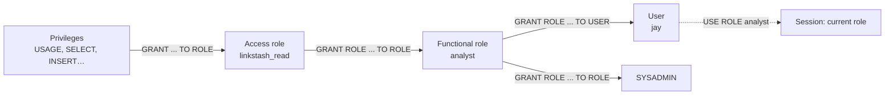

# 04-1 · The RBAC model

> **Level:** Intermediate · **Prerequisites:** [03-3 Snowpark: DataFrames & Python in Snowflake](../03_python_and_snowpark/03_snowpark_dataframes.md)
> **Time:** 30 min · **Verified:** 2026-08-22 (Snowflake trial; Enterprise-only features flagged)

You already know an access model: IAM. So the fastest way into Snowflake's is to
name the one structural difference and let everything else follow from it. **In IAM
a policy attaches to a principal. In Snowflake a privilege is granted to a *role*,
and the role is granted to the user.** There is no such thing as granting `SELECT`
to a person. The role is the only unit of permission in the product.

That single rule explains why Snowflake RBAC feels verbose at first and then feels
obvious: every design question becomes "which role should hold this, and who should
inherit that role?"

---

## The model in three arrows



| Term | Is |
|---|---|
| **Privilege** | one verb on one object — `SELECT` on `raw.clicks`, `USAGE` on `dev_wh` |
| **Role** | a named bag of privileges; the *only* thing privileges can be granted to |
| **Role hierarchy** | roles granted to roles — the parent **inherits** everything the child holds |
| **User** | a login (person or service) that has been granted one or more roles |
| **Current role** | the one role a session is acting as; changed with `USE ROLE` |

Inheritance is the workhorse. `GRANT ROLE linkstash_read TO ROLE analyst` means every
privilege in `linkstash_read` is now usable by `analyst`, and by anything `analyst` is
granted to, all the way up. Deep-ish hierarchies are idiomatic here, not a smell.

A session has exactly one **current role** at a time and it decides everything:

```sql
SELECT CURRENT_ROLE(), CURRENT_WAREHOUSE(), CURRENT_DATABASE();  -- who am I right now?
USE ROLE analyst;                    -- instant, no credential exchange, no token
SELECT CURRENT_ROLE();               -- ANALYST
```

> Snowflake also supports **secondary roles** (`USE SECONDARY ROLES ALL`), which
> union the privileges of every role you hold for the duration of the session.
> Handy for ad-hoc querying — but the *primary* current role is still what owns
> anything you create, so don't lean on it for DDL.

---

## Mapped onto IAM

| Question | AWS IAM | Snowflake |
|---|---|---|
| What holds permissions? | a **policy** document | a **role** |
| What is a policy attached to? | a **principal** (user, group, role) | nothing — privileges are *granted to a role* |
| How is it written? | **JSON** policy documents (`Action`/`Resource`/`Effect`) | **SQL** statements — `GRANT SELECT ON TABLE … TO ROLE …` |
| Switching identity | `sts:AssumeRole` → temporary credentials, needs a trust policy | `USE ROLE x;` — one statement, no STS, no trust policy, no new credentials |
| Composing permissions | attach several policies to one principal | grant several roles **into** one role (hierarchy) |
| Explicit deny | `"Effect": "Deny"` overrides any allow | **no deny exists** — grants are additive; you remove access by `REVOKE` |
| Who owns an object? | no such concept | every object has an **owner role** (see below) |
| Resource-side policy | bucket / queue policies | none — all access lives on the role side |

Two of those bite people migrating their instincts. First, **there is no `Deny`**: you
cannot carve an exception out of a broad grant, so "grant wide, deny the sensitive
bit" is not a strategy — grant narrowly instead, or use a masking policy ([04-3](03_data_governance.md)).
Second, `USE ROLE` is free and instantaneous. It is not `AssumeRole`; nothing is
issued, nothing expires. Cheap role switching is *why* Snowflake expects you to have
many small roles.

---

## The system roles

Every account ships with these, already wired into a hierarchy:

| Role | For | Notes |
|---|---|---|
| **ORGADMIN** | organisation-level: create accounts, see org usage | separate branch; not a parent of ACCOUNTADMIN |
| **ACCOUNTADMIN** | the superuser — billing, account parameters, resource monitors | inherits SYSADMIN **and** SECURITYADMIN |
| **SECURITYADMIN** | manage grants account-wide (`MANAGE GRANTS`) | inherits USERADMIN |
| **USERADMIN** | `CREATE USER`, `CREATE ROLE` | the role factory |
| **SYSADMIN** | owns databases, schemas, warehouses | where your custom roles should roll up |
| **PUBLIC** | granted to **every** user and role automatically | the floor, not a convenience |

Three rules that follow:

- **Don't do daily work in ACCOUNTADMIN.** It is `root`. Objects you create while in
  it are *owned* by ACCOUNTADMIN, which means SYSADMIN — the role that's supposed to
  manage your data — can't touch them. This is the most common self-inflicted wound
  in a new account, and it looks like a bug rather than a mistake.
- **Never grant anything sensitive to PUBLIC.** Everyone has it, always, including
  every service user you create later. A `GRANT … TO ROLE PUBLIC` is an account-wide
  grant with a friendly name.
- **Roll custom roles up to SYSADMIN** (`GRANT ROLE analyst TO ROLE sysadmin`) so the
  role that administers objects can actually see and manage what its children hold.

---

## The four-privilege minimum (read this twice)

To run `SELECT * FROM linkstash_analytics.raw.clicks` a role needs **four separate
grants**:

```sql
GRANT USAGE  ON DATABASE linkstash_analytics            TO ROLE analyst;  -- 1. enter the database
GRANT USAGE  ON SCHEMA   linkstash_analytics.raw        TO ROLE analyst;  -- 2. enter the schema
GRANT SELECT ON TABLE    linkstash_analytics.raw.clicks TO ROLE analyst;  -- 3. read the table
GRANT USAGE  ON WAREHOUSE dev_wh                        TO ROLE analyst;  -- 4. burn credits to compute it
```

Miss any one and the query fails — and the errors are deliberately unhelpful,
because Snowflake will not confirm the existence of an object you aren't authorised
to see:

| Missing | What you get |
|---|---|
| `USAGE` on database | `Object 'LINKSTASH_ANALYTICS.RAW.CLICKS' does not exist or not authorized.` |
| `USAGE` on schema | the same message, verbatim |
| `SELECT` on table | the same message, verbatim |
| `USAGE` on warehouse | `No active warehouse selected in the current session` — or a warehouse "does not exist or not authorized" |

**"Does not exist or not authorized" almost always means *not authorized*.** Three
different mistakes produce one identical string, so debug it structurally rather than
by reading the message: run `SHOW GRANTS TO ROLE analyst;` and check off the four
lines. The fourth is the sneaky one — the warehouse is a *privilege*, not a setting,
and a role with perfect data grants and no warehouse grant cannot execute anything.

---

## Ownership

Every object has exactly one **owner role**, and the owner is whichever role was
current when the object was created. Ownership implies all privileges on the object
plus the right to grant them — it is closer to "creator" in a filesystem than to
anything in IAM, which has no equivalent concept at all.

```sql
USE ROLE sysadmin;                              -- create as the role that should OWN this
CREATE DATABASE linkstash_analytics;            -- owner = SYSADMIN
SHOW GRANTS ON DATABASE linkstash_analytics;    -- the OWNERSHIP row names the owner role
GRANT OWNERSHIP ON TABLE raw.clicks TO ROLE etl_service COPY CURRENT GRANTS;  -- transfer, keep grants
```

That is the whole reason for the `USE ROLE sysadmin;` line at the top of every DDL
script in this course. `COPY CURRENT GRANTS` matters: the default on an ownership
transfer is to *revoke* the object's existing grants, which quietly breaks everyone
else's access.

---

## Auditing with SHOW GRANTS

Four variants answer four different questions. Learn all four; they're your only
debugging tool for access:

```sql
SHOW GRANTS TO ROLE analyst;      -- privileges this role holds + roles granted INTO it
SHOW GRANTS ON TABLE raw.clicks;  -- everyone who can touch this object (incl. OWNERSHIP)
SHOW GRANTS TO USER jay;          -- which ROLES this user may activate (not privileges!)
SHOW GRANTS OF ROLE analyst;      -- which users/roles have been given this role
```

`SHOW GRANTS TO USER` returning only `PUBLIC` is the signature of "I created the user
and forgot to grant the role". Account-wide views of the same data (with latency)
live in `SNOWFLAKE.ACCOUNT_USAGE.GRANTS_TO_ROLES` — [04-3](03_data_governance.md).

---

## The honest contrast: here it's actually enforced

In the LocalStack course you authored IAM policies you could never verify, because
Community creates IAM objects but doesn't enforce them — a missing `PutItem` sailed
through locally and blew up in production. **Snowflake has no such gap.** You are on
a real account; the cloud services layer checks every statement.

So do the thing you couldn't do there — **test the denial**:

```sql
USE ROLE analyst;
USE WAREHOUSE dev_wh;
SELECT count(*) FROM linkstash_analytics.raw.clicks;   -- ✅ expected to work
INSERT INTO linkstash_analytics.raw.clicks VALUES (…); -- ❌ SQL access control error:
                                                       --    Insufficient privileges to operate on table 'CLICKS'
```

A permission model you've only ever seen succeed is a model you haven't tested. Every
role you build in [04-2](02_roles_and_grants_in_practice.md) gets both checks: one
query that must pass, one that must fail. It costs seconds of `dev_wh` time.

---

## Recap & next

- ✅ **Privileges → roles → users.** Privileges are granted only to roles; roles are
  granted to users *or to other roles*, and parents inherit children.
- ✅ `USE ROLE` switches the **current role** instantly — no STS, no trust policy, no
  temporary credentials. Cheap switching is why many small roles is the norm.
- ✅ **No `Deny` exists.** Grants are additive; narrow the grant or mask the column.
- ✅ **Six system roles**; SYSADMIN owns objects, USERADMIN makes users/roles,
  SECURITYADMIN manages grants — and you **don't work in ACCOUNTADMIN** or grant
  anything to **PUBLIC**.
- ✅ Reading one table needs **four** grants: `USAGE` db + `USAGE` schema + `SELECT`
  table + `USAGE` warehouse. All three data-side misses produce the identical
  *"does not exist or not authorized"*.
- ✅ Objects are **owned** by the role that created them — hence `USE ROLE sysadmin`
  before DDL; transfer with `GRANT OWNERSHIP … COPY CURRENT GRANTS`.
- ✅ Audit with the four `SHOW GRANTS` forms, and **test denials** — unlike
  LocalStack, this is genuinely enforced.

## Exercise

A teammate says: "I granted `SELECT` on every table in `linkstash_analytics.analytics`
to the `analyst` role, and Jay has the `analyst` role, but he still gets
`Object 'LINKSTASH_ANALYTICS.ANALYTICS.CLICKS' does not exist or not authorized`. The
table definitely exists — I'm looking at it." Name every cause that produces exactly
that message, and the order you'd check them in.

<details>
<summary>Solution</summary>

Four candidates, all yielding the same string because Snowflake won't leak the
existence of an object you can't see:

1. **No `USAGE` on the database** `linkstash_analytics`.
2. **No `USAGE` on the schema** `analytics`.
3. The `SELECT` grant was `ON ALL TABLES` and the table was created **afterwards** —
   `ALL` is a one-time snapshot, not a standing rule ([04-2](02_roles_and_grants_in_practice.md) fixes this with `FUTURE` grants).
4. **Jay's session isn't actually in `analyst`** — the role is granted but never
   activated, so he's running as `PUBLIC` or his default role.

Order of checks, cheapest first:

```sql
SHOW GRANTS TO USER jay;        -- is ANALYST even in the list?
SHOW GRANTS TO ROLE analyst;    -- are the db-USAGE, schema-USAGE and SELECT rows all there?
SHOW GRANTS ON TABLE linkstash_analytics.analytics.clicks;   -- does ANALYST appear at all?
```

Note what is *not* a candidate: a missing warehouse grant. That produces "no active
warehouse selected", not "does not exist" — which is exactly why the distinct wording
is worth memorising.

</details>

**→ Next: [04-2 · Roles & grants in practice](02_roles_and_grants_in_practice.md)** —
build the linkstash hierarchy for real, with future grants and a denial test.
